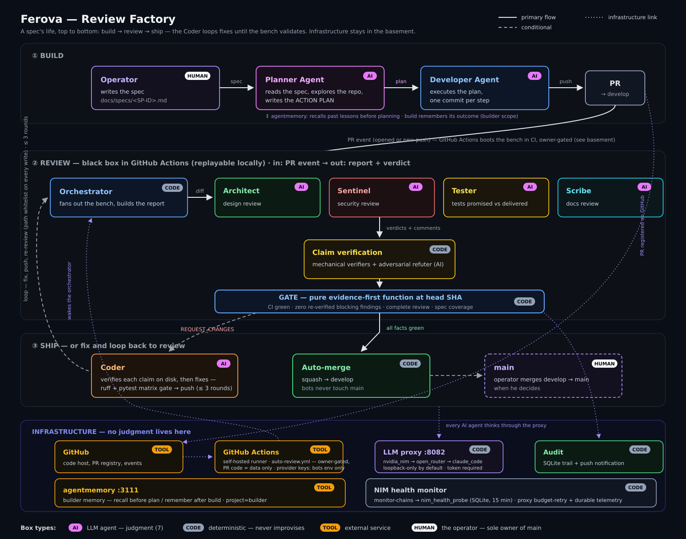
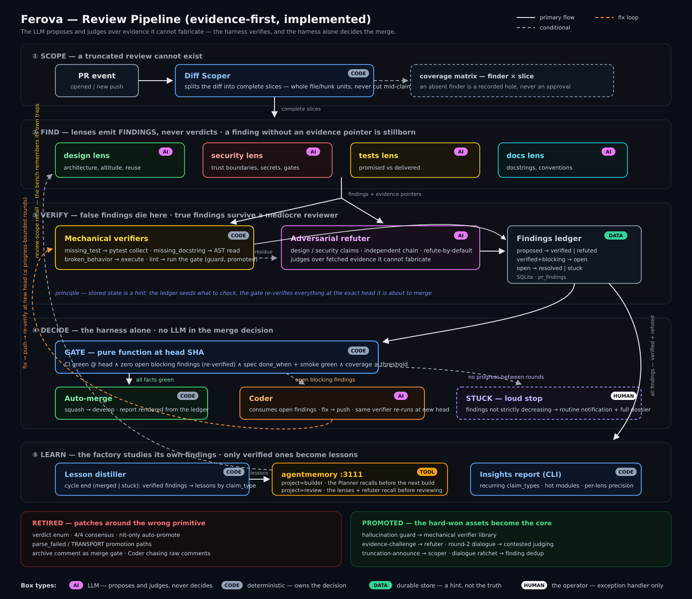
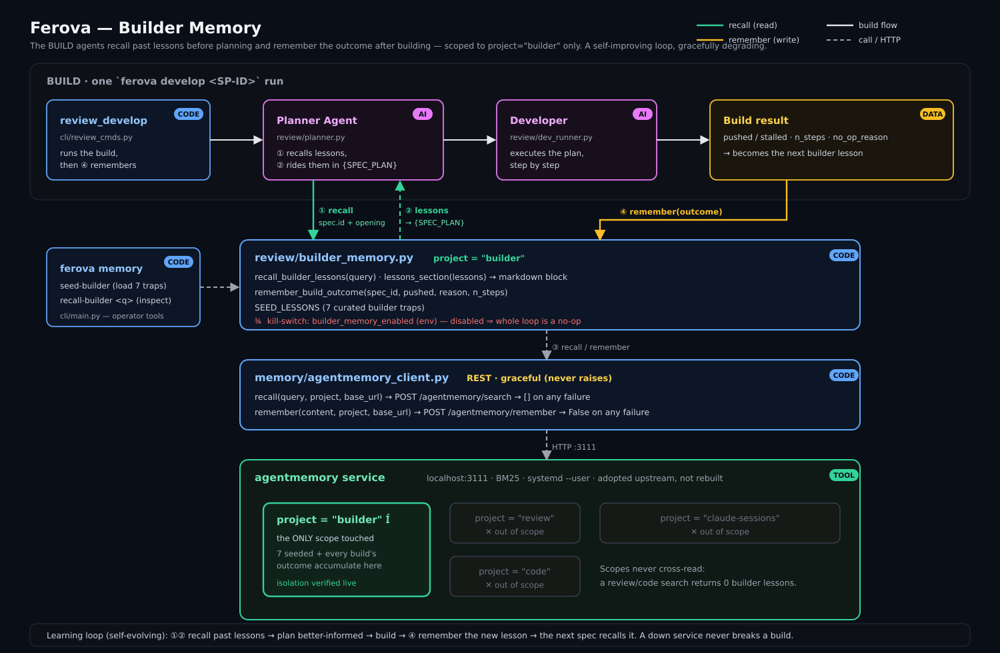
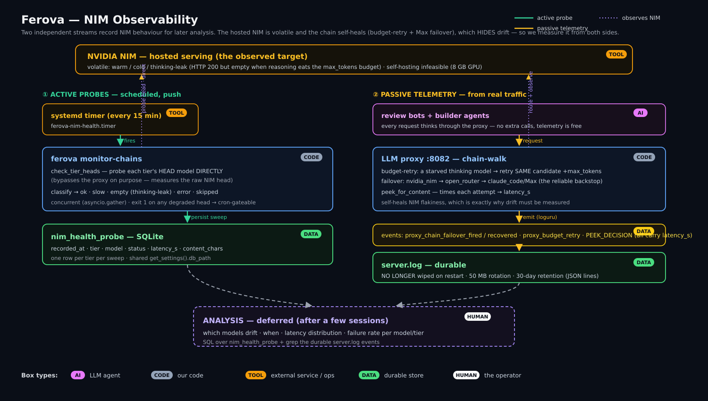

<div align="center">

# 🔥 Ferova

### The self-forging software factory.

*Plug it into your repo — it builds your system, and keeps forging itself.*

[](https://github.com/ferovahq/ferova/actions/workflows/ci.yml) []() []()

</div>

---

**Ferova** is an autonomous software factory. You point it at a repository and it ships changes through a multi-agent review pipeline that verifies its own work before anything merges. It runs its agent fleet over a self-healing, multi-provider LLM gateway — and it improves its own infrastructure as it goes.

> *ferro* — iron. The metal you forge, and re-forge.

## Why Ferova is different

Most "AI writes your code" tools trust the model. **Ferova trusts evidence.**

### 1. Evidence-first merge gate
Agents can't approve their own work. Every finding a reviewer raises is **re-verified against the current HEAD** before a merge is allowed. There is no forgeable "LGTM" — the gate re-checks the facts (CI green, zero surviving blockers, complete review) at merge time, every time.

### 2. Governed specs
Every change is anchored to a spec whose frontmatter declares **what it owns** and **what it depends on**. From that, Ferova *derives* the system's dependency graph — and *enforces* it: an import that crosses a boundary the spec never declared fails CI. The architecture can't silently drift from the docs.

### 3. Self-evolving routing
Ferova runs its agents across a dozen LLM providers with automatic failover. A built-in autopilot watches each provider's live health and **rewrites its own routing** to stay fast and cheap — bounded by hard safety caps.

### 🔁 It builds itself
Ferova is built by Ferova. Every PR in this repo went through Ferova's own review pipeline and merge gate. **The factory is its own first customer.**

## How it works

A spec's life, top to bottom: build → review → ship. Four reviewers and a claim-verification layer feed a findings ledger; a pure evidence-first gate re-verifies everything at the exact head it is about to merge.



### Deeper dives

<details>
<summary><b>The review pipeline</b> — findings, mechanical verifiers, adversarial refuter, and the merge gate</summary>


</details>

<details>
<summary><b>Builder memory</b> — the factory recalls past lessons before planning and remembers each build's outcome</summary>


</details>

<details>
<summary><b>Provider observability</b> — active probes + passive telemetry around the self-healing LLM gateway</summary>


</details>

## Quickstart

```bash
git clone https://github.com/ferovahq/ferova && cd ferova
pip install -e ".[dev]"

ferova --help            # the CLI
ferova review pr <N>     # run the review team on a pull request
ferova review gate <N>   # evidence-first merge gate, read-only
ferova develop <SP-ID>   # plan-driven build from a spec
```

## Safety

Letting agents write and merge code is only acceptable if the blast radius is bounded. In Ferova:

- Agents **never merge to your protected branches** — they open PRs and stop.
- Every agent fix is **path-whitelisted** — no touching CI config, workflows, or secrets.
- Secrets are **scrubbed** from every agent's environment.
- The self-evolving router is bounded by **per-cycle caps** and **can't deploy without a read**.

## Status

Early, and built in the open. If the idea resonates — an autonomous factory that's *transparent, self-evolving, and safe to be wrong* — ⭐ the repo and follow along.

---

<div align="center"><sub>MIT · <a href="https://github.com/ferovahq/ferova">github.com/ferovahq/ferova</a></sub></div>
