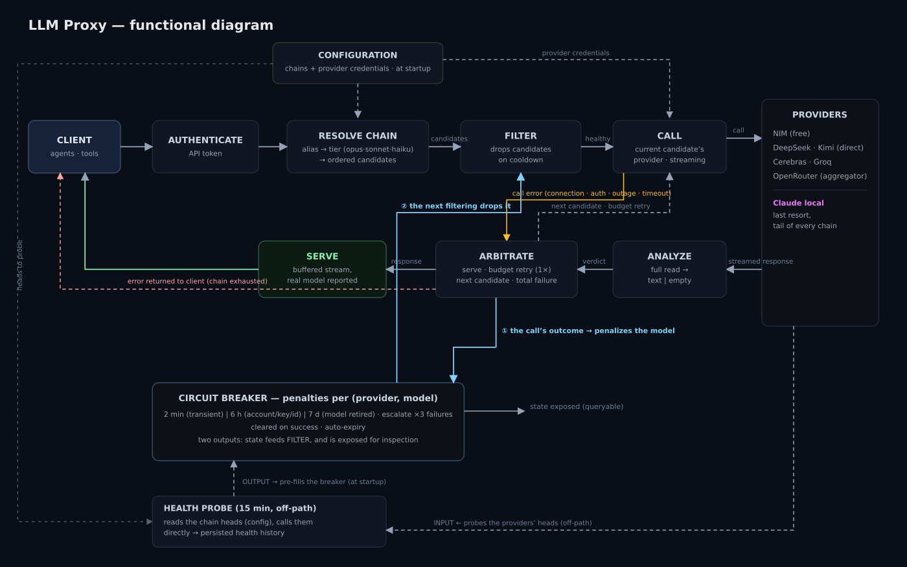

# LLM proxy — functional overview

> Status: **living document** (started 2026-07-12). A plain-language,
> block-by-block walkthrough of how the proxy serves one request, plus
> the elements that support it. It grows as we detail each block —
> expect sections to deepen over time. Diagram:
> `llm_proxy_functional_overview.svg` (+ `.png`). For implementation
> detail see `proxy_routing_redesign_architecture.md` and the code
> under `src/ferova/llm_proxy/`.

## What the proxy is

An Anthropic-compatible gateway that fronts several LLM providers. A
caller does **not** ask for a specific model — it asks for a
**capability tier** (opus / sonnet / haiku) and the proxy chooses which
concrete model answers, walking an ordered failover chain and stepping
over anything that recently failed. Agents run at near-zero cost with a
guaranteed quality floor (a local Claude is the tail of every chain).



## Technical stack

The proxy is the `llm_proxy` subtree. A standard, async Python stack:

| Role | Tech | Notes |
|---|---|---|
| Language / runtime | Python 3.11+ | fully async (`asyncio`) |
| API / server | **FastAPI** + **uvicorn** | ASGI; Anthropic-compatible endpoints; **SSE** streaming |
| HTTP client (to providers) | **httpx** (`[http2]`) | `AsyncClient`, HTTP/2 |
| Models / validation | **Pydantic v2** | every value object (`ModelRef`, `Chain`, request/response models), frozen and validated |
| Config | **pydantic-settings** | `Settings`, env files `chains.env` + `.env`, `FEROVA_*` aliases, `lru_cache` |
| Storage | **SQLAlchemy 2** + **SQLite** | the health history that seeds the breaker at startup |
| Logging | **loguru** | (the rest of ferova uses `structlog`; the proxy subtree uses loguru) |
| CLI | **Typer** | the `ferova …` commands; the proxy itself runs as `python -m ferova.llm_proxy` |

**Deployment.** A systemd **user** service (`ferova-llm-proxy.service`)
runs `uvicorn.run(app)` on `127.0.0.1:8082` with a 5 s graceful
shutdown — a **local sidecar**, not internet-facing (hence the simple
shared-secret door at `AUTHENTICATE`).

Three things about the nature of this stack:

1. **Async end-to-end** — a proxy mostly *waits on the network* (the
   providers). FastAPI + async httpx + SSE is the combination built for
   serving many in-flight, waiting requests without blocking.
2. **Pydantic is the through-line** — from config to internal value
   objects to API messages. This is why malformed input (a bad chain, an
   unknown provider) fails **loudly at startup** with a clear message,
   not mid-failover in production.
3. **SQLite is read-mostly on the proxy side** — the proxy only *reads*
   the health history to seed the breaker; the health probe (on the
   ferova side) *writes* it. The database is shared between the two.

## How a request flows

The top row is the request coming in; it drops down to the providers on
the right and comes back along the second row as the response is
handled. Follow the diagram left-to-right, then down, then back left.

### 1. CLIENT

The callers are **programs** — agents, tools, the CLI — not humans
typing. Each request carries three things:

- a **capability tier** (the "intelligence level": opus / sonnet /
  haiku) — *not* a specific model;
- the **context** — everything the model must read: instructions, the
  task itself, and any supporting material (documents, code, history);
- an **authentication token** — a shared secret, attached to the
  request envelope (a header), not to its body.

This block is both the entry and the exit: the whole journey starts and
ends here.

### 2. AUTHENTICATE

The door check. It reads only the **token on the envelope** — never the
body — and compares it against the configured secret
(`FEROVA_ANTHROPIC_AUTH_TOKEN`). Valid → the request continues; missing
or wrong → rejected immediately with `401`, before reaching any model.
If no secret is configured, the door is open (no-op). It is a simple
shared secret because the proxy is a private, local sidecar, not an
internet-facing service.

Code: `require_api_key` in `src/ferova/llm_proxy/api/dependencies.py`,
wired per-route via `Depends(require_api_key)` in `api/routes.py`
(opt-in, which is why `GET /health` deliberately omits it).

### 3. RESOLVE CHAIN

Translates the requested tier into a concrete plan: read the alias the
client sent → map it to a tier (opus / sonnet / haiku) → look up that
tier's **chain**: an *ordered* list of `(provider, model)` candidates,
preferred first (free NIM) down to the last resort (local Claude). The
chain comes from `CONFIGURATION` (loaded at startup); this block reads
the order, it does not decide it.

### 4. FILTER

Removes candidates the circuit breaker currently has **on cooldown**
(dead, erroring, out of credits, bad key, rate-limited). It is a
read-only consumer of breaker state — it applies penalties, it never
sets them. Note: a **slow** candidate is *not* filtered today (see
Known limits #2).

### 5. CALL

The first contact with the outside world: take the top surviving
candidate, call **its provider** using that provider's access key (the
`provider credentials` from configuration — the proxy is now itself a
client, authenticating to the provider), in **streaming** mode. Two
outcomes: a response stream begins → on to `ANALYZE`; or the call
raises before any content (connection, auth, outage, timeout) → the
amber `call error` arrow straight to `ARBITRATE`. Only one candidate is
called at a time.

### 6. ANALYZE

Reads the streamed response **in full and buffers it before deciding
anything**, then classifies it: **text** (real content) or **empty**.
Why read it whole? The dominant failure mode of open-weight models is
the *empty* response — the model spends its whole budget "thinking"
silently and returns nothing, as an HTTP-200 success. Buffering lets
the proxy catch that and switch candidates *before the client sees
anything*. The price is no fast first byte: perceived latency equals
full-completion time (a deliberate trade-off; see Known limits #4).

### 7. ARBITRATE

The decision hub. Given the verdict (or a call error), it chooses:

- **text** → `SERVE` the response, and clear the candidate's penalty
  in the breaker (the "success" half of feedback ①);
- **empty, looks budget-starved** → one **budget retry** on the same
  candidate; if it now has content, serve;
- **empty (hopeless) or error** → penalize the candidate (the
  "failure" half of ①) and move to the **next candidate** (the grey
  loop back to `CALL`);
- **no candidate left** → **total failure**: an error is returned to
  the client (the red arrow).

This is where both loops originate: the grey "next candidate" loop
(within one request) and the cyan breaker-feedback loop (across
requests).

### 8. SERVE

The exit door. Sends the **buffered** response back to the client (as a
stream, though it was fully collected first) and **reports the real
model** that answered — closing the abstraction: the client asked for a
tier, gets a concrete answer, and is told which model produced it.

## The circuit breaker and its feedback loop

The breaker is the system's memory of what is currently unhealthy. It
tracks penalties **per `(provider, model)` cell** — never per whole
provider (one provider can have one dead model and others perfectly
healthy). Penalty length depends on the fault class: **2 min** for a
transient blip (timeout, 5xx, rate-limit, empty), **6 h** for an
account-level fault that will not self-heal (bad key, no credits,
forbidden, bad id), **7 d** for a model the provider retired. Three
consecutive failures escalate to the long penalty; a successful,
content-bearing response clears the slate.

The **feedback loop** is two cyan arrows:

- **①** `ARBITRATE → breaker`: the call's outcome penalizes (on
  failure) or rehabilitates (on success) the model.
- **②** `breaker → FILTER`: the state is re-read by the *next request's*
  filtering, which drops the penalized model.

The loop therefore operates **between requests**, not within one:
within a single request the chain is filtered once, then walked; a
penalty written mid-request takes effect at the next request's filter.

State is in-process (lost on restart) and rebuilt at startup by the
health probe's history (`pre-fills the breaker`). It is also exposed,
unauthenticated, for inspection (`state exposed`).

## Circuit breaker internals

Implementation: `src/ferova/llm_proxy/routing/breaker.py` (~60 lines)
plus the fault classifier in `api/services.py`.

### Three tables

The breaker's whole memory is three dictionaries, each keyed by the
`(provider, model)` cell:

- `_down_until` — for each penalized cell, the timestamp when it may
  return (a deadline).
- `_down_reason` — why it was penalized (for display).
- `_consecutive_failures` — a per-cell strike counter.

Everything else is how those three are written and read.

### trip / recover

- **`trip`** (on failure) writes the deadline (`now + ttl`), records the
  reason, and increments the strike counter. Two subtleties: it
  **extends but never shortens** an existing deadline (a repeated
  failure can only push the return further out, never accidentally
  bring a cell back early); and the strike counter climbs on every
  trip.
- **`recover`** (on a content-bearing success) clears **all three**
  tables for the cell — deadline, reason, and strike counter reset to
  zero. Clean slate. This is the "success" half of feedback loop ①.

### Escalation (the subtle part)

When a penalty expires, `down_refs` prunes the deadline **but keeps the
strike counter** (`_consecutive_failures` survives TTL lapse). This is
what makes escalation work: a cell that *flaps* — fail, serve the 2-min
penalty, return, fail again — accumulates strikes across cycles
(1, 2, 3…). At the **third** consecutive failure it escalates to the
long (6 h) penalty. Without the counter surviving expiry, a cell that
fails once per window would never pass one strike and would flap
forever; keeping the counter turns "it flaps" into "quarantine it".

### Two readers

- **`down_refs(now)`** — the set of currently-down cells, read by
  `FILTER`; it lazily prunes expired deadlines as it goes. This is
  feedback loop ②.
- **`snapshot(now)`** — a read-only view for `GET /health`: per down
  cell, `(ref, reason, ttl_remaining, consecutive_failures)`.

### How a fault becomes a penalty class

A raised provider error reaches a penalty duration through **two**
translations, not one.

**Step 1 — exception → reason word** (`_classify_failover_reason`,
`api/services.py`). Different providers raise different exception types
for the same underlying problem, so this normalizes them into one
vocabulary via an ordered cascade (first match wins):

```
name contains "timeout"       → "timeout"
RateLimitError                → "rate_limited"
OverloadedError               → "provider_5xx"
AuthenticationError           → "auth_failed"
InvalidRequestError           → "invalid_request"
APIError with HTTP status:
      5xx                     → "provider_5xx"        (all merged)
      4xx                     → "provider_<status>"   (kept distinct)
transport/connection/network  → "transport_error"
otherwise                     → "exception:<TypeName>"
```

Note the HTTP handling: 5xx codes are **merged** into one word (they
all mean "server broke, retry"), while 4xx codes keep their **exact
number** (`provider_401` ≠ `provider_402` ≠ `provider_404` — bad key,
no credits, and bad id are different problems).

**Step 2 — reason word → penalty duration** (`ttl_for_reason`,
`breaker.py`). Two named sets and a default:

```
reason in {provider_410}                              → 7 d  (terminal)
reason in {auth_failed, provider_401, provider_402,
           provider_403, provider_404}                → 6 h  (quarantine)
otherwise (timeout, rate_limited, provider_5xx, …)    → 2 min (transient)
```

End-to-end example (the 2026-07-10 incident): OpenRouter runs out of
credits → HTTP 402 → step 1 gives `provider_402` → step 2 puts it in
the 6 h set → the cell is quarantined for 6 h (credits will not
self-heal). A plain NIM timeout, by contrast → `timeout` → in no named
set → 2 min.

**This classifier only runs on *raised* exceptions** (the "call error"
path). An upstream error folded into the stream (Known limit #1) never
raises — it looks *empty* — so it skips the classifier entirely, never
earns its `provider_402` word, and is mislabeled `empty_completion`
→ the generic 2-min bucket. That is precisely why limit #1 hurts: the
true cause (and the 6 h it deserved) is lost.

## Supporting elements

- **CONFIGURATION** — the chains (which models, in what order, per
  tier) and the provider access keys, read at startup. Feeds
  `RESOLVE CHAIN` (chains), `CALL` (credentials) and the health probe
  (which heads to test).
- **PROVIDERS** — NIM (free, heads most chains), DeepSeek / Kimi
  (direct), Cerebras / Groq, OpenRouter (aggregator), and local Claude
  as the tail / last resort of every chain.
- **HEALTH PROBE** — an off-path job (every 15 min) that calls each
  tier's chain head directly, bypassing the request path, and persists
  a health history. That history pre-fills the breaker at startup so it
  does not start cold.

*(These four are summarised here and will get their own detailed
sections as we go.)*

## Known limits

Faults we know about; some have a prepared fix, some are deferred, some
are accepted trade-offs.

1. **Ambiguous empty (ANALYZE)** — an upstream error that occurs
   *mid-stream* is folded into the stream and looks like an *empty*
   response; its real cause (e.g. credits) is lost before the breaker.
   *Status: deferred — needs the upstream status surfaced through the
   read layer.*
2. **Slow is not penalized (BREAKER)** — a slow-but-successful response
   (12–15 s) rehabilitates the model instead of penalizing it, so a
   sick head re-promotes itself endlessly. *Status: fix prepared — a
   too-slow response will count as a failure; shipped in observation
   mode first.*
3. **Credit exhaustion unmonitored (HEALTH PROBE)** — a provider
   running out of credits is not tracked; discovered mid-incident.
   *Status: fix prepared — balance monitoring with a floor alert.*
4. **No fast first byte (ANALYZE)** — full-read buffering means
   perceived latency is full-completion time. *Status: accepted
   trade-off (the price of catching empty responses).*
5. **Config read only at startup (CONFIGURATION)** — applying a config
   change requires restarting the service. *Status: later — hot reload
   + breaker reconciliation.*
6. **Head resurrection (FILTER)** — if every candidate is on cooldown,
   the preferred one is retried anyway: an implicit "serve degraded"
   valve, never formally decided. *Status: undecided.*

## To be expanded

- The health probe and the offline chain-repair path (including how the
  breaker is seeded at startup, `probe_seed`).
- The `/v1/agent` capability-gateway endpoint (native tool use).
- Provider transports and the SSE-error folding behind limit #1.
