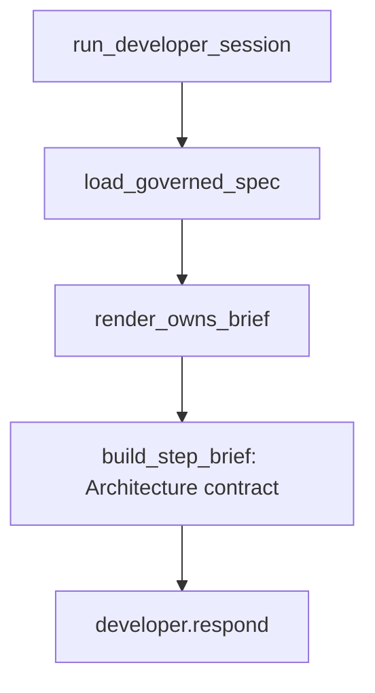

# SP-ARCH-DEV-WIRE — Developer owns priming

## Intent
Make the autonomous Developer aware of a governed spec's `owns` (the paths
it must create/keep) and `depends_on` (the components it may couple to),
so an autonomous `ferova develop` run produces **gate-passing** code on
the first try instead of failing the edge-honesty gate and bouncing
through a Coder round.

## Context
Slice B of the pipeline-wiring arc, scoped **Developer-only** (operator's
call — the Planner produces a plan; the Developer writes the code, so
gate-passing rides on it). The Developer's authority document is the
*step brief* built by `dev_runner.build_step_brief` — already carrying the
"File contract" (the only paths it may touch). This slice adds an
**architecture contract** section to that brief: owned paths + allowed
dependencies, framed as a hard constraint. No persona edit — the brief is
the per-task context, the natural home for per-spec arch info — so this
slice touches **no `prompts/review/*`** (no hand-ship).

It reuses slice A's `load_governed_spec` and adds a sibling
`render_owns_brief(spec)` (an *authoring* brief, distinct from the
Architect's *review* brief). Frontier/unknown specs render an empty brief —
fully backward-compatible.

## Goals
- G1: `render_owns_brief(spec: GovernedSpec | None) -> str` — a markdown
  block stating the owned paths + allowed dependencies as an authoring
  constraint ("import only these components, or the CI edge-honesty gate
  blocks the PR"); `""` for `None` / no declared owns+deps.
- G2: `build_step_brief` gains an `arch_owns: str = ""` parameter and
  renders it as an "## Architecture contract" section beside the existing
  "File contract"; empty keeps the legacy brief byte-for-byte.
- G3: `run_developer_session` resolves the governed spec once (it already
  holds `repo_root` + the loaded spec) and threads the rendered brief into
  every step's `build_step_brief`.
- G4: Backward-compatible — a frontier/no-spec run renders an empty section
  and the brief is unchanged.

## Non-Goals
- NG1: Does NOT touch the Planner (operator scoped this Developer-only).
- NG2: Does NOT edit any persona under `prompts/review/*` — the contract
  lives in the brief, not the developer persona (so: no hand-ship).
- NG3: Does NOT restrict the Developer's read/exploration scope — only the
  write expectation is primed.
- NG4: Does NOT enforce — enforcement is the CI gate (`SP-ARCH-EDGE-GATE`).
  This informs, to cut gate bounces.

## Assumptions
- A1: Slice A's `review/governed_spec.py` is merged (`load_governed_spec`,
  `GovernedSpec`).
- A2: `run_developer_session` holds `repo_root` and the loaded spec id.

## Interface
- `render_owns_brief(spec: GovernedSpec | None) -> str` — added to
  `review/governed_spec.py`.
- `build_step_brief(..., arch_owns: str = "") -> str` — new keyword param.

## Behavior

### Nominal
`run_developer_session` → `load_governed_spec(spec.id)` →
`render_owns_brief` → passed as `arch_owns` to every `build_step_brief`
call → the Developer sees the owned paths + allowed deps in its brief and
writes code that imports only declared components.

### Edge cases
- frontier/legacy spec ⇒ empty brief ⇒ step brief unchanged.
- governed spec with empty `owns.code` ⇒ section states "no owned paths
  declared; keep changes within the step's file contract".

### Failure scenarios
- malformed frontmatter ⇒ `MalformedFrontmatterError` surfaces (loud),
  consistent with slice A and the gate. (`run_developer_session` resolves
  it inside the existing spec-load path.)

## Architecture Impact
- Adds dependency: `SP-ARCH-DEV-WIRE -> SP-ARCH-REVIEW-WIRE` — calls
  `load_governed_spec` + `render_owns_brief`. (`dev_runner.py` is frontier;
  its imports are not gate-enforced, but the edge is declared for honesty.)
- Wiring-only: owns no new module; threads through frontier `dev_runner.py`
  + adds a sibling renderer to slice A's `governed_spec.py`.
- New coupling / cycles / shared state: none.

## Diagram

## Acceptance Criteria
- [ ] AC1: `render_owns_brief` emits owned paths + allowed deps for a
  governed spec, and `""` for `None`.
- [ ] AC2: `build_step_brief` with a non-empty `arch_owns` renders an
  "Architecture contract" section; with `arch_owns=""` the brief is
  byte-for-byte the legacy output.
- [ ] AC3: a `run_developer_session` over a governed-spec fixture threads
  the rendered contract into the step brief (the brief contains the
  declared deps); a frontier spec yields no such section.
- [ ] AC4: existing dev_runner / developer suites stay green (backward
  compat).
- [ ] AC5: full `pytest tests/unit` green; ruff + format + no-inline +
  no-silent clean; `ferova arch check` passes.

## Open Questions
- None. (Resolved while drafting: Developer-only; inject into the BRIEF not
  the persona — no hand-ship; `render_owns_brief` lives in slice A's
  module; exploration scope stays free.)
