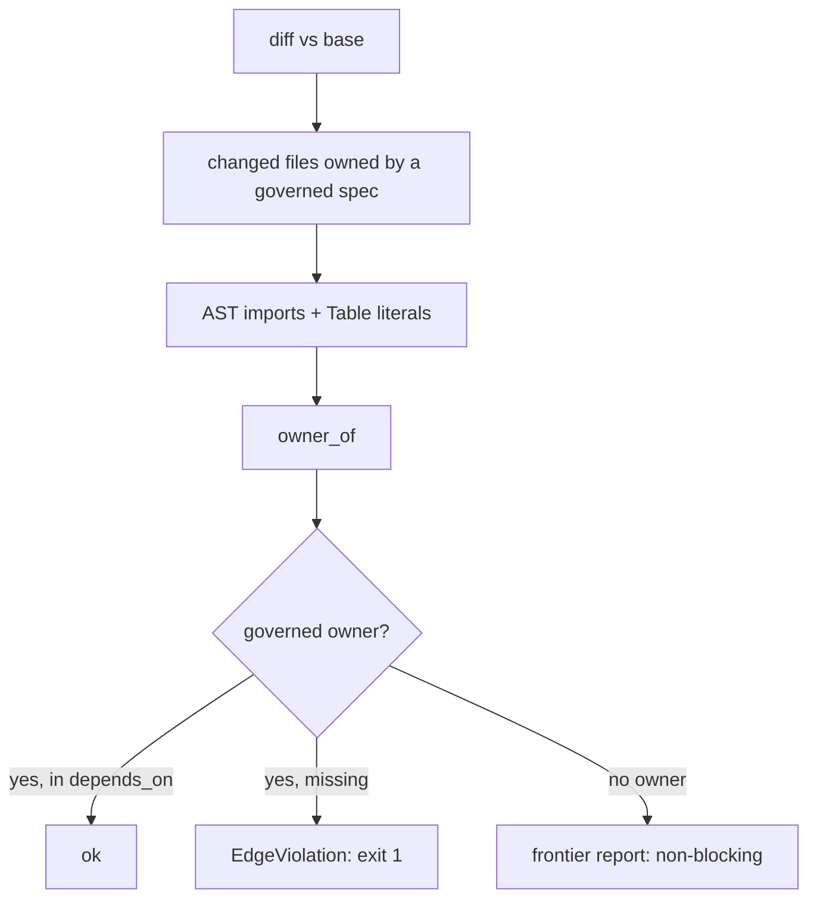

# SP-ARCH-EDGE-GATE — edge-honesty gate

## Intent
At diff time, enforce that a governed spec's declared `depends_on` covers
the couplings the change actually introduces — code imports (tier 1a) and
owned-table literals (tier 1b) — and report ungoverned/frontier couplings
proportionately. This is what turns "keep it honest" (a wish) into "the
gate keeps you honest" (a control).

## Context
A new gate in `src/ferova/lint/`, sibling of
`lint_no_inline_comments` / `lint_no_silent_except`, run in pre-commit and
CI the same way. It consumes `SP-ARCH-GRAPH`'s `Registry` + `owner_of`
(it does NOT re-parse frontmatter — its format dependency is transitive
through the deriver, not re-declared). It operates on the diff against a
base ref. Tier-2 couplings it cannot prove are handed to the Architect
reviewer via `## Architecture Impact`.

## Goals
- G1 (tier 1a — code, enforced): for each changed file owned by spec X,
  resolve its intra-repo imports via `owner_of`; any import owned by a
  governed Y ≠ X must have Y ∈ `X.depends_on`, else FAIL naming the
  missing edge `X -> Y`.
- G2 (tier 1b — table, enforced, high-confidence only): detect
  SQLAlchemy `Table("<n>", ...)` first-arg string literals in a changed
  file; resolve `db:table:<n>` via `owner_of`; the owner must be in
  `depends_on`. **Back-channel rule**: a table literal in the table's
  OWNER files is fine; the violation is a literal in a NON-owner that goes
  undeclared.
- G3 (disjointness): run the deriver's disjointness + frontmatter
  validation; a conflict / malformed frontmatter fails the gate (single
  source — not re-implemented here).
- G4 (frontier, proportionate): an import or table literal resolving to NO
  owner is REPORTED — aggregated, non-blocking, suppressible for known
  legacy. Never a failure. This keeps the ungoverned set VISIBLE without
  becoming wallpaper.
- G5 (tier-2 boundary, no overclaim): couplings the gate cannot prove —
  runtime-built `queue:topic`, raw SQL too ambiguous to attribute,
  dynamic/late imports — are explicitly OUT of enforcement; the gate
  states what it covers and defers the rest to Architect review. It never
  silently claims coverage it lacks.
- G6: entrypoint `ferova arch check [--base <ref>]` + a lint hook;
  exit non-zero on a tier-1 violation; wired alongside the existing lint
  gates in pre-commit + CI.

## Non-Goals
- NG1: Does NOT enforce tier-2 couplings (topics / ambiguous raw SQL /
  dynamic imports) — reports them, relies on review.
- NG2: Does NOT build or render the graph — that is `SP-ARCH-GRAPH`.
- NG3: Does NOT inspect frontier (un-owned) source files' internal
  couplings; only changed files owned by a governed spec are checked for
  declaration. Frontier refs are reported only.

## Assumptions
- A1: `SP-ARCH-GRAPH` exposes `load_registry`, `owner_of`, disjointness +
  frontmatter validation.
- A2: intra-repo imports resolve to file paths by the same convention the
  deriver uses; third-party / stdlib imports are ignored (ungoverned).
- A3: the diff base ref is reachable via git.

## Interface
CLI:
- `ferova arch check [--base <ref>] [--specs-dir docs/specs]`

Importable core:

Inputs:
- `registry`: `Registry` — from the deriver.
- `changed_files`: `list[Path]` — diff vs base.
- `repo_root`: `Path`.

Outputs:
- `check_diff(registry, changed_files, repo_root) -> Report`
- `Report.violations`: `list[EdgeViolation]` — tier-1a/1b, each naming
  source spec, target spec, and the import/table literal.
- `Report.frontier`: `list[FrontierRef]` — aggregated ungoverned refs.
- `Report.ok`: `bool` — true ⇔ no tier-1 violation.

Errors / exit:
- exit `1` on any tier-1 violation (with a human-readable ledger);
  exit `0` otherwise (frontier reports never fail the gate).

Resolution rule (locked):
- the edge is to the owner of the **directly-imported** module, not the
  transitive origin; the graph composes transitivity.
- a dynamic/late import the AST cannot see ⇒ not enforced (tier 2).

## Behavior

### Nominal
diff vs base → keep changed files owned by a governed spec → for each:
collect AST imports + SQLAlchemy `Table()` literals → resolve owners via
`owner_of` → for each governed owner ≠ self, require it in `depends_on` →
otherwise an `EdgeViolation`. Un-owned resolutions accumulate into
`Report.frontier`.

### Edge cases
- changed file in the frontier (un-owned) ⇒ skipped for tier-1 (its
  couplings are not enforced).
- import to third-party / stdlib ⇒ ignored.
- `Table("x")` literal inside x's owner ⇒ no violation (back-channel rule).
- re-export (`import B` where B re-exports C) ⇒ edge to B's owner.
- raw SQL whose table cannot be attributed with high confidence ⇒
  demoted to a frontier report, NEVER a false-positive failure.

### Failure scenarios
- a governed import/table literal missing from `depends_on` ⇒
  `EdgeViolation`, exit 1.
- disjointness conflict or malformed frontmatter (from the deriver) ⇒
  fail.

## Architecture Impact
- Adds `src/ferova/lint/edge_honesty.py` — a single **file-granular**
  ownership inside the frontier `lint/` package. (Dogfood finding: a new
  file joining a legacy package is owned at file granularity; ownership
  resolution is longest-path-match and must reject overlaps. The gate
  could NOT live under `src/ferova/arch/` — `SP-ARCH-GRAPH` owns that
  directory, and disjointness forbids nesting.)
- Adds dependency: `SP-ARCH-EDGE-GATE -> SP-ARCH-GRAPH` — imports
  `Registry` + `owner_of` (tier-1a code edge). It does NOT depend on
  `SP-SPEC-TEMPLATE`: its frontmatter dependency is transitive through the
  deriver, and the resolution rule declares only direct imports.
- **Self-application**: once landed, the gate runs on its own PR — its
  import of `arch/` requires the declared `SP-ARCH-GRAPH` edge, so the
  gate is the first component governed by itself.
- New coupling / cycles / shared state: none (the deriver does not import
  the gate — acyclic).

## Diagram

## Acceptance Criteria
- [ ] AC1: a changed owned file importing a governed component absent from
  `depends_on` ⇒ tier-1a `EdgeViolation` naming both spec-ids; exit 1.
- [ ] AC2: a `Table("x")` literal for an elsewhere-owned table, in a
  non-owner changed file and undeclared ⇒ tier-1b violation; the SAME
  literal inside x's owner ⇒ no violation (back-channel rule).
- [ ] AC3: an import/table resolving to no owner ⇒ aggregated frontier
  report, exit 0 (non-blocking).
- [ ] AC4: a runtime `queue:topic` and an ambiguous raw-SQL table ⇒ NOT a
  tier-1 failure (tier-2 / demoted-to-report), as documented.
- [ ] AC5: a re-export ⇒ edge attributed to the directly-imported module's
  owner, not the transitive origin.
- [ ] AC6: wired into pre-commit + CI beside `lint_no_inline_comments`;
  the gate passes its OWN PR (its `arch/` import is declared).
- [ ] AC7: a diff touching N un-owned (legacy) tables produces ONE
  aggregated, suppressible frontier report — not N blocking entries — and
  exit 0; a configured legacy-suppression list (`[tool.ferova.arch]`
  in `pyproject.toml`, per the golden-rule "exceptions live in
  pyproject.toml only") removes known tables from the report entirely.
  This pins G4's proportionality — the property both sessions judged
  adoption-critical (a frontier that over-fires becomes wallpaper, and the
  blind spot returns through fatigue).
- [ ] AC8: full `pytest tests/unit` green; ruff + format + no-inline +
  no-silent clean.

## Open Questions
- None. (Resolved while drafting: the gate lives in `lint/` not `arch/`
  for disjointness; it depends only on the deriver, the format dependency
  being transitive; tier-1b FAILS only on high-confidence SQLAlchemy
  `Table()` literals and demotes ambiguous raw SQL to a report, avoiding
  false-positive blocks.)
