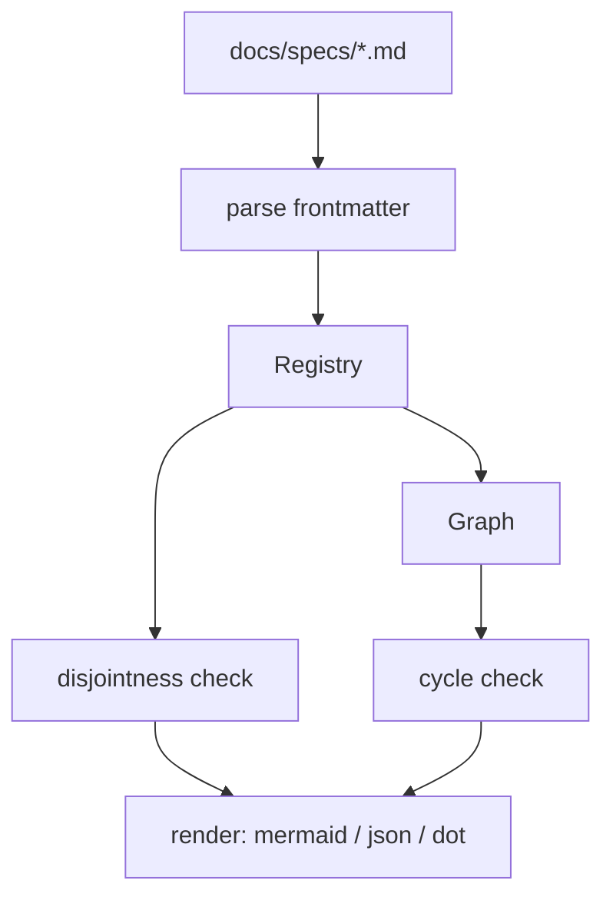

# SP-ARCH-GRAPH — architecture dependency-graph deriver

## Intent
Derive the system dependency graph from spec frontmatter (`owns` /
`depends_on`) — the single machine-readable source for architecture
visualization, and the resolution core the edge-honesty gate
(`SP-ARCH-EDGE-GATE`) reuses. Replaces hand-drawn diagrams like
`docs/review_factory_architecture.svg` with a graph derived from the
specs themselves.

## Context
New `src/ferova/arch/` package, invoked as `ferova arch graph`.
It reads `docs/specs/*.md` frontmatter only — it does **not** read code.
It is read-only over the filesystem: no DB, no network, no mutation. It
is the foundational slice of the spec-architecture arc; the next spec
(`SP-ARCH-EDGE-GATE`) imports its registry + resolver to enforce, in a
diff, that declared `depends_on` covers the observed couplings.

## Goals
- G1: Parse every governed spec's frontmatter into a registry
  (`id`, `owns.code`, `owns.resources`, `depends_on`).
- G2: Build the directed `id -> id` graph from `depends_on`; detect cycles.
- G3: Enforce ownership disjointness — a code path or a resource is owned
  by at most one spec; fail loudly otherwise.
- G4: Resolve an artifact (code path, `db:table:<n>`, `queue:topic:<n>`)
  to its owning spec-id — the primitive `SP-ARCH-EDGE-GATE` reuses.
- G5: Surface frontier (un-owned) nodes and references to ungoverned
  artifacts — proportionately (aggregated, non-blocking).
- G6: Render the graph (`mermaid` / `json` / `dot`) and, under `--check`,
  exit non-zero on a cycle or a disjointness violation.

## Non-Goals
- NG1: Does NOT scan a diff's imports/SQL against `depends_on` — that is
  `SP-ARCH-EDGE-GATE` (gate tiers 1a/1b). This component only builds,
  validates and renders the *declared* graph.
- NG2: Does NOT read or parse application code (no AST). Its only input
  is spec frontmatter.
- NG3: Does NOT migrate, rewrite, or require frontmatter on legacy specs;
  a frontmatter-less spec is a tolerated frontier node, not an error.

## Assumptions
- A1: Governed specs carry valid YAML frontmatter per `SP-SPEC-TEMPLATE`
  (`docs/specs/_TEMPLATE.md`).
- A2: A spec's `id` equals its SP-ID and is globally unique (one
  identifier across frontmatter / filename / branch / `depends_on`).
- A3: A YAML frontmatter parser is available; if `pyyaml` is not yet a
  dependency it is added with this code (per CLAUDE.md "deps with the
  code that uses them").
- A4: Underscore-prefixed files (`_TEMPLATE.md`) are not specs and are
  skipped.

## Interface
CLI:
- `ferova arch graph [--format mermaid|json|dot] [--check] [--specs-dir docs/specs]`

Importable core (consumed by `SP-ARCH-EDGE-GATE`):

Inputs:
- `specs_dir`: `Path` — directory of spec markdown files.

Outputs:
- `load_registry(specs_dir) -> Registry` — the parsed corpus.
- `Registry.owner_of(artifact: str) -> str | None` — owning spec-id for a
  code path or `db:table:<n>` / `queue:topic:<n>`; `None` ⇒ frontier.
- `Registry.graph() -> Graph` — `id -> frozenset[id]` over `depends_on`.
- `Graph.cycles() -> list[list[str]]` — every dependency cycle.
- `Registry.disjointness_violations() -> list[OwnershipConflict]`.
- `render(registry, fmt) -> str` — graph in the requested format.
- CLI exit: `0` clean, `2` on cycle or disjointness violation under
  `--check`.

Errors:
- `MalformedFrontmatterError`: a governed spec's frontmatter is absent
  where required, invalid YAML, or wrong shape — names the file.
- `OwnershipConflictError`: two specs own the same artifact — names both
  spec-ids and the artifact.

## Behavior

### Nominal
Glob `specs_dir/*.md` (skip `_*.md`) → for each, split frontmatter →
parse YAML → register `id`, `owns`, `depends_on`. Files with no
frontmatter register as frontier nodes (id derived from filename SP-ID,
no owns, no edges). Check ownership disjointness across the corpus →
build the `depends_on` graph → detect cycles → render.

### Edge cases
- spec without frontmatter ⇒ frontier node, reported, not an error.
- `owns.resources: N/A` or `[]` ⇒ no resources; not a violation.
- `depends_on` referencing an unknown id ⇒ reported as a dangling edge
  (warning); not a hard fail (it may name a not-yet-written sibling).
- a `db:table:x` and a code path are resolved by the same `owner_of`;
  resource keys and code paths share one disjoint namespace per spec.

### Failure scenarios
- malformed YAML in a governed spec ⇒ `MalformedFrontmatterError`
  (names the file); `--check` exits 2.
- the same path/resource in two specs' `owns` ⇒ `OwnershipConflictError`
  (names both + the artifact); `--check` exits 2.
- a cycle in `depends_on` ⇒ listed by `cycles()`; `--check` exits 2.

## Architecture Impact
- Introduces the `src/ferova/arch/` package.
- Adds dependency: `SP-ARCH-GRAPH -> SP-SPEC-TEMPLATE` — it parses spec
  frontmatter, a contract owned by `SP-SPEC-TEMPLATE` as the
  `format:spec-frontmatter` resource. A *format/contract* coupling: a
  third resource kind, **declarative (tier 2)** — no literal for the gate
  to scan, so it stays human-reviewed. (Dogfood finding, resolved: the
  operator chose to model this as a `format:` resource rather than leave
  it in prose, keeping the graph complete — no real dependency escapes the
  edge set.)
- `provides_to`: `SP-ARCH-EDGE-GATE` will import `owner_of` + the
  registry — the first *code* (tier-1a) edge in the new graph. Auto-derived
  once that spec lands.
- New coupling / cycles / shared state: none (the `format:` edge is a
  read-only contract, not shared mutable state).

## Diagram

## Acceptance Criteria
- [ ] AC1: `load_registry` parses `owns` / `depends_on` from a fixture
  specs dir; a file lacking frontmatter becomes a frontier node, not an
  error.
- [ ] AC2: `owner_of` resolves a code path AND a `db:table:<n>` literal to
  the owning spec-id, and returns `None` for an un-owned artifact.
- [ ] AC3: two specs owning the same path ⇒ `OwnershipConflictError`
  naming both spec-ids and the path.
- [ ] AC4: a `depends_on` cycle is detected and listed; `--check` exits 2.
- [ ] AC5: `--format mermaid` emits a mermaid graph; `--format json`
  emits the machine-readable registry + edges.
- [ ] AC6: `_TEMPLATE.md` and frontmatter-less legacy specs do not crash a
  full run over the real `docs/specs/`.
- [ ] AC7: full `pytest tests/unit` green; ruff + format + no-inline +
  no-silent clean.

## Open Questions
- None. (Resolved while drafting: `id` == SP-ID; the format/contract
  dependency is modelled as a `format:spec-frontmatter` resource owned by
  `SP-SPEC-TEMPLATE`, declarative tier 2; a dangling `depends_on` is a
  warning, not a `--check` failure.)
