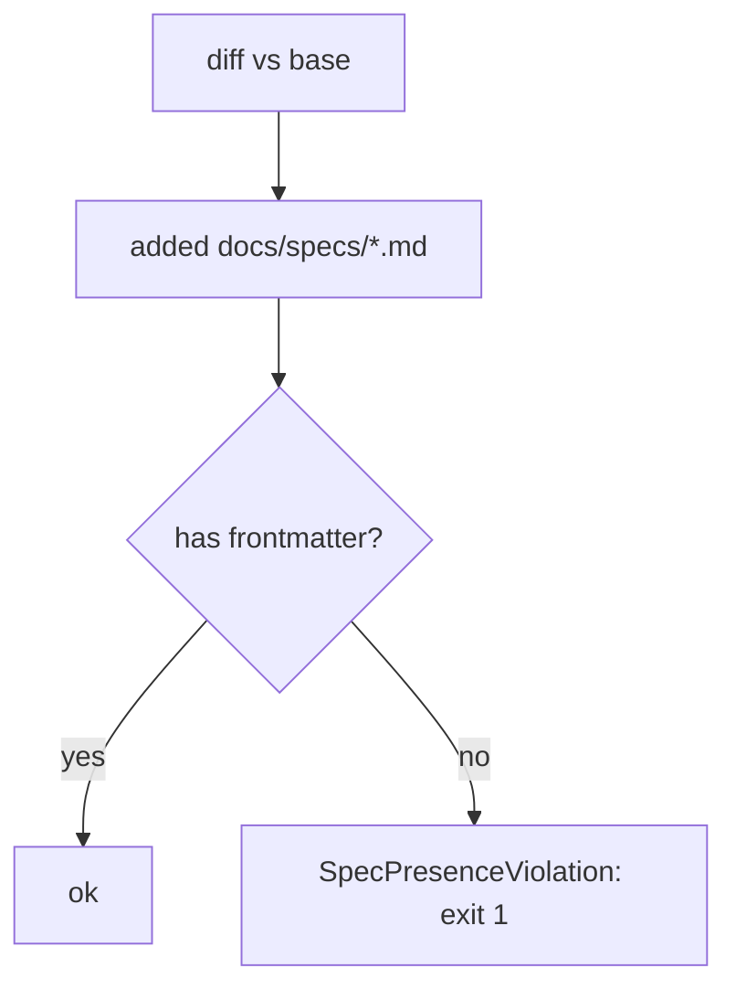

# SP-ARCH-SPEC-PRESENCE — a newly-added spec must carry frontmatter

## Intent
Close the last silent gap in the governance loop: a NEW spec written with
no frontmatter fence becomes a "frontier" (un-governed) node silently —
the edge-honesty gate skips frontier sources, so nothing complains. Make
the gate fail a PR that ADDS a `docs/specs/*.md` file lacking frontmatter,
so a new component cannot escape the dependency graph unnoticed.

## Context
Slice C of the pipeline-wiring arc, scoped to this one blocking check
(operator's call; the redundant "merge-gate surfaces arch-check" fact was
dropped — `ci_green` already requires the CI arch-check step). A *malformed*
frontmatter already fails loudly (`load_registry` raises
`MalformedFrontmatterError`); the only silent case is the total ABSENCE of
a fence on a newly-added spec. A *modified* legacy spec is untouched —
frozen frontier specs stay legitimately un-governed; only ADDED specs must
be governed.

## Goals
- G1: `has_frontmatter(text) -> bool` exposed from `arch` (the single
  frontmatter authority) so the check reuses one parser.
- G2: The gate gathers ADDED (`--diff-filter=A`) `docs/specs/*.md` files
  (excluding `_*.md`) and flags any without a frontmatter fence.
- G3: A spec-presence violation fails the gate (exit 1) with a clear
  message: "new spec X has no frontmatter — add the governed template
  block, or it becomes an un-graphed frontier node."
- G4: Modified/renamed legacy specs and `_TEMPLATE.md` are NOT flagged
  (only additions; underscore files skipped).

## Non-Goals
- NG1: Does NOT add a merge-gate `arch_honest` fact — redundant with
  `ci_green` (the edge-honesty step lives in the CI job).
- NG2: Does NOT flag a malformed frontmatter here — `load_registry`
  already raises on that (loud).
- NG3: Does NOT require frontmatter on legacy specs — only on additions.

## Assumptions
- A1: `SP-ARCH-EDGE-GATE` is merged; the gate's `run` / `check_diff` /
  `gather_changed_files` are the extension points.
- A2: git diff is reachable for the `--diff-filter=A` query.

## Interface
- `has_frontmatter(text: str) -> bool` — added to `arch` (re-exports the
  registry fence detector).
- `gather_added_specs(*, base, staged, repo_root) -> list[str]` — added
  spec paths, in `edge_honesty`.
- `Report` gains `spec_violations: tuple[SpecPresenceViolation, ...]`;
  `Report.ok` is false when any edge OR spec violation exists.

## Behavior

### Nominal
The gate, alongside the import/table checks, gathers added spec files →
for each, reads it and checks `has_frontmatter` → a file without a fence
becomes a `SpecPresenceViolation` → the gate exits 1 with the ledger line.

### Edge cases
- a modified (not added) legacy spec ⇒ not checked.
- `_TEMPLATE.md` / `_*.md` ⇒ skipped.
- an added spec WITH frontmatter ⇒ no violation.
- an added spec with MALFORMED frontmatter ⇒ surfaces via
  `load_registry` (`MalformedFrontmatterError`), as today — not this
  check's concern.

### Failure scenarios
- a newly-added spec with no fence ⇒ `SpecPresenceViolation`, exit 1.

## Architecture Impact
- Extends `SP-ARCH-EDGE-GATE`'s `edge_honesty.py` in place (owned by that
  spec; no new import, so no new edge — `depends_on` stays empty). Adds a
  re-export `has_frontmatter` to `arch` (owned by `SP-ARCH-GRAPH`'s
  package), reusing the registry's single fence parser.
- New coupling / cycles / shared state: none.

## Diagram

## Acceptance Criteria
- [ ] AC1: `has_frontmatter` is True for a fenced spec and False for a
  fence-less markdown file.
- [ ] AC2: `check_diff` (or the spec-presence pass) flags an ADDED
  fence-less `docs/specs/*.md`; `Report.ok` is False; exit 1.
- [ ] AC3: an ADDED spec WITH frontmatter ⇒ no spec violation.
- [ ] AC4: a MODIFIED (not added) fence-less legacy spec and `_TEMPLATE.md`
  ⇒ NOT flagged.
- [ ] AC5: full `pytest tests/unit` green; ruff + format + no-inline +
  no-silent clean; `ferova arch check` passes its own PR.

## Open Questions
- None. (Resolved while drafting: blocking, not a warning; added-only, not
  modified; reuse the registry fence parser via a `has_frontmatter`
  re-export; the merge-gate arch fact is dropped as redundant.)
