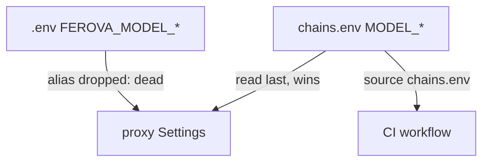

# SP-CHAINS-SINGLE-SOURCE — make chains.env the authoritative single source for capability chains

## Intent
End the `chains.env` ↔ `.env` drift on the four capability chains
(`MODEL_OPUS` / `MODEL_SONNET` / `MODEL_HAIKU` / `MODEL_CODER`) by making
`chains.env` authoritative: a per-machine `.env` can no longer silently
shadow the canonical tracked file. Editing `chains.env` always takes
effect; drift becomes mechanically impossible.

## Context
The chains are defined under two key names: `chains.env` (tracked,
canonical, also `source`-d by the CI workflow) uses bare `MODEL_*`, while a
local `.env` historically duplicated them as `FEROVA_MODEL_*`. The proxy's
`Settings` (`llm_proxy/config/settings.py`) read both via a dual alias
`AliasChoices(FEROVA_MODEL_*, MODEL_*)` AND with `.env` ordered after
`chains.env` in `env_file`. On both axes the `.env` `FEROVA_MODEL_*` value
WON — so editing the canonical `chains.env` had no live effect while a
stale `.env` carried the slot. The proxy is the only consumer; the main app
(`core/config.py`) has no `MODEL_*` fields. `.env` is gitignored, so a CI
gate cannot see it — the drift is purely local; the only enforcement points
are the proxy's own config resolution.

## Goals
- G1: `chains.env` is read LAST in the proxy `env_file` order, so its
  `MODEL_*` win over any value a `.env` defines for the same key.
- G2: The four chain fields read ONLY the bare `MODEL_*` key; the
  `FEROVA_MODEL_*` alias is dropped (a stale `.env` `FEROVA_MODEL_*` is dead).
- G3: With both files present, the resolved chain equals `chains.env`'s
  value regardless of `.env`.
- G4: `env.example` and the `chains.env` header reflect the new authority
  (no `FEROVA_MODEL_*` chain keys; chains live in `chains.env` only).

## Non-Goals
- NG1: Does NOT add a CI gate (impossible — `.env` is gitignored / unseen
  by CI).
- NG2: Does NOT change any other `FEROVA_*` alias — only the four chains.
- NG3: Does NOT preserve a per-machine `.env` override of the chains
  (operator's call): a machine-specific chain is made by editing
  `chains.env`, the canonical file.
- NG4: Does NOT touch `core/config.py` (no `MODEL_*` fields there).

## Assumptions
- A1: `chains.env` defines ONLY the four `MODEL_*` keys, so ordering it
  last changes precedence for nothing else.
- A2: An explicit process env var (`os.environ`, e.g. CI's `source
  chains.env`) still wins over every `env_file` — standard
  pydantic-settings precedence; CI sources `chains.env` so the value
  matches.

## Interface
`llm_proxy/config/settings.py`:
- `_env_files()` — returns the dotenv paths with `Path("chains.env")` LAST.
- `Settings.model_opus / model_sonnet / model_haiku / model_coder` —
  `validation_alias=AliasChoices("MODEL_OPUS")` (bare key only), each.
- `_LEGACY_TO_FEROVA_ALIAS` — no longer maps the four `MODEL_*` keys.

`chains.env` (owned): the four `MODEL_*` lines; header documents that it is
authoritative and `.env` cannot shadow it.

## Behavior

### Nominal
The proxy resolves each chain from `chains.env`. A `.env` carrying
`FEROVA_MODEL_*` (now an unread key) or bare `MODEL_*` (overridden by the
last-read `chains.env`) does not change the resolved chain.

### Edge cases
- `chains.env` absent (a deployment without it) → the field falls back to a
  bare `MODEL_*` process env var, else its default `None`.
- `MODEL_*` set in `os.environ` (CI `source chains.env`, or a deliberate
  deployment override) → wins, standard precedence; in CI the value is
  `chains.env`'s own.

### Failure scenarios
- A malformed chain value (no `provider/` prefix) → the existing
  `validate_model_format` validator raises `ValueError` at construction
  (unchanged).

## Architecture Impact
- Promotes `chains.env` into the governed graph as the owner of the
  `format:capability-chains` contract.
- `depends_on: []` — the contract needs no governed component.
- New / changed coupling, cycles, or shared state: none. `settings.py` and
  `.github/workflows/auto-review.yml` remain frontier consumers of the
  contract.

## Diagram

## Acceptance Criteria
- [ ] AC1: `_env_files()` returns `Path("chains.env")` as the last element.
- [ ] AC2: setting `FEROVA_MODEL_OPUS` no longer populates `model_opus`;
  setting `MODEL_OPUS` does; `_LEGACY_TO_FEROVA_ALIAS` has no `MODEL_*` key.
- [ ] AC3: a test with a temp `chains.env` and a temp `.env` defining a
  different chain resolves the field to `chains.env`'s value.
- [ ] AC4: `env.example` lists no `FEROVA_MODEL_*` chain key and the
  `chains.env` header states it is authoritative.
- [ ] AC5: the chain-resolution suites (routing table parity, health
  breaker, probe seed, chain health) pass with their fixtures using the
  bare `MODEL_*` key.

## Open Questions
- None.
</content>
