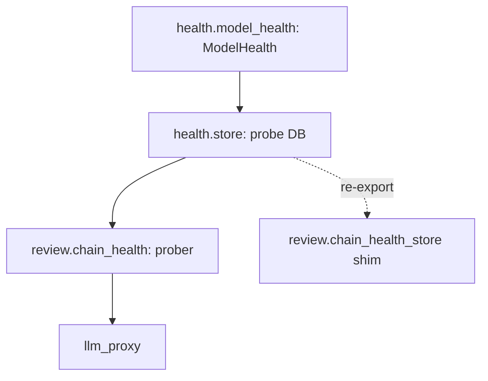

# SP-HEALTH-STORE-NEUTRALIZE — break the proxy↔review cycle

## Intent
Make the NIM health-probe store importable by BOTH the review subtree and
the llm_proxy without an import cycle, so the proxy can later seed its
failover breaker from probe history (`SP-PROXY-BREAKER-PROBE-SEED`, D2b).
Today the store transitively imports `llm_proxy` (via `chain_health`), so
`llm_proxy → store → chain_health → llm_proxy` would cycle.

## Context
Pure refactor — no behaviour change. `ModelHealth` (a frozen dataclass)
and the probe store (`ProbeRow` / `record_probes` / `fetch_probes` / the
`nim_health_probe` schema) move to a new neutral leaf `src/ferova/health/`
that imports only `sqlalchemy` + `core.logging`. The prober
`review/chain_health.py` (which legitimately imports `llm_proxy` to call
NIM) keeps its probing logic but imports `ModelHealth` from the neutral
home. `review/chain_health_store.py` becomes a thin re-export so existing
import paths (cli, tests) keep working. Characterized by the existing
chain-health suites — they must stay green unchanged.

## Goals
- G1: `health/model_health.py` — `ModelHealth` + status constants +
  `is_degraded`, pure (no `llm_proxy`, no DB).
- G2: `health/store.py` — `ProbeRow`, `record_probes`, `fetch_probes`,
  `init_nim_health_schema`, the `nim_health_probe` table — importing only
  `sqlalchemy`, `core.logging`, and `health.model_health`.
- G3: `review/chain_health.py` imports `ModelHealth` / `is_degraded` from
  `health.model_health` (the prober keeps its `llm_proxy` import — it does
  the actual probing).
- G4: `review/chain_health_store.py` re-exports `health.store` symbols so
  `cli/main.py` and tests need no import change (or are updated in lockstep).
- G5: No cycle — `health/` imports nothing that imports `llm_proxy` or
  `review`.

## Non-Goals
- NG1: Does NOT add the breaker seed — that is D2b
  (`SP-PROXY-BREAKER-PROBE-SEED`), which builds on this.
- NG2: Does NOT change any probe/health behaviour, schema columns, or the
  `monitor-chains` CLI output — pure move + re-export.

## Assumptions
- A1: `ModelHealth` is a pure dataclass (no `llm_proxy` dependency in its
  own definition — confirmed; only the prober functions around it use
  `llm_proxy`).
- A2: The `nim_health_probe` schema is owned solely by the store.

## Interface
- `health.model_health`: `ModelHealth`, `is_degraded`, status constants.
- `health.store`: `ProbeRow`, `record_probes`, `fetch_probes`,
  `init_nim_health_schema`.
- `review.chain_health_store`: re-exports the above (back-compat shim).

## Behavior

### Nominal
Imports resolve to the neutral home; `monitor-chains` records and the
review prober produce identical results to before.

### Edge cases
- existing callers importing from `review.chain_health_store` keep working
  via the re-export.

### Failure scenarios
- none new — pure refactor; a missed import site is a hard ImportError at
  load, caught by the suite.

## Architecture Impact
- Introduces the governed leaf `src/ferova/health/` and moves the
  `db:table:nim_health_probe` resource ownership to it.
- Removes the latent `llm_proxy → store → chain_health → llm_proxy` cycle
  that would form once the proxy reads probes — `health/` depends on no
  governed component (`depends_on: []`).
- `review/` (frontier) now imports `health/` (governed) — a frontier→
  governed edge, not gate-enforced (frontier source), but acyclic.
- New coupling / cycles / shared state: removes a would-be cycle; none added.

## Diagram

## Acceptance Criteria
- [ ] AC1: `health.model_health` and `health.store` import cleanly with no
  `llm_proxy` / `review` import in their module graph (a test asserts the
  absence).
- [ ] AC2: `fetch_probes` / `record_probes` round-trip through
  `health.store` exactly as the old store did (moved test passes).
- [ ] AC3: `review.chain_health_store` re-exports the symbols; existing
  `monitor-chains` + chain-health suites stay green unchanged.
- [ ] AC4: full `pytest tests/unit` green; ruff + format + no-inline +
  no-silent clean; `ferova arch check` passes (the new governed leaf
  declares no edges and owns the table).

## Open Questions
- None. (Resolved while drafting: keep a re-export shim in
  `review.chain_health_store` for back-compat; the prober stays in
  `review/` with its `llm_proxy` import; the table resource moves to the
  neutral owner.)
