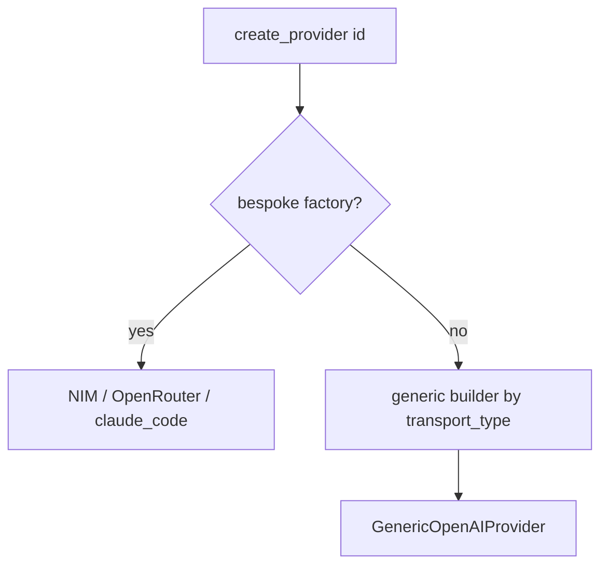

# SP-PROVIDER-TRANSPORT-SPI — consolidate provider error mapping and make transport_type dispatch

## Intent
Close the residual of pillar 3 of the proxy-routing redesign (the
"provider SPI") with two bounded consolidations: factor the user-facing
upstream-error message — duplicated verbatim across both transports —
into one shared helper, and make the catalog's declared `transport_type`
actually drive the factory so a provider that needs no bespoke shaping is
purely declarative.

## Context
The provider layer is already well factored: `OpenAIChatTransport`
(`openai_compat.py`) and `AnthropicMessagesTransport`
(`anthropic_messages.py`) each own a full streaming loop, and the catalog
(`catalog.py`) + registry (`registry.py`) form a declarative SPI where
adding an OpenAI-compatible provider is a descriptor plus a factory entry.
Two seams remain. First, the 405-rejection special case and the
read-timeout-aware fallback that map an upstream exception to user text
are copied near-verbatim in `openai_compat._stream_response_impl` and
`anthropic_messages._get_error_message`. Second, `ProviderDescriptor`
declares `transport_type` (`"openai_chat"` / `"anthropic_messages"`) but
the factory ignores it: `PROVIDER_FACTORIES` hard-wires every class,
including four near-identical `_generic_openai_factory(name)` closures for
kimi / groq / cerebras / deepseek — so `transport_type` is dead metadata.

## Goals
- G1: A single `provider_error_message(...)` in `error_mapping.py` that
  both transports call to produce the base user-facing message (the
  request-id suffix stays each transport's own concern).
- G2: `create_provider` dispatches by `descriptor.transport_type` for any
  provider with no bespoke factory; kimi / groq / cerebras / deepseek
  build through that path with no per-provider closure.
- G3: A startup invariant proves every descriptor is buildable — bespoke
  factory OR a generic transport builder for its `transport_type` — so a
  new descriptor cannot silently lack a builder.
- G4: Behaviour is byte-identical: the SSE error bytes emitted for an
  upstream failure (both wire shapes) are unchanged.

## Non-Goals
- NG1: Does NOT merge the two transport base classes — they encode two
  genuinely different wire formats; unifying them would add abstraction
  for no gain.
- NG2: Does NOT touch `claude_code` (a bespoke subprocess provider) or any
  request-builder (`build_request_body`) — those divergences are real.
- NG3: Does NOT add a generic `anthropic_messages` transport builder — no
  provider needs one (OpenRouter and claude_code are both bespoke); the
  dispatch table simply has no entry for that transport yet.

## Assumptions
- A1: All provider/config/core modules touched are frontier (un-owned by
  any governed spec), so promoting `error_mapping.py` and `registry.py`
  with `depends_on: []` is honest — verified against `ferova arch graph`.
- A2: The request-id suffix divergence between transports
  (`append_request_id` vs `_format_error_message`) is intentional and
  preserved.

## Interface

`error_mapping.py` — new:
- `provider_error_message(error: Exception, *, provider_name: str,
  rate_limiter: GlobalRateLimiter | None = None, read_timeout_s: float)
  -> str` — maps `error` via `map_error`, returns the HTTP-405 rejection
  sentence when the mapped error's `status_code` is 405, else
  `get_user_facing_error_message(mapped, read_timeout_s=...)`. Returns the
  base message WITHOUT a request-id suffix.

`registry.py` — changed:
- `_BESPOKE_FACTORIES: dict[str, ProviderFactory]` — `nvidia_nim`,
  `open_router`, `claude_code` only.
- `_GENERIC_TRANSPORT_BUILDERS: dict[TransportType, Callable[[ProviderConfig,
  ProviderDescriptor], BaseProvider]]` — `{"openai_chat": <generic
  OpenAI builder>}`.
- `create_provider(provider_id, settings)` — bespoke factory if present,
  else the generic builder for `descriptor.transport_type`, else
  `UnknownProviderTypeError`.
- `PROVIDER_FACTORIES` and `_generic_openai_factory` are removed; the
  module-level sync guard asserts every descriptor is buildable.

Errors:
- `UnknownProviderTypeError`: unknown id, or a descriptor whose
  `transport_type` has no generic builder and no bespoke factory.

## Behavior

### Nominal
- An upstream failure in either transport calls `provider_error_message`;
  the OpenAI path appends the request id via `append_request_id`, the
  native path via `_format_error_message` — identical bytes to today.
- `create_provider("kimi", settings)` builds a `GenericOpenAIProvider`
  via the `"openai_chat"` generic builder; `create_provider("nvidia_nim",
  ...)` uses the bespoke NIM factory.

### Edge cases
- A mapped error with `status_code == 405` → the fixed "rejected the
  request method or endpoint (HTTP 405)" sentence, naming the provider.
- A descriptor added with an unmapped `transport_type` → the import-time
  buildability guard raises `AssertionError`.

### Failure scenarios
- Unknown `provider_id` → `UnknownProviderTypeError` listing supported ids
  (unchanged).

## Architecture Impact
- Promotes `error_mapping.py` and `registry.py` from frontier into the
  governed graph (opportunistic erosion, their zone being touched).
- `depends_on: []` — both owned files import only frontier modules
  (`core.anthropic`, `providers.catalog`, `providers.exceptions`,
  `providers.rate_limit`, `config.settings`); no governed component.
- New / changed coupling, cycles, or shared state: none. `openai_compat.py`
  and `anthropic_messages.py` remain frontier consumers of the helper.

## Diagram

## Acceptance Criteria
- [ ] AC1: `error_mapping.provider_error_message` exists and returns the
  405 sentence for a 405-mapped error and the read-timeout-aware message
  otherwise; a unit test covers both branches.
- [ ] AC2: both `openai_compat` and `anthropic_messages` call
  `provider_error_message`; neither imports `map_error` or
  `get_user_facing_error_message` directly any more.
- [ ] AC3: `create_provider` builds each of kimi / groq / cerebras /
  deepseek as a `GenericOpenAIProvider` and `nvidia_nim` /
  `open_router` / `claude_code` via their bespoke factories.
- [ ] AC4: `PROVIDER_FACTORIES` is gone; a guard asserts every descriptor
  is buildable, and `test_provider_catalog` verifies buildability via the
  bespoke set ∪ generic-transport coverage.
- [ ] AC5: existing transport error-emission tests pass unchanged
  (byte-identical SSE error output).

## Open Questions
- None.
</content>
</invoke>
