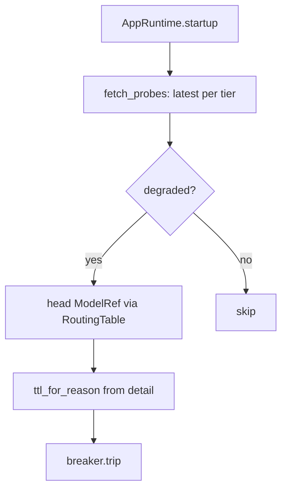

# SP-PROXY-BREAKER-PROBE-SEED — seed the breaker at startup

## Intent
Remove the once-per-restart 410 penalty: at proxy startup, pre-trip the
failover breaker for any tier whose most recent NIM probe is degraded, so
a model known dead from the 15-minute `monitor-chains` sweep is skipped
BEFORE the first live request pays its round-trip. Reuses the reason-aware
TTL (`ttl_for_reason`, D2a) so a probed 410 stays down 7 days while a stale
transient error only trips the 120 s window.

## Context
D2b, unblocked by `SP-HEALTH-STORE-NEUTRALIZE` (the probe store is now a
neutral leaf the proxy can read without a cycle). A new bridge
`llm_proxy/routing/probe_seed.py` reads the latest probe per tier
(`fetch_probes`), maps a degraded tier to its chain HEAD `ModelRef` via
`RoutingTable.from_settings`, classifies the probe `detail` into a failover
reason, and trips the process breaker. Wired into `AppRuntime.startup`,
gated by a setting, and defensive — a missing/empty DB seeds nothing.

## Goals
- G1: `seed_breaker_from_probes(settings, *, now, db_path) -> int` —
  trips the head `ModelRef` of every tier whose latest probe is degraded
  (`is_degraded`), with `ttl_for_reason(reason, ...)`; returns the count
  tripped.
- G2: Probe→ref mapping: a degraded probe for tier T trips
  `RoutingTable.from_settings(settings).chains[T].refs[0]` (the head the
  router would try first) — robust to the probe's exact model string.
- G3: Probe `detail`→reason: a `detail` containing `410` ⇒ `provider_410`
  (terminal, 7-day TTL); any other degraded status ⇒ a transient reason
  (120 s) — a stale transient trip is harmless and self-clears.
- G4: A proxy setting `breaker_probe_seed_enabled` (default True) +
  `db_path` (default the shared review DB) gate the seed.
- G5: Wired into `AppRuntime.startup`; defensive — a missing DB, empty
  probes, or a read error logs and seeds nothing (never blocks startup).

## Non-Goals
- NG1: Does NOT probe NIM itself — it only READS the
  `monitor-chains`-written history.
- NG2: Does NOT seed non-degraded (ok/slow/skipped) tiers.
- NG3: Does NOT change the breaker, `ttl_for_reason`, or the routing table
  — reuses them.

## Assumptions
- A1: `SP-HEALTH-STORE-NEUTRALIZE` is merged — `health.store.fetch_probes`
  imports no `llm_proxy` (no cycle).
- A2: `RoutingTable.from_settings` yields a head `ModelRef` per configured
  tier.
- A3: The breaker is the process singleton (`get_breaker`).

## Interface
In `llm_proxy/routing/probe_seed.py`:
- `seed_breaker_from_probes(settings: Settings, *, now: float, db_path: Path) -> int`
  — trips the degraded tiers' head refs; returns the count tripped.
- `parse_tier(value: str) -> Tier | None` — map a probe tier string to the
  routing `Tier`, `None` when unknown (reuses `routing.tier`).
- `reason_from_detail(detail: str) -> str` — `provider_410` when `"410"`
  is in `detail`, else a transient reason.

Wiring:
- `AppRuntime.startup` calls `seed_breaker_from_probes` when
  `settings.breaker_probe_seed_enabled`, inside a best-effort guard.
- Settings: `breaker_probe_seed_enabled: bool = True`,
  `breaker_probe_seed_db: str` (alias `BREAKER_PROBE_SEED_DB`, default the
  shared review DB path).

## Behavior

### Nominal
`seed_breaker_from_probes(settings, *, now, db_path)` runs this:

```
table   = RoutingTable.from_settings(settings)
breaker = get_breaker()
rows    = fetch_probes(db_path)            # newest-first (id DESC)
seen    = set()                            # tiers already decided
tripped = 0
for row in rows:                           # newest row per tier wins
    tier = parse_tier(row.tier)            # "coder" -> Tier.CODER; unknown -> skip
    if tier is None or tier in seen:
        continue
    seen.add(tier)                         # this is the LATEST probe for the tier
    if not is_degraded(row.status):        # ok / slow / skipped -> leave the tier alone
        continue
    chain = table.chains.get(tier)         # tier with no configured chain -> skip
    if chain is None:
        continue
    head   = chain.refs[0]                  # the ModelRef the router tries first
    reason = reason_from_detail(row.detail) # "410" substring -> provider_410, else transient
    ttl    = ttl_for_reason(reason,
                            default_ttl_s=settings.breaker_ttl_s,
                            terminal_ttl_s=settings.breaker_ttl_terminal_s)
    breaker.trip(head, now=now, ttl_s=ttl)  # extends-not-shortens (D)
    tripped += 1
return tripped
```

Key rules:
- **Latest-per-tier:** `fetch_probes` returns newest-first, so the first
  row seen for a tier is its latest probe; later rows for that tier are
  ignored (`seen`).
- **Degraded only:** `is_degraded` (empty/error) — `ok`/`slow`/`skipped`
  never seed.
- **Head, not raw model:** trip `chain.refs[0]` — the ref the router would
  try first — not `row.model`, so a probe model string that differs from
  the configured ref still trips the right ModelRef.
- **Reason from detail:** `reason_from_detail(detail)` returns
  `provider_410` when `"410"` is in `detail` (terminal, 7-day TTL), else a
  transient reason (`breaker_ttl_s`, 120 s).

`AppRuntime.startup`, when `settings.breaker_probe_seed_enabled`, calls it
with `now=time.monotonic()` and `db_path=Path(settings.breaker_probe_seed_db)`
inside a best-effort guard.

### Edge cases
- no DB file / empty probes ⇒ `fetch_probes` returns `[]` ⇒ 0 tripped.
- latest probe is ok/slow/skipped ⇒ tier not seeded.
- a tier with no configured chain ⇒ skipped (no head to trip).
- an unknown `tier` string in a row ⇒ skipped (`parse_tier` returns None).
- a degraded probe whose head later recovers ⇒ a transient trip lapses on
  its 120 s TTL, or the live success path `recover()`s the ref.

### Failure scenarios
- a read/parse error (corrupt DB, unreadable path) ⇒ caught at the
  `startup` call site, logged, startup continues — the seed is
  best-effort and must never block the proxy from coming up.

## Architecture Impact
- Adds the governed bridge `llm_proxy/routing/probe_seed.py`.
- Adds dependency: `SP-PROXY-BREAKER-PROBE-SEED -> SP-HEALTH-STORE-NEUTRALIZE`
  — imports `fetch_probes` from the neutral health store (the edge the
  whole D2b refactor existed to make acyclic).
- Imports the breaker / RoutingTable / `ttl_for_reason` from
  `llm_proxy/routing` (frontier) — reported, not enforced; acyclic
  (health store imports no llm_proxy).
- Edits frontier `config/settings.py` + `api/runtime.py` (not enforced).
- New coupling / cycles / shared state: none — the cycle the refactor
  removed stays removed.

## Diagram


## Acceptance Criteria
- [ ] AC1: a degraded `provider_410` probe for `coder` trips the coder
  head ModelRef for the 7-day terminal TTL (still down past 120 s, clear
  past 7 days).
- [ ] AC2: a degraded transient probe trips only the 120 s window.
- [ ] AC3: an ok/slow/skipped latest probe seeds nothing for that tier.
- [ ] AC4: empty/missing DB ⇒ returns 0, no exception.
- [ ] AC5: `breaker_probe_seed_enabled=False` ⇒ startup seeds nothing.
- [ ] AC6: `BREAKER_PROBE_SEED_DB` alias covered by the settings test.
- [ ] AC7: full `pytest tests/unit` green; ruff + format + no-inline +
  no-silent clean; `ferova arch check` passes (the import of
  `fetch_probes` is declared as `SP-HEALTH-STORE-NEUTRALIZE`).

## Open Questions
- None. (Resolved while drafting: trip the configured chain HEAD per tier,
  not the probe's raw model string; reason from `detail` substring `410`;
  seed enabled by default, fully defensive on a missing DB.)
