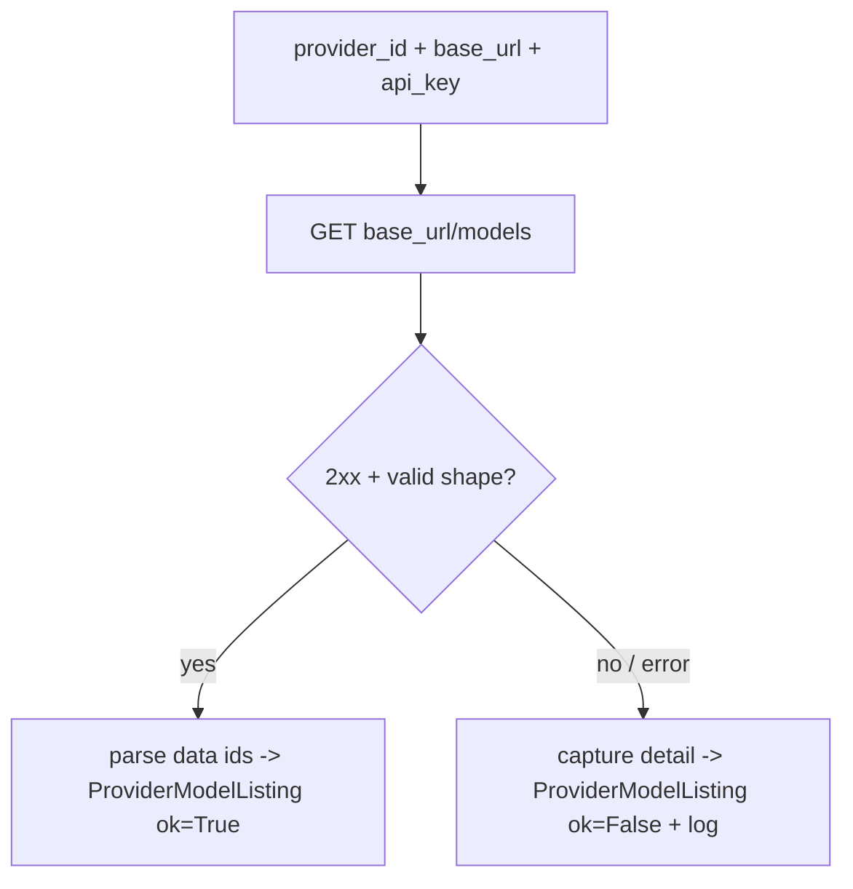

# SP-CHAINPILOT-CATALOG-MODELS — per-provider model listing

## Intent
Phase 1a of the Chain Autopilot arc. A single pure-ish leaf that asks one
provider "which models do you serve?" by hitting its upstream
`GET {base_url}/models` and returning the parsed ids. This is the catalog
sweep's *eyes* — the lowest brick of the observatory. Additive, resilient
(never raises), and unwired: nothing iterates it yet (that is 1b).

## Context
The Chain Autopilot must build a live `(provider × model)` matrix
(`docs/chain_autopilot_architecture.md`, brick 1). The matrix is built by
iterating `PROVIDER_DESCRIPTORS` and querying each provider's `/v1/models`.
This slice provides the per-provider call only. It deliberately does **not**
resolve credentials or base URLs itself: the caller (1b's matrix builder)
turns a descriptor into `(base_url, api_key)` via the existing
`build_provider_config` and injects them — exactly mirroring how
`review/chain_health.py:probe_nim_model` takes an explicit client +
base_url + api_key so it stays decoupled from `Settings` and trivially
testable with a fake transport.

Note: the proxy's own `GET /v1/models` route (`api/routes.py`) is the
*opposite* direction — it advertises the proxy's Claude-compatible ids to
clients. This slice queries the *upstream* providers; the two are unrelated
and `routes.py` is untouched.

`claude_code` is special-cased out of the sweep: it is a subprocess backstop
with no HTTP `/v1/models` endpoint, so it is never listed.

## Goals
- G1: `async list_provider_models(client, *, provider_id, base_url, api_key,
  timeout_s=15.0) -> ProviderModelListing` — issues `GET
  {base_url.rstrip('/')}/models` with `Authorization: Bearer {api_key}`,
  parses the OpenAI-shape `{"data": [{"id": ...}, ...]}` body into ids, and
  **never raises** (any failure is captured as `ok=False` + a `detail`
  string, and logged via structlog — no silent except, per
  SP-LINT-LOG-CATCH-ALL).
- G2: `ProviderModelListing` (frozen) — `provider_id: str`,
  `models: tuple[ListedModel, ...]`, `ok: bool`, `detail: str`; and
  `ListedModel` (frozen) — `model_id: str`. The contract 1b consumes.
- G3: `UNSWEPT_PROVIDERS: frozenset[str]` (= `{"claude_code"}`) and
  `is_sweepable(provider_id: str) -> bool` — the documented predicate that
  keeps the subprocess backstop out of the sweep without importing the
  descriptor table.

## Non-Goals
- NG1: Does NOT build the matrix or iterate `PROVIDER_DESCRIPTORS` — that is
  1b (`SP-CHAINPILOT-MATRIX`).
- NG2: Does NOT resolve `base_url`/`api_key` from `Settings` or call
  `build_provider_config` — the caller injects them (no edge to `registry.py`).
- NG3: Does NOT persist anything — no DB writes (persistence arrives with the
  probe matrix, 2a).
- NG4: Does NOT touch the proxy's own `/v1/models` route, routing, or
  `chains.env`.
- NG5: Does NOT probe health, latency, or thinking — pure id discovery only.

## Assumptions
- A1: All swept providers are OpenAI-compatible and expose `GET
  {base_url}/models` returning `{"data": [{"id": str, ...}, ...]}` — true for
  nvidia_nim, open_router, kimi, groq, cerebras, deepseek. `base_url` already
  includes the `/v1` segment (e.g. `https://integrate.api.nvidia.com/v1`), so
  the endpoint is `{base_url}/models`, not `{base_url}/v1/models`.
- A2: `httpx` is available (already a dependency) and the caller owns the
  `AsyncClient` lifecycle (injected, not created here).

## Interface
`src/ferova/llm_proxy/providers/model_catalog.py`:

- `@dataclass(frozen=True, slots=True) class ListedModel`: `model_id: str`
- `@dataclass(frozen=True, slots=True) class ProviderModelListing`:
  `provider_id: str`, `models: tuple[ListedModel, ...]`, `ok: bool`,
  `detail: str`
- `UNSWEPT_PROVIDERS: frozenset[str]`
- `def is_sweepable(provider_id: str) -> bool`
- `async def list_provider_models(client: httpx.AsyncClient, *,
  provider_id: str, base_url: str, api_key: str, timeout_s: float = 15.0)
  -> ProviderModelListing`

Inputs:
- `client`: `httpx.AsyncClient` — caller-owned transport.
- `base_url`: `str` — provider base ending in `/v1`.
- `api_key`: `str` — bearer credential; may be empty for keyless locals.

Outputs:
- `ProviderModelListing` — `ok=True` with the parsed ids on a 2xx + valid
  body; `ok=False` with a populated `detail` otherwise. `models` is always a
  tuple (empty on failure).

Errors:
- None propagated — the function never raises; failures live in
  `ok`/`detail`.

## Behavior

### Nominal
- `GET {base_url}/models` returns 2xx with `{"data": [{"id": "x"}, ...]}` →
  `ProviderModelListing(provider_id, (ListedModel("x"), ...), ok=True,
  detail="<n> models")`. Entries missing a string `id` are skipped (not fatal).

### Edge cases
- Empty `data` list → `ok=True`, `models=()`, `detail="0 models"`.
- Body present but not the expected shape (no `data` key / not a list) →
  `ok=False`, `detail` names the shape problem.
- Non-2xx status (incl. 410 EOL, 401 auth) → `ok=False`, `detail` carries the
  status code and reason.

### Failure scenarios
- Transport error (timeout, connection refused, DNS) → caught, `ok=False`,
  `detail=str(exc)`, and a structlog warning is emitted (caught-and-logged,
  never silenced).
- `is_sweepable(provider_id) is False` is the caller's guard; this function
  does not itself reject claude_code (it has no base_url to call anyway).

## Architecture Impact
- New leaf `providers/model_catalog.py`; `depends_on: []` — uses only `httpx`
  + stdlib and imports no owned module. (It does not import `catalog.py`; the
  caller in 1b does the descriptor iteration.)
- New / changed coupling, cycles, shared state: none. 1b
  (`SP-CHAINPILOT-MATRIX`) will become the consumer.

## Diagram

## Acceptance Criteria
- [ ] AC1: A 2xx body `{"data": [{"id": "a"}, {"id": "b"}]}` yields
  `ok=True` and `models == (ListedModel("a"), ListedModel("b"))` (tested with
  a fake/mock `httpx.AsyncClient`).
- [ ] AC2: A non-2xx response (e.g. 410) yields `ok=False`, `models == ()`,
  and a `detail` containing the status code — no exception escapes.
- [ ] AC3: A transport exception (raised by the fake client) yields
  `ok=False` with `detail=str(exc)` and no propagation; a structlog event is
  emitted (asserted via a captured `_log`).
- [ ] AC4: A malformed body (missing `data`) yields `ok=False` with a
  shape-describing `detail`; entries lacking a string `id` are skipped while
  valid siblings survive.
- [ ] AC5: `is_sweepable("claude_code") is False` and
  `is_sweepable("nvidia_nim") is True`; `UNSWEPT_PROVIDERS == frozenset({"claude_code"})`.
- [ ] AC6: The module is unwired — grep proves no existing module imports
  `model_catalog` in this slice.

## Open Questions
- None.
