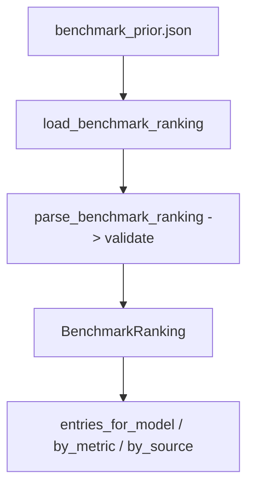

# SP-CHAINPILOT-BENCHMARK-INGEST — the benchmark prior

## Intent
Phase 1c of the Chain Autopilot arc. Ingest a **versioned snapshot of real
public benchmark rankings** into a queryable in-memory prior. By Principle 3
this is only the *prior* — a starting quality estimate for a model the factory
has not yet run — which the live performance harvest (2b–2d) later overrides.

## Context
Brick 2 of the architecture: "Benchmark prior — ingest public benchmark
rankings." A model unseen in our own outcomes still needs a quality estimate so
the decision engine (3b) can reason about promoting it; public rankings supply
that. The data is a hand-curated, version-controlled JSON snapshot
(`benchmark_prior.json`, mixing several real sources, each with provenance),
refreshed by hand as the landscape moves — **not** fetched live (that would be
fragile and is contrary to a mere seed). Rankings are keyed by each source's
own model *name*; bridging those names to our provider model IDs is 1d
(`SP-CHAINPILOT-EQUIVALENCES`), kept separate. This slice is pure ingest +
query; it picks no models and writes no chain.

The snapshot is a **mix** of sources (operator's call): a general-intelligence
ranking plus a coding-specific one, so both general tiers and the coder tier
get a prior. Every figure carries provenance (source, url, capture date,
metric, scale); no number is synthesised — unverifiable models are simply
absent.

## Goals
- G1: Pydantic v2 models (frozen) for the contract: `BenchmarkEntry`
  (`source`, `model_name`, `metric`, `score: float`, `rank: int`),
  `BenchmarkSourceMeta` (`source`, `url`, `captured`, `metric`, `scale`), and
  `BenchmarkRanking` (`sources: tuple[...]`, `entries: tuple[...]`). Validation
  on load makes a malformed resource fail loud.
- G2: `parse_benchmark_ranking(payload: dict) -> BenchmarkRanking` — the pure
  parser (validates + builds), testable with a fixture.
- G3: `load_benchmark_ranking(path: Path | None = None) -> BenchmarkRanking` —
  reads the versioned JSON resource (default: `benchmark_prior.json` beside the
  module) and parses it.
- G4: Query helpers on `BenchmarkRanking`: `entries_for_model(model_name) ->
  tuple[BenchmarkEntry, ...]`, `by_source(source) -> tuple[...]`,
  `by_metric(metric) -> tuple[...]`, `model_names() -> tuple[str, ...]`.
- G5: A real seed `benchmark_prior.json` — a current snapshot from real public
  sources (a general index + a coding leaderboard), with full provenance.

## Non-Goals
- NG1: Does NOT fetch rankings live — read-from-resource only.
- NG2: Does NOT map benchmark names to provider model IDs — that is 1d.
- NG3: Does NOT compute a blended score, rank tiers, or pick models — the
  posterior/aggregation is 2d, the decision is 3b.
- NG4: Does NOT persist to a DB or mutate `chains.env`.
- NG5: Does NOT synthesise scores — only verified, sourced figures are seeded.

## Assumptions
- A1: The resource is hand-curated and trusted; a parse/validation error means
  a broken commit, so loading MAY raise (fail loud) rather than degrade.
- A2: Source model names differ from our provider IDs and from each other; 1d
  reconciles them. 1c stores them verbatim.

## Interface
`src/ferova/llm_proxy/providers/benchmark_prior.py`:

- `class BenchmarkEntry(BaseModel, frozen=True)`: `source: str`,
  `model_name: str`, `metric: str`, `score: float`, `rank: int`
- `class BenchmarkSourceMeta(BaseModel, frozen=True)`: `source: str`,
  `url: str`, `captured: str`, `metric: str`, `scale: str`
- `class BenchmarkRanking(BaseModel, frozen=True)`: `sources: tuple[...]`,
  `entries: tuple[...]`; methods `entries_for_model`, `by_source`, `by_metric`,
  `model_names`
- `def parse_benchmark_ranking(payload: dict) -> BenchmarkRanking`
- `def load_benchmark_ranking(path: Path | None = None) -> BenchmarkRanking`

Errors:
- `pydantic.ValidationError` / `json.JSONDecodeError` — on a malformed resource
  (fail loud, by A1).

## Behavior

### Nominal
- `load_benchmark_ranking()` reads the seed JSON, validates it, and returns a
  `BenchmarkRanking`. `entries_for_model("DeepSeek V4")` returns every source's
  entry for that name; `by_metric("intelligence_index")` returns that metric's
  ranking.

### Edge cases
- A model present in one source but not another → appears only in that source's
  entries (no fabricated cross-source figure).
- `entries_for_model` of an unknown name / `by_source` of an unknown source →
  empty tuple.

### Failure scenarios
- Malformed/incomplete resource (missing field, wrong type) →
  `ValidationError` at load — loud, not silent (A1).

## Architecture Impact
- New leaf `providers/benchmark_prior.py` (+ its `benchmark_prior.json`);
  `depends_on: []` (json + pydantic + stdlib). New / changed coupling, cycles,
  shared state: none. 2d (`SP-CHAINPILOT-PERF-AGGREGATE`) and 1d become frontier
  consumers later.

## Diagram

## Acceptance Criteria
- [ ] AC1: `parse_benchmark_ranking` over a fixture with 2 sources builds a
  `BenchmarkRanking` whose `sources`/`entries` round-trip the fixture and whose
  `model_names()` lists the distinct names.
- [ ] AC2: `entries_for_model` returns all and only the entries for a name
  across sources; an unknown name returns `()`.
- [ ] AC3: `by_metric` / `by_source` filter correctly; unknown → `()`.
- [ ] AC4: A malformed payload (missing required field / wrong type) raises
  `ValidationError` — asserted in a test.
- [ ] AC5: `load_benchmark_ranking()` loads the shipped `benchmark_prior.json`
  without error and yields a non-empty ranking with ≥2 real sources, each entry
  carrying provenance via its `BenchmarkSourceMeta`.

## Open Questions
- None.
