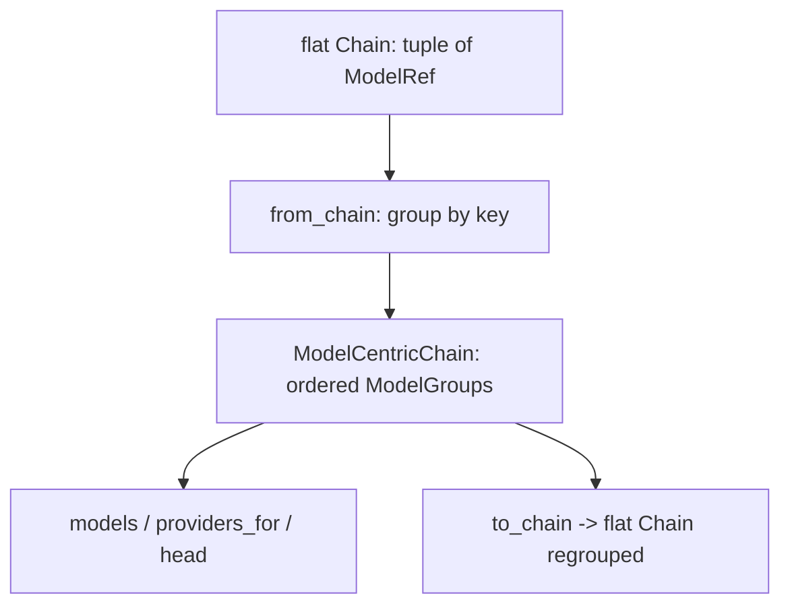

# SP-CHAINPILOT-CHAIN-MODEL-CENTRIC — model-centric chain structure

## Intent
Phase 1e of the Chain Autopilot arc — and the last Phase-1 brick. Introduce the
**model-centric** view of a chain (Principle 2): a chain as an ordered list of
*models* (by quality), each fanning out to all of its providers, so failover has
two axes — across models (quality) and, within a model, across providers
(health/latency). It lands **additively, behind the existing flat `Chain`**:
the flat type and all routing/dispatch behaviour are untouched; this is a
derivable lens, wired by nobody yet.

## Context
Today routing is entirely flat: `Chain` is a `tuple[ModelRef, ...]`
(`routing/chain.py`), iterated left-to-right by the dispatcher with no grouping
(`api/services.py:_stream_with_failover`). The model-centric structure the arc
needs is a *grouping* of that flat order by model. This slice delivers the
**types and the derivation** only; it does not change how chains are parsed,
resolved, or traversed (that re-wiring, if ever, is a later slice). Keeping it a
pure leaf that imports just `Chain`/`ModelRef` makes it zero-risk.

`from_chain` groups by each ref's `model` segment by default (syntactic). It
accepts an optional `key` callable so the **semantic** grouping — the same model
served under different provider IDs (e.g. `nvidia_nim/deepseek-ai/deepseek-v4-pro`
vs `open_router/deepseek/deepseek-v4`) — can be layered later via the 1d
equivalence resolver, **without reshaping this type**. That composition lives in
2d, so 1e itself stays `depends_on: []`.

## Goals
- G1: `ModelGroup` (frozen) — `model: str` (the grouping identity), `providers:
  tuple[ModelRef, ...]` (non-empty, order preserved); `head() -> ModelRef`.
- G2: `ModelCentricChain` (frozen) — `groups: tuple[ModelGroup, ...]`
  (non-empty); helpers `models() -> tuple[str, ...]`, `providers_for(model) ->
  tuple[ModelRef, ...]`, `__len__` (= group count).
- G3: `ModelCentricChain.from_chain(chain: Chain, *, key:
  Callable[[ModelRef], str] | None = None) -> ModelCentricChain` — group the
  flat refs, preserving first-occurrence order of both the groups and the
  providers within each. `key` defaults to `ref.model`.
- G4: `to_chain() -> Chain` — flatten the groups back to a flat `Chain` in
  group-major order (providers of each model adjacent). It round-trips a chain
  whose providers are already model-adjacent; for an interleaved source it
  yields the regrouped order (the model-centric traversal), by design.

## Non-Goals
- NG1: Does NOT modify `Chain`, `ModelRef`, `RoutingTable`, or any routing/
  dispatch code — purely additive.
- NG2: Is NOT wired into resolution or failover — no caller in this slice.
- NG3: Does NOT do semantic cross-provider-ID grouping itself — it only exposes
  the `key` seam; the equivalence-keyed grouping is 2d's composition.
- NG4: Does NOT read `chains.env`, persist, or pick models.

## Assumptions
- A1: The source `Chain` is valid (non-empty, de-duplicated) — `Chain`'s own
  validators guarantee this, so a derived `ModelCentricChain` is always
  non-empty with non-empty groups.
- A2: `routing/chain.py` and `routing/refs.py` are pre-template (frontier); no
  governed edge is introduced by importing them.

## Interface
`src/ferova/llm_proxy/routing/model_centric.py`:

- `class ModelGroup(BaseModel, frozen=True)`: `model: str`, `providers:
  tuple[ModelRef, ...]`; `head() -> ModelRef`
- `class ModelCentricChain(BaseModel, frozen=True)`: `groups: tuple[ModelGroup,
  ...]`; `from_chain(chain, *, key=None)` (classmethod), `to_chain() -> Chain`,
  `models()`, `providers_for(model)`, `__len__`

Errors:
- `pydantic.ValidationError` — constructing an empty `ModelCentricChain` or a
  `ModelGroup` with no providers.

## Behavior

### Nominal
- `from_chain(Chain.parse("nvidia_nim/mistralai/x,open_router/mistralai/x,nvidia_nim/qwen/y"))`
  → two groups: `model="mistralai/x"` with providers `[nvidia_nim/…, open_router/…]`,
  then `model="qwen/y"` with `[nvidia_nim/…]`. `models()` → `("mistralai/x", "qwen/y")`,
  `len` → 2.
- `to_chain()` of that → a flat `Chain` `[nvidia_nim/mistralai/x, open_router/mistralai/x, nvidia_nim/qwen/y]`.

### Edge cases
- A single-provider-per-model chain → each group has exactly one provider;
  `to_chain()` round-trips the original order exactly.
- A custom `key` collapsing two distinct model strings into one identity → a
  single group spanning both providers (the seam 2d uses with equivalences).
- `providers_for` of an unknown model → `()`.

### Failure scenarios
- Empty `groups` / empty `providers` → `ValidationError` (mirrors `Chain`'s
  non-empty rule).

## Architecture Impact
- New leaf `routing/model_centric.py`; `depends_on: []` — imports only `Chain`
  and `ModelRef` (routing, frontier/pre-template). New / changed coupling,
  cycles, shared state: none; flat `Chain` and dispatch untouched. 2d becomes
  the consumer that keys it by 1d equivalences.

## Diagram

## Acceptance Criteria
- [ ] AC1: `from_chain` groups refs sharing a model segment into one
  `ModelGroup`, preserving first-occurrence order of groups and of providers
  within them; `models()`/`__len__` reflect the grouping.
- [ ] AC2: `providers_for(model)` returns that model's providers in order, `()`
  for an unknown model; `head()` returns the first provider.
- [ ] AC3: `to_chain()` of a single-provider-per-model chain round-trips the
  original flat `Chain` exactly; of an interleaved chain yields the regrouped
  (model-adjacent) order.
- [ ] AC4: a custom `key` that maps two distinct model strings to one identity
  produces a single group spanning both providers.
- [ ] AC5: an empty `ModelCentricChain` and a `ModelGroup` with no providers
  each raise `ValidationError`.
- [ ] AC6: `arch check` passes; grepping proves no routing/dispatch module
  imports `model_centric` in this slice (additive/unwired).

## Open Questions
- None.
