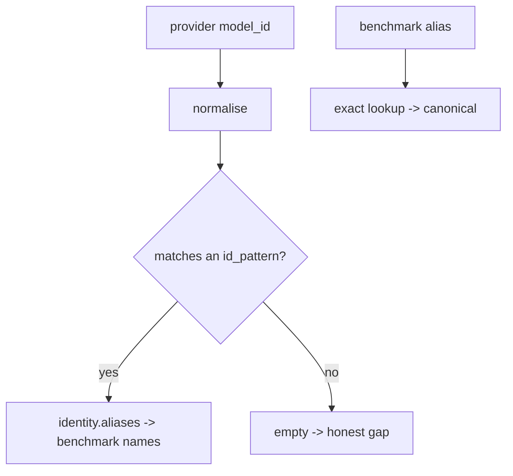

# SP-CHAINPILOT-EQUIVALENCES — benchmark name ↔ provider model ID

## Intent
Phase 1d of the Chain Autopilot arc. A pure resolver that bridges the two
naming worlds the prior straddles: the benchmark sources' model *names*
(1c — e.g. `"DeepSeek V4 Pro (Max)"`) and the providers' real model *IDs*
(1b — e.g. `deepseek-ai/deepseek-v4-pro`). Without this bridge a matrix cell
cannot find its benchmark prior.

## Context
1c stores rankings keyed by each source's own model name; 1b's matrix is keyed
by provider model IDs — and the two differ, per source and per provider. This
slice resolves between them over a hand-curated, version-controlled mapping
(`benchmark_equivalences.json`). To avoid hardcoding exact provider IDs that
cannot be verified without a live sweep, each identity carries **`id_patterns`**
— normalised matching tokens (a curated linking *rule*, not fabricated data) —
plus the **real `aliases`** (benchmark names verbatim from the 1c snapshot). The
resolver normalises a model ID and matches it against the patterns.

It is deliberately a pure **string↔string** resolver: it imports neither
`ModelCell` (1b) nor `BenchmarkEntry` (1c). The composition — matrix cell →
aliases → prior entries — belongs to 2d (`SP-CHAINPILOT-PERF-AGGREGATE`), which
depends on all three. So 1d stays edge-free and trivially testable.

The seed covers the open candidate models that actually appear in the 1c
snapshot and that our providers plausibly serve (DeepSeek / Qwen / GLM / Kimi /
MiniMax / MiMo); the table grows as the live matrix is swept and equivalences
verified. (Most of our current mistral-heavy chain models are absent from the
public top rankings — an honest gap, not a fabricated entry.)

## Goals
- G1: Pydantic v2 models (frozen): `ModelEquivalence` (`canonical: str`,
  `aliases: tuple[str, ...]`, `id_patterns: tuple[str, ...]`) and
  `EquivalenceTable` (`equivalences: tuple[...]`). Validation on load.
- G2: `parse_equivalence_table(payload) -> EquivalenceTable` (pure) and
  `load_equivalence_table(path=None) -> EquivalenceTable` (reads the shipped
  `benchmark_equivalences.json` beside the module).
- G3: Resolver methods on `EquivalenceTable`, all pure:
  - `aliases_for_model_id(model_id) -> tuple[str, ...]` — the benchmark names a
    provider model ID maps to, by normalised pattern match (empty if none);
  - `canonical_for_model_id(model_id) -> str | None`;
  - `canonical_for_alias(alias) -> str | None` — exact alias lookup;
  - `id_patterns_for_alias(alias) -> tuple[str, ...]`.
- G4: A normalisation that makes matching robust to separators/case
  (`deepseek-ai/deepseek-v4-pro` matches the pattern `deepseek-v4-pro`).
- G5: A real seed `benchmark_equivalences.json` whose aliases are verbatim 1c
  snapshot names.

## Non-Goals
- NG1: Does NOT score, rank, or pick models — pure name resolution.
- NG2: Does NOT import the matrix or the prior types — composition is 2d.
- NG3: Does NOT fetch or fuzzy-guess beyond the curated patterns; an unmatched
  ID resolves to nothing (honest gap), never a wrong default.
- NG4: Does NOT mutate `chains.env`.

## Assumptions
- A1: `id_patterns` are curated matching heuristics, expected to be verified
  against the live matrix (1b) over time; an over/under-match is low-stakes
  because the prior is only a seed (Principle 3 — our outcomes are the truth).
- A2: Benchmark `aliases` are stored verbatim (incl. effort suffixes), so an
  exact alias lookup ties straight back to 1c entries.

## Interface
`src/ferova/llm_proxy/providers/benchmark_equivalences.py`:

- `class ModelEquivalence(BaseModel, frozen=True)`: `canonical`, `aliases`,
  `id_patterns`
- `class EquivalenceTable(BaseModel, frozen=True)`: `equivalences`; methods
  `aliases_for_model_id`, `canonical_for_model_id`, `canonical_for_alias`,
  `id_patterns_for_alias`
- `def parse_equivalence_table(payload: dict) -> EquivalenceTable`
- `def load_equivalence_table(path: Path | None = None) -> EquivalenceTable`

Errors:
- `pydantic.ValidationError` / `json.JSONDecodeError` on a malformed resource
  (fail loud).

## Behavior

### Nominal
- `aliases_for_model_id("deepseek-ai/deepseek-v4-pro")` normalises to
  `deepseekaideepseekv4pro`, matches the `deepseek-v4-pro` pattern, and returns
  `("DeepSeek V4 Pro (Max)",)`.
- `canonical_for_alias("DeepSeek V4 Pro (Max)")` → `"deepseek-v4-pro"`.

### Edge cases
- A model ID matching no pattern → `aliases_for_model_id` returns `()`,
  `canonical_for_model_id` returns `None`.
- An unknown alias → `canonical_for_alias` / `id_patterns_for_alias` →
  `None` / `()`.
- The first identity whose pattern matches wins (deterministic by table order).

### Failure scenarios
- Malformed resource → `ValidationError` at load (loud, A-fail-loud as in 1c).

## Architecture Impact
- New leaf `providers/benchmark_equivalences.py` (+ its JSON); `depends_on: []`
  (json + pydantic + re + stdlib). New / changed coupling, cycles, shared
  state: none. 2d becomes the frontier consumer that joins 1b/1c/1d.

## Diagram

## Acceptance Criteria
- [ ] AC1: `aliases_for_model_id` returns the right aliases for a provider ID
  via normalised pattern match (e.g. `deepseek-ai/deepseek-v4-pro` →
  `DeepSeek V4 Pro (Max)`), and `()` for an unmatched ID.
- [ ] AC2: `canonical_for_model_id` returns the canonical for a matched ID and
  `None` for an unmatched one.
- [ ] AC3: `canonical_for_alias` / `id_patterns_for_alias` resolve an exact
  alias and return `None` / `()` for an unknown one.
- [ ] AC4: Normalisation is separator/case insensitive (a pattern matches an ID
  differing only by `/ - _` and case) — asserted by a test.
- [ ] AC5: A malformed payload raises `ValidationError`.
- [ ] AC6: `load_equivalence_table()` loads the shipped JSON (non-empty), and
  every alias in it is a real 1c snapshot name (spot-checked in a test).

## Open Questions
- None.
