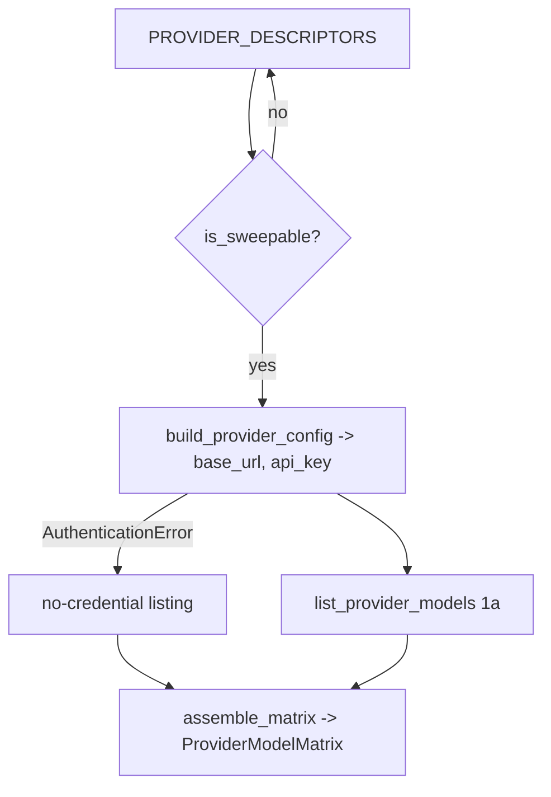

# SP-CHAINPILOT-MATRIX — the (provider × model) matrix

## Intent
Phase 1b of the Chain Autopilot arc. The domain type for the live
`(provider × model)` matrix and the builder that produces it: iterate the
provider descriptors, resolve each *sweepable* one's endpoint, list its
models (1a), and assemble the cells. This is the observatory's structural
core — the shape every downstream brick (benchmark, probe, decision) reads.

## Context
1a (`SP-CHAINPILOT-CATALOG-MODELS`) gave us `list_provider_models`, a
per-provider lister that takes an injected client + already-resolved
`base_url`/`api_key`. 1b closes the gap it deliberately left: turning a
`PROVIDER_DESCRIPTORS` entry into that endpoint pair (via the canonical
`build_provider_config`, reused to avoid drift) and fanning the lister across
every sweepable provider, then collecting the results into one matrix value
object. `claude_code` is skipped via `is_sweepable` (subprocess backstop, no
endpoint). A provider without a configured credential is **skipped
gracefully**, not fatal — the sweep records it and moves on.

The pure parts (the value objects + the `assemble_matrix` flattener) carry no
I/O and are fully unit-testable; only the thin async orchestrator touches
`Settings` and the network (with an injected client).

## Goals
- G1: `ModelCell` (frozen) — `provider_id: str`, `model_id: str`. One cell of
  the matrix; the unit of evaluation for the whole arc (Principle 1).
- G2: `ProviderModelMatrix` (frozen) — `cells: tuple[ModelCell, ...]` (the
  flattened successful pairs) + `listings: tuple[ProviderModelListing, ...]`
  (per-provider provenance, including failures/skips), plus read helpers:
  `providers() -> tuple[str, ...]`, `models_for(provider_id) -> tuple[str, ...]`,
  `__len__` (= cell count).
- G3: `assemble_matrix(listings: Sequence[ProviderModelListing]) ->
  ProviderModelMatrix` — pure flattener; cells = every `(listing.provider_id,
  model.model_id)` over `ok` listings' models, listings preserved verbatim.
- G4: `async sweep_model_matrix(settings, client, *, descriptors=
  PROVIDER_DESCRIPTORS) -> ProviderModelMatrix` — the orchestrator: for each
  descriptor where `is_sweepable(provider_id)`, resolve `(base_url, api_key)`
  via `build_provider_config` (catching `AuthenticationError` → a
  `"no credential"` failure listing, logged, no network call), call
  `list_provider_models`, then `assemble_matrix` the lot. Never raises.

## Non-Goals
- NG1: Does NOT persist the matrix — in-memory value only (the probe matrix,
  2a, owns the table).
- NG2: Does NOT probe health/latency/thinking, rank, or pick models per tier —
  that is the probe (2a), benchmark (1c/1d), and decision (3b) slices.
- NG3: Does NOT mutate `chains.env`, routing, or the proxy's own `/v1/models`.
- NG4: Does NOT re-implement credential/base-url resolution — it reuses
  `build_provider_config` (single source) rather than duplicating it.
- NG5: Does NOT sweep `claude_code` (filtered by `is_sweepable`).

## Assumptions
- A1: `build_provider_config(descriptor, settings)` is the canonical resolver;
  it raises `AuthenticationError` (from `providers.exceptions`) when a
  credential is missing — the one exception the sweep catches to skip.
- A2: The caller owns the injected `httpx.AsyncClient` lifecycle (as in 1a).
- A3: The sweep runs over a small provider set (~6); a sequential pass is
  acceptable — concurrency is not required at this slice.

## Interface
`src/ferova/llm_proxy/providers/model_matrix.py`:

- `@dataclass(frozen=True, slots=True) class ModelCell`: `provider_id: str`,
  `model_id: str`
- `@dataclass(frozen=True, slots=True) class ProviderModelMatrix`:
  `cells: tuple[ModelCell, ...]`, `listings: tuple[ProviderModelListing, ...]`;
  `providers() -> tuple[str, ...]`; `models_for(provider_id: str) ->
  tuple[str, ...]`; `__len__() -> int`
- `def assemble_matrix(listings: Sequence[ProviderModelListing]) ->
  ProviderModelMatrix`
- `async def sweep_model_matrix(settings: Settings, client:
  httpx.AsyncClient, *, descriptors: Mapping[str, ProviderDescriptor] =
  PROVIDER_DESCRIPTORS) -> ProviderModelMatrix`

Outputs:
- `ProviderModelMatrix` — `cells` flattened from `ok` listings; `listings`
  preserved for provenance (a failed/skipped provider appears with `ok=False`
  and contributes no cells).

Errors:
- None propagated — `sweep_model_matrix` never raises (1a never raises;
  `AuthenticationError` is caught and recorded).

## Behavior

### Nominal
- For each sweepable descriptor with a resolvable endpoint:
  `list_provider_models(client, provider_id, base_url, api_key)` →
  appended to `listings`. `assemble_matrix` then flattens the `ok` ones into
  `cells`. Two providers each serving 3 models → 6 cells, 2 listings.

### Edge cases
- `is_sweepable(provider_id)` is `False` (claude_code) → skipped entirely
  (absent from both `cells` and `listings`).
- Missing credential → `AuthenticationError` caught → a
  `ProviderModelListing(provider_id, (), False, "no credential")` recorded,
  no HTTP call, logged at warning.
- A provider returns 0 models (`ok=True`, empty) → present in `listings`,
  contributes no cells.
- `models_for` of an unknown provider → empty tuple.

### Failure scenarios
- An individual provider's transport/HTTP/shape failure is already captured by
  1a as an `ok=False` listing → it lands in `listings`, contributes no cells,
  and never aborts the sweep.

## Architecture Impact
- Adds dependency: SP-CHAINPILOT-MATRIX -> SP-CHAINPILOT-CATALOG-MODELS
  (imports `list_provider_models` / `is_sweepable` / `ProviderModelListing`).
- Adds dependency: SP-CHAINPILOT-MATRIX -> SP-PROVIDER-TRANSPORT-SPI
  (imports `build_provider_config` from `registry.py` to resolve endpoints).
- Reads `PROVIDER_DESCRIPTORS` (frontier — `catalog.py` is ungoverned). New /
  changed coupling, cycles, shared state: none; in-memory leaf, no persistence.

## Diagram

## Acceptance Criteria
- [ ] AC1: `assemble_matrix` over two `ok` listings (3 + 2 models) yields a
  matrix with `len == 5`, `providers()` returning both ids, and
  `models_for(p)` the right ids — listings preserved verbatim.
- [ ] AC2: `assemble_matrix` includes an `ok=False` listing in `listings` but
  contributes no cells from it.
- [ ] AC3: `sweep_model_matrix` over a fake client + a `Settings` with one
  provider keyed and another unkeyed lists the keyed provider's models and
  records the unkeyed one as a `"no credential"` `ok=False` listing (no HTTP
  for it) — no exception escapes.
- [ ] AC4: `sweep_model_matrix` never produces a `claude_code` listing or cell
  (filtered by `is_sweepable`).
- [ ] AC5: `models_for` of an unknown provider returns `()`; `__len__` equals
  the cell count.
- [ ] AC6: `arch check` passes — both `depends_on` edges resolve and no
  undeclared cross-`owns` import remains.

## Open Questions
- None.
