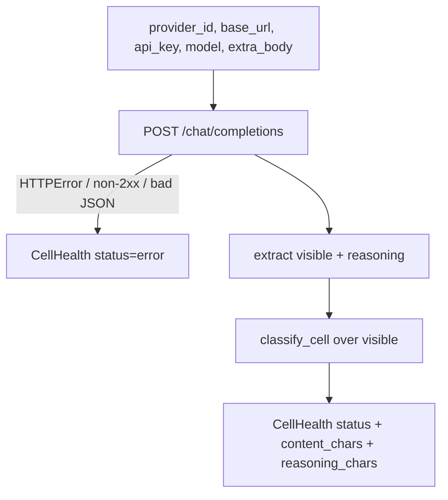

# SP-CHAINPILOT-PROBE-CELL — the per-cell probe primitive

## Intent
Phase 2a-1 of the Chain Autopilot arc. The provider-agnostic probe of a
single `(provider, model)` cell: one chat completion against the cell's
endpoint, classified into alive / latency / visible-content **and** a
reasoning observation (did the cell emit hidden reasoning, and did it still
return a visible answer or starve). It is the eyes of Phase 2's probe matrix —
the primitive the sweep (2a-2) fans across the matrix and the effort probe
(2a-3) drives with reasoning knobs.

## Context
The arc's only probe today is `review.chain_health.probe_nim_model` — NIM-only
(hard-coded base, no reasoning awareness) and tier-keyed. Phase 2 needs the
same shape generalised to **any** OpenAI-compatible provider in the matrix and
aware of the reasoning dimension the chains now must handle (Principle 4,
Phase 0). This slice provides that primitive only: an injected
`httpx.AsyncClient` plus an already-resolved `(base_url, api_key)` and the
`(provider_id, model)` pair — exactly the decoupling 1a (`CATALOG-MODELS`)
used, so the probe stays Settings-free and the endpoint resolution stays the
sweep's job (2a-2). It reuses the neutral `STATUS_*` vocabulary so its results
speak the same language as the existing health store; it does not import the
NIM-specific `review.chain_health` (wrong dependency direction).

The probe sends whatever `extra_body` it is handed and merely **observes** the
response — it injects no reasoning knob of its own. Whether to enable reasoning
(and which effort to request) is the effort probe's decision (2a-3); this leaf
records `reasoning_chars` faithfully whether or not reasoning was asked for.

## Goals
- G1: `CellHealth` (frozen) — `provider_id: str`, `model_id: str`,
  `status: str`, `latency_s: float | None`, `content_chars: int`,
  `reasoning_chars: int`, `detail: str`; plus derived read-only properties
  `thinking_observed` (`reasoning_chars > 0`), `thinking_handled`
  (`reasoning_chars > 0 and content_chars > 0`), and `thinking_starved`
  (`reasoning_chars > 0 and content_chars == 0` — reasoned but no visible
  answer, the budget-starve signature).
- G2: `classify_cell(status_code, latency_s, content, *, slow_threshold_s) ->
  str` — pure classifier over the **visible** content only (reasoning is not
  visible output): `error` (non-2xx / no response), `empty` (2xx but blank
  visible text), `slow` (visible content over threshold), `ok`. Reuses the
  neutral `STATUS_*` constants.
- G3: `async probe_cell(client, *, provider_id, base_url, api_key, model,
  prompt=..., max_tokens=64, timeout_s=30.0, slow_threshold_s=8.0,
  extra_body=None) -> CellHealth` — one POST to
  `{base_url}/chat/completions`, merging `extra_body` into the request body,
  extracting both visible content and reasoning, classifying, and returning a
  `CellHealth`. **Never raises** — a transport error / timeout / unparseable
  body becomes `status="error"` so one dead cell never aborts a matrix sweep.
- G4: The api key is never written to any log sink (redacted in error detail,
  as `probe_nim_model` does).

## Non-Goals
- NG1: Does NOT resolve endpoints or credentials — caller injects
  `(base_url, api_key)` (the sweep, 2a-2, resolves them via
  `build_provider_config`, as the matrix sweep does).
- NG2: Does NOT persist anything — in-memory value only (the
  `cell_health_probe` table is 2a-2's).
- NG3: Does NOT iterate the matrix, run concurrently, or pick models — that is
  the sweep (2a-2).
- NG4: Does NOT inject reasoning knobs or decide effort — it observes whatever
  `extra_body` it is given; the effort probe (2a-3) drives reasoning.
- NG5: Does NOT probe `claude_code` (no `/chat/completions`; the sweep filters
  it via `is_sweepable`, as in 1a/1b).
- NG6: Does NOT replace or modify `review.chain_health.probe_nim_model` — that
  NIM head probe stays; this is the generalised matrix-level primitive
  alongside it.

## Assumptions
- A1: Every sweepable provider is OpenAI-compatible at
  `{base_url}/chat/completions` with a `Bearer` api key (the contract the
  existing transports and `probe_nim_model` already rely on).
- A2: Reasoning, when present, arrives in the assistant message under
  `reasoning_content` (NIM family) or `reasoning` (OpenRouter family); absence
  of both means `reasoning_chars == 0`.
- A3: The caller owns the injected `httpx.AsyncClient` lifecycle (as in 1a/1b).
- A4: `base_url` already ends at the API root (e.g. `.../v1`); the probe
  appends `/chat/completions` (mirrors `probe_nim_model`).

## Interface
`src/ferova/llm_proxy/providers/cell_probe.py`:

- `@dataclass(frozen=True, slots=True) class CellHealth`: `provider_id: str`,
  `model_id: str`, `status: str`, `latency_s: float | None`,
  `content_chars: int`, `reasoning_chars: int`, `detail: str`; properties
  `thinking_observed -> bool`, `thinking_handled -> bool`,
  `thinking_starved -> bool`
- `def classify_cell(status_code: int | None, latency_s: float | None,
  content: str, *, slow_threshold_s: float) -> str`
- `async def probe_cell(client: httpx.AsyncClient, *, provider_id: str,
  base_url: str, api_key: str, model: str, prompt: str = ...,
  max_tokens: int = 64, timeout_s: float = 30.0, slow_threshold_s: float = 8.0,
  extra_body: Mapping[str, Any] | None = None) -> CellHealth`

Inputs:
- `provider_id`: catalog provider id (label only; not used to shape the body).
- `extra_body`: optional fields merged into the request body (reasoning knobs
  the effort probe injects); `None` → a plain probe.

Outputs:
- `CellHealth` — status + latency + `content_chars` + `reasoning_chars` +
  a short `detail` (visible-content preview on success, `http=<code>` /
  error class on failure).

Errors:
- None propagated — `probe_cell` never raises.

## Behavior

### Nominal
- POST `{base_url}/chat/completions` with `{model, max_tokens, messages,
  **extra_body}` and a `Bearer` header. Measure wall-clock latency. Extract
  `choices[0].message.content` (visible) and the reasoning field. `status =
  classify_cell(status_code, latency_s, visible, slow_threshold_s=...)`. Return
  `CellHealth(provider_id, model, status, latency_s, len(visible),
  len(reasoning), detail)`.

### Edge cases
- 2xx with empty visible content but non-empty reasoning → `status="empty"`,
  `reasoning_chars > 0` → `thinking_starved` is `True` (reasoned, no answer).
- 2xx with both visible content and reasoning → `status="ok"` (or `slow`),
  `thinking_handled` is `True`.
- 2xx with visible content and no reasoning → `thinking_observed` is `False`
  (a non-thinking or non-triggered cell).
- `extra_body=None` → a plain probe body, identical shape to `probe_nim_model`.
- Reasoning under neither known key → `reasoning_chars == 0`.

### Failure scenarios
- Transport error / timeout (`httpx.HTTPError`) → `CellHealth(..., status=
  "error", latency_s=None, content_chars=0, reasoning_chars=0, detail=<redacted
  error class>)`, logged at warning. Never raises.
- Non-2xx response → `status="error"`, `detail="http=<code>"`.
- Unparseable JSON (`ValueError`) → `status="error"`, latency preserved,
  `detail="json_decode: <type>"`, logged at warning.

## Architecture Impact
- Adds dependency: SP-CHAINPILOT-PROBE-CELL -> SP-HEALTH-STORE-NEUTRALIZE
  (imports the neutral `STATUS_OK/SLOW/EMPTY/ERROR` constants from
  `health.model_health` so probe results share the existing health
  vocabulary; no import of the NIM-specific `review.chain_health`).
- New / changed coupling, cycles, shared state: none. Additive in-memory leaf;
  nothing imports it yet (the sweep wires it in 2a-2 — per
  [[unwired-invariant-breaks-next-slice]], no unwired-invariant test is
  shipped here).

## Diagram

## Acceptance Criteria
- [ ] AC1: `classify_cell` returns `error` for `status_code=None` and for a
  500; `empty` for a 200 with blank visible content; `slow` for a 200 with
  content above `slow_threshold_s`; `ok` otherwise.
- [ ] AC2: `probe_cell` against a fake client returning visible content + a
  `reasoning_content` field yields `status="ok"`, `content_chars > 0`,
  `reasoning_chars > 0`, and `thinking_handled is True`.
- [ ] AC3: A 200 with empty `content` but non-empty `reasoning` yields
  `status="empty"`, `reasoning_chars > 0`, `thinking_starved is True`,
  `thinking_handled is False`.
- [ ] AC4: A 200 with visible content and no reasoning field yields
  `thinking_observed is False`, `reasoning_chars == 0`.
- [ ] AC5: A transport error (client raises `httpx.HTTPError`) yields
  `status="error"`, `latency_s is None`, and never propagates; the api key
  does not appear in `detail`.
- [ ] AC6: `extra_body` keys are merged into the POSTed request body (verified
  against the fake client's captured request).
- [ ] AC7: `probe_cell` reads `reasoning` from the OpenRouter-style `reasoning`
  key as well as the NIM-style `reasoning_content` key.
- [ ] AC8: `arch check` passes — the single `depends_on` edge resolves and no
  undeclared cross-`owns` import remains.

## Open Questions
- None.
