# SP-CHAINPILOT-PROBE-SWEEP — probe the matrix, record the series

## Intent
Phase 2a-2 of the Chain Autopilot arc. Fan the per-cell probe (2a-1) across a
whole `(provider × model)` matrix (1b), concurrently and bounded, into one
`CellHealth` per cell; and persist each sweep as a row-per-cell time-series in a
new `cell_health_probe` table. This turns the one-shot probe into the
observatory's standing record of how every cell behaves over time — the
posterior the decision engine (Phase 3) reads.

## Context
1b gives the live `ProviderModelMatrix` (the cells); 2a-1 gives `probe_cell`
(probe one cell, never raises) and `CellHealth`. 2a-2 is the orchestrator that
joins them: resolve each provider's endpoint once (via the canonical
`build_provider_config`, reused — no second copy of the credential logic), probe
every cell under a concurrency bound, and emit exactly **one `CellHealth` per
matrix cell** (1:1 — a cell whose provider cannot be resolved becomes an
`error` health with no network call, so the record stays complete). The store
mirrors the existing `health/store.py` (`nim_health_probe`) shape but lives in
the chainpilot domain as its own leaf — the arc stays self-contained; the
modest SQLite-engine duplication is the accepted cost of not reaching across
into another component's owned store.

The sweep is **additive and unwired** — no CLI or cadence runs it yet (the loop
is 3e). It is a callable capability, exactly as 1b's `sweep_model_matrix` is.

## Goals
- G1: `async sweep_cell_health(matrix, settings, client, *, descriptors=
  PROVIDER_DESCRIPTORS, max_concurrency=8, extra_body=None, <probe params>) ->
  list[CellHealth]` — resolve each provider in `matrix.providers()` to
  `(base_url, api_key)` once via `build_provider_config`; probe every
  `matrix.cells` entry with `probe_cell` under an `asyncio.Semaphore(
  max_concurrency)`; return one `CellHealth` per cell, in `matrix.cells` order.
  **Never raises** (probe_cell never raises; an unresolvable provider yields an
  `error` cell).
- G2: A provider whose endpoint cannot be resolved (`AuthenticationError`) →
  each of its cells becomes `CellHealth(provider, model, "error", None, 0, 0,
  "no credential")` with **no** network call, logged once per provider.
- G3: `cell_probe_store.py` — a `cell_health_probe` table
  (`id, recorded_at, provider_id, model_id, status, latency_s, content_chars,
  reasoning_chars, detail`, indexed on `recorded_at`) plus
  `init_cell_health_schema(db_path)`, `record_cell_probes(db_path, probes, *,
  recorded_at) -> int` (one sweep, every row sharing `recorded_at`; returns rows
  written, `0` for empty), and `fetch_cell_probes(db_path, *, since=None,
  provider_id=None, model_id=None, limit=None) -> list[CellProbeRow]`
  (newest-first, optionally filtered).
- G4: `CellProbeRow` (frozen) mirrors a persisted row; `recorded_at` is
  re-stamped to UTC on read when the SQLite value is naive (as `fetch_probes`
  does).
- G5: `recorded_at` is **injected** into `record_cell_probes` (not read from the
  wall clock) so the store is deterministic under test, mirroring
  `health.store.record_probes`.

## Non-Goals
- NG1: Does NOT inject reasoning knobs or resolve `reasoning_effort` — it sweeps
  with `extra_body` as given (default `None` = plain probe). The effort probe
  (2a-3) drives reasoning and wires the generic transport.
- NG2: Does NOT decide, rank, evict, or aggregate — it records raw per-cell
  health. Aggregation is 2d; attribution/decision is Phase 3.
- NG3: Does NOT build the matrix (that is 1b) nor list models (1a).
- NG4: Does NOT run on a schedule or expose a CLI — additive capability only
  (the cadence is 3e). No production caller is added; no unwired-invariant test
  is shipped (it would go CI-red the moment 3e wires it —
  see [[unwired-invariant-breaks-next-slice]]).
- NG5: Does NOT extend or touch `health/store.py` / `nim_health_probe` — the new
  table is a separate, chainpilot-owned store.
- NG6: Does NOT probe `claude_code` — by construction it is absent from
  `matrix.cells` (1b filters it via `is_sweepable`).

## Assumptions
- A1: Every cell in `matrix.cells` comes from a provider that listed models
  successfully in 1b, so its credential is present and `build_provider_config`
  resolves — the `"no credential"` path (G2) is a defensive fallback, not the
  norm.
- A2: The caller owns the injected `httpx.AsyncClient` lifecycle (as in
  1a/1b/2a-1).
- A3: The matrix may carry many cells (NIM alone lists 100+ models); a bounded
  concurrency keeps the sweep from opening one connection per cell at once. The
  caller may pass a filtered matrix to probe a subset.
- A4: The store reuses the shared review DB (`FEROVA_DB_PATH`) alongside
  `nim_health_probe`; the new table is created idempotently on first write.

## Interface
`src/ferova/llm_proxy/providers/cell_probe_sweep.py`:
- `async def sweep_cell_health(matrix: ProviderModelMatrix, settings: Settings,
  client: httpx.AsyncClient, *, descriptors: Mapping[str, ProviderDescriptor] =
  PROVIDER_DESCRIPTORS, max_concurrency: int = 8, extra_body: Mapping[str, Any]
  | None = None, prompt: str = ..., max_tokens: int = 64, timeout_s: float =
  30.0, slow_threshold_s: float = 8.0) -> list[CellHealth]`

`src/ferova/llm_proxy/providers/cell_probe_store.py`:
- `@dataclass(frozen=True) class CellProbeRow`: `recorded_at: datetime`,
  `provider_id: str`, `model_id: str`, `status: str`, `latency_s: float | None`,
  `content_chars: int`, `reasoning_chars: int`, `detail: str`
- `def init_cell_health_schema(db_path: Path) -> None`
- `def record_cell_probes(db_path: Path, probes: Sequence[CellHealth], *,
  recorded_at: datetime) -> int`
- `def fetch_cell_probes(db_path: Path, *, since: datetime | None = None,
  provider_id: str | None = None, model_id: str | None = None, limit: int |
  None = None) -> list[CellProbeRow]`

Errors:
- None propagated from `sweep_cell_health`. The store raises only on genuine
  SQLite/IO failure (it does not swallow them).

## Behavior

### Nominal
- `sweep_cell_health`: resolve `{provider_id: (base_url, api_key)}` for each
  `matrix.providers()`; build one coroutine per cell that, under the semaphore,
  calls `probe_cell(...)`; `asyncio.gather` them and return the list in
  `matrix.cells` order. A matrix with 2 providers × 3 models → 6 `CellHealth`.
- `record_cell_probes`: create-if-absent, then insert one row per `CellHealth`,
  every row stamped with the passed `recorded_at`; returns the count.
- `fetch_cell_probes`: newest-first, narrowed by the given filters.

### Edge cases
- Empty matrix → `sweep_cell_health` returns `[]`; `record_cell_probes([])`
  writes 0 rows.
- A provider in the matrix that fails `build_provider_config` → all its cells
  become `"error"` / `"no credential"` health, no HTTP, logged once.
- `fetch_cell_probes` with a `model_id` unseen → `[]`.
- Naive `recorded_at` read from SQLite → re-stamped UTC.

### Failure scenarios
- An individual cell's transport/HTTP/parse failure is already absorbed by
  `probe_cell` into an `error` `CellHealth` → it lands in the list and the row,
  and never aborts the sweep.
- A semaphore-bounded sweep over a degraded provider costs at most
  `ceil(n/max_concurrency) * timeout_s`, not `n * timeout_s`.

## Architecture Impact
- Adds dependency: SP-CHAINPILOT-PROBE-SWEEP -> SP-CHAINPILOT-PROBE-CELL
  (imports `probe_cell` / `CellHealth`).
- Adds dependency: SP-CHAINPILOT-PROBE-SWEEP -> SP-CHAINPILOT-MATRIX
  (consumes `ProviderModelMatrix` / `ModelCell`).
- Adds dependency: SP-CHAINPILOT-PROBE-SWEEP -> SP-PROVIDER-TRANSPORT-SPI
  (imports `build_provider_config` / `ProviderDescriptor` /
  `PROVIDER_DESCRIPTORS` from `registry.py` to resolve endpoints).
- Adds dependency: SP-CHAINPILOT-PROBE-SWEEP -> SP-HEALTH-STORE-NEUTRALIZE
  (imports the neutral `STATUS_ERROR` to label a cell whose provider cannot be
  resolved — same shared vocabulary 2a-1 reuses).
- New owned resource: `db:table:cell_health_probe` — a new table in the shared
  review DB, disjoint from `nim_health_probe` (owned by
  SP-HEALTH-STORE-NEUTRALIZE). No coupling to that store; the duplication of the
  SQLite-engine boilerplate is deliberate (keeps the arc self-contained).
- New / changed coupling, cycles, shared state: none beyond the new table.

## Diagram

```mermaid
flowchart TD
    A[ProviderModelMatrix cells] --> B[resolve endpoint per provider]
    B --> C{bounded gather over cells}
    C --> D[probe_cell -> CellHealth]
    D --> E[list&#91;CellHealth&#93;]
    E --> F[record_cell_probes -> cell_health_probe]
```

## Acceptance Criteria
- [ ] AC1: `sweep_cell_health` over a fake client + a 2-provider × N-model matrix
  returns one `CellHealth` per cell in `matrix.cells` order, each carrying the
  cell's `provider_id`/`model_id`.
- [ ] AC2: A provider whose `build_provider_config` raises
  `AuthenticationError` yields `"error"` / `"no credential"` health for each of
  its cells with **no** HTTP call (verified against the fake client) and is
  logged once.
- [ ] AC3: The sweep never makes more than `max_concurrency` concurrent
  `probe_cell` calls (verified with an instrumented fake client tracking peak
  in-flight).
- [ ] AC4: An empty matrix yields `[]`; `sweep_cell_health` never raises even
  when every cell errors.
- [ ] AC5: `record_cell_probes` writes one row per `CellHealth` sharing the
  injected `recorded_at`, returns the count, and `record_cell_probes([])`
  returns 0; the schema is created idempotently.
- [ ] AC6: `fetch_cell_probes` returns newest-first and honours `since`,
  `provider_id`, `model_id`, and `limit` filters; a naive stored `recorded_at`
  comes back UTC-aware.
- [ ] AC7: `arch check` passes — all three `depends_on` edges resolve, the new
  table is owner-resolved to this spec, and no undeclared cross-`owns` import or
  table literal remains.

## Open Questions
- None.
