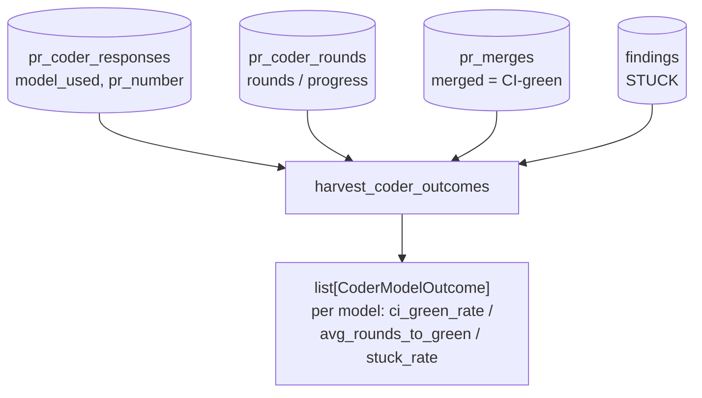

# SP-CHAINPILOT-CODER-OUTCOMES — harvest Coder outcomes per model

## Intent
Phase 2b of the Chain Autopilot arc — the first half of the **live
performance harvest** (brick 4 of the architecture). It aggregates the
factory's own Coder results **per model**, turning the bare
`(provider × model)` cells of the matrix into evidence-bearing ones: how
often each Coder model lands green CI, how many rounds it takes, and how
often it gets stuck. This is the posterior that Principle 3 says overrides
the benchmark prior — *"the factory's own outcomes are the truth."*

## Context
The Coder loop already persists everything this slice needs; nothing new is
measured. Three existing tables hold the raw events:

- `pr_coder_responses` (`review/persistence.py`) — one row per Coder
  fix-plan, carrying `model_used` (the **attribution key**) and `pr_number`.
- `pr_coder_rounds` (`review/stuck.py`) — one row per Coder round with
  `open_blocking_before` / `open_blocking_after` (the **progress** signal),
  but **no `model_used`**.
- `pr_merges` (`review/persistence.py`) — the terminal merge `outcome`
  (the **CI-green** signal: a merged PR is one whose required checks were
  green at head, per the pure merge gate).
- `findings` (`review/findings.py`) — a PR whose blocking findings reached
  the terminal `STUCK` status (the **stuck** signal).

`model_used` lives only on `pr_coder_responses`. `pr_coder_rounds` and
`pr_merges` are keyed by `pr_number` alone, so this slice attributes a PR's
rounds/outcome to the Coder model(s) recorded for that PR. In practice a PR
is fixed by a single chain-head model across its rounds; if the chain failed
over mid-PR, the PR contributes to every model it observed — acceptable for a
posterior that 2d guards with a minimum sample size.

This leaf lives in `review/`, **not** `llm_proxy/providers/` where the other
arc bricks sit: the only inter-package edge today is `review → llm_proxy`
(`chain_health.py`), and reading the review tables from `llm_proxy` would
invert it into a cycle (`arch check` would block it, and
[[SP-HEALTH-STORE-NEUTRALIZE]] exists precisely to keep that boundary
one-way). The 2d aggregator will join this harvest with the benchmark prior
along the existing safe direction.

## Goals
- G1: A new module `src/ferova/review/coder_outcomes.py` exposing a pure,
  read-only harvest: `harvest_coder_outcomes(db_path: Path) ->
  list[CoderModelOutcome]`, ordered by model id.
- G2: A frozen `CoderModelOutcome` dataclass with: `model` (the `model_used`
  string), `n_prs` (distinct PRs attributed to the model), `n_ci_green`,
  `ci_green_rate` (`n_ci_green / n_prs`, or `None` when `n_prs == 0`),
  `avg_rounds_to_green` (mean `pr_coder_rounds` count over the model's
  green PRs, or `None` when none), `n_stuck`, and `stuck_rate`
  (`n_stuck / n_prs`, or `None`).
- G3: Attribution is read purely from `pr_coder_responses.model_used`; a PR
  contributes its outcome to each distinct model that served at least one of
  its Coder rounds.
- G4: CI-green is read from `pr_merges` (a recorded merged outcome for the
  PR); stuck is read from `findings` (a PR holding ≥1 terminal `STUCK`
  blocking finding). No new column, no new table, no write.

## Non-Goals
- NG1: Does NOT combine with the benchmark prior or apply min-sample guards —
  that is 2d (`SP-CHAINPILOT-PERF-AGGREGATE`). 2b emits raw per-model counts.
- NG2: Does NOT map `model_used` onto matrix cells or providers — the harvest
  is model-grained; the cell join is downstream.
- NG3: Does NOT harvest reviewer precision — that is 2c
  (`SP-CHAINPILOT-REVIEWER-OUTCOMES`), which extends slice-11's per-lens view
  to per-model.
- NG4: Does NOT add a CLI surface, a routine, or any write/mutation. Read-only.
- NG5: Does NOT backfill `model_used` onto `pr_coder_rounds` — the PR-level
  attribution (G3) is the deliberate, documented approximation.

## Assumptions
- A1: A PR is fixed by a single Coder model across its rounds in the common
  case; multi-model PRs (mid-PR chain failover) attribute to every model
  seen, which a min-sample-guarded posterior tolerates (NG1).
- A2: A merged `pr_merges.outcome` is a faithful CI-green signal — the pure
  merge gate only merges at a head with all required checks green.
- A3: `pr_coder_rounds` for a PR is the round count; `rounds_to_green` for a
  green PR is that count (the rounds it took to drive blockers to zero).
- A4: The harvest reads tables created by other modules; on a fresh DB where
  a table is absent it returns an empty list rather than raising (it calls
  the existing idempotent `init_*_schema` helpers, mirroring slice-11).

## Interface
New:
- `src/ferova/review/coder_outcomes.py`
  - `@dataclass(frozen=True) class CoderModelOutcome` (fields per G2).
  - `def harvest_coder_outcomes(db_path: Path) -> list[CoderModelOutcome]`.

No public surface changes elsewhere; no new Settings field.

## Behavior

### Nominal
- A DB where model `deepseek-ai/deepseek-v4-pro` served 4 PRs, 3 of which
  merged, taking 1/2/2 rounds, with 1 PR stuck → one `CoderModelOutcome`
  with `n_prs=4`, `n_ci_green=3`, `ci_green_rate=0.75`,
  `avg_rounds_to_green≈1.67`, `n_stuck=1`, `stuck_rate=0.25`.

### Edge cases
- A model with PRs but none merged → `ci_green_rate=0.0`,
  `avg_rounds_to_green=None` (no green PR to average).
- An empty / fresh DB → `[]`.
- A PR with Coder responses from two models → both models receive the PR's
  outcome (A1).
- A PR with a merged outcome but no recorded rounds → counts toward
  `n_ci_green`; contributes no round sample to `avg_rounds_to_green`.

### Failure scenarios
- A missing table on an older DB → the idempotent `init_*_schema` call
  creates it empty; the harvest returns `[]` for that signal rather than
  raising (A4).

## Architecture Impact
- New leaf in `review/`; imports only frontier review modules
  (`persistence`, `stuck`, `findings`) — un-owned, so no `depends_on` edge is
  required and `arch check` stays green.
- Adds **no** edge to or from `llm_proxy`; the one-way `review → llm_proxy`
  boundary is preserved (the reason this leaf is not placed beside the other
  arc bricks).
- No new coupling, cycle, or shared state — pure read over existing tables.
- Nobody imports this module yet; per [[unwired-invariant-breaks-next-slice]]
  any "nothing imports me" assertion is omitted (the 2d consumer would turn
  it CI-red), and the FULL unit suite is run in this PR.

## Diagram

## Acceptance Criteria
- [ ] AC1: `harvest_coder_outcomes` returns one `CoderModelOutcome` per
  distinct `model_used` in `pr_coder_responses`, ordered by model id.
- [ ] AC2: `ci_green_rate` equals merged-PR-count / attributed-PR-count for
  the model, and is `None` when the model has zero attributed PRs.
- [ ] AC3: `avg_rounds_to_green` is the mean `pr_coder_rounds` count over the
  model's merged PRs, and `None` when the model has no merged PR.
- [ ] AC4: `stuck_rate` equals stuck-PR-count / attributed-PR-count, where a
  stuck PR is one holding ≥1 terminal `STUCK` blocking finding.
- [ ] AC5: A PR served by two models contributes its outcome to both.
- [ ] AC6: An empty / fresh DB yields `[]` and raises nothing.
- [ ] AC7: `arch check` passes — `coder_outcomes.py` is owned by this spec and
  introduces no undeclared cross-`owns` import (no `llm_proxy` edge).
- [ ] AC8: The module is pure and read-only — no INSERT/UPDATE, no Settings
  read, no network.

## Open Questions
- None.
