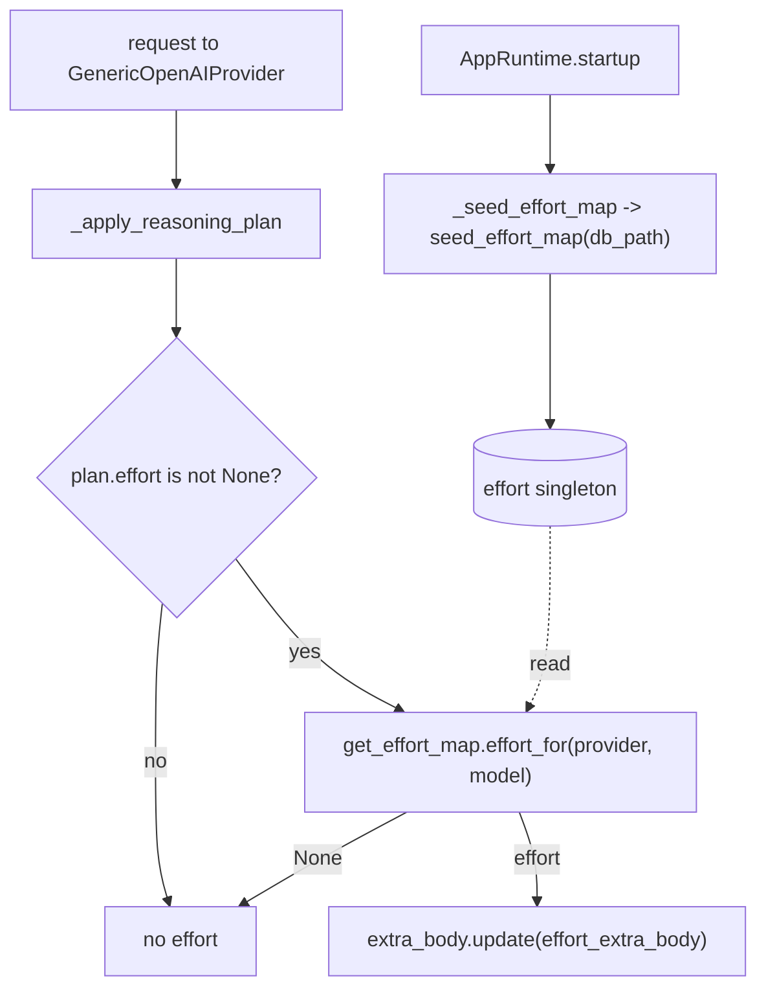

# SP-CHAINPILOT-EFFORT-APPLY — wire the resolved effort into the transport

## Intent
Phase 2a-3-iv-b — the final segment, which **closes the `reasoning_effort`
deferral from 0b-3**. The generic OpenAI transport
(`GenericOpenAIProvider._apply_reasoning_plan`) finally applies a per-cell
`reasoning_effort`: gated by the runtime effort map (2a-3-iv-a), seeded at
`AppRuntime.startup` from the `cell_effort_probe` series, and formatted by the
effort knob (2a-3-i). With this slice the observatory's effort observation feeds
back into live requests — the first effort dimension of self-maintenance.

## Context
0b-3 wired the transport's safe reasoning levers (headroom floor + thinking
toggle) but **deliberately skipped** `plan.effort` because `reasoning_effort` is
per-model, the cells were unknown, and no probe yet observed which cells reason.
Phase 2a-3 closed those gaps: the effort knob (i) formats the field, the effort
sweep (ii) probes each cell with it, the resolver (iii) decides which cell safely
reasons at which effort, and the runtime map (iv-a) caches that decision behind a
process singleton seeded at startup. This slice spends that work: it makes the
transport read the map and apply the resolved effort.

The gate is conservative and evidence-driven: effort is applied **only** when
(a) `plan.effort` is set (an EFFORT provider with thinking on — `plan_reasoning`
already encodes this), **and** (b) the runtime map resolves a non-`None` effort
for this exact `(provider, model)` cell. A missing/unresolved cell applies
nothing, so **behavior is identical to 0b-3 until an effort sweep has populated
the table and a restart has seeded the map** — no flag-day, no surprise on
unprobed cells. The startup seed mirrors `_seed_breaker_from_probes` exactly
(flag-gated, best-effort, never blocks startup).

## Goals
- G1: `GenericOpenAIProvider._apply_reasoning_plan` applies the resolved effort:
  when `plan.effort is not None`, look up `get_effort_map().effort_for(
  self._provider_name, body["model"])`; if it is non-`None`, merge
  `effort_extra_body(self._provider_name, resolved)` into `body["extra_body"]`.
  The headroom-floor and thinking-toggle behavior is unchanged.
- G2: `AppRuntime.startup` seeds the effort map: a `_seed_effort_map` method
  mirroring `_seed_breaker_from_probes` — gated by a new
  `effort_map_seed_enabled` setting (default `True`), reusing the existing
  `breaker_probe_seed_db` path, calling `seed_effort_map(db_path=...)`, logging
  the wired count, swallowing+logging any error (seeding never blocks startup).
- G3: A new Settings field `effort_map_seed_enabled: bool = True`
  (`FEROVA_EFFORT_MAP_SEED_ENABLED`).
- G4: The 0b-3 effort test (`TestEffortDeferredAndUnknown`) is repurposed: the
  pinned invariant becomes "no `reasoning_effort` is emitted when the map is
  unseeded" (the conservative default, still true), plus a new positive test
  that a seeded cell DOES emit `reasoning_effort` and a thinking-off request does
  not. The module docstring drops the "deferred to Phase 2" framing.

## Non-Goals
- NG1: Does NOT change the resolver, sweep, knob, or map logic (i–iv-a) — it
  only consumes them.
- NG2: Does NOT apply effort to NIM/OpenRouter (token-budget) or to non-EFFORT
  providers — `plan.effort is None` for them, so the gate never fires.
- NG3: Does NOT re-seed mid-process or watch the table — a restart re-seeds (as
  the breaker does); the live-refresh cadence is Phase 3e.
- NG4: Does NOT alter the headroom-floor or thinking-toggle behavior.
- NG5: Does NOT transfer ownership of `openai_generic.py` — it stays with
  SP-CHAINPILOT-REASONING-WIRE-GENERIC, whose `depends_on` grows the two new
  edges (the honest record that its transport now imports the effort modules).

## Assumptions
- A1: `plan_reasoning` sets `plan.effort = control.min_effort` exactly for an
  EFFORT provider with thinking enabled, and `None` otherwise — so gating on
  `plan.effort is not None` selects precisely the cells where an effort knob is
  meaningful.
- A2: `body["model"]` carries the cell's model id (set by
  `build_base_request_body` from `request.model`).
- A3: The effort map is empty until seeded, and seeding is a restart-time event
  (mirroring the breaker) — acceptable because the effort sweep + chains.env are
  not high-frequency.
- A4: `runtime.py` and `settings.py` are frontier (unowned); their new
  edges/fields are additive and non-blocking under the edge-honesty gate.

## Interface
Changed (no new public surface):
- `src/ferova/llm_proxy/providers/openai_generic.py` — imports
  `get_effort_map` (effort_map) and `effort_extra_body` (effort_knob); applies
  effort in `_apply_reasoning_plan`.
- `src/ferova/llm_proxy/api/runtime.py` — `startup` calls `_seed_effort_map`;
  new `_seed_effort_map` method.
- `src/ferova/llm_proxy/config/settings.py` — new `effort_map_seed_enabled`.

## Behavior

### Nominal
- An EFFORT provider (groq) request whose `(groq, model)` cell the map resolved
  to `"low"` → `body["extra_body"]["reasoning_effort"] == "low"`.
- The same request with an empty/unseeded map → no `reasoning_effort` (0b-3
  behavior).

### Edge cases
- thinking off on deepseek → `plan.effort is None` → no effort, and the existing
  thinking-disable toggle still fires.
- A non-EFFORT or unknown provider → `plan.effort is None` → no effort.
- A cell present in the matrix but resolved to `None` (starved / never reasoned)
  → `effort_for` returns `None` → no effort.

### Failure scenarios
- Effort-map seed failure at startup (missing/unreadable DB) → logged + swallowed
  by `_seed_effort_map`; the map stays empty; the proxy starts; no effort applied.

## Architecture Impact
- Adds edges (in SP-CHAINPILOT-REASONING-WIRE-GENERIC's `depends_on`, since the
  imports live in its `openai_generic.py`): -> SP-CHAINPILOT-EFFORT-MAP and ->
  SP-CHAINPILOT-EFFORT-KNOB. That merged spec's `depends_on` is updated and its
  effort-deferral note marked closed by this slice.
- `runtime.py` -> effort_map and `settings.py` additions are frontier
  (non-blocking).
- New / changed coupling, cycles, shared state: reads the existing effort
  singleton (iv-a); no new state, no cycle. This is the wiring slice — the
  effort map (iv-a, additive) becomes live here, so the FULL unit suite is run
  (the 0b-3 effort test is updated in this PR), per
  [[unwired-invariant-breaks-next-slice]].

## Diagram

## Acceptance Criteria
- [ ] AC1: With the map seeded `{('groq','some-model'): 'low'}`, a groq request
  yields `body["extra_body"]["reasoning_effort"] == "low"`.
- [ ] AC2: With the map unseeded (default), a groq/cerebras/deepseek/kimi request
  emits no `reasoning_effort` (the 0b-3 invariant still holds).
- [ ] AC3: A thinking-off deepseek request emits no `reasoning_effort` even if the
  map resolves its cell (because `plan.effort is None`), and still gets
  `thinking:{type:disabled}`.
- [ ] AC4: An unknown/non-EFFORT provider emits no `reasoning_effort`.
- [ ] AC5: `_seed_effort_map` is gated by `effort_map_seed_enabled` and swallows a
  DB error without raising (startup proceeds).
- [ ] AC6: The headroom-floor and thinking-toggle tests still pass unchanged.
- [ ] AC7: `arch check` passes — the two new edges are declared in
  SP-CHAINPILOT-REASONING-WIRE-GENERIC; no undeclared cross-`owns` import remains.

## Open Questions
- None.
