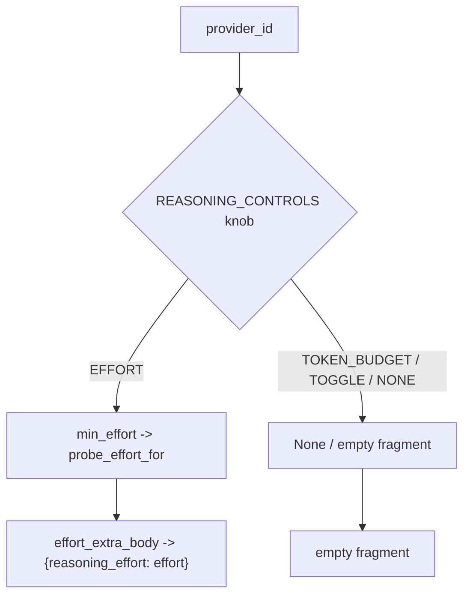

# SP-CHAINPILOT-EFFORT-KNOB — the reasoning-effort wire fragment

## Intent
Phase 2a-3-i of the Chain Autopilot arc (first of four segments closing the
`reasoning_effort` deferral from 0b-3). One pure leaf that turns a provider's
`EFFORT` reasoning control into the single wire fragment that carries
`reasoning_effort` on an OpenAI-compatible request — plus the single-pass probe
value (`min_effort`) the effort sweep will request per cell. It is the one
source of the effort wire format, shared by both consumers downstream: the
effort sweep (2a-3-ii, which probes each cell with the fragment as `extra_body`)
and the generic transport (2a-3-iv, which finally applies `plan.effort`).

## Context
`plan_reasoning` (`providers/reasoning.py`) already computes a `ReasoningPlan`
whose `effort` is `control.min_effort` for `EFFORT` providers (groq, cerebras,
deepseek). But the value is never turned into a request field: the generic
transport applies only the safe parts of the plan (headroom floor + thinking
toggle) and **intentionally omits** `plan.effort`
(`openai_generic.py:_apply_reasoning_plan`), and the probe sweep runs with
`extra_body=None`. 0b-3 deferred the wiring because `reasoning_effort` is
per-model and no probe yet observed which cells reason — Phase 2's probe matrix
is exactly that observer.

This segment ships nothing but the fragment builder. Both downstream consumers
merge `reasoning_effort` into the **top-level** request JSON, but via different
in-memory shapes: the probe merges its `extra_body=` argument straight into the
POST body, while the transport splices the openai-python SDK `extra_body`
kwarg. A flat fragment `{"reasoning_effort": <value>}` lands top-level either
way, so one builder serves both — the in-memory merge is each consumer's job.

The single-pass policy (one probe per cell at the provider's declared
`min_effort`, the operator's decision for 2a-3) lives here as a thin resolver
over `REASONING_CONTROLS`, so the sweep stays policy-free and a future
multi-pass slice changes one function.

## Goals
- G1: `effort_extra_body(provider_id, effort) -> dict[str, str]` — the flat wire
  fragment. Returns `{"reasoning_effort": effort}` when *provider_id* is an
  `EFFORT` provider and *effort* is a non-empty string; returns `{}` otherwise
  (non-`EFFORT` provider, unknown provider, or `effort` is `None`/empty). The
  empty dict is the merge identity, so `{**body, **fragment}` is always safe.
- G2: `probe_effort_for(provider_id) -> str | None` — the single-pass probe
  value: `control.min_effort` for an `EFFORT` provider, else `None` (no effort
  knob to probe). `None` signals the sweep to probe that provider's cells with
  no effort fragment.
- G3: Both functions are pure over :data:`REASONING_CONTROLS` — Settings-free,
  no I/O, no state — mirroring `plan_reasoning`'s style and resolving an unknown
  provider to the conservative `NONE` control (no fragment, no probe value).

## Non-Goals
- NG1: Does NOT decide *whether* a cell should reason or apply a headroom floor
  — that is `plan_reasoning`'s job; this leaf only formats the effort field.
- NG2: Does NOT inject the fragment into any request, probe, or transport — it
  returns a value; the sweep (2a-3-ii) and transport (2a-3-iv) merge it.
- NG3: Does NOT handle `TOKEN_BUDGET` (NIM/OpenRouter) or `TOGGLE` (kimi)
  knobs — those are not `reasoning_effort`; a non-`EFFORT` provider yields `{}`.
- NG4: Does NOT do multi-pass effort sweeping (low→high search). The single-pass
  `min_effort` policy is fixed for this arc; a later slice can add a sweep
  without touching the wire fragment.
- NG5: Does NOT validate that a provider actually honors `reasoning_effort` —
  that hypothesis is exactly what the probe sweep (2a-3-ii) tests empirically
  per cell; a non-honoring cell will simply read `thinking_observed=False`.

## Assumptions
- A1: Every `EFFORT` provider (groq, cerebras, deepseek) accepts a top-level
  `reasoning_effort` string field on its OpenAI-compatible `/chat/completions`
  endpoint — the wire encoding the 2026-06-22 reasoning audit established and
  `REASONING_CONTROLS` records. The probe matrix verifies it per cell.
- A2: `control.min_effort` is set for every `EFFORT` provider (it is, in
  `REASONING_CONTROLS`: `"low"` for groq/cerebras, `"high"` for deepseek); a
  `EFFORT` control with `min_effort is None` would yield `probe_effort_for ->
  None` and an empty fragment (degrades safely, never raises).

## Interface
`src/ferova/llm_proxy/providers/effort_knob.py`:

- `REASONING_EFFORT_FIELD: str = "reasoning_effort"` — the wire field name (one
  source).
- `def effort_extra_body(provider_id: str, effort: str | None) -> dict[str, str]`
- `def probe_effort_for(provider_id: str) -> str | None`

Inputs:
- `provider_id`: catalog provider id (e.g. `"groq"`); resolved against
  `REASONING_CONTROLS`.
- `effort`: the effort level to encode (e.g. `"low"`), or `None`.

Outputs:
- `effort_extra_body`: `{"reasoning_effort": effort}` or `{}`.
- `probe_effort_for`: the single-pass effort string or `None`.

Errors:
- None — both functions are total and never raise.

## Behavior

### Nominal
- `effort_extra_body("groq", "low")` → `{"reasoning_effort": "low"}`.
- `effort_extra_body("deepseek", "high")` → `{"reasoning_effort": "high"}`.
- `probe_effort_for("groq")` → `"low"`; `probe_effort_for("deepseek")` →
  `"high"`.

### Edge cases
- `effort_extra_body("nvidia_nim", "low")` → `{}` (TOKEN_BUDGET, not EFFORT).
- `effort_extra_body("kimi", "low")` → `{}` (TOGGLE, not EFFORT).
- `effort_extra_body("groq", None)` → `{}`; `effort_extra_body("groq", "")` →
  `{}` (no value to encode).
- `effort_extra_body("unknown", "low")` → `{}` (resolves to NONE control).
- `probe_effort_for("nvidia_nim")` / `probe_effort_for("kimi")` /
  `probe_effort_for("unknown")` → `None`.

### Failure scenarios
- None — pure, total functions; no transport, no parsing, no state.

## Architecture Impact
- Adds dependency: SP-CHAINPILOT-EFFORT-KNOB -> SP-CHAINPILOT-REASONING-CONTROL
  (imports `REASONING_CONTROLS` and `KnobType` from `providers/reasoning.py`;
  the single place the per-provider knob matrix lives).
- New / changed coupling, cycles, shared state: none. Additive pure leaf;
  nothing imports it yet — the effort sweep wires `effort_extra_body` /
  `probe_effort_for` in 2a-3-ii and the generic transport wires
  `effort_extra_body` in 2a-3-iv. Per [[unwired-invariant-breaks-next-slice]],
  no unwired-invariant test ships here.

## Diagram

## Acceptance Criteria
- [ ] AC1: `effort_extra_body("groq", "low")` and `effort_extra_body("cerebras",
  "low")` each return `{"reasoning_effort": "low"}`; `effort_extra_body(
  "deepseek", "high")` returns `{"reasoning_effort": "high"}`.
- [ ] AC2: `effort_extra_body` returns `{}` for every non-`EFFORT` provider
  (`nvidia_nim`, `open_router`, `kimi`) and for an unknown provider id.
- [ ] AC3: `effort_extra_body("groq", None)` and `effort_extra_body("groq", "")`
  both return `{}` (no value to encode).
- [ ] AC4: The returned fragment is a fresh `dict` (mutating it never affects a
  later call) and `{**{"max_tokens": 1}, **effort_extra_body("groq", "low")}`
  merges to a body carrying both keys.
- [ ] AC5: `probe_effort_for` returns `"low"` for groq and cerebras, `"high"`
  for deepseek, and `None` for every non-`EFFORT` and unknown provider.
- [ ] AC6: `effort_extra_body(p, probe_effort_for(p))` round-trips: a non-empty
  fragment for each `EFFORT` provider, `{}` for every other provider.
- [ ] AC7: `arch check` passes — the single `depends_on` edge resolves and no
  undeclared cross-`owns` import remains.

## Open Questions
- None.
