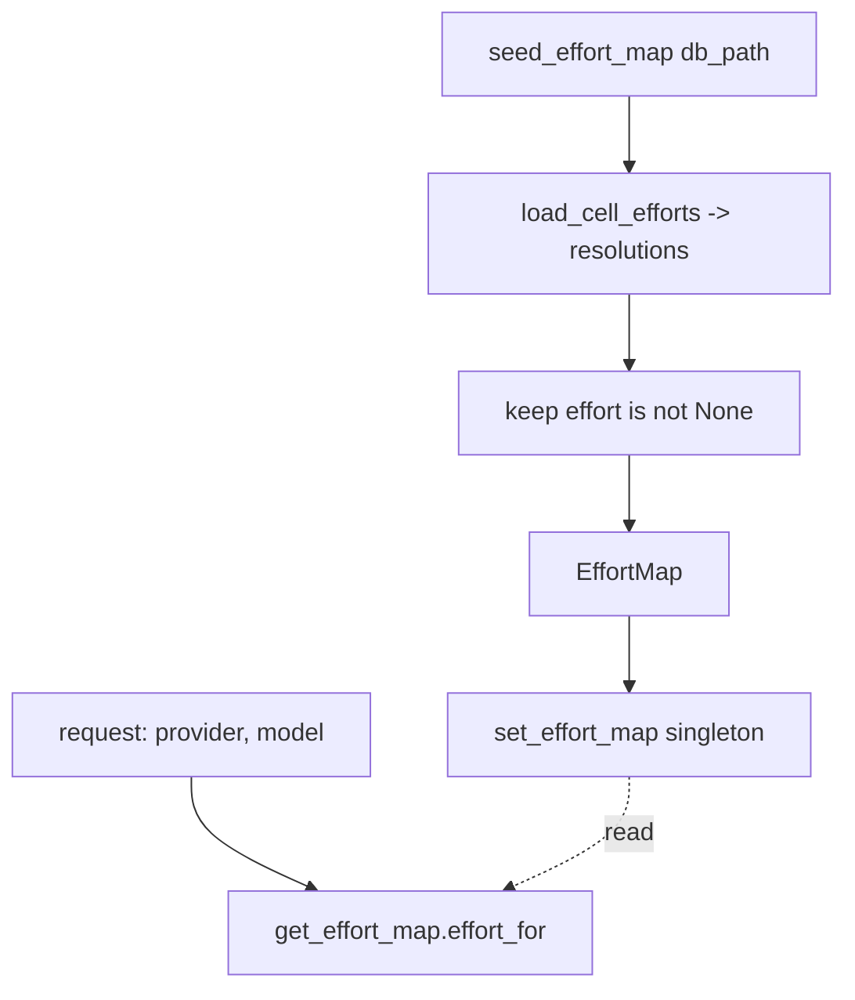

# SP-CHAINPILOT-EFFORT-MAP — the resolved-effort runtime singleton

## Intent
Phase 2a-3-iv-a of the Chain Autopilot arc (first half of the keystone that
closes the `reasoning_effort` deferral from 0b-3). A process-singleton map from
`(provider, model)` to the resolved effort, seeded once at startup from the
`cell_effort_probe` series — the request-time lookup the generic transport will
read (2a-3-iv-b). It mirrors the health-breaker singleton exactly: a singleton
seeded at `AppRuntime.startup` from probe history and consulted on the hot path,
because per-request DB reads are not affordable and providers are built lazily
(so there is no instance to inject into at startup).

## Context
The effort resolver (2a-3-iii) turns the probe series into a
`{(provider, model): EffortResolution}` decision, but reading it per request is
too costly. The breaker faced the same shape (D2b) and solved it with a process
singleton (`get_breaker()`) seeded at startup (`seed_breaker_from_probes`,
`routing/probe_seed.py`) and read on the routing hot path. This slice provides
the effort analogue: `get_effort_map()` seeded by `seed_effort_map(db_path=...)`.

This half ships the singleton and its seeder only — **unwired**: nothing calls
`seed_effort_map` at startup and nothing reads `get_effort_map` in production yet
(2a-3-iv-b adds the startup seed call and the transport read). Keeping the map a
plain `(provider, model) -> str | None` lookup (the conservative default for a
missing or unresolved cell is `None` = leave effort off) means the consumer in
iv-b imports a value, not policy, and behavior stays the 0b-3 default until the
effort sweep has actually populated the table.

## Goals
- G1: `EffortMap` — wraps the resolved per-cell efforts; `effort_for(provider_id,
  model_id) -> str | None` returns the cell's resolved effort, or `None` when the
  cell is absent or resolved to no effort (the safe default). Construct from a
  `Mapping[tuple[str, str], str | None]`; stores only the non-`None` entries.
  `replace(efforts)` swaps the contents in place and `clear()` empties them —
  mirroring the breaker's in-place mutation (one instance, no global rebind).
- G2: Process singleton — `get_effort_map() -> EffortMap` (the one instance,
  empty by default) and `reset_effort_map() -> None` (clears it; for test
  isolation, exactly as the breaker exposes `get_breaker`/`reset_breaker`).
- G3: `seed_effort_map(*, db_path, min_samples=1, handled_fraction=0.5) -> int` —
  `load_cell_efforts(db_path, ...)` (2a-3-iii), `replace` the singleton's contents
  with the cells whose resolution carries a non-`None` effort, and return the
  count of wired cells.

## Non-Goals
- NG1: Does NOT read or apply effort in any transport — that is 2a-3-iv-b
  (`openai_generic._apply_reasoning_plan` reads `get_effort_map`).
- NG2: Does NOT call itself at startup — the `AppRuntime.startup` seed call is
  2a-3-iv-b (mirroring `_seed_breaker_from_probes`).
- NG3: Does NOT probe, sweep, resolve, or write — it caches the resolver's output.
- NG4: Does NOT format the `reasoning_effort` wire field — that is `effort_knob`
  (2a-3-i), used by the transport in iv-b.
- NG5: Owns no Settings field — `seed_effort_map` takes `db_path` directly; the
  startup caller (iv-b) supplies it (reusing the existing `breaker_probe_seed_db`)
  and owns any enable flag.

## Assumptions
- A1: `load_cell_efforts` (2a-3-iii) returns the per-cell `EffortResolution`
  decisions; this slice keeps only `.effort is not None` (the cells worth wiring).
- A2: A process singleton is the right lifetime — the breaker (D2b) establishes
  it for exactly this startup-seed / hot-path-read shape.
- A3: The seeder is defensive at the call site (iv-b wraps it in try/except like
  `_seed_breaker_from_probes`); the function itself surfaces a DB error.

## Interface
`src/ferova/llm_proxy/providers/effort_map.py`:
- `class EffortMap`: `__init__(self, efforts: Mapping[tuple[str, str], str | None]
  | None = None)`; `effort_for(self, provider_id: str, model_id: str) -> str |
  None`; `replace(self, efforts: Mapping[tuple[str, str], str | None]) -> None`;
  `clear(self) -> None`; `__len__` (the count of wired cells).
- `def get_effort_map() -> EffortMap`
- `def reset_effort_map() -> None`
- `def seed_effort_map(*, db_path: Path, min_samples: int = 1, handled_fraction:
  float = 0.5) -> int`

Outputs:
- `effort_for` → the resolved effort string to request, or `None` to leave effort
  off.
- `seed_effort_map` → the number of cells wired with a non-`None` effort.

Errors:
- `EffortMap` / `get` / `set` / `reset` never raise. `seed_effort_map` surfaces a
  DB read error (the caller in iv-b guards it).

## Behavior

### Nominal
- `seed_effort_map(db_path=db)` over a `cell_effort_probe` whose groq/g1 resolved
  to `"low"` installs a map where `get_effort_map().effort_for("groq", "g1") ==
  "low"` and returns `1`.
- A cell resolved to `None` is not wired; `effort_for` returns `None` for it.

### Edge cases
- An empty / absent table → `seed_effort_map` returns `0`, the map is empty,
  every `effort_for` is `None`.
- A cell never probed → `effort_for` returns `None` (the conservative default).
- `reset_effort_map()` → `get_effort_map()` is empty again.

### Failure scenarios
- A DB read error in `load_cell_efforts` propagates out of `seed_effort_map`
  (iv-b's startup call swallows + logs it, leaving the empty default map).

## Architecture Impact
- Adds edge: SP-CHAINPILOT-EFFORT-MAP -> SP-CHAINPILOT-EFFORT-RESOLVE (imports
  `load_cell_efforts`).
- New / changed coupling, cycles, shared state: introduces ONE process singleton
  (`_effort_map`), the same controlled global the breaker uses; `reset_effort_map`
  keeps tests isolated. Additive and unwired — nothing seeds or reads it in
  production yet (iv-b does). Per [[unwired-invariant-breaks-next-slice]], no
  unwired-invariant test ships here.

## Diagram

## Acceptance Criteria
- [ ] AC1: `EffortMap({('groq','g1'): 'low', ('kimi','k1'): None}).effort_for(
  'groq','g1') == 'low'` and `.effort_for('kimi','k1') is None` and
  `.effort_for('x','y') is None`; `len(...) == 1`.
- [ ] AC2: `get_effort_map()` is an empty map by default; after
  `get_effort_map().replace({('groq','g1'): 'low'})` the singleton reflects it;
  `reset_effort_map()` empties it.
- [ ] AC3: `seed_effort_map(db_path=db)` over a seeded `cell_effort_probe`
  (groq/g1 handled at `low`) returns `1` and installs a map where
  `get_effort_map().effort_for('groq','g1') == 'low'`.
- [ ] AC4: A cell whose probes never reasoned (resolves to `None`) is not wired —
  `seed_effort_map` does not count it and `effort_for` returns `None`.
- [ ] AC5: An empty DB → `seed_effort_map` returns `0` and the map is empty.
- [ ] AC6: `arch check` passes — the single `depends_on` edge resolves and no
  undeclared cross-`owns` import remains.

## Open Questions
- None.
