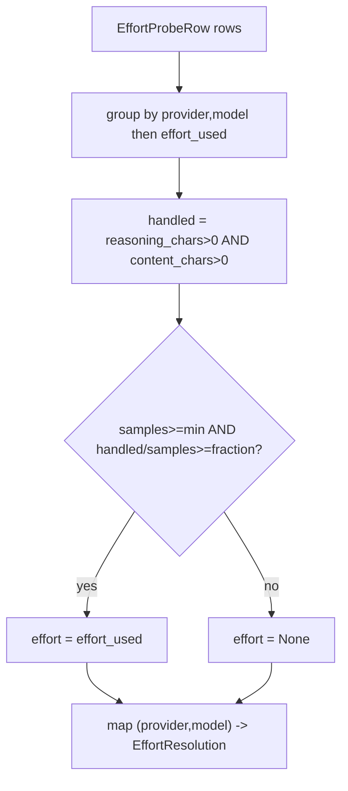

# SP-CHAINPILOT-EFFORT-RESOLVE — resolve the per-cell effort to wire

## Intent
Phase 2a-3-iii of the Chain Autopilot arc (third of four segments closing the
`reasoning_effort` deferral from 0b-3). The effort sweep (2a-3-ii) accumulates a
`cell_effort_probe` time-series — how each `(provider, model)` cell behaved when
asked to reason at its single-pass effort. This slice reads that series and
decides, per cell, **which effort (if any) is safe to wire**: the conservative,
evidence-based map `{(provider, model): effort | None}` the generic transport
(2a-3-iv) applies. It turns observation into a decision; it does not yet apply it.

## Context
Effort is worth wiring on a cell only where it both took effect and stayed safe.
The probe records two characters counts that, together, classify the outcome
(2a-1's `CellHealth` properties, re-expressed here over the persisted row):
- `thinking_handled` — reasoning emitted **and** a visible answer survived:
  effort works end-to-end → wire it.
- `thinking_starved` — reasoning emitted but the answer was starved: enabling
  effort risks empty completions → do not wire.
- not reasoned (`reasoning_chars == 0`) — the effort knob had no effect (a
  non-thinking cell or one ignoring `reasoning_effort`) → wiring it is pointless
  → do not wire.

So the rule is: resolve a cell's effort to the probed `effort_used` only when a
sufficient, consistent share of its recent probes were `thinking_handled`;
otherwise `None` (leave effort off, the 0b-3 safe default). Aggregation
(min-sample + handled-fraction) honors Principle 6 — one outcome never decides —
while the full rolling-window perf model stays Phase 2d/3. The resolver is a pure
function over rows (the caller fetches), with a thin loader convenience that
fetches via the store; it owns no table and decides nothing about transports.

## Goals
- G1: `EffortResolution` (frozen) — `provider_id: str`, `model_id: str`,
  `effort: str | None` (the effort to wire, or `None` = leave off),
  `handled: int` (count of `thinking_handled` probes backing the decision),
  `samples: int` (probes considered for the chosen effort).
- G2: `resolve_cell_efforts(rows, *, min_samples=1, handled_fraction=0.5) ->
  dict[tuple[str, str], EffortResolution]` — pure. Group `rows`
  (`EffortProbeRow`) by `(provider_id, model_id)`; within a cell group by
  `effort_used` (ignoring `None` effort groups — nothing to wire there);
  a candidate effort qualifies when its `samples >= min_samples` and
  `handled / samples >= handled_fraction`, where a row is handled iff
  `reasoning_chars > 0 and content_chars > 0`. The cell resolves to the
  qualifying effort with the most `handled` probes (ties → the lexicographically
  larger effort, a stable deterministic tie-break); if none qualifies, the cell
  resolves to `effort=None` (still present in the map, so callers see it was
  observed). Every cell appearing in `rows` appears in the result exactly once.
- G3: `load_cell_efforts(db_path, *, since=None, provider_id=None, model_id=None,
  min_samples=1, handled_fraction=0.5) -> dict[tuple[str, str], EffortResolution]`
  — thin convenience: `fetch_effort_probes(...)` then `resolve_cell_efforts(...)`.

## Non-Goals
- NG1: Does NOT apply effort to any transport or request — that is 2a-3-iv
  (`openai_generic._apply_reasoning_plan`), which reads this map.
- NG2: Does NOT probe, sweep, or write anything — read-only over the store.
- NG3: Does NOT do multi-pass effort search or pick among several efforts a cell
  was probed at beyond the deterministic most-handled rule — single-pass means
  one effort per cell today; the rule is merely written to stay total if more
  appear.
- NG4: Does NOT implement the rolling-window / decay / cross-tier perf model
  (Principle 6 at full strength) — that is Phase 2d/3; here aggregation is a
  simple min-sample + fraction over whatever rows the caller supplies.
- NG5: Does NOT read `cell_health_probe` (2a-2's baseline series) — effort
  resolution is over the reasoned-at-effort series only.

## Assumptions
- A1: `EffortProbeRow.effort_used` is the effort actually requested for that
  probe (2a-3-ii guarantees it), and `reasoning_chars`/`content_chars` are the
  faithful observation (2a-1 guarantees it).
- A2: Under the single-pass policy a cell's non-`None` rows share one
  `effort_used`; the per-effort grouping degrades gracefully if that ever
  changes (each effort judged on its own samples).
- A3: The caller scopes recency/volume via `fetch_effort_probes` filters
  (`since`, `limit`); the resolver judges exactly the rows it is handed.

## Interface
`src/ferova/llm_proxy/providers/effort_resolve.py`:
- `@dataclass(frozen=True, slots=True) class EffortResolution`: `provider_id`,
  `model_id`, `effort: str | None`, `handled: int`, `samples: int`.
- `def resolve_cell_efforts(rows: Sequence[EffortProbeRow], *, min_samples: int =
  1, handled_fraction: float = 0.5) -> dict[tuple[str, str], EffortResolution]`
- `def load_cell_efforts(db_path: Path, *, since: datetime | None = None,
  provider_id: str | None = None, model_id: str | None = None, min_samples: int =
  1, handled_fraction: float = 0.5) -> dict[tuple[str, str], EffortResolution]`

Outputs:
- A map keyed by `(provider_id, model_id)`; `.effort` is the value 2a-3-iv wires,
  or `None` to leave effort off (the safe default).

Errors:
- `resolve_cell_efforts` is total and never raises. `load_cell_efforts` surfaces
  store/DB errors (read is loud, as the store is).

## Behavior

### Nominal
- A cell with two `effort_used="low"` rows, both `thinking_handled`
  (`reasoning_chars>0`, `content_chars>0`) → resolves to `effort="low"`,
  `handled=2`, `samples=2`.
- A cell whose `"low"` probes all reasoned but starved (`content_chars==0`) →
  `handled=0` → resolves to `effort=None`.
- A cell that never reasoned (`reasoning_chars==0`, answered) →
  `effort=None` (effort had no effect).

### Edge cases
- `min_samples=2` with a single handled row → does not qualify → `effort=None`.
- Rows whose `effort_used is None` (non-effort providers) → the cell appears with
  `effort=None` (no candidate effort to wire).
- Mixed efforts on one cell (forward-compat) → each effort judged on its own
  samples; the qualifying one with the most `handled` wins (ties → larger value).
- No rows → empty map.

### Failure scenarios
- None in `resolve_cell_efforts`. `load_cell_efforts` propagates a DB read error.

## Architecture Impact
- Adds edge: SP-CHAINPILOT-EFFORT-RESOLVE -> SP-CHAINPILOT-EFFORT-SWEEP (imports
  `EffortProbeRow` and `fetch_effort_probes` from `effort_probe_store`).
- New / changed coupling, cycles, shared state: none. Additive read-only leaf;
  nothing imports it yet — the generic transport wires it in 2a-3-iv. Per
  [[unwired-invariant-breaks-next-slice]], no unwired-invariant test ships here.

## Diagram

## Acceptance Criteria
- [ ] AC1: Two handled `"low"` rows for a groq cell → `EffortResolution(effort=
  "low", handled=2, samples=2)`.
- [ ] AC2: `"low"` rows that all starved (`content_chars==0`, `reasoning_chars>0`)
  → `effort=None`, `handled=0`.
- [ ] AC3: Rows that never reasoned (`reasoning_chars==0`) → `effort=None`.
- [ ] AC4: `min_samples=2` with one handled row → `effort=None`; with two handled
  rows → `effort` resolved.
- [ ] AC5: `handled_fraction=0.5` with one handled + one starved row (fraction
  0.5) → qualifies (`effort` resolved); with one handled + two starved (fraction
  ~0.33) → `effort=None`.
- [ ] AC6: A cell whose rows all carry `effort_used=None` appears in the map with
  `effort=None`.
- [ ] AC7: Empty rows → empty map; every cell present in rows appears exactly
  once in the map.
- [ ] AC8: `load_cell_efforts` over a seeded temp DB returns the same map
  `resolve_cell_efforts` does for the fetched rows.
- [ ] AC9: `arch check` passes — the single `depends_on` edge resolves and no
  undeclared cross-`owns` import remains.

## Open Questions
- None.
