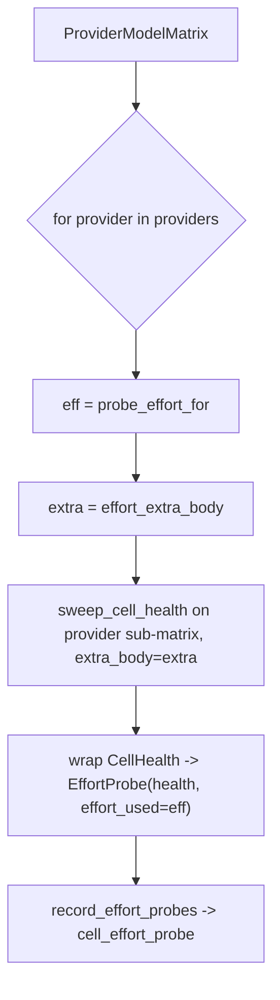

# SP-CHAINPILOT-EFFORT-SWEEP — the effort-aware probe sweep

## Intent
Phase 2a-3-ii of the Chain Autopilot arc (second of four segments closing the
`reasoning_effort` deferral from 0b-3). Where the 2a-2 health sweep probes every
matrix cell with **no reasoning knob** (baseline alive / latency), this slice
probes every cell **with the cell's reasoning-effort knob applied** — the
single-pass policy: each provider's declared `min_effort` (2a-3-i) — and records
a parallel time-series, `cell_effort_probe`, that says how each cell behaves when
asked to reason at that effort: did it reason and still answer (`thinking_handled`)
or starve. That standing record is what the effort resolver (2a-3-iii) reads to
decide which `(provider, model)` cells reason and at which effort, which the
generic transport then wires (2a-3-iv).

## Context
Baseline health and reasoned-at-effort are **two different measurements** of a
cell, so they live in two tables owned by two slices rather than as columns on
one: 2a-2 owns `cell_health_probe` (no knob); this slice owns `cell_effort_probe`
(knob applied + the `effort_used` / `model_used` attribution, Phase 2 policy B).
Keeping ownership disjoint means this slice introduces its own leaves and edits
none of 2a-2's files (the arc's governance — `owns` is exclusive; an import edge
is attributed to the importer's file owner).

Reasoning effort is **per-provider**, not per-model, under the single-pass policy
(`probe_effort_for` returns one value per provider). So the sweep needs no copy
of the 2a-2 orchestration: it slices the matrix into per-provider sub-matrices
and calls `sweep_cell_health` once per provider with that provider's
`effort_extra_body` as the uniform `extra_body`. `matrix.cells` is already
provider-grouped (`assemble_matrix` flattens per listing), so iterating
`matrix.providers()` and concatenating the per-provider results reproduces
`matrix.cells` order — the 1:1 contract 2a-2 guarantees is preserved.

A provider with no effort knob (`probe_effort_for -> None`: nvidia_nim,
open_router, kimi) is still probed, with an empty fragment and `effort_used =
None` — so the table stays 1:1 with the matrix and the resolver sees a complete
snapshot; those rows are simply baseline observations under this slice's table.

## Goals
- G1: `EffortProbe` (frozen) — `health: CellHealth`, `effort_used: str | None`;
  property `model_used -> str` (`= health.model_id`; the cell's model is the
  model used — there is no routing indirection in a direct cell probe, so policy
  B's `model_used` mirrors `model_id`).
- G2: `async sweep_effort_health(matrix, settings, client, *, descriptors=
  PROVIDER_DESCRIPTORS, max_concurrency=8, prompt=..., max_tokens=64,
  timeout_s=30.0, slow_threshold_s=8.0) -> list[EffortProbe]` — for each provider
  in `matrix.providers()`: resolve `eff = probe_effort_for(provider)`, build
  `extra = effort_extra_body(provider, eff)`, and call `sweep_cell_health` on
  that provider's sub-matrix with `extra_body=extra`; wrap every returned
  `CellHealth` in an `EffortProbe(health, effort_used=eff)`. Returns one
  `EffortProbe` per cell in `matrix.cells` order. **Never raises**
  (`sweep_cell_health` never raises).
- G3: `cell_effort_probe` table + `init_cell_effort_schema` /
  `record_effort_probes(db_path, probes, *, recorded_at) -> int` /
  `fetch_effort_probes(db_path, *, since, provider_id, model_id, limit) ->
  list[EffortProbeRow]` — mirroring `cell_probe_store` (the boilerplate dup is
  the accepted cost of a self-contained arc, as 2a-2 chose) with the two extra
  persisted fields `effort_used` (nullable) and `model_used` (not null).
- G4: A sweep's rows share one injected `recorded_at` (deterministic under test,
  as 2a-2).

## Non-Goals
- NG1: Does NOT resolve the per-model accepted effort or build the
  `{(provider, model): effort}` map — that is the effort resolver (2a-3-iii),
  which reads this table.
- NG2: Does NOT wire `reasoning_effort` into any production transport — that is
  2a-3-iv (`openai_generic._apply_reasoning_plan`).
- NG3: Does NOT do multi-pass effort sweeping (low→high search) — single pass at
  `min_effort` is the fixed arc policy (2a-3-i).
- NG4: Does NOT edit or extend `cell_health_probe` or any 2a-2 file — disjoint
  ownership; the reasoned series is this slice's own table.
- NG5: Does NOT schedule itself or add a CLI — additive capability, unwired; the
  cadence is Phase 3e (as 2a-2's sweep is).
- NG6: Does NOT re-implement endpoint resolution or concurrency — it delegates to
  `sweep_cell_health` per provider.

## Assumptions
- A1: `matrix.cells` is provider-grouped (guaranteed by `assemble_matrix`, which
  flattens listing by listing), so concatenating per-provider sub-sweep results
  in `matrix.providers()` order equals `matrix.cells` order.
- A2: `sweep_cell_health` applies its `extra_body` uniformly to every cell of the
  matrix it is given (2a-2's contract), so a per-provider sub-matrix call applies
  exactly that provider's effort.
- A3: An `EFFORT` provider honors a top-level `reasoning_effort` field
  (2a-3-i, A1) — this sweep is precisely the empirical check; a non-honoring cell
  reads back `thinking_observed=False` and the resolver (iii) learns it.

## Interface
`src/ferova/llm_proxy/providers/effort_sweep.py`:
- `@dataclass(frozen=True, slots=True) class EffortProbe`: `health: CellHealth`,
  `effort_used: str | None`; property `model_used -> str`.
- `async def sweep_effort_health(matrix: ProviderModelMatrix, settings: Settings,
  client: httpx.AsyncClient, *, descriptors: Mapping[str, ProviderDescriptor] =
  PROVIDER_DESCRIPTORS, max_concurrency: int = 8, prompt: str = ...,
  max_tokens: int = 64, timeout_s: float = 30.0, slow_threshold_s: float = 8.0)
  -> list[EffortProbe]`

`src/ferova/llm_proxy/providers/effort_probe_store.py`:
- `cell_effort_probe` table (columns: `id`, `recorded_at`, `provider_id`,
  `model_id`, `status`, `latency_s`, `content_chars`, `reasoning_chars`,
  `detail`, `effort_used` nullable, `model_used` not null; index on
  `recorded_at`).
- `@dataclass(frozen=True) class EffortProbeRow` — the read-back row (the
  `cell_health_probe` fields plus `effort_used`, `model_used`).
- `def init_cell_effort_schema(db_path: Path) -> None`
- `def record_effort_probes(db_path: Path, probes: Sequence[EffortProbe], *,
  recorded_at: datetime) -> int`
- `def fetch_effort_probes(db_path: Path, *, since=None, provider_id=None,
  model_id=None, limit=None) -> list[EffortProbeRow]`

Errors:
- `sweep_effort_health` never raises. Store functions surface DB errors (as
  `cell_probe_store` does — persistence is loud).

## Behavior

### Nominal
- A matrix with groq + nvidia_nim cells: groq's sub-sweep posts
  `reasoning_effort="low"` on each groq cell, nvidia's posts no effort field;
  the result is one `EffortProbe` per cell, groq's `effort_used="low"`,
  nvidia's `effort_used=None`, every `model_used == model_id`, in
  `matrix.cells` order.
- `record_effort_probes` writes one `cell_effort_probe` row per `EffortProbe`,
  all sharing `recorded_at`; `fetch_effort_probes` returns them newest-first
  with the two extra fields populated.

### Edge cases
- A provider with no resolvable credential → its cells are `error`/"no
  credential" `CellHealth` (from `sweep_cell_health`) wrapped with the
  provider's `effort_used` (the effort that *would* have been requested) — no
  network call, still 1:1.
- An `EFFORT` provider that ignores `reasoning_effort` → `thinking_observed`
  reads `False` on its `EffortProbe.health`; recorded faithfully for the
  resolver.
- An empty matrix → empty list; `record_effort_probes([])` writes 0 rows.

### Failure scenarios
- A single dead cell → `error` health (never raises), recorded like any other.
- DB write failure → surfaced by the store (loud), as in `cell_probe_store`.

## Architecture Impact
- Adds edges: SP-CHAINPILOT-EFFORT-SWEEP -> {SP-CHAINPILOT-PROBE-SWEEP,
  SP-CHAINPILOT-EFFORT-KNOB, SP-CHAINPILOT-PROBE-CELL, SP-CHAINPILOT-MATRIX,
  SP-PROVIDER-TRANSPORT-SPI}, all from `effort_sweep.py`'s imports
  (`sweep_cell_health`, `effort_extra_body`/`probe_effort_for`, `CellHealth`,
  `ProviderModelMatrix`, `PROVIDER_DESCRIPTORS`). The store imports `EffortProbe`
  from `effort_sweep` (intra-`owns`, no edge) and is imported by no other module.
- New resource: `db:table:cell_effort_probe` (owned here; disjoint from 2a-2's
  `cell_health_probe`).
- New / changed coupling, cycles, shared state: none with prior owners' files
  (2a-2 untouched). `effort_sweep` does not import the store (the caller wires
  sweep → record, as 2a-2's cadence does), so no cycle. Additive and unwired —
  no schedule/CLI runs it yet; per [[unwired-invariant-breaks-next-slice]] no
  unwired-invariant test ships here (the resolver 2a-3-iii reads the table, the
  cadence 3e runs the sweep).

## Diagram

## Acceptance Criteria
- [ ] AC1: `sweep_effort_health` over a fake-client matrix with a groq cell and
  an nvidia_nim cell posts `reasoning_effort="low"` in the groq request body and
  no `reasoning_effort` key in the nvidia request body (asserted against the
  captured requests).
- [ ] AC2: The returned list is one `EffortProbe` per cell in `matrix.cells`
  order; the groq probe's `effort_used == "low"`, the nvidia probe's
  `effort_used is None`, and every `model_used == health.model_id`.
- [ ] AC3: A deepseek cell is probed with `reasoning_effort="high"`; a kimi cell
  is probed with no effort field and `effort_used is None`.
- [ ] AC4: A provider absent from `descriptors` / without a credential yields an
  `error` health with no network call, still wrapped as an `EffortProbe` with
  that provider's `effort_used`, preserving 1:1.
- [ ] AC5: `sweep_effort_health` never raises when a cell's client call errors
  (the dead cell becomes `error` health).
- [ ] AC6: `record_effort_probes` writes one `cell_effort_probe` row per probe
  sharing `recorded_at`, with `effort_used` and `model_used` persisted;
  `fetch_effort_probes` reads them back newest-first, and filters by
  `provider_id` / `model_id` / `since` / `limit`.
- [ ] AC7: An empty matrix yields `[]` and `record_effort_probes([])` returns 0.
- [ ] AC8: `arch check` passes — every declared edge resolves, the new table
  resolves to this owner, and no undeclared cross-`owns` import remains.

## Open Questions
- None.
