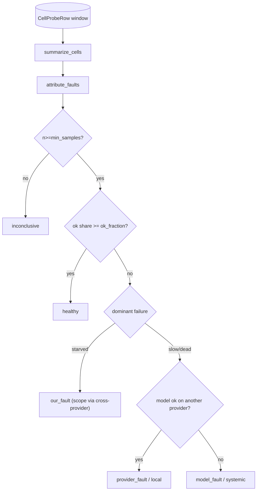

# SP-CHAINPILOT-ATTRIBUTION — classify a cell's fault before any eviction

## Intent
Phase 3a of the Chain Autopilot arc — the hard conceptual core (Principle 5:
**attribution before eviction**), isolated as a pure classifier. Given the
matrix's recent per-cell probe observations, it decides for each failing
`(provider, model)` cell whether the fault is the **model's** (evict it
everywhere), the **provider's** (skip that provider for that model), or
**ours** (fix our handling). Nothing acts on the verdict here — the decision
engine (3b) does. Pure, no I/O.

## Context
The classifier is grounded in the real probe signal (`cell_health_probe`, read
back as `CellProbeRow`): per cell, `status ∈ {ok, slow, empty, error}` plus
`content_chars` / `reasoning_chars`. A probe is **starved** when it reasoned
but produced no visible content (`reasoning_chars > 0 and content_chars == 0`)
— the post-Phase-0 signature of *our* output budget being too tight, not a bad
model or provider.

Three operator decisions (2026-06-25) shape it:
1. **No short-circuit on our-fault.** Even a starved cell is examined across
   providers, so the verdict carries a **scope** — *systemic* (the model is
   starved on all its providers → our thinking handling for it is wrong
   everywhere, fix it once) vs *local* — rather than a blind our-fault label.
   The whole point is to enable a definitive fix, not just a tag.
2. **`slow` is provider-fault when the model is fast elsewhere**; slow on every
   provider is a model-level signal (a slow model), not a provider's fault.
3. **Aggregate before judging** (Principle 6): classify over a window of probes
   per cell with a minimum sample size; below it the verdict is `inconclusive`.

The cross-provider comparison is the engine of the model-vs-provider split: the
same model healthy on provider A but failing on B is B's fault for that model;
failing on every provider is the model's.

## Goals
- G1: A new pure leaf `src/ferova/llm_proxy/providers/attribution.py`.
- G2: `FaultClass` (`healthy` / `our_fault` / `provider_fault` / `model_fault`
  / `inconclusive`) and `FaultScope` (`none` / `local` / `systemic`) enums.
- G3: `CellHealthSummary(provider_id, model_id, n_samples, n_ok, n_slow,
  n_starved, n_dead)` and `summarize_cells(probes) -> list[CellHealthSummary]`
  aggregating `CellProbeRow`s per cell (`dead` = `error`, or `empty` with no
  reasoning; `starved` = `empty` with reasoning; `slow`; `ok`).
- G4: `CellFault(provider_id, model_id, fault, scope, reason, n_samples)` and
  `attribute_faults(probes, *, min_samples=3, ok_fraction=0.5) ->
  list[CellFault]`, one verdict per cell, ordered by `(provider_id, model_id)`.
- G5: Classification rule per cell, after aggregation:
  - `n_samples < min_samples` → `inconclusive` (scope `none`).
  - healthy share `n_ok / n_samples >= ok_fraction` → `healthy`.
  - else the dominant failure mode decides:
    - **starved** dominant → `our_fault`; scope `systemic` if every sampled
      provider of the model is non-healthy with starvation present, else
      `local` — but the cross-provider profile is always computed (decision 1).
    - **slow** dominant → `provider_fault` (`local`) if the model is healthy on
      another provider, else `model_fault` (`systemic`) (decision 2).
    - **dead** dominant → `provider_fault` (`local`) if the model is healthy on
      another provider, else `model_fault` (`systemic`).

## Non-Goals
- NG1: Does NOT decide or apply any action (evict/skip/fix) — that is 3b/3d.
- NG2: Does NOT read the DB or network — the caller injects the probe rows
  (windowed by `since` via the existing `fetch_cell_probes`); 3a stays pure.
- NG3: Does NOT use coder/reviewer outcomes (2b/2c) — those drive *quality*
  demotion in 3b; 3a is purely about *fault* over probe health.
- NG4: Does NOT parse `detail` strings (e.g. HTTP codes) — the structural
  signal (cross-provider health + starvation) is the robust classifier.

## Assumptions
- A1: `starved` (`reasoning_chars>0 and content_chars==0`) is our-fault: after
  Phase 0 the transports bound reasoning, so a still-starved cell means our
  bound is too tight, independent of model/provider quality.
- A2: A model is "healthy on a provider" when that cell clears `ok_fraction`
  with at least `min_samples` — the same bar used for the cell under judgment.
- A3: A model served by a single provider can only be `our_fault`,
  `model_fault`, or `healthy` (no other provider to localize a `provider_fault`
  against); a lone failing provider is then attributed `model_fault` (systemic).

## Interface
New (all in `attribution.py`):
- `class FaultClass(StrEnum)`, `class FaultScope(StrEnum)`.
- `@dataclass(frozen=True) class CellHealthSummary`, `def summarize_cells(...)`.
- `@dataclass(frozen=True) class CellFault`, `def attribute_faults(...)`.

## Behavior

### Nominal
- Model M `ok` on provider A, `error` on B (≥ min_samples each) → A `healthy`,
  B `provider_fault`/`local`.
- M `error` on its only/both providers → `model_fault`/`systemic`.
- M `empty`+reasoning (starved) on every provider → `our_fault`/`systemic`.
- M starved on B but `ok` on A → B `our_fault`/`local`.
- M `slow` on B, `ok` on A → B `provider_fault`/`local`; `slow` on all → M
  `model_fault`/`systemic`.

### Edge cases
- A cell with `< min_samples` probes → `inconclusive`.
- A healthy cell (≥ ok_fraction ok) → `healthy`/`none`.
- An empty probe list → `[]`.
- A model on one provider only, failing → `model_fault` (A3).

### Failure scenarios
- None — pure in-memory function; malformed inputs are simply summarized as
  whatever their fields say (no raising).

## Architecture Impact
- New pure leaf in `llm_proxy/providers/`; imports `CellProbeRow`
  (PROBE-SWEEP) and `STATUS_*` (HEALTH-STORE-NEUTRALIZE) — both declared.
- No `review/` dependency (3a is probe-only); no cycle; no shared state.
- Nobody imports it yet (3b will), so per
  [[unwired-invariant-breaks-next-slice]] no "nothing imports me" assertion is
  pinned and the FULL unit suite is run.

## Diagram

## Acceptance Criteria
- [ ] AC1: `summarize_cells` aggregates probes per `(provider, model)` into the
  five counts, with `starved` = empty+reasoning and `dead` = error or
  empty-without-reasoning.
- [ ] AC2: A cell below `min_samples` is `inconclusive`/`none`.
- [ ] AC3: A cell at/above `ok_fraction` ok is `healthy`/`none`.
- [ ] AC4: A failing cell whose model is healthy on another provider is
  `provider_fault`/`local` (for slow or dead dominant).
- [ ] AC5: A failing cell whose model fails on every provider is
  `model_fault`/`systemic`.
- [ ] AC6: A starved-dominant cell is `our_fault`, `systemic` when the model is
  starved across all its providers, else `local` — and the cross-provider
  profile is computed regardless (no short-circuit).
- [ ] AC7: Verdicts are ordered by `(provider_id, model_id)`; an empty input
  yields `[]`.
- [ ] AC8: `arch check` passes with the two declared edges; ruff + no-inline
  pass; the module is pure (no I/O).

## Open Questions
- None.
