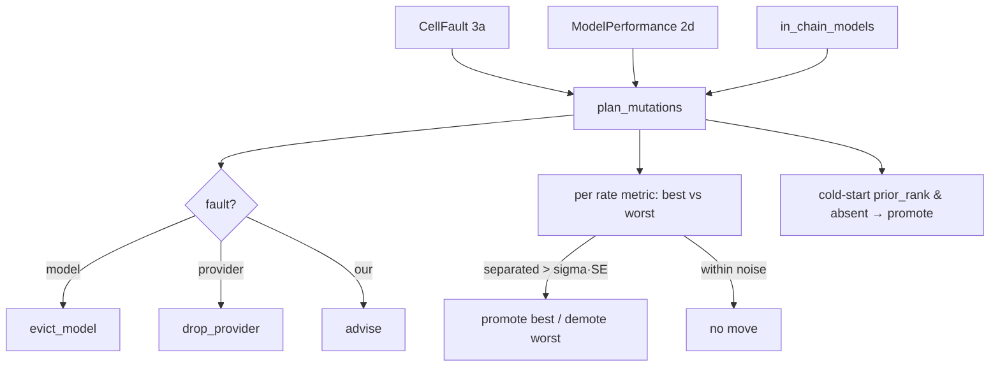

# SP-CHAINPILOT-DECISION — turn diagnosis into planned mutations

## Amendment (0.2, 2026-06-26)
Cold-start promotion (originally G6 / the `in_chain_models` input / the
prior-rank trial) is **removed from this slice**. Inserting a never-seen model
is a structural operation that needs the chain layout, the live `(provider ×
model)` matrix (to choose a healthy provider), and a benchmark metric→tier
mapping (to choose the tier) — context the decision layer does not hold. It
moves to the apply layer (3d), where that context exists. `plan_mutations`
therefore no longer takes `in_chain_models` and emits no cold-start PROMOTE; it
covers faults + ordinal quality moves only. The goals/criteria below that
reference cold-start are superseded by this amendment.

## Intent
Phase 3b of the Chain Autopilot arc — the policy layer 2d and 3a deliberately
declined to carry. It reads the 3a fault verdicts and the 2d scoreboard and
emits a list of **planned mutations** to the chains (evict / drop-provider /
demote / promote / advise). Pure: it plans, it does not write — 3d applies.

## Context
Two kinds of signal drive a mutation, kept strictly separate:

**Fault (from 3a) — deterministic, no threshold.** A fault verdict maps 1:1 to
an action: `model_fault` → evict the model everywhere; `provider_fault` → drop
that provider from the model's fan-out; `our_fault` → **advise** (never punish
the model or provider — it is our config to fix); `healthy` / `inconclusive` →
nothing.

**Quality (from 2d) — ordinal, statistically guarded.** Absolute success-rate
thresholds are forbidden (a raw rate has no meaning without a reference, and
"good" drifts with the model landscape), and a prior-relative reference would
reintroduce the quality→rate incommensurability 2d rejected. So the reference
is **the other models in the same role**: within a rate metric's candidate set,
demote the worst and promote the best — but **only when the two are separated
beyond sampling noise**: `|p_best − p_worst| > sigma · sqrt(p_b(1−p_b)/n_b +
p_w(1−p_w)/n_w)` (binomial standard error). If the gap fits inside the noise,
nothing moves this cycle. The only knob is `sigma` (a statistical confidence
factor, not a calibration threshold), so the bar emerges from the data.

Three shaping decisions (operator-agreed 2026-06-25):
1. Only **rate** metrics are gated (`coder_ci_green` ↑, `reviewer_precision` ↑,
   `coder_stuck` ↓ — proportions with a binomial SE). `coder_rounds_to_green`
   is a mean of counts with no variance exposed → excluded from gated moves.
2. The current **in-chain model set** is an input, so a cold-start model (a
   model absent from the chains with a strong `prior_rank`) can be proposed for
   a PROMOTE trial — the prior's only role (no fusion, consistent with 2d).
3. Candidates are compared **within a role**, never globally — and since each
   rate metric belongs to one role, ranking within a metric's candidate set
   keeps coder-vs-coder and reviewer-vs-reviewer separate by construction.

## Goals
- G1: A new pure leaf `src/ferova/review/decision.py`.
- G2: `MutationKind` enum (`evict_model` / `drop_provider` / `demote` /
  `promote` / `advise`) and a frozen `PlannedMutation(kind, model, provider,
  metric, reason)` (`provider` set only for `drop_provider`; `metric` set only
  for `demote` / `promote`).
- G3: `plan_mutations(faults, scoreboard, *, in_chain_models=frozenset(),
  sigma=1.0) -> list[PlannedMutation]`, deterministic and ordered.
- G4: Fault mapping (deterministic, one mutation per distinct target):
  `model_fault` → one `evict_model` per model; `provider_fault` → one
  `drop_provider` per `(model, provider)`; `our_fault` → one `advise` per model
  (its scope carried in the reason); others → none.
- G5: Quality moves: for each gated rate metric, over scoreboard entries whose
  `GuardedMetric` for it is `confident` with a non-`None` value, find the best
  and worst by the metric's direction; if they are different models and
  separated beyond `sigma · combined-SE`, emit a `promote` for the best and a
  `demote` for the worst, tagged with the metric. Fewer than two confident
  candidates, or a gap within noise → no move.
- G6: Cold-start: for each scoreboard model with a non-`None` `prior_rank` that
  is **not** in `in_chain_models`, emit a `promote` (reason names the prior
  rank as a trial seed).

## Non-Goals
- NG1: Does NOT write or read `chains.env` / the DB / the network — caller
  injects faults, scoreboard, and the in-chain set; 3d applies (this is pure).
- NG2: Does NOT resolve conflicting moves across metrics (a model best on one
  rate, worst on another) — both proposals stand; 3d/operator reconcile.
- NG3: Does NOT use absolute or prior-relative quality thresholds (only the
  ordinal + noise guard) — and `our_fault` never yields a chain mutation.
- NG4: Does NOT gate moves on `coder_rounds_to_green` (decision 1).

## Assumptions
- A1: A rate metric's `GuardedMetric.value` is a proportion in `[0, 1]` and
  `n` its sample size, so a binomial SE is well-defined; `confident` already
  encodes the min-sample guard from 2d.
- A2: Comparing within a single metric's candidate set keeps roles separate
  (decision 3), so no explicit role→tier table is needed.
- A3: The in-chain set is the minimal projection of the chains 3b needs (model
  membership); ordering/where-to-apply is 3d's concern.

## Interface
New (all in `decision.py`):
- `class MutationKind(StrEnum)`.
- `@dataclass(frozen=True) class PlannedMutation`.
- `def plan_mutations(...) -> list[PlannedMutation]`.

## Behavior

### Nominal
- A `model_fault` cell → one `evict_model` for that model.
- A `provider_fault` cell → one `drop_provider(model, provider)`.
- Two coder models with confident `coder_ci_green` 0.9 (n=20) vs 0.4 (n=20) →
  separated → `promote` the 0.9 model, `demote` the 0.4 model.
- The same two at 0.62 vs 0.58 (n=5) → within noise → no quality move.
- A model with `prior_rank=2` absent from `in_chain_models` → `promote` (trial).

### Edge cases
- `our_fault` cell → `advise` only (no evict/drop), scope in the reason.
- `inconclusive` / `healthy` cells → no mutation.
- A metric with one confident candidate → no demote/promote.
- `coder_stuck` (lower better) → best = lowest, worst = highest.
- Empty inputs → `[]`.

### Failure scenarios
- None — pure in-memory; degenerate SE (a rate at 0 or 1 contributes 0 to the
  SE) simply makes any non-zero gap count as separated.

## Architecture Impact
- New pure leaf in `review/` (imports `attribution` from `llm_proxy` along the
  safe `review → llm_proxy` direction + in-package `perf_aggregate`); both
  governed edges declared. No cycle.
- Nobody imports it yet (3d will), so per
  [[unwired-invariant-breaks-next-slice]] no "nothing imports me" assertion is
  pinned and the FULL unit suite is run.

## Diagram

## Acceptance Criteria
- [ ] AC1: `model_fault` → exactly one `evict_model` per model (deduped across
  cells); `provider_fault` → one `drop_provider` per `(model, provider)`.
- [ ] AC2: `our_fault` → one `advise` per model, no chain mutation; `healthy` /
  `inconclusive` → none.
- [ ] AC3: Two confident candidates separated beyond `sigma·SE` yield a
  `promote` (best) and a `demote` (worst) tagged with the metric.
- [ ] AC4: Two confident candidates within noise yield no quality move.
- [ ] AC5: `coder_stuck` ranks lower-is-better; a non-confident metric never
  drives a move; `coder_rounds_to_green` never drives a move.
- [ ] AC6: A scoreboard model with `prior_rank` set and absent from
  `in_chain_models` yields a `promote`; one already in chains does not.
- [ ] AC7: Output is deterministically ordered; empty inputs yield `[]`.
- [ ] AC8: `arch check` passes with the two declared edges; ruff + no-inline
  pass; the module is pure (no I/O).

## Open Questions
- None.
