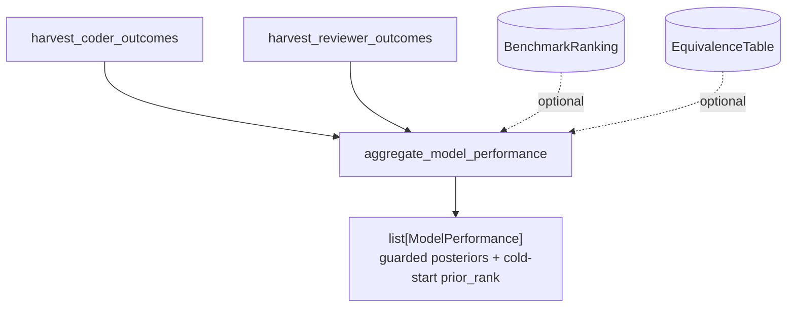

# SP-CHAINPILOT-PERF-AGGREGATE — the per-model scoreboard

## Intent
Phase 2d of the Chain Autopilot arc — the convergence point of brick 4. It
assembles, per model, the live posteriors from 2b (coder) and 2c (reviewer),
each **min-sample guarded**, alongside the benchmark **prior rank** as a
separate cold-start signal. This is the observatory's scoreboard — the input
the decision engine (3b) reads.

## Context
A design decision (agreed 2026-06-25): 2d **exposes, it does not fuse**. The
benchmark prior is a *generic quality* (intelligence index, SWE-V, …); the
posteriors are *task success rates* on our own work (CI-green, reviewer
precision). They are not the same quantity, so a numeric blend
(`(k·prior + successes)/(k+n)`) would have to assume — and calibrate — a
quality→rate correspondence, exactly the synthetic mapping the project avoids.
Instead, per Principle 3 ("benchmarks seed a never-seen model; a model in
service is judged by its real results"), 2d keeps them side by side: the prior
is a cold-start rank for unseen models, the posterior is the truth once samples
exist, and the actual policy (blend / threshold / evict) lives in the decision
engine. Each tier keeps its own metric — there is no single score.

This leaf lives in `review/`, not beside the other arc bricks in
`llm_proxy/providers/`: it imports both the `review/` posteriors and the
`llm_proxy/` prior, and only the `review -> llm_proxy` direction is acyclic.
Because it imports four governed modules, all four edges are declared in
`depends_on` (the honest convergence record).

## Goals
- G1: A new module `src/ferova/review/perf_aggregate.py` exposing
  `aggregate_model_performance(db_path, *, ranking=None, equivalences=None,
  prior_metric=None, min_sample=5) -> list[ModelPerformance]`, ordered by model
  id; pure and read-only.
- G2: A frozen `GuardedMetric(metric, value, n, confident)` — one posterior
  dimension: its live `value` (`None` when no sample), sample size `n`, and
  `confident = n >= min_sample`.
- G3: A frozen `ModelPerformance(model, prior_rank, prior_score, metrics)` —
  the model id, its cold-start prior (both `None` when no prior is resolvable),
  and the tuple of `GuardedMetric` for its dimensions.
- G4: The dimensions are derived from the harvests, each with its own `n`:
  `coder_ci_green` (n = `n_prs`), `coder_stuck` (n = `n_prs`),
  `coder_rounds_to_green` (value = `avg_rounds_to_green`, n = `n_ci_green` —
  the green PRs the average is taken over), and `reviewer_precision`
  (n = `n_settled`). A model carries only the dimensions it has data for (the
  union of coder- and reviewer-seen models).
- G5: The prior is attached **only** when `ranking`, `equivalences`, and
  `prior_metric` are all provided: the model id resolves to benchmark aliases
  via `equivalences.aliases_for_model_id`, the ranking's entries for those
  aliases on `prior_metric` give `(rank, score)`, and the **best (lowest)
  rank** wins. An unmatched / unseen model gets `prior_rank = prior_score =
  None` — itself the cold-start signal.

## Non-Goals
- NG1: Does NOT blend prior and posterior into a single number, nor apply any
  threshold/eviction policy — that is the decision engine (3b).
- NG2: Does NOT compute a cross-dimension "overall" score — dimensions stay
  separate (no single score).
- NG3: Does NOT load the ranking / equivalence files itself — the caller
  injects them (keeps the leaf pure and file-free); absent → no prior.
- NG4: Does NOT write anything or hit the network.

## Assumptions
- A1: `min_sample` is a statistical confidence guard, not a calibration
  threshold; `n` is exposed raw so the decision engine may re-guard.
- A2: `coder_rounds_to_green`'s `n` is the green-PR count (`n_ci_green`), a safe
  upper bound on the PRs the average is actually taken over.
- A3: The harvests already encode the attribution and exclusion rules (2b/2c);
  2d composes them verbatim and adds no new attribution.

## Interface
New:
- `src/ferova/review/perf_aggregate.py`
  - `@dataclass(frozen=True) class GuardedMetric`.
  - `@dataclass(frozen=True) class ModelPerformance`.
  - `def aggregate_model_performance(...) -> list[ModelPerformance]`.

## Behavior

### Nominal
- A model with coder + reviewer data and a benchmark entry → one
  `ModelPerformance` with four `GuardedMetric` (the three coder + the reviewer)
  and a non-`None` `prior_rank`.
- `min_sample=5`: a dimension with `n=3` has `confident=False`; with `n=8`,
  `confident=True`.

### Edge cases
- A coder-only model → only the three coder dimensions; reviewer absent.
- No `ranking`/`equivalences`/`prior_metric` → every `prior_rank` is `None`.
- A model not in the equivalence table → `prior_rank = None`, posteriors intact.
- An empty / fresh DB → `[]`.

### Failure scenarios
- Missing tables on an older DB → the harvests' idempotent `init_*` create them
  empty → `[]`, nothing raised.

## Architecture Impact
- New `review/` leaf; imports four governed modules, all declared in
  `depends_on`; `arch check` edge-honesty passes.
- Adds no `llm_proxy -> review` edge; the one-way boundary holds.
- Pure read; no new state or cycle. Nobody imports it yet (3b will), so per
  [[unwired-invariant-breaks-next-slice]] the FULL unit suite is run and no
  "nothing imports me" assertion is pinned.

## Diagram

## Acceptance Criteria
- [ ] AC1: One `ModelPerformance` per model in the union of coder/reviewer
  harvests, ordered by model id.
- [ ] AC2: Each `GuardedMetric.confident` is `n >= min_sample`, and `value`
  carries the harvest's rate (or `None` where the harvest had none).
- [ ] AC3: A coder-only model carries exactly the three coder dimensions; a
  reviewer-only model carries exactly `reviewer_precision`.
- [ ] AC4: With ranking + equivalences + `prior_metric`, a matched model's
  `prior_rank` is the best rank across its aliases on that metric; an unmatched
  model's `prior_rank` is `None`.
- [ ] AC5: With any of ranking / equivalences / `prior_metric` absent, every
  `prior_rank` and `prior_score` is `None`.
- [ ] AC6: An empty / fresh DB yields `[]` and raises nothing.
- [ ] AC7: `arch check` passes with the four declared edges; ruff and the
  no-inline-comments gate pass; the module is pure and read-only.

## Open Questions
- None.
