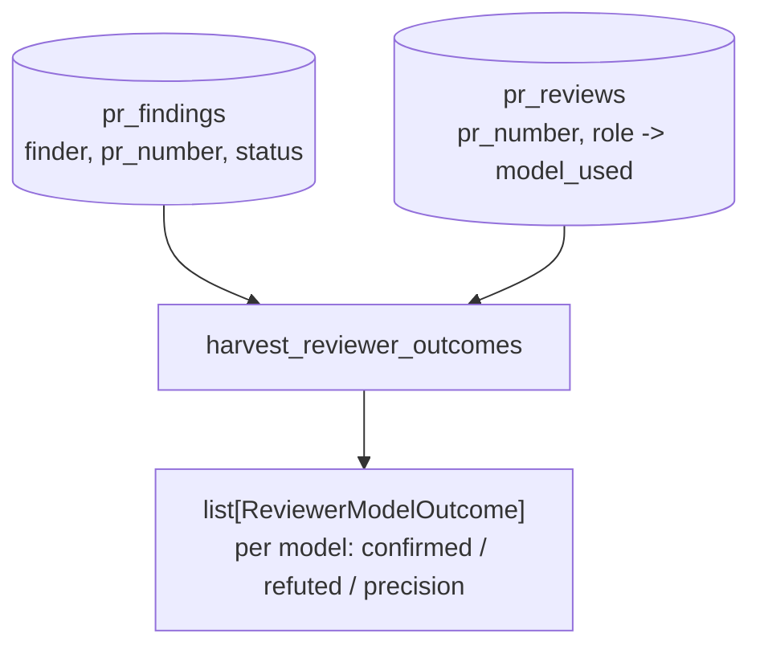

# SP-CHAINPILOT-REVIEWER-OUTCOMES — harvest reviewer precision per model

## Intent
Phase 2c of the Chain Autopilot arc — the second half of the live performance
harvest (brick 4). It aggregates each model's **reviewer precision** — the
fraction of the findings it raised that survived verification (confirmed real)
rather than being refuted — attributed by the model that produced the review.
The reviewer counterpart to 2b's coder outcomes: together they are the live
posterior (2d) that overrides the benchmark prior (Principle 3).

## Context
Slice 11 (`review_lessons.compute_lens_precision`) already computes precision
**per lens** (architect / sentinel / tester / scribe) over the findings ledger.
2c re-attributes that same confirmed-vs-refuted signal **per model**, because a
lens is served by whichever model the chain resolved — the unit the autopilot
tunes is the model, not the lens.

The model is not on the `Finding` (which carries `finder` = the lens role), but
the `pr_reviews` table records `model_used` per `(pr_number, role)`. A finding
joins to its model via `(finding.pr_number, finding.finder) == (pr_reviews.
pr_number, pr_reviews.role)` — `findings_bridge` sets `finder = role.value`, the
same lowercase role `pr_reviews.role` stores. CI-authored findings
(`finder = "ci"`) have no reviewer row and are naturally unattributed.

A `(pr, role)` may map to more than one model across review rounds (chain
failover); a finding then contributes to each such model, mirroring 2b's
PR-granular attribution. No minimum-sample guard — that is 2d.

This leaf lives in `review/` for the same reason as 2b: reading these tables
from `llm_proxy` would invert the one-way `review -> llm_proxy` import boundary
into a cycle the edge-honesty gate rejects.

## Goals
- G1: A new module `src/ferova/review/reviewer_outcomes.py` exposing
  `harvest_reviewer_outcomes(db_path: Path) -> list[ReviewerModelOutcome]`,
  ordered by model id; pure and read-only.
- G2: A frozen `ReviewerModelOutcome` with: `model`, `confirmed` (findings the
  model raised that are downstream of VERIFIED), `refuted` (findings it raised
  that were REFUTED), `n_settled` (`confirmed + refuted`), and `precision`
  (`confirmed / n_settled`, or `None` when the model has no settled finding).
- G3: Attribution joins each finding to `model_used` via `(pr_number, finder)`
  against `pr_reviews`; a finding served by several models for that
  `(pr, role)` contributes to each. Still-proposed findings (no verdict) and
  unattributable findings (no matching `pr_reviews` row, e.g. `finder == "ci"`)
  are excluded from the counts.
- G4: The confirmed-vs-refuted classification matches slice 11 exactly — a
  finding counts as confirmed when its status is downstream of VERIFIED
  (VERIFIED / OPEN / RESOLVED / STUCK) and refuted when REFUTED.

## Non-Goals
- NG1: Does NOT combine with the benchmark prior or apply min-sample guards
  (2d, `SP-CHAINPILOT-PERF-AGGREGATE`).
- NG2: Does NOT modify slice 11's per-lens view; it adds a per-model view
  beside it.
- NG3: Does NOT learn lessons or write to agentmemory — pure aggregation.
- NG4: Does NOT add a CLI surface, routine, or any write. Read-only.

## Assumptions
- A1: `findings_bridge` sets `finder = role.value`, identical to the lowercase
  `pr_reviews.role`, so the join key is exact.
- A2: A finding with no matching `pr_reviews` row (a CI finding, or a review
  whose row was never persisted) is unattributable and excluded — never
  miscounted against an arbitrary model.
- A3: Multi-model `(pr, role)` attribution to each model is acceptable for a
  posterior that 2d guards with a minimum sample size (NG1).

## Interface
New:
- `src/ferova/review/reviewer_outcomes.py`
  - `@dataclass(frozen=True) class ReviewerModelOutcome` (fields per G2).
  - `def harvest_reviewer_outcomes(db_path: Path) -> list[ReviewerModelOutcome]`.

No public surface changes elsewhere; no new Settings field.

## Behavior

### Nominal
- Model X served the architect lens on PRs 1 and 2, raising 3 findings that
  reached VERIFIED/RESOLVED and 1 that was REFUTED → one `ReviewerModelOutcome`
  with `confirmed=3`, `refuted=1`, `n_settled=4`, `precision=0.75`.

### Edge cases
- A model with only still-proposed findings → `n_settled=0`, `precision=None`.
- A finding whose `(pr, role)` maps to two models → both models receive it.
- A `finder == "ci"` finding, or a finding with no `pr_reviews` row → excluded.
- An empty / fresh DB → `[]`.

### Failure scenarios
- A missing table on an older DB → the idempotent `init_*_schema` call creates
  it empty; the harvest returns `[]` rather than raising.

## Architecture Impact
- New leaf in `review/`; imports only frontier review modules (`findings`,
  `persistence`) — no `depends_on` edge required, `arch check` stays green.
- Adds no edge to/from `llm_proxy`; the one-way boundary is preserved.
- Pure read; no new shared state or cycle. Nobody imports it yet (the 2d
  consumer will), so per [[unwired-invariant-breaks-next-slice]] no
  "nothing imports me" assertion is pinned and the FULL unit suite is run.

## Diagram

## Acceptance Criteria
- [ ] AC1: One `ReviewerModelOutcome` per distinct attributed model, ordered by
  model id.
- [ ] AC2: `precision == confirmed / (confirmed + refuted)`, and `None` when the
  model has no settled finding.
- [ ] AC3: A finding downstream of VERIFIED counts confirmed; a REFUTED finding
  counts refuted; a still-proposed finding counts neither.
- [ ] AC4: A finding whose `(pr, role)` maps to two models contributes to both.
- [ ] AC5: A `finder == "ci"` finding and any finding with no `pr_reviews` row
  are excluded from every model's counts.
- [ ] AC6: An empty / fresh DB yields `[]` and raises nothing.
- [ ] AC7: `arch check`, ruff, and the no-inline-comments gate pass; the module
  is pure and read-only (no INSERT/UPDATE, no network).

## Open Questions
- None.
