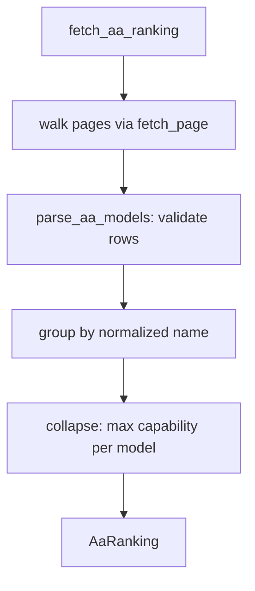

# Artificial Analysis free-API capability ingest

## Intent

Pull live per-model capability from the Artificial Analysis free API and reduce
it to one capability number per model, so the model-first chain builder ranks
models off the real market instead of a hand-curated snapshot. This is the
INGEST step (slice 1) of the model-first chains arc; see
`docs/model_first_chains_architecture.md`.

## Context

A pure, additive leaf. It replaces the role of the manual
`providers/benchmark_prior.json` snapshot with a live fetch, but does NOT wire
into routing yet — downstream slices (`SP-MFC-SELECT`, `SP-MFC-EXPAND`) consume
its output. It reads the operator's `FEROVA_ARTIFICIAL_ANALYSIS_API_KEY` from
Settings and calls `GET /api/v2/language/models/free`. Network I/O is injected so
unit tests run against a captured payload (no live calls in the suite).

## Goals

- G1: Fetch every page of the free endpoint and parse each model into a typed
  record (identity, intelligence/coding/agentic index, input/output price, median
  performance).
- G2: Validate the payload — schema (Pydantic v2) plus sanity bounds — and reject
  out-of-range values rather than propagate them into routing.
- G3: Collapse a model's reasoning/non-reasoning variants into ONE
  `ModelCapability` whose `capability` = the MAX intelligence index across its
  variants, keyed on the normalized model name.
- G4: Be unit-testable offline: the HTTP call is an injected dependency; a
  captured multi-page fixture drives the tests.

## Non-Goals

- NG1: No selection, eligibility, tiering, or top-N (that is `SP-MFC-SELECT`).
- NG2: No provider matrix / equivalence join (that is SELECT/EXPAND).
- NG3: No persistence — results are returned in-memory; a snapshot table, if
  wanted, is a later slice.
- NG4: No wiring into the proxy, the chainpilot, or `chains.env`.
- NG5: Does not use the Pro/Commercial endpoints (free tier only).

## Assumptions

- A1: `FEROVA_ARTIFICIAL_ANALYSIS_API_KEY` is set; auth is the `x-api-key` header.
- A2: The endpoint is paginated via `page` / `page_size`, with
  `pagination.has_more` / `total_pages` signalling continuation.
- A3: `evaluations.artificial_analysis_intelligence_index` may be `null` for some
  rows; such a row is skipped (no usable capability).
- A4: `coding_index` / `agentic_index` may be `null` → fall back to the
  intelligence index when a consumer needs them.

## Interface

The contract (typed):

```python
class ModelVariant(BaseModel):
    name: str
    slug: str
    creator: str
    intelligence_index: float
    coding_index: float | None
    agentic_index: float | None
    price_1m_input: float | None
    price_1m_output: float | None
    median_output_tps: float | None
    median_ttft_s: float | None

class ModelCapability(BaseModel):
    name: str                  # normalized display name (collapse key)
    capability: float          # MAX intelligence_index across variants
    coding: float | None       # MAX coding_index across variants (None if all null)
    cheapest_input: float | None
    fastest_tps: float | None
    variants: tuple[ModelVariant, ...]

class AaRanking(BaseModel):
    index_version: str | None
    models: tuple[ModelCapability, ...]   # one per normalized name

def normalize_model_name(name: str) -> str: ...
    # lowercase, strip the variant parenthetical and non-alphanumerics

def parse_aa_models(pages: Sequence[dict]) -> AaRanking: ...
    # validate + collapse captured page payloads (pure, no I/O)

def fetch_aa_ranking(
    settings: Settings,
    *,
    fetch_page: Callable[[int], dict] | None = None,
) -> AaRanking: ...
    # walk pages via fetch_page (default = real x-api-key HTTP call), then
    # delegate to parse_aa_models. fetch_page is injected in tests.
```

Inputs:
- `settings`: Settings — supplies `artificial_analysis_api_key`.
- `fetch_page`: optional injected page fetcher — `(page:int) -> dict`.

Outputs:
- `AaRanking` — `index_version` + one `ModelCapability` per normalized name.

Errors:
- `AaIngestError`: raised when the key is missing, a page request fails, or the
  payload fails schema/bound validation.

## Behavior

### Nominal
1. Resolve the API key from Settings; missing → `AaIngestError`.
2. Fetch page 1; read `pagination` to learn `total_pages` (or loop while
   `has_more`); fetch the rest. The default `fetch_page` issues
   `GET {base}/api/v2/language/models/free?page={p}` with header `x-api-key`.
3. `parse_aa_models`: validate each `data[]` row into a `ModelVariant` (skipping
   rows whose intelligence index is `null`), group by `normalize_model_name`, and
   emit one `ModelCapability` per group with `capability = max(intelligence)`,
   `coding = max(coding_index ignoring null)`, `cheapest_input = min(price)`,
   `fastest_tps = max(tps)`.

### Edge cases
- A model appears only as a single variant → a one-variant `ModelCapability`.
- `coding_index` / `agentic_index` all null for a model → `coding = None`.
- Duplicate normalized names across creators (collision) → kept as one group
  (acceptable; the equivalence table disambiguates downstream, NG2).
- A single page (`has_more=false` on page 1) → no further requests.

### Failure scenarios
- Page request non-200 or malformed JSON → `AaIngestError` (no partial ranking).
- An intelligence index outside `[0,100]`, or a negative price/perf → validation
  failure → `AaIngestError` (a bad scrape must never silently reach routing).

## Architecture Impact
- Adds no dependency edges: `depends_on: []`. A pure leaf that reads Settings
  (frontier config, not an owned component) and an external HTTP API.
- New / changed coupling, cycles, or shared state: none. Additive and unwired;
  nothing imports it yet (a consumer arrives in `SP-MFC-SELECT`).

## Diagram


## Acceptance Criteria
- [ ] AC1: Given a captured multi-page fixture, `fetch_aa_ranking` (with an
      injected `fetch_page`) walks every page and returns one `ModelCapability`
      per distinct normalized name.
- [ ] AC2: A model present as both a reasoning and a non-reasoning variant
      collapses to a single `ModelCapability` whose `capability` equals the MAX of
      the two intelligence indices.
- [ ] AC3: A row with a null intelligence index is skipped; a model whose
      coding indices are all null yields `coding = None`.
- [ ] AC4: An out-of-bounds intelligence index (e.g. 140) or a negative price
      raises `AaIngestError`; no partial ranking is returned.
- [ ] AC5: A missing `FEROVA_ARTIFICIAL_ANALYSIS_API_KEY` raises `AaIngestError`.
- [ ] AC6: No unit test performs live network I/O (the page fetcher is injected).

## Open Questions
- (none — resolved during design; downstream join/trigger are owned by later slices.)
