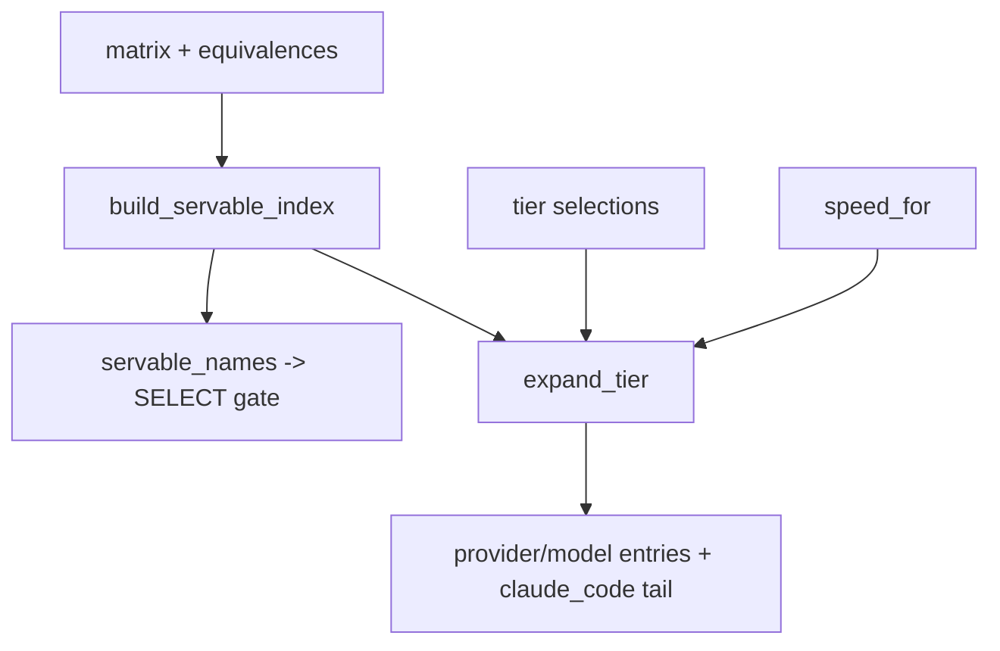

# Model-first provider expansion — NIM-first, then live speed

## Intent

Expand each selected model into every provider that serves it, ordered NIM-first
(free) then by live-measured speed, and resolve the **servable** set that gates
selection. This is the join linchpin of the model-first chains arc and the step
that turns a per-tier model list into concrete `provider/model` chain entries;
see `docs/model_first_chains_architecture.md`.

## Context

Pure and I/O-free. It joins three already-built inputs: the per-tier
`ModelCapability` selections (`SP-MFC-SELECT`), the live `(provider × model)`
matrix (`SP-CHAINPILOT-MATRIX`), and the benchmark name↔id equivalence table
(`SP-CHAINPILOT-EQUIVALENCES`). Per-cell speed is injected as a `speed_for`
callable (the caller reads `fetch_cell_probes` latency), so this leaf keeps no
edge to the probe store. Its output — per tier, an ordered tuple of
`provider_id/model_id` strings plus the `claude_code/<tier>` tail — is rendered
into `chains.env` by `SP-MFC-GENERATE`. The `servable_names` it derives is the
matrix∩AA gate that `SP-MFC-GENERATE` feeds back into `SP-MFC-SELECT`
(matrix-before-top-N).

## Goals

- G1: Build the servable index — a map from normalized AA model name to the
  matrix cells that serve it, resolved through the equivalence table's aliases.
- G2: Expose `servable_names` (the index's keys) as the gate for selection.
- G3: Order a model's cells NIM-first, then by ascending probe latency (fastest
  first; unknown latency last).
- G4: Expand a tier's selected models into ordered `provider/model` entries,
  de-duplicated, with the `claude_code/<tier>` tail appended.
- G5: Make coverage visible — log every selected model that expands to zero
  cells (dropped; the `claude_code` tail remains the net).

## Non-Goals

- NG1: No HTTP / matrix sweep / probe reads — matrix, equivalences and
  `speed_for` are injected.
- NG2: No `chains.env` rendering or writing (that is GENERATE).
- NG3: No fuzzy/substring name matching — the equivalence table is the
  authoritative join; unmatched cells are dropped and counted, not guessed
  (a coverage gap is a data fix in the equivalence table, not a silent guess).
- NG4: No model selection / eligibility (that is SELECT).

## Assumptions

- A1: The equivalence table's aliases are benchmark names that normalize to the
  same key as the AA model names (both flow from the Artificial Analysis naming).
- A2: `speed_for(provider_id, model_id)` returns a probe latency in seconds, or
  `None` when the cell has no usable measurement.
- A3: `claude_code` is never in the matrix (subprocess backstop) — it is added
  only as the explicit tail.

## Interface

```python
NIM_PROVIDER = "nvidia_nim"

def build_servable_index(
    matrix: ProviderModelMatrix, equivalences: EquivalenceTable,
) -> dict[str, tuple[ModelCell, ...]]: ...

def servable_names(index: Mapping[str, tuple[ModelCell, ...]]) -> frozenset[str]: ...

def order_cells(
    cells: Sequence[ModelCell],
    *,
    speed_for: Callable[[str, str], float | None],
    nim_provider: str = NIM_PROVIDER,
) -> tuple[ModelCell, ...]: ...

def expand_tier(
    models: Sequence[ModelCapability],
    *,
    index: Mapping[str, tuple[ModelCell, ...]],
    speed_for: Callable[[str, str], float | None],
    tier: str,
    nim_provider: str = NIM_PROVIDER,
) -> tuple[str, ...]: ...

def expand_chains(
    selections: Mapping[str, Sequence[ModelCapability]],
    *,
    index: Mapping[str, tuple[ModelCell, ...]],
    speed_for: Callable[[str, str], float | None],
    nim_provider: str = NIM_PROVIDER,
) -> dict[str, tuple[str, ...]]: ...
```

Inputs:
- `matrix`, `equivalences`: the live join inputs.
- `selections`: `{tier: (ModelCapability, ...)}` from SELECT.
- `speed_for`: injected per-cell latency lookup.

Outputs:
- `expand_chains` → `{tier: ("provider/model", ..., "claude_code/<tier>")}`.

Errors:
- None raised; a model with no serving cell is logged and skipped.

## Behavior

### Nominal
1. `build_servable_index`: for each `ModelCell`, take `aliases_for_model_id`,
   normalize each alias, and append the cell under each resulting name. Cells
   whose model id matches no alias are counted and dropped (logged).
2. `order_cells`: sort key `(0 if provider == nim_provider else 1,
   latency_or_inf)` ascending — NIM block first, each block fastest-first,
   unknown latency last.
3. `expand_tier`: for each selected model in order, look up its cells in the
   index, order them, and emit `provider/model`; de-duplicate while preserving
   order; append `claude_code/<tier>`.

### Edge cases
- A selected model absent from the index → skipped, logged (G5); other models
  still expand. A tier with no expandable model still yields `(claude_code/<tier>,)`.
- A model served by several NIM ids → all NIM cells precede non-NIM, ordered
  among themselves by latency.
- The same `provider/model` reachable via two selected models → emitted once
  (first occurrence wins).
- Every cell latency `None` → NIM-first still holds; ties keep matrix order.

### Failure scenarios
- Equivalence coverage gap (cells match no alias) → those cells never enter any
  chain; the count is logged so the gap is visible, never silently masked.

## Architecture Impact
- Adds dependency: SP-MFC-EXPAND -> SP-MFC-AA-INGEST (`ModelCapability`,
  `normalize_model_name`).
- Adds dependency: SP-MFC-EXPAND -> SP-MFC-SELECT (consumes the tier selections,
  whose elements are `ModelCapability`).
- Adds dependency: SP-MFC-EXPAND -> SP-CHAINPILOT-MATRIX (`ModelCell`,
  `ProviderModelMatrix`).
- Adds dependency: SP-MFC-EXPAND -> SP-CHAINPILOT-EQUIVALENCES (`EquivalenceTable`).
- New / changed coupling, cycles, or shared state: none. `speed_for` is injected,
  so no edge to the cell-probe store; `chains.env` is untouched here.

## Diagram


## Acceptance Criteria
- [ ] AC1: `build_servable_index` maps a cell to the normalized names of its
      equivalence aliases; `servable_names` returns those keys.
- [ ] AC2: a cell whose model id matches no alias is excluded from the index.
- [ ] AC3: `order_cells` puts the NIM cell(s) first, then orders the rest by
      ascending latency, with `None`-latency cells last.
- [ ] AC4: `expand_tier` emits ordered `provider/model` for each model then
      appends `claude_code/<tier>`; a model absent from the index is skipped.
- [ ] AC5: a `provider/model` reachable via two selected models appears once.
- [ ] AC6: `expand_chains` returns one ordered tuple per tier.

## Open Questions
- (none — rendering + write owned by GENERATE; equivalence-coverage strengthening
  is a separate data concern, logged here per NG3/G5.)
