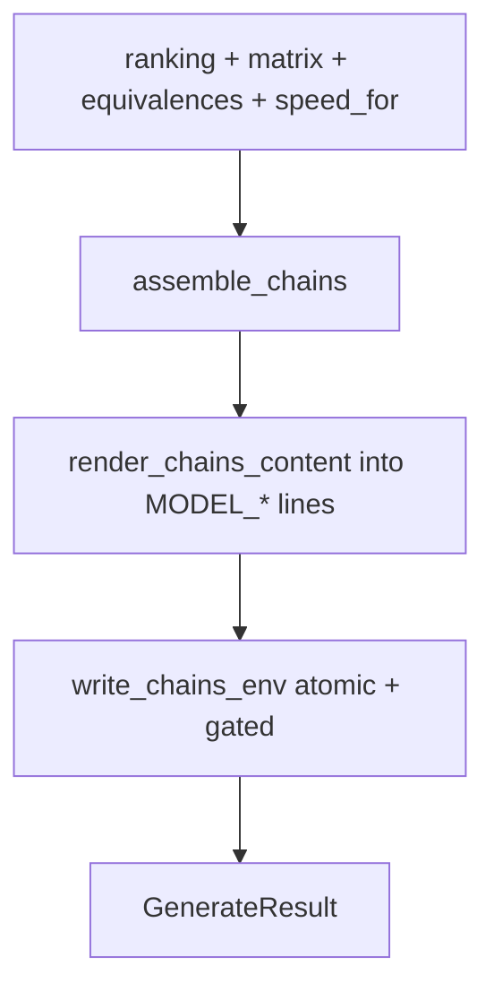

# Model-first chains.env generation — assemble, render, atomic write

## Intent

Turn the gathered model-market inputs into a regenerated `chains.env`: assemble
the three tier chains (select → expand), render them into the file's MODEL_*
lines preserving everything else, and write atomically behind the same apply
flag the chainpilot uses. Slice 4 of the model-first chains arc; see
`docs/model_first_chains_architecture.md`.

## Context

Pure and synchronous. It composes slices 1–3: `select_models` (SELECT) gated by
the `servable_names` from `build_servable_index` (EXPAND), then `expand_chains`
(EXPAND) into ordered `provider/model` entries. The live gathering (AA fetch,
async matrix sweep, probe-latency read) and the CLI/cadence wiring belong to
`SP-MFC-CHAINPILOT-REFRAME` (slice 5), which calls this leaf with already-gathered
inputs and an injected `speed_for`. So this leaf does no HTTP, no async, no DB —
only assemble, render, and a flag-gated atomic file write.

## Goals

- G1: `assemble_chains` — from a ranking, matrix, equivalences and `speed_for`,
  produce `{tier: ("provider/model", ..., "claude_code/<tier>")}` (servable-gated
  selection then expansion).
- G2: `render_chains_content` — replace each `MODEL_OPUS/SONNET/HAIKU` line's
  value in the current `chains.env` text, preserving every other line (comments,
  blanks, other vars).
- G3: `write_chains_env` — atomic (temp → backup → `os.replace`), gated by an
  `enabled` flag; a disabled call is a no-op (shadow by default), mirroring the
  chainpilot apply discipline.
- G4: Fail loud — a missing tier slot in the current file is an error, never a
  silently appended line.

## Non-Goals

- NG1: No live gathering — ranking, matrix, equivalences, `speed_for` are inputs
  (slice 5 gathers them).
- NG2: No async, no HTTP, no DB, no probe reads.
- NG3: No chainpilot integration / CLI command / cadence (slice 5).
- NG4: Does not re-run selection logic itself — delegates to SELECT/EXPAND.

## Assumptions

- A1: The current `chains.env` already declares `MODEL_OPUS`, `MODEL_SONNET`,
  `MODEL_HAIKU` lines (the canonical file does).
- A2: `enabled` reflects the operator's apply gate (`--apply` /
  `FEROVA_CHAINPILOT_APPLY_ENABLED`), resolved by the caller.
- A3: Chain entries are already valid `provider/model` strings from EXPAND.

## Interface

```python
TIER_SLOT = {"opus": "MODEL_OPUS", "sonnet": "MODEL_SONNET", "haiku": "MODEL_HAIKU"}

class GenerateError(Exception): ...

class GenerateResult(BaseModel):
    chains: dict[str, tuple[str, ...]]
    written: bool
    changed: bool

def assemble_chains(
    ranking: AaRanking,
    matrix: ProviderModelMatrix,
    equivalences: EquivalenceTable,
    *,
    speed_for: Callable[[str, str], float | None],
    margin: float = DEFAULT_MARGIN,
    depth: Mapping[str, int] = DEFAULT_DEPTH,
) -> dict[str, tuple[str, ...]]: ...

def render_chains_content(content: str, chains: Mapping[str, Sequence[str]]) -> str: ...

def write_chains_env(new_content: str, chains_path: Path, *, enabled: bool) -> bool: ...
```

Inputs:
- `ranking`, `matrix`, `equivalences`, `speed_for`: the gathered inputs.
- `content`: the current `chains.env` text.
- `chains_path`: the file to write; `enabled`: the apply gate.

Outputs:
- `assemble_chains` → per-tier ordered entries.
- `render_chains_content` → the new file text.
- `write_chains_env` → `True` if it wrote, `False` if gated off.

Errors:
- `GenerateError`: a tier's `MODEL_*` slot is absent from `content`.
- `SelectError` (from SELECT): an anchor model absent from the ranking.

## Behavior

### Nominal
1. `assemble_chains`: `index = build_servable_index(matrix, equivalences)`;
   `select_models(ranking, servable=servable_names(index), margin, depth)`;
   `expand_chains(selections, index, speed_for)`.
2. `render_chains_content`: for each tier, find the line beginning
   `{TIER_SLOT[tier]}=` and replace it with `{slot}={",".join(entries)}`; all
   other lines pass through unchanged.
3. `write_chains_env`: if `not enabled`, return `False` (no write). Else write to
   a temp file beside the target, copy the current file to `<name>.bak`, and
   `os.replace(tmp, chains_path)` (atomic against concurrent readers).

### Edge cases
- New content identical to the current file → `GenerateResult.changed = False`;
  still respects `enabled` for the (no-op) write.
- A tier whose chain is just `(claude_code/<tier>,)` (nothing servable) → renders
  that single entry; valid (the tail is the net).
- Extra `MODEL_*` keys not in `TIER_SLOT` (none today) → untouched.

### Failure scenarios
- A tier slot missing from `content` → `GenerateError` (never append a line into
  an unknown file structure).
- `enabled` true but the write fails (I/O) → the exception propagates; the `.bak`
  preserves the prior file.

## Architecture Impact
- Adds dependency: SP-MFC-GENERATE -> SP-MFC-AA-INGEST (`AaRanking`).
- Adds dependency: SP-MFC-GENERATE -> SP-MFC-SELECT (`select_models`, knobs).
- Adds dependency: SP-MFC-GENERATE -> SP-MFC-EXPAND (`build_servable_index`,
  `servable_names`, `expand_chains`).
- Adds dependency: SP-MFC-GENERATE -> SP-CHAINPILOT-MATRIX (`ProviderModelMatrix`).
- Adds dependency: SP-MFC-GENERATE -> SP-CHAINPILOT-EQUIVALENCES (`EquivalenceTable`).
- New / changed coupling, cycles, or shared state: writes `chains.env`
  (the `format:capability-chains` contract, owned by chains.env / #422) — a
  declarative coupling, performed only behind the apply gate.

## Diagram


## Acceptance Criteria
- [ ] AC1: `assemble_chains` returns three tiers, each ending `claude_code/<tier>`,
      with NIM-first ordering inherited from EXPAND.
- [ ] AC2: `render_chains_content` replaces only the three MODEL_* values and
      leaves comments / other lines byte-identical.
- [ ] AC3: a `content` missing a tier slot raises `GenerateError`.
- [ ] AC4: `write_chains_env(enabled=False)` does not touch the file and returns
      `False`; `enabled=True` writes the new content and leaves a `.bak`.
- [ ] AC5: identical new content reports `changed = False`.

## Open Questions
- (none — live gather + CLI + chainpilot reframe owned by SP-MFC-CHAINPILOT-REFRAME.)
