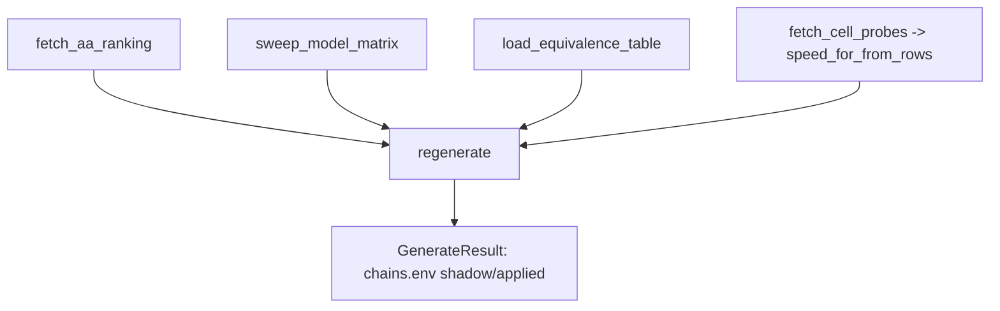

# Model-first chains — live gather + regenerate entrypoint

## Intent

Wire the model-first chains pipeline to live data: gather the Artificial Analysis
ranking, the live `(provider × model)` matrix, the equivalence table, and the
per-cell probe latency, then regenerate `chains.env` (slice 4). This is the
runnable entrypoint of the arc — exposed as a CLI command, shadow by default.
Slice 5 of the model-first chains arc; see
`docs/model_first_chains_architecture.md`.

## Context

The one slice that touches live I/O: it composes the pure pieces (slices 1–4)
over real gather functions (`fetch_aa_ranking`, `sweep_model_matrix`,
`load_equivalence_table`, `fetch_cell_probes`) and writes `chains.env` behind the
same apply flag the chainpilot uses. It deliberately runs **alongside** the
existing Chain Autopilot rather than repointing its armed loop: this slice adds
the model-first regeneration path; retiring/replacing the chainpilot's mechanical
edit cycle is a separate, operator-gated follow-up taken after the model-first
output is validated live (the chainpilot is armed on `main` — its loop is not
rewritten autonomously).

## Goals

- G1: `speed_for_from_rows` — reduce newest-first `CellProbeRow`s to a
  `(provider_id, model_id) -> latest latency_s | None` lookup.
- G2: `gather_and_regenerate` — fetch ranking + sweep matrix + load equivalences
  + read probes, then call `regenerate` (slice 4) on the current `chains.env`.
- G3: A `regenerate-chains` CLI command, shadow by default, armed by `--apply` /
  `FEROVA_CHAINPILOT_APPLY_ENABLED`, mirroring the `autopilot` command's surface.

## Non-Goals

- NG1: Does NOT modify or repoint the existing chainpilot autopilot loop
  (`run_autopilot_cycle`) — model-first runs as a parallel, additive path.
- NG2: No new persistence / audit table (the slice-4 `.bak` + logs suffice for v1).
- NG3: No new selection/expansion/render logic — all delegated to slices 1–4.

## Assumptions

- A1: `fetch_cell_probes` returns rows newest-first, so the first row seen for a
  cell is its latest probe.
- A2: `FEROVA_ARTIFICIAL_ANALYSIS_API_KEY` is configured (slice 1) for the live
  fetch; absent → `AaIngestError` surfaces.
- A3: The probe DB and `chains.env` paths resolve as for `autopilot`.

## Interface

```python
def speed_for_from_rows(
    rows: Sequence[CellProbeRow],
) -> Callable[[str, str], float | None]: ...

async def gather_and_regenerate(
    settings: Settings,
    *,
    client: httpx.AsyncClient,
    chains_path: Path,
    db_path: Path,
    enabled: bool,
) -> GenerateResult: ...
```

CLI:
```
ferova regenerate-chains [--apply] [--chains-path chains.env] [--db-path ...]
```

Inputs:
- `settings`, `client`, `chains_path`, `db_path`, `enabled`.

Outputs:
- `GenerateResult` (slice 4): the chains, whether written, whether changed.

Errors:
- `AaIngestError` (key/fetch), `GenerateError` (missing slot), `SelectError`
  (absent anchor) propagate — the regeneration fails loud.

## Behavior

### Nominal
1. `speed_for_from_rows`: walk rows once; the first latency seen per
   `(provider_id, model_id)` is the latest (newest-first input). Return a closure
   over that map.
2. `gather_and_regenerate`: `ranking = fetch_aa_ranking(settings)`;
   `matrix = await sweep_model_matrix(settings, client)`;
   `equivalences = load_equivalence_table()`;
   `speed_for = speed_for_from_rows(fetch_cell_probes(db_path))`;
   `regenerate(chains_path.read_text(), ranking, matrix, equivalences,
   speed_for=speed_for, chains_path=chains_path, enabled=enabled)`.
3. CLI: resolve `enabled = apply or settings.chainpilot_apply_enabled`, run the
   coroutine, echo `written/changed` and the per-tier entry counts.

### Edge cases
- No probe rows → every `speed_for` is `None`; ordering falls back to NIM-first
  then matrix order (EXPAND handles it).
- Shadow run (`enabled=False`) → `regenerate` computes and logs the diff but does
  not write (slice 4 gate).

### Failure scenarios
- AA key missing / fetch fails → `AaIngestError`; nothing written.
- A tier slot missing from `chains.env` → `GenerateError`; nothing written.

## Architecture Impact
- Adds dependency: SP-MFC-REGEN -> SP-MFC-AA-INGEST (`fetch_aa_ranking`).
- Adds dependency: SP-MFC-REGEN -> SP-MFC-GENERATE (`regenerate`, `GenerateResult`).
- Adds dependency: SP-MFC-REGEN -> SP-CHAINPILOT-MATRIX (`sweep_model_matrix`).
- Adds dependency: SP-MFC-REGEN -> SP-CHAINPILOT-EQUIVALENCES (`load_equivalence_table`).
- Adds dependency: SP-MFC-REGEN -> SP-CHAINPILOT-PROBE-SWEEP (`fetch_cell_probes`,
  `CellProbeRow`).
- New / changed coupling: the `regenerate-chains` CLI command is added to the
  frontier `cli/main.py` (a frontier importer, not an owned cross-edge). The
  chainpilot loop is untouched.

## Diagram


## Acceptance Criteria
- [ ] AC1: `speed_for_from_rows` returns the latest latency per cell (first of the
      newest-first rows) and `None` for an unseen cell.
- [ ] AC2: `gather_and_regenerate` composes the gather functions and returns the
      `regenerate` result; with `enabled=False` it does not write.
- [ ] AC3: `gather_and_regenerate` with `enabled=True` writes the regenerated
      `chains.env` (verified against a temp file with stubbed gather functions).
- [ ] AC4: the `regenerate-chains` CLI command exists and resolves `enabled` from
      `--apply` or `FEROVA_CHAINPILOT_APPLY_ENABLED`.

## Open Questions
- (none for this slice. Follow-up, operator-gated: repoint/retire the chainpilot
  mechanical edit loop onto model-first once validated live.)
