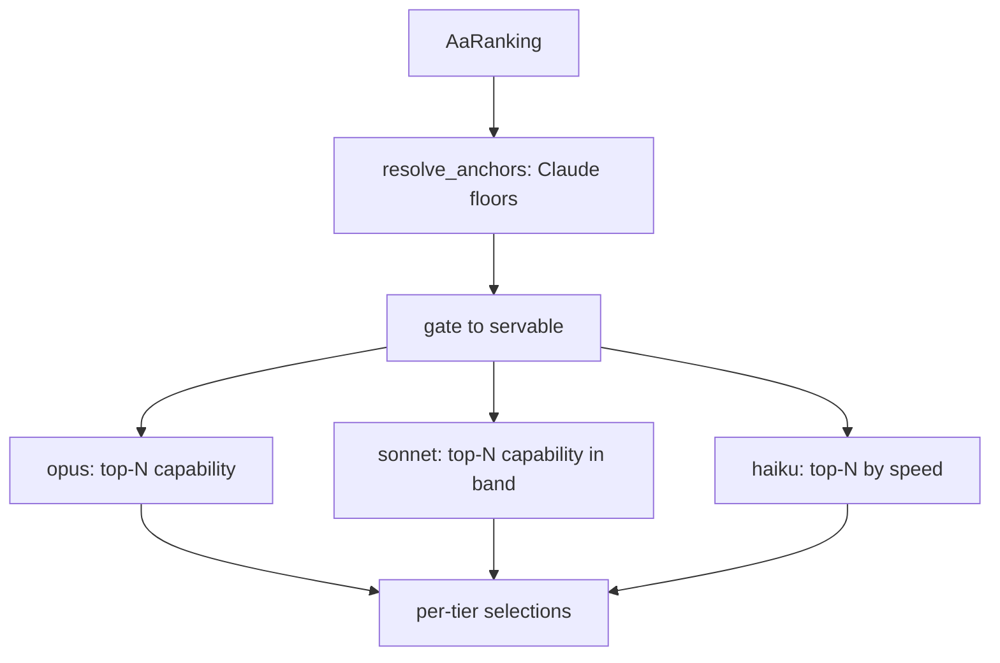

# Model-first tier selection — Claude-anchored eligibility + top-N

## Intent

Turn the collapsed capability ranking (slice 1) into the ordered per-tier model
lists that drive each chain — picking models by capability, anchored on the
Claude reference models, gated to what our providers can actually serve. Slice 2
of the model-first chains arc; see `docs/model_first_chains_architecture.md`.

## Context

A pure selection function. It consumes the `AaRanking` from `SP-MFC-AA-INGEST`
and a caller-supplied set of **servable** model names (the matrix ∩ AA join,
which lives downstream in `SP-MFC-EXPAND`/`SP-MFC-GENERATE`, kept out of this
leaf so selection stays pure and testable). Its output — per tier, an ordered
tuple of `ModelCapability` — is consumed by `SP-MFC-EXPAND`, which expands each
model to its providers. It does NOT touch the provider matrix, equivalences,
cell-probe, or `chains.env`.

## Goals

- G1: Resolve the three tier anchors (opus/sonnet/haiku) from the ranking by the
  Claude reference model names, using each model's collapsed `capability`.
- G2: Apply nested eligibility bands: a model is `<tier>`-eligible when its
  `capability ≥ anchor(<tier>) − margin`.
- G3: Select per tier with the tier-specific sort and depth: opus = top-N by
  capability; sonnet = top-N by capability in `[sonnet_floor, opus_floor)`;
  haiku = top-N by speed (`fastest_tps`) among haiku-eligible.
- G4: Gate every tier to **servable** models only (matrix-before-top-N), so an
  unservable global flagship never consumes a slot.

## Non-Goals

- NG1: No provider expansion / ordering / `claude_code` tail (that is EXPAND).
- NG2: No matrix or equivalence resolution — the servable set is an input.
- NG3: No HTTP, no `chains.env`, no persistence.
- NG4: Does not re-rank or re-score models; capability comes from slice 1.

## Assumptions

- A1: The ranking contains the three Claude anchor models (by configured name);
  a missing anchor is a hard error (cannot define the band).
- A2: `fastest_tps` may be `None` for some haiku-eligible models; those sort last
  (treated as slowest) but remain selectable if depth is not filled.
- A3: The servable set is keyed on the same normalized name as `AaRanking`.

## Interface

```python
DEFAULT_MARGIN = 5.0
DEFAULT_DEPTH = {"opus": 5, "sonnet": 4, "haiku": 3}
CLAUDE_ANCHORS = {"opus": "Claude Opus 4.7",
                  "sonnet": "Claude Sonnet 4.6",
                  "haiku": "Claude 4.5 Haiku"}

class TierAnchors(BaseModel):
    opus: float
    sonnet: float
    haiku: float

class SelectError(Exception): ...

def resolve_anchors(
    ranking: AaRanking, *, names: Mapping[str, str] = CLAUDE_ANCHORS,
) -> TierAnchors: ...

def select_models(
    ranking: AaRanking,
    *,
    servable: Container[str],          # normalized names ≥1 provider serves
    anchors: TierAnchors | None = None,
    margin: float = DEFAULT_MARGIN,
    depth: Mapping[str, int] = DEFAULT_DEPTH,
) -> dict[str, tuple[ModelCapability, ...]]: ...
```

Inputs:
- `ranking`: AaRanking — the collapsed capability ranking (slice 1).
- `servable`: Container[str] — normalized names ≥1 provider serves.
- `anchors`: optional pre-resolved anchors (else resolved from `ranking`).
- `margin`, `depth`: the pinned knobs (overridable).

Outputs:
- `dict[str, tuple[ModelCapability, ...]]` — `{"opus": (...), "sonnet": (...),
  "haiku": (...)}`, each ordered head→tail per the tier's sort, length ≤ depth.

Errors:
- `SelectError`: an anchor model is absent from the ranking.

## Behavior

### Nominal
1. `resolve_anchors`: look up each Claude anchor by normalized name; its
   `capability` is the tier anchor. Missing → `SelectError`.
2. Compute floors: `opus_floor = anchors.opus − margin`,
   `sonnet_floor = anchors.sonnet − margin`,
   `haiku_floor = anchors.haiku − margin`.
3. Restrict to servable models (`name in servable`).
4. opus: servable with `capability ≥ opus_floor`, sorted by capability desc,
   take `depth["opus"]`.
5. sonnet: servable with `sonnet_floor ≤ capability < opus_floor`, sorted by
   capability desc, take `depth["sonnet"]`.
6. haiku: servable with `capability ≥ haiku_floor`, sorted by `fastest_tps` desc
   (None last), take `depth["haiku"]`.

### Edge cases
- A tier with fewer eligible servable models than its depth → a shorter tuple
  (never padded; the `claude_code` tail in EXPAND remains the net).
- A model eligible for several bands → may appear in opus AND haiku (expected;
  matches today's `chains.env`). sonnet's half-open band keeps it distinct from opus.
- `fastest_tps is None` for every haiku candidate → ordering falls back to
  capability desc (deterministic), still bounded by depth.
- `margin = 0` → strict `≥ anchor`.

### Failure scenarios
- Anchor model name not present in the ranking → `SelectError` (no silent
  empty-tier; a broken anchor must be loud).

## Architecture Impact
- Adds dependency: SP-MFC-SELECT -> SP-MFC-AA-INGEST (consumes `AaRanking` /
  `ModelCapability`).
- New / changed coupling, cycles, or shared state: none. The servable set is an
  injected value, deliberately NOT an import of the matrix/equivalence modules,
  so this leaf introduces no edge to them.

## Diagram


## Acceptance Criteria
- [ ] AC1: `resolve_anchors` returns the three anchors' collapsed capability;
      a ranking missing an anchor raises `SelectError`.
- [ ] AC2: opus contains the top `depth["opus"]` servable models with
      `capability ≥ opus_floor`, ordered by capability desc.
- [ ] AC3: sonnet contains only servable models in `[sonnet_floor, opus_floor)`;
      no opus-band model leaks into sonnet.
- [ ] AC4: haiku is ordered by `fastest_tps` desc among servable haiku-eligible,
      `None` tps sorting last; bounded by `depth["haiku"]`.
- [ ] AC5: an unservable model above a floor is excluded from every tier.
- [ ] AC6: a tier with fewer eligible servable models than its depth returns a
      shorter tuple (no padding, no error).

## Open Questions
- (none — downstream join/expansion owned by EXPAND/GENERATE.)
