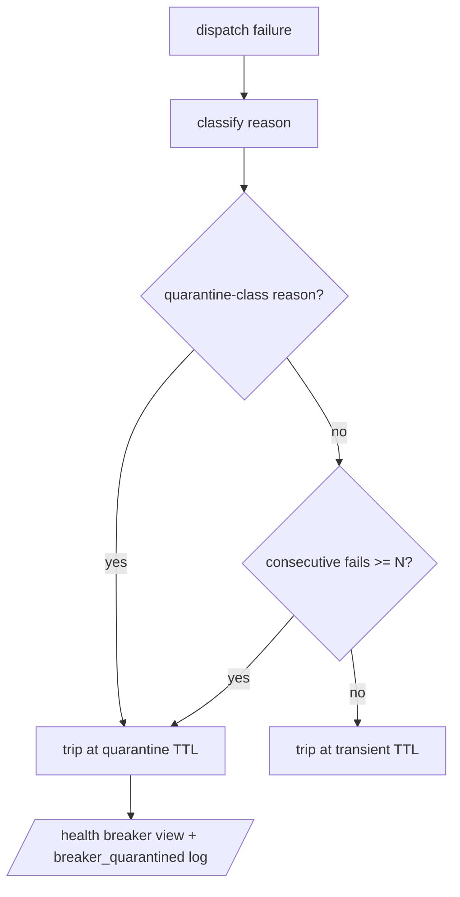

# Quarantine dead chain hops out of the runtime failover order

## Intent

A hop that is dead on every call must stop being re-tried on every
dispatch. Today the health breaker trips it for 120 s, the TTL lapses,
and the very next request pays the hop's full round-trip again —
forever. Quarantine escalates a persistently-dead hop to a long
cool-down so chain resolution skips it between ChainPilot cycles, and
makes the breaker's state observable.

## Context

Incident (2026-07-02 → 2026-07-04, proxy logs): the OpenRouter account
ran out of credits. Every call to the two `open_router` hops in the
sonnet/haiku chains returned HTTP 402. Over ~41 h the three proxy logs
accumulated ~97 `402` lines and 194 `proxy_chain_failover_fired`
events; `CHAIN_RESOLVED` kept listing the dead hops on every request;
reviewer dispatches stacked 402 round-trips plus 300 s NIM
read-timeouts up to **1432 s (~24 min)** and read as stuck sessions.

What already exists, and why it does not cover this:

- `routing/breaker.py` (SP-PROXY-HEALTH-BREAKER) — per-ref trip with a
  TTL; `api/model_router.py:85` filters down refs per request;
  `routing/chain.py:69` (`Chain.without`) guarantees a never-empty
  chain.
- SP-PROXY-BREAKER-REASON-TTL — reason-aware TTL, but
  `TERMINAL_REASONS` is deliberately `{"provider_410"}` only. A 402,
  401, 404, or a timeout gets `breaker_ttl_s` = 120 s, so a
  permanently-dead hop re-enters the chain every two minutes.
- The incident path never even reaches `_classify_failover_reason`:
  the OpenRouter transport converts upstream 4xx into in-stream error
  events (`_emit_error_events`, `stop_reason="error"`,
  `output_tokens=0` — see `tests/unit/test_proxy_402_failover.py`), so
  the dispatcher trips the breaker with reason `"empty_completion"`
  (`api/services.py:310`). Any fix keyed on the HTTP status alone
  misses the live failure mode; **counting consecutive failures per
  ref is the only signal that survives every transport**.
- ChainPilot eviction (SP-CHAINPILOT-*) is structural, capped, and
  runs on a 6 h cadence with `chainpilot_apply_enabled=False`
  (shadow). It cannot protect the requests between cycles.
- SP-PROXY-BREAKER-PROBE-SEED seeds tier HEADS from probe history at
  startup; mid-chain hops and mid-process deaths are out of its scope.

## Goals

- G1: A failover reason in the permanent-config class (`auth_failed`,
  `provider_401`, `provider_402`, `provider_403`, `provider_404`)
  trips the ref for a quarantine TTL on the FIRST occurrence.
- G2: N consecutive breaker trips of the same ref — any reason,
  including `empty_completion` and `timeout`, with no intervening
  recovery — escalate the trip to the quarantine TTL
  (default N = 3). The consecutive count survives TTL lapse and only
  resets on a successful completion (`recover`).
- G3: Quarantine state is observable: the proxy `/health` response
  lists each down ref with its reason, remaining cool-down, and
  consecutive-failure count; escalation emits a structured
  `breaker_quarantined` log event.
- G4: Recovery stays automatic: when the quarantine TTL lapses the ref
  re-enters the chain, the next live request probes it once, and a
  real completion clears the trip and the counter. A still-dead hop
  costs one failed attempt per quarantine window instead of one per
  120 s window.

## Non-Goals

- NG1: Arming ChainPilot apply mode. Structural eviction from
  `chains.env` stays ChainPilot's job behind
  `FEROVA_CHAINPILOT_APPLY_ENABLED` — an operator decision, bounded by
  SP-CHAINPILOT-MUTATION-CAP. Quarantine is the runtime bridge between
  its cycles, not a replacement.
- NG2: Per-request-class read-timeout profiles (the reviewer-class
  short-output timeout named in the original queue entry) — a separate
  spec candidate (SP-PROXY-TIMEOUT-PROFILE).
- NG3: Editing `chains.env` to drop the currently-dead `open_router`
  hops — config/operator action under SP-CHAINS-SINGLE-SOURCE.
- NG4: Cross-process or persistent breaker state. The breaker remains
  an in-process singleton; a proxy restart forgets quarantines
  (probe-seed partially rehydrates tier heads, as today).
- NG5: Changing `monitor-chains` probing (it probes NIM tier heads
  directly; operator inspects quarantine via `/health`).

## Assumptions

- A1: `BreakerState` stays clock-free (`time.monotonic` passed in) and
  free of I/O; escalation policy is pure and unit-testable.
- A2: `Chain.without`'s never-empty guard is unchanged — a fully
  quarantined chain still surfaces the head's real failure instead of
  looping on an empty chain.
- A3: `/health` is loopback-only (SP-PROXY-SECURE-DEFAULTS), so
  exposing model refs and breaker reasons there leaks nothing beyond
  the operator's own machine.

## Interface

`src/ferova/llm_proxy/routing/breaker.py`:

- `QUARANTINE_REASONS: frozenset[str]` — `{"auth_failed",
  "provider_401", "provider_402", "provider_403", "provider_404"}`.
  Account/config faults that stay dead until the operator acts (fund
  the account, rotate the key, fix the model id).
- `ttl_for_reason(reason, *, default_ttl_s, terminal_ttl_s,
  quarantine_ttl_s) -> float` — extended: terminal beats quarantine
  beats default.
- `escalated_ttl(consecutive_failures, *, base_ttl_s, quarantine_ttl_s,
  threshold) -> float` — pure: returns
  `max(base_ttl_s, quarantine_ttl_s)` when
  `consecutive_failures >= threshold`, else `base_ttl_s`.
- `BreakerState.trip(ref, *, now, ttl_s, reason) -> int` — records the
  reason, increments and returns the ref's consecutive-failure count.
  Still never shortens an existing trip.
- `BreakerState.recover(ref)` — clears the trip AND the counter.
- `BreakerState.snapshot(now) -> list[BreakerEntry]` — read-only view
  for `/health`: `(ref, reason, ttl_remaining_s,
  consecutive_failures)` for each currently-down ref.

`src/ferova/llm_proxy/config/settings.py`:

- `breaker_ttl_quarantine_s: float = 21_600.0` (6 h — one ChainPilot
  cadence; between the 120 s flap TTL and the 7-day terminal TTL),
  alias `BREAKER_TTL_QUARANTINE_S`.
- `breaker_quarantine_threshold: int = 3` (`ge=1`), alias
  `BREAKER_QUARANTINE_THRESHOLD`.

`src/ferova/llm_proxy/api/services.py` — `_trip_breaker` composes:
reason TTL via `ttl_for_reason`, then `escalated_ttl` with the count
returned by `trip`; emits `breaker_quarantined` (ref, reason, count,
ttl_s) when the applied TTL is the quarantine one.

`src/ferova/llm_proxy/api/routes.py` — `/health` response gains a
`breaker` array built from `BreakerState.snapshot`.

Errors: none new — all changes are policy inside existing paths.

## Behavior

### Nominal

A healthy hop: trips never accumulate (each success calls `recover`,
resetting the count). A flapping hop: isolated failures keep the 120 s
transient TTL exactly as today.

### Edge cases

- Third consecutive `empty_completion` on the same ref (the OpenRouter
  402-as-stream path) -> the trip TTL escalates to
  `breaker_ttl_quarantine_s`; `breaker_quarantined` logged; the ref
  vanishes from `CHAIN_RESOLVED` for 6 h.
- First `auth_failed` / `provider_402` raised as an exception -> the
  quarantine TTL applies immediately (no need for three strikes).
- Trip, TTL lapse, fail again -> the counter continues (2, then 3 →
  quarantine): "breaker-open beyond TTL renewals" is the escalation
  trigger, not wall-clock adjacency.
- Success between failures -> `recover` resets the counter; the next
  failure starts at 1.
- Every ref of a chain quarantined -> `Chain.without` falls back to
  the original head; the caller surfaces the real failure.
- `breaker_enabled=False` -> no counting, no quarantine (existing
  gate).
- `provider_410` -> terminal TTL still wins (it is longer).

### Failure scenarios

- Proxy restart -> quarantine state lost (in-process). Accepted: the
  first post-restart request per dead hop re-trips it, and three
  requests re-quarantine it; probe-seed still pre-trips degraded tier
  heads.
- Counter growth unbounded -> capped in practice by `recover` and by
  dict size (one int per configured ref).

## Architecture Impact

- No new cross-component edges: all changes live inside
  `src/ferova/llm_proxy/` (routing + api + config), the same ownership
  zone as SP-PROXY-HEALTH-BREAKER / SP-PROXY-BREAKER-REASON-TTL (both
  pre-template frontier specs).
- `/health` grows a read-only field — additive, no consumer parses it
  strictly today.
- ChainPilot interplay: quarantine handles minutes-to-hours; ChainPilot
  handles structural eviction on its 6 h cycle. No shared state — the
  breaker never writes `chains.env`.

## Diagram

## Suggested decomposition (Planner guidance)

Added 2026-07-08 after a planning session exhausted five attempts on
plan-form rules (integration selector placed under `tests/unit/`, or
integration test omitted, or the integration step missing unit
tests). The three-step shape below satisfies every rule by
construction; the Planner may refine details but should keep the
shape: every step promises unit selectors under `tests/unit/`, and
the LAST step also promises the integration selector under
`tests/integration/` (never under `tests/unit/`).

1. **Pure breaker policy** — `routing/breaker.py`:
   `QUARANTINE_REASONS`, `ttl_for_reason` extension, `escalated_ttl`,
   trip counter + `recover` + `snapshot`. Unit:
   `tests/unit/test_health_breaker.py::test_ttl_for_reason_quarantine_class`,
   `::test_consecutive_failures_escalate_to_quarantine`,
   `::test_recover_resets_counter`, `::test_snapshot_lists_down_refs`.
2. **Settings knobs** — `config/settings.py`:
   `breaker_ttl_quarantine_s`, `breaker_quarantine_threshold`
   (aliases + bounds). Unit:
   `tests/unit/test_health_breaker.py::test_quarantine_settings_defaults_and_aliases`.
3. **Wiring + observability** — `api/services.py` `_trip_breaker`
   composition + `breaker_quarantined` event; `api/routes.py`
   `/health` breaker array. Unit:
   `tests/unit/test_health_breaker.py::test_trip_breaker_composes_escalation`,
   `::test_health_reports_breaker_entries`. Integration (same step):
   `tests/integration/test_proxy_dead_hop_quarantine.py::test_dead_hop_quarantined_and_reported_on_health`.

## Acceptance Criteria

- [ ] AC1: `ttl_for_reason` returns the quarantine TTL for every
  member of `QUARANTINE_REASONS`, the terminal TTL for
  `provider_410`, and the default TTL for `timeout`,
  `empty_completion`, `rate_limited`, and an unknown reason —
  `test_ttl_for_reason_quarantine_class` in
  `tests/unit/test_health_breaker.py`.
- [ ] AC2: three consecutive `trip` calls on the same ref with reason
  `empty_completion` leave it `is_down` past
  `breaker_ttl_s + 1` (still down after the transient window) but
  recovered past `breaker_ttl_quarantine_s + 1`; two trips recover at
  the transient window —
  `test_consecutive_failures_escalate_to_quarantine`.
- [ ] AC3: `recover` between failures resets the count — a
  trip/trip/recover/trip sequence stays on the transient TTL —
  `test_recover_resets_consecutive_count`.
- [ ] AC4: the count survives TTL lapse — trip twice, advance past the
  transient TTL, trip once more: the third trip quarantines —
  `test_counter_survives_ttl_lapse`.
- [ ] AC5: dispatcher integration — a chain whose first hop yields
  three empty-completion streams across three requests stops listing
  that hop in the resolved chain of the fourth request, and a
  `breaker_quarantined` event was logged —
  `test_dead_hop_quarantined_after_three_empty_completions` in
  `tests/unit/test_proxy_dead_hop_quarantine.py` (new file).
- [ ] AC6: an exception-path failure classified `provider_402`
  quarantines on the first trip —
  `test_permanent_reason_quarantines_first_strike` in
  `tests/unit/test_proxy_dead_hop_quarantine.py`.
- [ ] AC7: `GET /health` lists each down ref with `reason`,
  `ttl_remaining_s`, `consecutive_failures`; empty array when nothing
  is down — `test_health_endpoint_reports_breaker_state`.
- [ ] AC8: `test_settings_sharp_prefix_aliases` covers
  `BREAKER_TTL_QUARANTINE_S` and `BREAKER_QUARANTINE_THRESHOLD`.
- [ ] AC9: existing suites stay green unchanged —
  `test_health_breaker.py`, `test_proxy_chain_failover.py`,
  `test_proxy_402_failover.py`, `test_proxy_410_auto_skip.py`,
  `test_proxy_breaker_probe_seed.py` (probe-seed's `trip` call sites
  updated for the new signature only).

## Open Questions

- Q1: none — TTL defaults (6 h / threshold 3) are operator-tunable via
  `.env` if the first live window proves them wrong.
