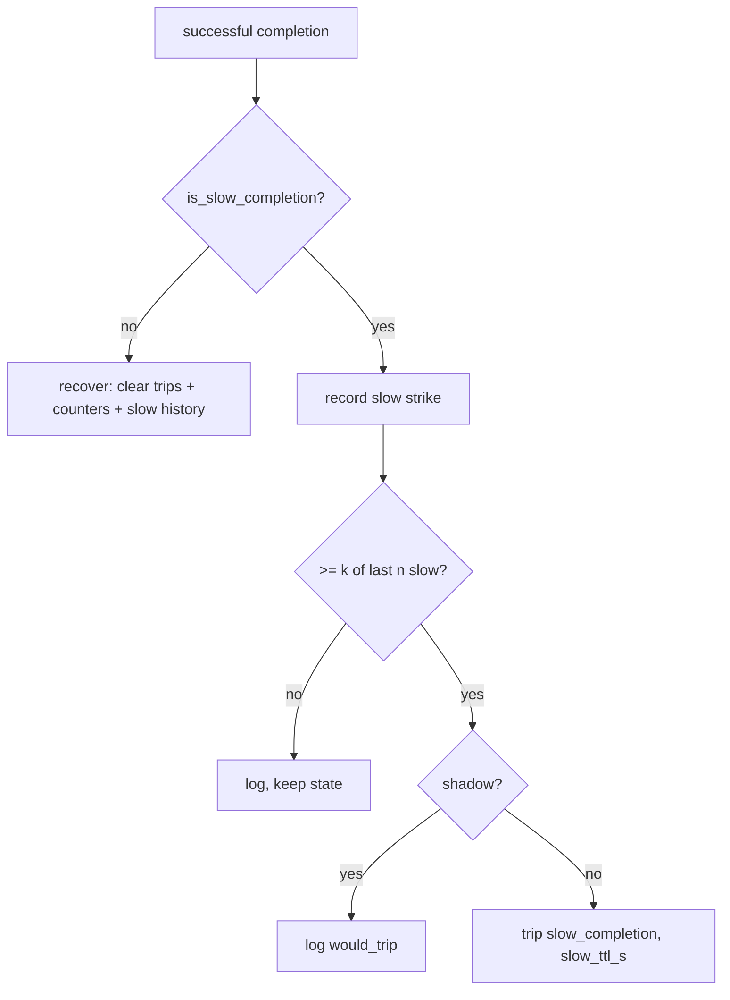

# Slow success is a strike — k-of-n slow-completion breaker policy (shadow-first)

## Intent

Close the breaker's blind spot to chronic slowness. During the
2026-07-10 flapping week, the sonnet head served 11–18 HTTP-200
completions per day at 12–15 s (max 30 s, `nim_health_probe`), and
every such slow success called `recover()` — un-tripping the breaker
and resuming full traffic at 12–15 s until the next hard failure.
Slowness with content never triggers failover and actively RESETS
containment. A completion that is both slow and thin (low
tokens-per-second) must count as a strike, not a recovery.

This deliberately diverges from the offline-probe doctrine
("slowness is not a fault",
`src/repoach/llm_proxy/providers/attribution.py:26`): offline probes
assess capability; live dispatch protects callers. The divergence is
documented in the touched module docstrings.

## Context

In `_stream_with_failover` (`src/repoach/llm_proxy/api/services.py`):
`attempt_started` at `:258`; on the peek-complete path
`attempt_latency_s` is computed at `:288` — a FULL-completion wall
clock, because `peek_for_content` drains the stream to
`message_stop` (`src/repoach/llm_proxy/api/_failover.py:238-255`) —
and `recover()` is called at `:291` when `peek.got_content`.
`peek_for_content` computes `final_output_tokens` as a local
(`_failover.py:234, 242-246`) but `PeekResult`
(`_failover.py:56-87`) does not carry it. The budget-retry success
path (`services.py:309-320`) yields content WITHOUT calling
`recover()` today. The breaker (`src/repoach/llm_proxy/routing/
breaker.py`) tracks `_consecutive_failures` whose escalation
(`escalated_ttl`, `breaker.py:93`; applied `services.py:205-213`)
must NOT be fed by slow strikes (panel finding: two timeouts + one
slow-but-served completion must not produce a 6-h quarantine).
Breaker settings live at
`src/repoach/llm_proxy/config/settings.py:263-271`.

## Goals

- G1: a pure, total policy decides "slow" from
  `(latency_s, output_tokens)` and two thresholds.
- G2: a slow success records a slow strike; `k` slow among the last
  `n` successful completions of a ref trips it with reason
  `slow_completion` for `slow_ttl_s` — a short, dedicated TTL that
  never escalates to the hard-quarantine TTL and never feeds
  `_consecutive_failures`.
- G3: a fast success keeps today's behavior: full `recover()`,
  clearing hard counters AND the slow history.
- G4: the budget-retry success path applies the same
  recover-or-strike policy as the primary success path.
- G5: shadow-first: with `breaker_slow_shadow=true` (default), the
  policy runs fully (history recorded) but never trips — when `k` is
  reached it logs `breaker_slow_strike_shadow` with `would_trip=True`
  instead; below-`k` slow strikes log `breaker_slow_strike` in BOTH
  modes. Flipping the setting to `false` enforces.

## Non-Goals

- NG1: no time-to-first-token instrumentation — the measured latency
  is full-completion by design (it IS the incident's 12–15 s
  signature).
- NG2: no latency-percentile baselines, no per-request-size dynamic
  thresholds — fixed gates, settings-overridable.
- NG3: no change to the offline probe/autopilot layer's slow
  semantics (`STATUS_SLOW` stays healthy there).
- NG4: no notification emission (wave 2).

## Assumptions

- A1: `attempt_latency_s` at `services.py:288` is in scope exactly
  where the recover-or-strike branch is inserted.
- A2: `usage.output_tokens` may be absent on some final deltas
  (e.g. tool_use flows) → `final_output_tokens` is `int | None`.

## Interface

New pure policy (module of the Developer's choice under
`src/repoach/llm_proxy/routing/`, exported next to the breaker):

- `is_slow_completion(latency_s: float, output_tokens: int | None, *, gate_s: float, tps_floor: float) -> bool`
  — `True` iff `latency_s > gate_s` AND `output_tokens` is not `None`
  AND `output_tokens / latency_s < tps_floor`. `output_tokens is
  None` → `False` (conservative: never strike blind).

`PeekResult` (`_failover.py`) gains
`final_output_tokens: int | None = None`, populated from the existing
local computation.

`BreakerState` gains per-ref slow-success history (last `n` boolean
outcomes) and:
- `record_success(ref, slow: bool, *, k: int, n: int) -> bool` —
  appends, returns `True` when the ref has ≥ `k` slow among its last
  `n` recorded successes. `recover()` (`breaker.py:154`) also clears
  the ref's slow history.

At the budget-retry success point the policy inputs are the RETRY's,
not the first attempt's: the hook recomputes the latency as
`time.monotonic() - attempt_started` (the caller-experienced
full-completion wall clock covering starved attempt + retry) and
reads `retry_peek.final_output_tokens` from the peek returned by
`_retry_with_more_budget` (`services.py:359-367`) — NEVER the `:288`
value (computed before the retry ran) nor the starved first peek's
tokens (0/`None` by definition of budget starvation,
`looks_budget_starved`, `_failover.py:277-281`).

Settings (`FEROVA_*` aliases):
- `breaker_slow_latency_gate_s: float = 10.0` (anchor: the probe
  layer's 8-s slow threshold + margin)
- `breaker_slow_tps_floor: float = 1.0`
- `breaker_slow_k: int = 3`, `breaker_slow_n: int = 5`
- `breaker_slow_ttl_s: float = 300.0`
- `breaker_slow_shadow: bool = True`

Errors: none — pure predicates and in-memory state.

## Behavior

### Nominal

At the primary success hook (`services.py:290-291`) and at the
budget-retry success point (`services.py:309-320`):

```
slow = is_slow_completion(attempt_latency_s, peek.final_output_tokens, ...)
should_trip = breaker.record_success(ref, slow, k=..., n=...)
if slow and should_trip:
    shadow ? log(breaker_slow_strike_shadow, would_trip=True)
           : trip(ref, reason="slow_completion", ttl=slow_ttl_s)   # no escalation path
elif not slow:
    breaker.recover(ref)                                           # today's behavior
else:
    log(breaker_slow_strike, strikes=…)                            # slow, below k: no recover, no trip
```

At the budget-retry point, `slow` is computed from the retry-covering
latency and the retry peek's tokens (see Interface) — the pseudocode's
`attempt_latency_s` / `peek` names bind to DIFFERENT objects there.

A `slow_completion` trip goes through a path that bypasses
`escalated_ttl` and does not increment `_consecutive_failures`
(reason-gated in `_trip_breaker` or a dedicated trip call — the
mechanism is the Developer's choice; the OBSERVABLE contract is AC4).

### Edge cases

- `output_tokens is None` → not slow; falls to the `not slow` branch
  (recover) — identical to today.
- A slow success below `k` strikes neither recovers nor trips: hard
  counters keep their current value (a slow success is no longer
  evidence of health).
- TTL lapse of a `slow_completion` trip → ref re-enters the chain
  with its slow history intact; the next fast success clears it.

### Failure scenarios

- Sustained slow head (the incident signature): after `k` of `n`
  slow completions, the head trips for `slow_ttl_s` per cycle —
  traffic shifts to the next hop instead of serving 12–15 s
  responses; the head re-probes every `slow_ttl_s`.
- Mass slow-trip during a provider brownout: chains fall through
  toward the `claude_code` tail — the shadow window (G5) exists
  precisely to size this risk before enforcement; the shadow log
  carries `ref`, `latency_s`, `output_tokens`, `would_trip`.

## Architecture Impact

- New / changed coupling, cycles, or shared state: none beyond the
  existing services→breaker edge; `PeekResult` gains one optional
  field (additive, default `None` — existing constructors
  unaffected).
- Governance posture: the new policy module under
  `src/repoach/llm_proxy/routing/` is deliberately left frontier
  (unowned) — `services.py` imports it, and owning it here would
  force a `depends_on` amendment on that file's owning spec for a
  pure policy helper; the edge-honesty gate does not police imports
  INTO frontier modules.

## Diagram



## Acceptance Criteria

- [ ] AC1: pure-policy unit tests: gate/floor boundary cases,
  `None` tokens → not slow; property: `is_slow_completion` never
  raises for any finite non-negative inputs.
- [ ] AC2: `BreakerState` unit tests with injected `now` floats
  (pattern: `tests/unit/test_health_breaker.py`): k-of-n windows,
  history cleared by `recover()`, history survives a `slow_completion`
  TTL lapse.
- [ ] AC3: integration via the `test_proxy_dead_hop_quarantine.py`
  pattern (stub `BaseProvider` subclasses = truthful boundary fakes;
  a slow stub sleeps > gate with `breaker_slow_latency_gate_s`
  shrunk): enforcing mode — k slow successes → `/health` breaker
  entry with reason `slow_completion` and the ref filtered from the
  next resolve; shadow mode — same traffic, NO `/health` entry, the
  `breaker_slow_strike_shadow` log event observed.
- [ ] AC4: regression (panel finding), run with
  `breaker_slow_shadow=false` and `breaker_slow_k=1`: two hard
  failures then one slow-but-served completion does NOT produce a
  quarantine-TTL trip — the ref's breaker entry is `slow_completion`
  with `ttl_remaining_s <= breaker_slow_ttl_s` (never
  `breaker_ttl_quarantine_s`).
- [ ] AC5: budget-retry success path (`breaker_slow_shadow=false`,
  `breaker_slow_k=1`), with a fixture whose STARVED FIRST ATTEMPT is
  fast and thin, two cases: (a) retry slow AND thin (below
  `tps_floor`) → strike recorded; (b) retry slow but fat (above
  `tps_floor`) → recover. An implementation reading the pre-retry
  `:288` latency fails (a); one reading the starved first peek's
  tokens fails (b). (Today this path neither strikes nor recovers —
  a behavior CHANGE, named in the PR description.)
- [ ] AC6: `PeekResult.final_output_tokens` populated on the nominal
  path and `None`-safe on a final delta without usage.
- [ ] AC7: `ruff` clean, no inline comments, full `pytest tests/unit`
  green; module docstrings state the live-vs-offline slowness
  divergence.

## Open Questions

(none)
