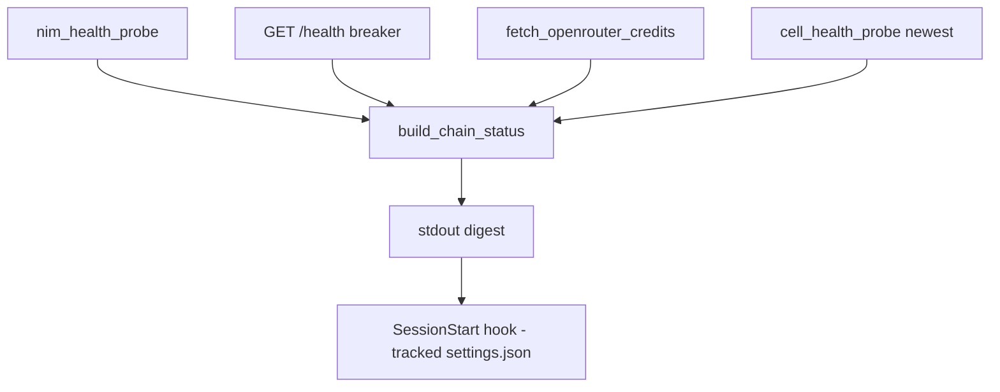

# ferova chain-status — the operator-visible chain digest, wired to session start

## Intent

Give the chain layer a surface the operator provably reads. The
2026-07-10 incident was a SURFACING failure: incident day alone
produced 130 `proxy_chain_failover_fired` warnings and
`nim_health_probe` carried the sonnet degradation every day for a
week — in logs and tables nothing exposed. This spec is wave 1's
alert terminus: one pull-based, stateless command that aggregates
what the system already knows, printed where the operator already
looks (the Claude session-start hook).

## Context

Readers this command composes (all existing except the credits
helper, which SP-CREDITS-CHECK delivers first — this spec must not
start before it merges):
- `fetch_probes(db_path, since=, tier=, limit=)`
  (`src/ferova/health/store.py:134-178`) over `nim_health_probe`;
  statuses ok/slow/empty/error/skipped
  (`src/ferova/health/model_health.py`). SLOW COUNTS AS BAD here —
  the probe layer's `is_degraded` excludes it, which is exactly how
  a week of 12–15 s responses stayed invisible.
- breaker snapshot over HTTP: `GET /health`
  (`src/ferova/llm_proxy/api/routes.py:150-173`) on the running
  proxy — the endpoint is deliberately unauthenticated (no
  `require_api_key` dependency on its route, unlike root at
  `routes.py:135`), so the digest sends no token.
- `cell_health_probe` freshness: newest `recorded_at` via
  `fetch_cell_probes` (`src/ferova/llm_proxy/providers/
  cell_probe_store.py:147`).
- credits snapshot: `fetch_openrouter_credits` (NEW —
  `src/ferova/health/credits.py`, lands with SP-CREDITS-CHECK),
  called DIRECTLY (not via `/health`) so a stopped proxy cannot kill
  the credits line.
- tier heads: `Settings.model_opus/sonnet/haiku` + `chain_head`
  (`src/ferova/review/chain_health.py:55-68`) — a non-`nvidia_nim`
  head is UNMONITORED by the 15-min probe
  (`STATUS_SKIPPED`, `chain_health.py:180-181`) and must be flagged.

The tracked SessionStart hook today runs `dream_check.py`
(`.claude/settings.json`); an untracked local hook runs
`monitor-chains | tail -6` (`.claude/settings.local.json`).

## Goals

- G1: `ferova chain-status` prints, per tier: head ref, last-`W`-hours
  probe mix with slow surfaced as bad (never folded into ok), and any
  breaker entries for refs of that tier's chain.
- G2: one summary block: cell freshness age, credits line,
  `tier unmonitored` warnings, proxy reachability.
- G3: the command is wired into the TRACKED `.claude/settings.json`
  SessionStart hooks so every Claude session opens on the digest —
  on every clone.
- G4: the command never fails the session: exit 0 always; every data
  source degrades to an explicit `unavailable` line, never a
  traceback.

## Non-Goals

- NG1: no gating (exit code carries no signal — this is a surface,
  not a gate).
- NG2: no push notification, no state, no dedup (wave 2).
- NG3: no edit of the untracked `.claude/settings.local.json`
  (retiring the redundant local `monitor-chains` hook is a one-line
  operator action, noted in the PR description).
- NG4: no new probes — the digest READS; `monitor-chains` keeps
  writing.

## Assumptions

- A1: the SQLite DB path resolves exactly as `monitor-chains`
  resolves it today (same settings source).
- A2: a stopped proxy is a normal state for the digest (e.g. fresh
  clone) — G4 covers it.

## Interface

Inputs:
- CLI: `ferova chain-status [--window-hours W] [--db-path P]
  [--proxy-url U]`. `--window-hours` defaults from
  `chain_status_window_h: float = 24.0` (hosted in the llm_proxy
  `Settings` with a `FEROVA_*` alias, matching SP-CREDITS-CHECK's
  knobs); `--db-path` mirrors monitor-chains' existing override
  (`cli/main.py:77-79`); `--proxy-url` defaults to
  `http://127.0.0.1:8082`. The two overrides exist because the core
  `get_settings()` is a process-cached singleton
  (`core/config.py:158-174`) — tests control both through argv, not
  through env mutation.

Structure (designed for truthful testing): the digest logic lives in
an async pure function in the new module —
`async build_chain_status(db_path, window_h, *, proxy_url, client: httpx.AsyncClient, settings) -> str`
(`src/ferova/cli/chain_status.py`) — with the CLI command a thin
argv-parsing wrapper calling `asyncio.run` (mirroring monitor-chains,
`cli/main.py:104-113`). The client is an `httpx.AsyncClient` because
the ONE injected client must serve both the `/health` GET and
`fetch_openrouter_credits`, whose SP-CREDITS-CHECK contract is async.
Tests inject `httpx.AsyncClient(transport=httpx.MockTransport(...))`
into the pure function directly; no monkeypatching of ferova code.
CLI-level tests pin `FEROVA_OPENROUTER_API_KEY=""` in the CliRunner
env (the llm_proxy `Settings` is constructed fresh per invocation,
`cli/main.py:102`, and an explicit env value beats the `.env` files)
so the wrapper can never fire a live credits GET; the credits-`None`
degradation case is driven through the pure function's injected
client.

Outputs (stdout, one block, stable line prefixes for greppability):
```
chain-status (24h window)
  opus    head=nvidia_nim/z-ai/glm-5.2            41% ok · 33% slow · 26% err  (n=96, avg slow 18.6s)
  sonnet  head=nvidia_nim/deepseek-ai/deepseek-v4-pro  94% ok · 4% slow · 2% err  (n=96, avg slow 9.1s)
  haiku   head=nvidia_nim/z-ai/glm-5.2            88% ok · 8% slow · 4% err   (n=96, avg slow 12.3s)
  breaker: sonnet nvidia_nim/minimaxai/minimax-m3 quarantined 4h12m (provider_400 x7)
  cells:   newest 3h ago
  credits: open_router remaining=1.4 floor=2.0 LOW
  proxy:   reachable
```
The `avg slow <x>s` figure (mean `latency_s` of the window's slow
probes; omitted when the window has none) carries the incident's
headline signature — 12–15 s responses — into the surface. The
`cells:` line renders age only (`newest <age> ago` /
`no probes recorded`); no fresh/stale qualifier, that judgment
belongs to SP-REGEN-FRESH-CELLS' guard.
- a tier with zero probes in the window → `no probes in window`.
- a non-NIM head → `head=<ref>  UNMONITORED (probe skips non-NIM heads)`.
- unreachable proxy → `proxy: unreachable (breaker state unknown)`;
  credits fetch failure → `credits: unavailable`; no API key
  configured → `credits: skipped (no key)`.

Errors: none escape the CLI (G4).

## Behavior

### Nominal

Aggregate `fetch_probes(since=now-W)` per tier into a percentage mix
rendered as three columns: ok, slow, err (`err = error + empty`);
slow is counted as bad, never folded into ok. Render heads from the
live Settings
chains; map `/health` breaker entries to tiers by matching each
entry's ref against the tier chains; render freshness, credits,
warnings; exit 0.

### Edge cases

- Percentages rendered from actual counts (`n=`) — no smoothing; a
  single probe renders `100% <status> (n=1)`.
- Rows with status `skipped` are EXCLUDED from the mix and from `n=`
  (monitor-chains persists the whole sweep unfiltered,
  `cli/main.py:115-117`, including `STATUS_SKIPPED` for non-NIM
  heads): percentages always sum over ok/slow/empty/error only; the
  live-Settings `UNMONITORED` flag is the surface for non-NIM heads.
- A breaker ref not present in any current chain renders under
  `breaker (unchained):` — state must never be silently dropped.

### Failure scenarios

- DB missing/empty → per-tier `no probes in window`, everything else
  still renders.
- any non-2xx or malformed `/health` response → the same
  `unreachable` degradation, with the HTTP status in the line
  (defensive rendering; the endpoint has no auth to fail).

## Architecture Impact

- Adds dependency: SP-CHAIN-STATUS-DIGEST -> SP-CREDITS-CHECK
  (credits line semantics), SP-CHAIN-STATUS-DIGEST ->
  SP-HEALTH-STORE-NEUTRALIZE (reads `nim_health_probe` via
  `fetch_probes`), SP-CHAIN-STATUS-DIGEST ->
  SP-CHAINPILOT-PROBE-SWEEP (reads `cell_health_probe` freshness via
  `fetch_cell_probes`).
- New / changed coupling: read-only composition of existing stores +
  two HTTP GETs (`/health`, credits); no new shared state. The new
  module is owned by this spec; `cli/main.py` (frontier) gains its
  import, which the edge-honesty gate does not police for frontier
  files.

## Diagram



## Acceptance Criteria

- [ ] AC1: pure-function tests — `build_chain_status` driven with a
  tmp-path SQLite seeded with a known mix (e.g. sonnet: 5 ok / 2 slow
  / 2 error / 1 empty → `50% ok · 20% slow · 30% err` with `n=10` and
  the seeded slow rows' mean as `avg slow` — exact rendering
  asserted) and an injected
  `httpx.AsyncClient(transport=httpx.MockTransport(...))` answering
  `/health` and credits (truthful boundary fakes; no monkeypatched
  ferova code). A thin `CliRunner` test covers argv parsing
  (`--window-hours`, `--db-path`, `--proxy-url`) and exit 0, with
  `FEROVA_OPENROUTER_API_KEY=""` pinned in the runner env.
- [ ] AC2: unmonitored-head warning — with `MODEL_SONNET` heading
  `open_router/...`, the sonnet line carries `UNMONITORED`.
- [ ] AC3: degradation matrix — proxy connection refused (via
  `--proxy-url` at an unbound localhost port), credits `None`, empty
  DB (via `--db-path` at a fresh tmp path): each renders its explicit
  `unavailable`/`no probes` line — exit code 0 for the CLI-driven
  cases; the credits-`None` case asserts the rendered line via the
  pure function. No traceback on stderr in any case.
- [ ] AC4: breaker mapping — a `/health` snapshot containing a
  quarantined sonnet-chain ref renders on the sonnet breaker line; a
  ref absent from every chain renders under `breaker (unchained):`.
- [ ] AC5: hook wiring integration — a repo-level test asserts the
  tracked `.claude/settings.json` SessionStart hooks include a
  command containing both `chain-status` and `|| true` (pattern: the
  repo-file assertions of `tests/unit/test_dream_check_hook.py:23-24`
  — resolve the repo root, `json.load` the settings, assert on the
  hook command), so a broken venv can never block a session.
- [ ] AC6: `ruff` clean, no inline comments, full `pytest tests/unit`
  green; ≤ 2 new files (`src/ferova/cli/chain_status.py` + test
  module), net new non-test code ≤ 220 LOC (the test module is
  excluded from the cap).

## Open Questions

(none)
