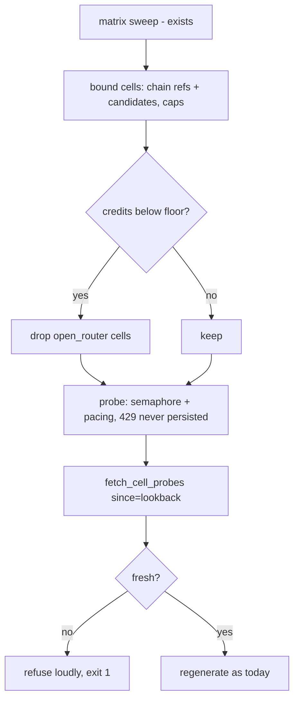

# Regenerate on fresh cells — bounded in-cycle sweep + freshness refusal

## Intent

Make the scheduled chain regeneration reason on live data, loudly
refusing to conclude otherwise. Root cause of the 2026-07-10
blindness: the 6-h timer runs `regenerate-chains`
(`deploy/systemd/ferova-chainpilot.service`), a pure READER of
`cell_health_probe`; the only writer (the cell sweep) lives in the
unscheduled `ferova autopilot` path. The table froze at 2026-06-30,
and `gather_and_regenerate` consumed 10-day-old latencies as current
— reporting `changed=False` throughout the incident.

## Context

`gather_and_regenerate`
(`src/ferova/llm_proxy/routing/chain_regen.py:65-114`) already runs
`sweep_model_matrix` (discovery; the `cells=501` journal figure) at
`:92` and calls `fetch_cell_probes(db_path)` with NO `since` window
at `:94`. The health sweep pieces exist: `sweep_cell_health`
(`src/ferova/llm_proxy/providers/cell_probe_sweep.py:73-85`, takes
the matrix as first argument) and `record_cell_probes`
(`src/ferova/llm_proxy/providers/cell_probe_store.py:107`); their
only chain-cycle caller is `src/ferova/review/chain_loop.py:212-214`
(`effort_sweep.py:116` also reuses `sweep_cell_health` once per
provider on filtered sub-matrices — exactly the mechanism this spec
sanctions).
`fetch_cell_probes` supports `since=` (`cell_probe_store.py:147`).
A FULL-matrix sweep is ~490 cells (~340 OpenRouter) of real
completions per cycle ≈ 1,360 paid requests/day — unacceptable from
the account whose credit exhaustion is this design's incident
context, and concurrent per-key probing 429s NIM (observed live).
The service unit already tolerates exit 1 (`SuccessExitStatus=0 1`).

## Goals

- G1: every scheduled regeneration cycle refreshes the cells it is
  about to read — inline in `gather_and_regenerate`, no new CLI, no
  new systemd unit.
- G2: the sweep is BOUNDED: only chain-relevant cells, per-provider
  caps, per-provider concurrency limit, inter-probe pacing; the
  planned cell count is logged before probing.
- G3: a 429 probe outcome is observer interference, not cell death —
  it is never persisted as cell health.
- G4: paid-provider (open_router) cells are skipped when the
  SP-CREDITS-CHECK snapshot reports `remaining < credits_floor_usd`.
- G5: the regeneration READ is windowed (`since=`) and REFUSES to
  conclude on stale data: newest fetched cell older than
  `max_cell_age_h` (or zero rows) → loud refusal, no chains
  conclusion, exit 1.

## Non-Goals

- NG1: no change to the `ferova autopilot` legacy path or its
  freshness gate (`chain_loop.py:225`).
- NG2: no change to any reader's scoring semantics
  (`speed_for_from_rows`, attribution) — G3 keeps 429s OUT of the
  table instead of teaching readers about them.
- NG3: no PR-proposal or apply-mode change (wave 3); shadow posture
  is untouched.
- NG4: no new probe table.

## Assumptions

- A1: the candidate models the regeneration will consider are
  computable BEFORE probing (they derive from the ranking + matrix
  already in scope in `gather_and_regenerate`).
- A2: `sweep_cell_health` can be invoked on a SUBSET of the matrix
  (a filtered matrix value is a legal argument); if its current
  signature resists subsetting, filtering the matrix passed to it is
  the sanctioned mechanism.

## Interface

Inputs (new Settings, `FEROVA_*` aliases):
- `regen_max_cell_age_h: float = 12.0` — staleness refusal threshold.
- `regen_sweep_per_provider_cap: int = 12` — max cells probed per
  provider per cycle; chain-ref cells take priority over candidate
  cells within the cap.
- `regen_sweep_per_provider_concurrency: int = 2` — semaphore per
  provider (NIM 429s under concurrent per-key load).
- `regen_sweep_pacing_s: float = 0.5` — inter-probe delay per
  provider lane.
- `regen_sweep_retry_backoff_s: float = 2.0` — backoff before the
  single 429 retry (tests pass `0.0` to stay fast).

Mechanism (named, so the Developer invents nothing):
- The bounded sweep lives INSIDE `chain_regen.py` (0 new source
  modules): call `sweep_cell_health` once per provider on the
  filtered sub-matrix — the `effort_sweep.py:116` pattern — with
  `max_concurrency=regen_sweep_per_provider_concurrency`;
  `sweep_cell_health` gains an optional `pacing_s` keyword
  (keyword-with-default, existing callers `chain_loop.py:213` and
  `effort_sweep.py:116` unaffected).
- 429 detection: a rate-limited probe surfaces as a `CellHealth` with
  `detail == "http=429"` (`cell_probe.py:227-230`) — no schema
  change; matching that detail is the sanctioned mechanism. If the
  type is referenced, import `CellHealth` via the `cell_probe_sweep`
  namespace (re-exported at `cell_probe_sweep.py:28`, covered by the
  declared SP-CHAINPILOT-PROBE-SWEEP edge) or duck-type on `.detail`
  — a direct `from ...providers.cell_probe import CellHealth` in
  `chain_regen.py` would fire the edge-honesty gate
  (SP-CHAINPILOT-PROBE-CELL is not in SP-MFC-REGEN's `depends_on`).
- Ranking seam: `gather_and_regenerate` gains an optional keyword
  `ranking: AaRanking | None = None` — when `None` it calls
  `fetch_aa_ranking` as today; tests pass a pre-built ranking
  (precedent: `chain_loop.run_autopilot_cycle` already takes
  `ranking` as an argument, `chain_loop.py:172,178`; the only
  production caller of `gather_and_regenerate` is `cli/main.py:269`).
- Refusal channel: `gather_and_regenerate` raises a dedicated
  `StaleCellsError` on the G5 condition; the `regenerate-chains`
  command catches it, prints the one-line reason and raises
  `typer.Exit(1)`.

Outputs:
- structlog events: `regen_sweep_planned` (`cells=`, `per_provider=`,
  `skipped_paid=`), `cell_probe_rate_limited` (`provider=`, `model=`)
  per dropped 429, `chain_regen_stale_cells` (`newest=`, `max_age_h=`)
  on refusal.
- CLI: refusal prints a one-line reason and exits 1
  (`SuccessExitStatus=0 1` absorbs it at the unit level).

Errors:
- refusal is an orderly exit path, not an exception escaping the CLI.

## Behavior

### Nominal

Inside `gather_and_regenerate`, after the matrix sweep (`:92`) and
before the cell read (`:94`):

```
relevant = cells(current chains.env refs) ∪ cells(candidate pool)
bounded  = per-provider cap applied, chain refs first
bounded -= open_router cells if credits.remaining < floor   (G4)
log regen_sweep_planned
probe bounded cells (per-provider semaphore + pacing)
persist outcomes EXCEPT 429s (G3: retry once after
  regen_sweep_retry_backoff_s; still 429 -> log
  cell_probe_rate_limited, do not record)
rows = fetch_cell_probes(db_path, since=now - max_cell_age)
if not rows or newest(rows) older than max_cell_age: refuse (G5)
else: proceed exactly as today
```

### Edge cases

- Credits snapshot unavailable (`None`) → do NOT skip paid cells
  (unknown ≠ exhausted), log it.
- A provider whose every probe 429s → zero fresh rows for its cells;
  its stale rows fall outside the `since` window; regeneration
  proceeds on the remaining providers' fresh rows (per-cell
  freshness is what `since=` gives; the G5 refusal triggers only
  when the WHOLE fetch is stale/empty).
- `regen_sweep_per_provider_cap=0` → sweep disabled for that run
  (operational escape hatch); G5 then refuses on stale data — the
  guard is belt-and-braces by construction.

### Failure scenarios

- Sweep raises mid-cycle (network down) → treat as zero fresh rows:
  the G5 guard refuses loudly; the cycle never concludes on the
  stale table (the exact 2026-07-10 silence, inverted).
- Sweep succeeds but regeneration still reports `changed=False` →
  legitimate: the conclusion is now grounded in fresh cells.

## Architecture Impact

- Adds dependency: SP-REGEN-FRESH-CELLS -> SP-CREDITS-CHECK
  (consumes the credits snapshot for the paid-cell skip) and
  SP-REGEN-FRESH-CELLS -> SP-CHAINPILOT-PROBE-SWEEP (imports the
  sweep pieces `cell_probe_sweep` / `cell_probe_store`).
- Adds ENFORCED edge (same PR): SP-MFC-REGEN -> SP-CREDITS-CHECK.
  `chain_regen.py` is owned by SP-MFC-REGEN and the edge-honesty gate
  resolves a changed file's imports through the FILE OWNER's
  `depends_on` (`src/ferova/lint/edge_honesty.py:140-158`) — so the
  credits import lands only if SP-MFC-REGEN declares it. This PR
  amends SP-MFC-REGEN's frontmatter accordingly (version bump). The
  sweep-pieces imports are already covered there
  (SP-CHAINPILOT-PROBE-SWEEP is in SP-MFC-REGEN's depends_on).
- New / changed coupling: all NEW cross-spec coupling lands inside
  `chain_regen.py` (owned by SP-MFC-REGEN); the other touched files
  (`cell_probe_sweep.py`, `settings.py`, `cli/main.py`) gain no new
  intra-repo imports. Deliberately 0 new source modules, so no
  ownership or frontier question arises; no cycle.

## Diagram



## Acceptance Criteria

- [ ] AC1: freshness refusal — `gather_and_regenerate` driven
  directly with an injected `client` carrying `httpx.MockTransport`
  and a pre-built `ranking=` (the Interface's two designed seams; no
  monkeypatched ferova functions), against a tmp-path SQLite whose
  rows are older than `max_cell_age_h` and a transport whose probes
  yield no fresh rows: raises `StaleCellsError`, logs
  `chain_regen_stale_cells`, writes no chains output even with apply
  enabled. A separate thin CLI test (style:
  `test_chain_regen.py:159-163`) asserts the
  `StaleCellsError` → one-line message + `typer.Exit(1)` wiring.
- [ ] AC2: bounding unit test — given a matrix of > cap cells per
  provider and a candidate pool, the planned set respects
  `per_provider_cap` with chain-ref cells present before candidate
  cells, and with P providers never exceeds
  P × `regen_sweep_per_provider_cap` cells (3-4 keyed providers →
  ≤ 36-48 probes/cycle, ≤ 192/day, vs ~1,360/day unbounded);
  `regen_sweep_planned` reports the exact count.
- [ ] AC3: 429 handling — a boundary fake returning 429 twice for
  one cell, with `regen_sweep_retry_backoff_s=0.0`: no row persisted
  for that cell, `cell_probe_rate_limited` logged once, other cells
  persisted normally.
- [ ] AC4: credits skip — snapshot below floor → zero open_router
  probes issued (assert at the transport layer), `skipped_paid`
  count logged; snapshot `None` → open_router cells probed.
- [ ] AC5: nominal path — `gather_and_regenerate` with fresh sweep
  results (injected client + ranking) concludes and reports,
  matching today's outputs on identical inputs (no behavior change
  to the conclusion itself).
- [ ] AC6: `ruff` clean, no inline comments, full `pytest tests/unit`
  green; net new non-test code ≤ 250 LOC, 0 new source modules
  (touched files: `chain_regen.py`, `cell_probe_sweep.py` [pacing
  keyword], `settings.py`, `cli/main.py` [exit mapping]).

## Open Questions

(none)
