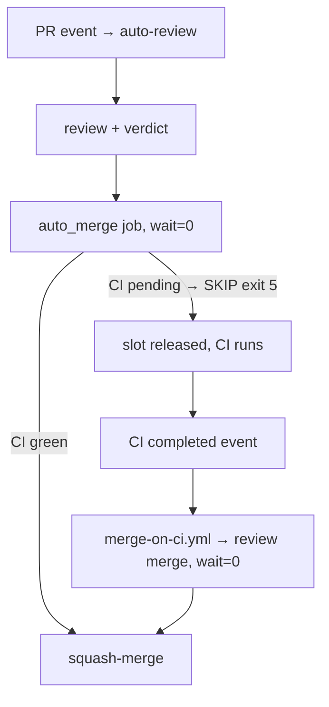

# Auto-merge never holds the runner slot — fail-fast CI gate + merge on CI completion

## Intent

On a single self-hosted runner (SP-CI-SELF-HOSTED), the auto-merge job
polling "wait for CI" is a self-deadlock: the job occupies the only
runner slot while the required check it waits for sits queued behind
it. Replace poll-while-holding-the-slot with fail-fast-and-release:
the in-job CI gate evaluates ONCE, skips non-fatally when checks are
still pending, and a `workflow_run`-triggered merge pass fires when CI
actually completes. Merging becomes event-driven; no merge job ever
polls for a check that needs the slot it is holding.

## Context

Incident (PR #79, run 29209292364, 2026-07-12, timeline from job
logs): "Test suite (Python 3.11)" held the runner 21:36→21:49; the
"Auto-merge to develop" job took the freed slot at 21:50 AHEAD of the
queued "Test suite (Python 3.13)" matrix leg; `ferova review merge 79`
then polled the rollup every 30 s for 720 s (auto_merge.py CI gate)
while 3.13 could never start — the poller itself held the slot it
needed to free. At 22:07 the gate concluded `SKIP_CI_TIMEOUT`; 3.13
ran 22:08→22:29 and PASSED. The PR stalled green-but-unmerged until a
manual rerun ~22 h later.

Three mechanisms are involved:

- **The in-CLI poll** — `src/ferova/review/auto_merge.py:101-102`
  (`_DEFAULT_WAIT_SECONDS = 12 * 60`, `_DEFAULT_POLL_INTERVAL = 30`)
  feeding `evaluate_ci_gate` (`auto_merge.py:226-332`),
  `required_checks_green` (`:340-341`), `evaluate_merge_gate`
  (`:584-585` — the gate behind `ferova review gate` and
  `safe_merge.sh`), and `run_auto_merge` (`:692-693`). The 12-minute
  internal wait is legacy SP-AUTOMERGE-CI-GATE behavior (referenced in
  an `auto-review.yml` comment and in `auto_merge.py` docstrings at
  lines 9, 39-40 and 239; no governed spec file exists — frontier).
  Polling is sound with concurrent runners and structurally wrong with
  one: any finite deadline just wastes the slot before skipping.
- **Two inert belt-and-suspenders wait steps** — "Wait for required CI
  checks to complete" in the `auto_fix` job (`auto-review.yml:376`)
  and the `auto_merge` job (`auto-review.yml:659`) count
  `gh pr checks --required` pending buckets. This private free-plan
  repo has NO server-side branch protection (SP-CI-SUPPLY-CHAIN-HARDEN
  H2), so no check is ever marked required, the count is always 0, and
  both loops exit on their first iteration ("finished (loop 1)" while
  3.13 was demonstrably queued). They protect nothing and mislead
  readers.
- **No completion event** — auto-review triggers on PR events and the
  merge step runs inside that same workflow run
  (`auto-review.yml:605-696`). When CI finishes AFTER the auto-review
  run died, no event re-fires the merge: PR #79's exact stall.

Execution is split in two lanes. Lane 1 (G1-G3) touches `src/` and
`tests/` and is factory-developable (`ferova develop`). Lane 2 (G4-G6)
touches `.github/workflows/*`, which is WHITELIST-FORBIDDEN for the
bots — OPERATOR-MANUAL, hand-implemented with human review, same
convention as SP-CI-SUPPLY-CHAIN-HARDEN.

Same-region coordination: G1 edits `Settings`
(`src/ferova/core/config.py`), which SP-CONFIG-ENV-ANCHOR (env-file
anchoring, fail-loud `Settings()`) and SP-CONSISTENCY-SWEEP C2 (two
other new fields) also edit. Land the three sequentially; AC1 below is
written to stay green whichever lands first (`_env_file=None`).

Known adjacent hole, out of scope here: `_SUCCESS_CONCLUSIONS`
(`auto_merge.py:96`) counts `SKIPPED` check conclusions as green, so a
required check whose job was skipped by an actor gate would satisfy
the CI gate at any wait budget — a pre-existing property, unchanged by
this spec (NG6), flagged as a follow-up spec candidate for the audit
stream.

## Goals

Lane 1 — factory-developable (src):

- G1: `Settings` (`src/ferova/core/config.py`) gains
  `automerge_ci_wait_seconds: int = Field(default=720, ge=0, ...)` and
  `automerge_ci_poll_interval: int = Field(default=30, ge=1, ...)`,
  env-tunable as `FEROVA_AUTOMERGE_CI_WAIT_SECONDS` /
  `FEROVA_AUTOMERGE_CI_POLL_INTERVAL` following the module's existing
  `Field` + `AliasChoices` pattern. (`.env.example` documentation of
  the two vars belongs to Lane 2 / G4 — `.env*` is whitelist-forbidden
  to the bots.)
- G2: the four functions that default wait/poll to the module
  constants — `evaluate_ci_gate` (`auto_merge.py:231-232`),
  `required_checks_green` (`:340-341`), `evaluate_merge_gate`
  (`:584-585`), `run_auto_merge` (`:692-693`) — source those defaults
  from settings at call time (`wait_seconds: int | None = None`
  sentinel pattern); an explicitly passed argument always wins.
  `decide_at_head` is deliberately untouched (it consumes an
  already-computed `ci_green`). The module constants
  `_DEFAULT_WAIT_SECONDS` / `_DEFAULT_POLL_INTERVAL` are retired into
  the settings defaults, and the docstrings that describe the
  12-minute window / SP-AUTOMERGE-CI-GATE polling contract
  (`auto_merge.py:9`, `:39-40`, `:239`) are updated to the
  settings-sourced contract so no doc drift is introduced.
- G3: `wait_seconds=0` is a defined fail-fast contract: exactly one
  rollup evaluation, zero `sleep` calls; still-pending required checks
  yield `SKIP_CI_TIMEOUT` with the pending names in the reason,
  exactly as a deadline expiry does today.

Lane 2 — OPERATOR-MANUAL (workflows):

- G4: the `auto_merge` job's `review merge` step sets
  `FEROVA_AUTOMERGE_CI_WAIT_SECONDS: "0"` in its env — with
  SP-MERGE-EXIT-CONTRACT in place the fast skip exits 5 and the job
  stays green. The operator also documents both
  `FEROVA_AUTOMERGE_CI_*` vars in `.env.example` with their defaults
  and the wait=0 fail-fast semantics (`.env*` is whitelist-forbidden
  to the bots, hence operator-manual).
- G5: both inert "Wait for required CI checks to complete" steps
  (`auto_fix`, `auto_merge`) are deleted, and the two stale
  permission-rationale comments that cite `gh pr checks --required`
  (`auto-review.yml:314`, `:627`) are reworded to the real remaining
  consumers of `checks: read` (the permission itself stays — the CI
  gate reads the check rollup via the API).
- G6: a new workflow `.github/workflows/merge-on-ci.yml` closes the
  event loop: `on: workflow_run: workflows: ["CI"], types:
  [completed]`. Its single job:
  - runs on `self-hosted` with
    `concurrency: merge-${{ github.event.workflow_run.head_branch }}`
    (`cancel-in-progress: false`) — the PR number is only known after
    in-job resolution, so the group keys on `head_branch`, which is
    per-PR in this repo's branch convention;
  - gates at job level, from the event payload alone, on:
    `workflow_run.conclusion == 'success'`,
    `workflow_run.event == 'pull_request'` (post-merge push runs on
    `develop`/`main` and `workflow_dispatch` runs never take the
    slot), same-repo head
    (`workflow_run.head_repository.full_name == github.repository`),
    and an actor allowlist that admits BOTH the owner and the fix-loop
    bot: `contains(fromJSON('["jwfaye", "github-actions[bot]"]'),
    github.event.workflow_run.actor.login)` — coder-pushed heads have
    their released CI runs actored by `github-actions[bot]`
    (SP-CI-FIX-LOOP-CLOSURE), and admitting them is safe because the
    merge decision is re-verified by the pure gate at head, never
    trusted from the event;
  - checks out and installs the package from the TRUSTED default
    branch ref only — never `workflow_run.head_sha` (a merge-capable
    token must not execute PR-authored code; same rationale as the
    base-ref install convention in `auto-review.yml:90-101`);
  - resolves the open, non-draft PR whose head SHA equals
    `workflow_run.head_sha` and whose base is `develop` (none →
    skip successfully with a log line);
  - locates the newest non-expired `findings-ledger-<N>` artifact via
    the artifacts API (absent → skip successfully — never run the
    gate against an empty ledger DB); downloads it to `FEROVA_DB_PATH`
    (SP-LEDGER-TRANSPORT convention);
  - runs `python -m ferova.cli.main review merge <N>` with
    `FEROVA_AUTOMERGE_CI_WAIT_SECONDS: "0"` (the trigger already
    guarantees CI completed at the resolved head; a mid-flight push
    fails fast and defers to that push's own CI-completion event),
    tolerating rc 0 and 5;
  - pins every action to a full commit SHA — the greppable invariant
    `grep -rn "uses:.*@v[0-9]" .github/workflows/` returns nothing
    extends SP-CI-SUPPLY-CHAIN-HARDEN AC1 to the new file.

Rollout ordering (Lane 2): `workflow_run` workflows fire only when the
workflow file exists on the DEFAULT branch (`main`), and `main` moves
only by manual develop→main release. Therefore: land `merge-on-ci.yml`
first and release develop→main; only THEN (or in the same release)
activate G4's wait=0 and G5's deletions — activating wait=0 while
`merge-on-ci.yml` is absent from `main` would stall every pending-CI
PR exactly like PR #79, silently.

## Non-Goals

- NG1: no second runner. Rejected alternative: it removes this one
  serialization but keeps poll-fragility (a 12-minute ceiling, burned
  slot time) and adds permanent load on the operator machine.
- NG2: no change to review/auto_fix job ordering, the verdict logic,
  or the pure merge gate itself.
- NG3: no server-side branch protection (impossible on this plan —
  SP-CI-SUPPLY-CHAIN-HARDEN H2 documents the compensating controls).
- NG4: the bots MUST NOT implement Lane 2 — `.github/workflows/*` is
  whitelist-forbidden; operator-manual only.
- NG5: no change to operator-local flows: with the env vars unset,
  `ferova review merge`, `ferova review gate`, and
  `scripts/safe_merge.sh` keep today's 720 s / 30 s defaults.
- NG6: no change to check-conclusion classification
  (`_SUCCESS_CONCLUSIONS` / `_FAIL_CONCLUSIONS` / `_PENDING_STATUSES`,
  `auto_merge.py:93-100`) — the SKIPPED-counts-as-green property
  predates this spec and is flagged in Context as a follow-up
  candidate, not silently altered here.

## Assumptions

- A1: the runner topology stays a single self-hosted runner. The
  design is correct under that constraint; on a multi-runner topology
  the fail-fast gate stays correct and the residual dual-merge race is
  handled as described in Edge cases.
- A2: `workflow_run` fires for the `CI` workflow (`ci.yml`, name
  `CI`) on completion — PROVIDED `merge-on-ci.yml` exists on the
  repository's default branch (`main`). Until the develop→main
  release that ships it, the event lane is inert (see Rollout
  ordering).
- A3: the `findings-ledger-<N>` artifact outlives the CI run that
  follows the review (default artifact retention ≫ the minutes-scale
  gap); if it expired, skipping and waiting for the next PR event is
  acceptable.
- A4: SP-MERGE-EXIT-CONTRACT is merged first (depends_on) — otherwise
  every fail-fast skip turns the auto_merge job red.

## Interface

Inputs:
- `FEROVA_AUTOMERGE_CI_WAIT_SECONDS`: `int ≥ 0` env — total CI-gate
  wait budget in seconds; `0` = single evaluation, fail fast.
- `FEROVA_AUTOMERGE_CI_POLL_INTERVAL`: `int ≥ 1` env — seconds
  between rollup polls when the budget allows waiting.
- `workflow_run` event payload — `head_sha`, `head_branch`,
  `head_repository.full_name`, `conclusion`, `event`, `actor.login`
  consumed by `merge-on-ci.yml`.

Outputs:
- unchanged `AutoMergeResult` vocabulary; `SKIP_CI_TIMEOUT` now also
  denotes the deliberate fail-fast skip (reason still names the
  pending checks).

Errors:
- none new — refusals stay outcome-encoded, exit-coded per
  SP-MERGE-EXIT-CONTRACT; negative/invalid env values are rejected by
  pydantic at `Settings` construction (G1 `ge` constraints).

## Behavior

### Nominal

1. Review approves; `auto_merge` job runs with wait 0: CI already
   green → merges immediately (today's fast path, minus up to 12
   minutes of slot-holding when it isn't).
2. CI still pending → one evaluation → `SKIP_CI_TIMEOUT`, exit 5, job
   green, slot released; the queued test job runs.
3. CI completes green → `merge-on-ci.yml` fires → resolves the PR,
   restores the ledger, `review merge` re-evaluates every gate at head
   and squash-merges.
4. Coder-fix path: the Coder pushes, the released CI rerun carries the
   `github-actions[bot]` actor (SP-CI-FIX-LOOP-CLOSURE), the in-run
   merge step fail-fasts while that CI is queued, and the bot-actored
   CI completion is admitted by G6's allowlist — the pure gate at
   head, not the event's actor, decides the merge.

### Edge cases

- CI completes red → `conclusion != 'success'` → merge pass never
  runs (and the gate would refuse anyway).
- Push to a branch with no open `develop`-based PR at that head →
  resolve step finds nothing → skip, log, exit 0.
- Both the in-run merge step and a `merge-on-ci.yml` pass reach a
  mergeable PR (CI finished during the auto-review run) → they are NOT
  in a shared concurrency group (different workflows); serialization
  comes from the single runner slot (A1), and correctness from
  `run_auto_merge` itself: the state gate yields `ALREADY_MERGED`
  (exit 0) and the pre-squash `ls-remote` re-read
  (SP-AUTOMERGE-FRESH-HEAD) yields `SKIP_STALE_HEAD` (exit 5). On a
  future multi-runner topology a truly simultaneous squash race can
  surface as one `FAILED` red job — accepted residual, named here so
  it is a known signature, not a mystery.
- Ledger artifact expired or review never produced one → skip with an
  explicit log line; the next PR event regenerates it. Never merge on
  an empty ledger.
- PR closed/merged between CI completion and the merge pass →
  `run_auto_merge` state gate skips (`ALREADY_MERGED` or state skip).
- Force-push lands between CI completion and the merge pass →
  `resolve_verified_head` converges on the NEW tip, the fail-fast gate
  sees its CI pending → `SKIP_CI_TIMEOUT`, exit 5; the new head's own
  CI completion re-fires the lane.

### Failure scenarios

- `merge-on-ci.yml` never fires (Actions outage, disabled workflow,
  not yet released to `main`) → behavior degrades exactly to today's:
  PR waits for the next PR event or a manual `safe_merge.sh`. No new
  failure mode.
- Settings misconfigured (negative wait, zero poll interval) →
  pydantic validation rejects at `Settings` construction (G1 `ge=0` /
  `ge=1`).

## Architecture Impact

- Adds dependency: SP-AUTOMERGE-EVENT-DRIVEN → SP-MERGE-EXIT-CONTRACT
  (the fail-fast skip is only viable because non-fatal skips exit 5;
  Lane 2's rc-tolerance consumes that contract).
- New / changed coupling: a second workflow now invokes `review merge`
  (event-driven path) — same CLI contract, no new module edges.
- Amends frontier behavior SP-AUTOMERGE-CI-GATE (the 12-minute
  internal wait): superseded by settings-sourced, workflow-pinned
  fail-fast; the docstrings citing it are updated by G2.

## Diagram

## Acceptance Criteria

Lane 1 — new tests in `tests/unit/test_automerge_fail_fast_gate.py`:

- [ ] AC1: `::test_settings_env_overrides_wait_and_poll` —
  `FEROVA_AUTOMERGE_CI_WAIT_SECONDS=0` /
  `FEROVA_AUTOMERGE_CI_POLL_INTERVAL=5` produce `Settings` fields 0/5;
  with those vars absent the fields are 720/30; a negative wait raises
  `ValidationError`. All `Settings` constructions pass
  `_env_file=None` so the test is immune to env-file anchoring changes
  (SP-CONFIG-ENV-ANCHOR).
- [ ] AC2: `::test_wait_zero_single_evaluation_no_sleep` —
  `evaluate_ci_gate` with `wait_seconds=0` against a boundary-faked
  `GhCli` whose rollup keeps one required check `QUEUED`: exactly one
  rollup read, the injected `sleep` recorder never called, outcome
  `SKIP_CI_TIMEOUT`, reason names the pending check.
- [ ] AC3 (integration — entry point):
  `::test_run_auto_merge_wait_zero_persists_fail_fast_skip` —
  `run_auto_merge` with `wait_seconds=0`, fake `GhCli` (pending
  required check), real sqlite `db_path`: persists a `pr_merges` row
  with outcome `SKIP_CI_TIMEOUT` and never calls the merge endpoint
  (the `tests/unit/test_review_auto_merge.py` fixture pattern).
- [ ] AC4: `::test_explicit_wait_argument_beats_settings` — settings
  say 0, caller passes `wait_seconds=60` → the deadline honors 60
  (observed via injected `monotonic`/`sleep`).
- [ ] AC5: `::test_gate_functions_source_defaults_from_settings` —
  with settings wait=0, `required_checks_green` and
  `evaluate_merge_gate` called WITHOUT wait/poll arguments fail fast
  (no sleep) — protecting NG5's promise that `ferova review gate`
  honors the same knobs.
- [ ] AC6: existing suites stay green — the `required_checks_green`
  tests in `tests/unit/test_review_auto_merge.py` pass explicit waits,
  and its `run_auto_merge` fixtures never produce a pending rollup
  (green/failed only), so the settings-sourced defaults (720/30,
  identical to the retired constants) change nothing.

Lane 2 — operator-verifiable checklist (hand-implemented):

- [ ] AC7: `grep -rn "Wait for required CI checks" .github/workflows/`
  and `grep -rn 'pending=$(gh pr checks' .github/workflows/` both
  return nothing; the permission-rationale comments at the former
  `auto-review.yml:314` / `:627` sites no longer cite
  `gh pr checks --required` while `checks: read` is retained.
- [ ] AC8: the `auto_merge` job's `review merge` step env contains
  `FEROVA_AUTOMERGE_CI_WAIT_SECONDS: "0"`, and `.env.example`
  documents `FEROVA_AUTOMERGE_CI_WAIT_SECONDS` and
  `FEROVA_AUTOMERGE_CI_POLL_INTERVAL` (defaults 720/30; 0 = single
  evaluation, fail fast).
- [ ] AC9: `.github/workflows/merge-on-ci.yml` exists and satisfies
  every G6 bullet: `workflow_run` trigger on `CI`/`completed`;
  payload-level gates (success conclusion, `event == 'pull_request'`,
  same-repo head, owner+bot actor allowlist); `head_branch`
  concurrency group without cancel-in-progress; trusted-ref checkout
  and install (never `head_sha`); open/non-draft/develop-based PR
  resolution by `head_sha`; ledger-artifact-or-skip; wait=0 env on the
  merge step; rc 0/5 tolerance;
  `grep -rn "uses:.*@v[0-9]" .github/workflows/` returns nothing.
- [ ] AC10 (operational, verifiable only AFTER the develop→main
  release that ships `merge-on-ci.yml`): the first factory PR whose CI
  is still pending at verdict time lands via the `merge-on-ci.yml`
  pass with zero red jobs across auto-review and merge-on-ci.

## Open Questions

None.
