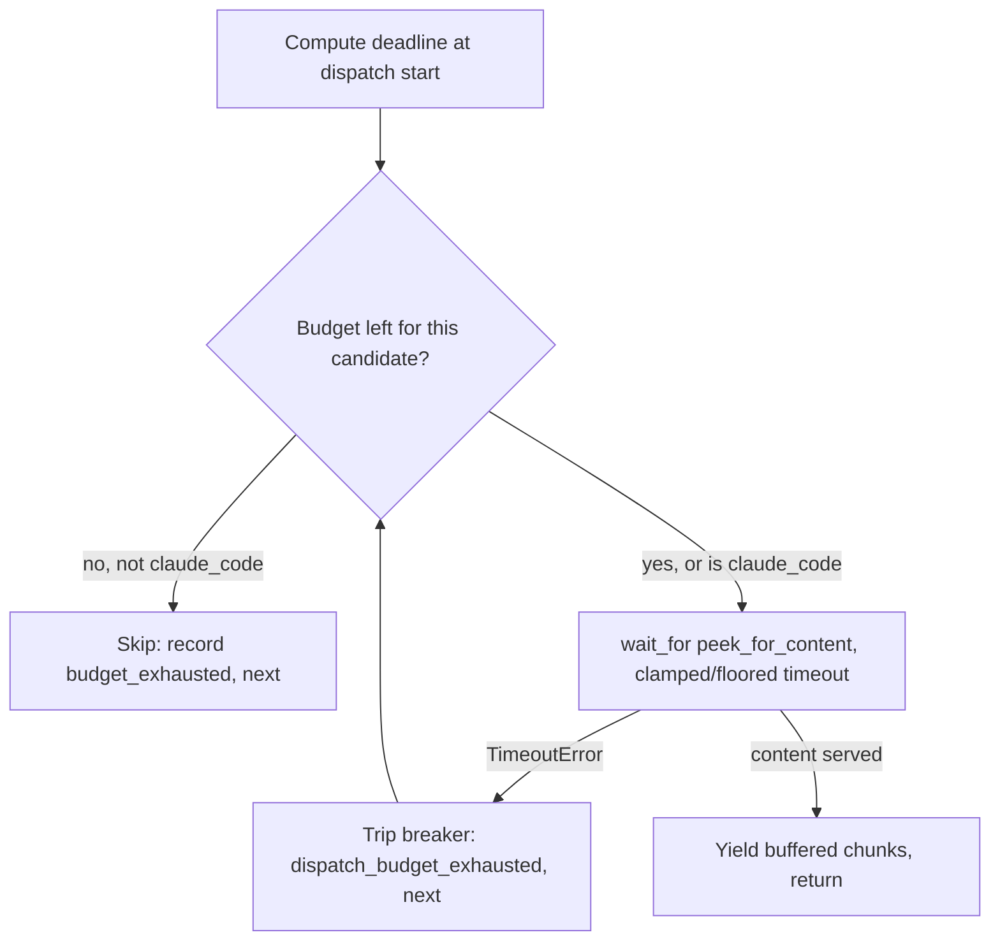

# Total request budget propagated across the failover chain

## Intent

A fully-exhausted `MODEL_OPUS` dispatch can cost up to 840s of wall
clock (two 120s native HTTP hops plus a 600s `claude_code` subprocess
backstop) before the caller sees anything, because no hop knows how
much time the WHOLE request has already spent. Give the dispatcher a
total per-request deadline that shrinks as each hop is tried, so a
caller either gets served or gets a loud, structured failure well
before 840s — without ever cutting the `claude_code` backstop below
the time a genuine cold-start/long-generation turn needs.

## Context

`ClaudeProxyService._stream_with_failover` (`src/repoach/llm_proxy/
api/services.py:274-513`) walks `chain: list[ResolvedModel]`
(`api/model_router.py:18-23`) sequentially: for each candidate it
calls `provider.stream_response(...)` and awaits `peek_for_content
(stream)` (`api/_failover.py:193`) to completion before it can even
consider the next candidate (`services.py:335-362`). There is no
outer clock — each hop is timed only by its own, independently
configured timeout:

- The two native transports (`providers/openai_compat.py:96-118`,
  used by `nvidia_nim`/`kimi`/etc.; `providers/anthropic_messages.py
  :42-51`, used by `open_router`) bake `httpx.Timeout(read=settings.
  http_read_timeout, ...)` into the client **once**, at provider
  construction time, wired from `Settings.http_read_timeout` (default
  `120.0`, `config/settings.py:350`) via `build_provider_config`
  (`providers/registry.py:114-130`). On a read timeout, BOTH
  transports catch the exception **internally** and emit an SSE
  `error` stop-reason instead of re-raising
  (`openai_compat.py:340-362`, `anthropic_messages.py:251-274`) — the
  failure surfaces to `services.py` as an ordinary `empty_completion`
  peek result, never as a raised exception.
- `claude_code` (`providers/claude_code/client.py`) wraps its
  subprocess in `asyncio.wait_for(proc.communicate(...), timeout=
  self._subprocess_timeout)` (`client.py:163-166`), wired from
  `Settings.claude_code_subprocess_timeout` (default `600.0`,
  `config/settings.py:257-260`) via `registry.py:44-52`. Unlike the
  native transports, a `claude_code` timeout **is** re-raised — as
  `ProviderError` (`client.py:241-248`) — and IS caught by
  `services.py`'s per-candidate `except Exception` branch
  (`services.py:343-362`).

`chains.env:88` confirms the shape for `MODEL_OPUS`:
`nvidia_nim/z-ai/glm-5.2,open_router/z-ai/glm-5.2,claude_code/opus` —
two native hops then the backstop, per the file's own ordering rule
#4, "Each chain ENDS with the corresponding Anthropic model"
(`chains.env:39`). Worst case: 120 + 120 + 600 = 840s. `claude_code`'s
own docstring already documents why its floor cannot shrink:
"cold starts + cache-creation on the first turn can exceed 2 min"
(`client.py:71-73`), and observed successful `claude_code` calls run
100-300s.

On a repeat dispatch within a TTL window the breaker already amortizes
this (`_trip_breaker`, `services.py:195-273`; `ttl_for_reason`,
`routing/breaker.py:90-120`) — a hop that failed with reason
`"timeout"` is neither in `TERMINAL_REASONS` (`breaker.py:39`) nor
`QUARANTINE_REASONS` (`breaker.py:49`), so it earns only the plain
`breaker_ttl_s` (120s default) cool-down unless three consecutive
failures escalate it via `escalated_ttl` (`breaker.py:123-148`). This
spec is about the COLD case — the first dispatch after a TTL lapse, or
a hop that fails a different way each time — where the breaker offers
no protection and the full 840s can still be paid.

## Goals

- G1: A configurable total wall-clock budget for one `/v1/messages`
  dispatch, enforced across the WHOLE chain walk (not per hop, not
  replacing any hop's own timeout).
- G2: The budget shrinks as it is spent; a candidate that would start
  after the budget is already gone is skipped without being dispatched
  at all.
- G3: `claude_code` is exempt from being starved by an already-spent
  budget: it always gets at least `claude_code_subprocess_timeout`
  seconds, regardless of how much the earlier hops consumed.
- G4: When the chain is exhausted purely because the budget ran out
  (not because every candidate genuinely failed within its own
  window), the caller gets a distinct, loud `504` carrying a per-hop
  breakdown (ref, reason, elapsed seconds) — not the generic `502` /
  re-raised exception used for ordinary exhaustion today.
- G5: The thinking-budget retry (`_retry_with_more_budget`,
  `services.py:515-578`) is also bound by the remaining deadline — it
  must not silently spend more wall clock than the dispatch has left.

## Non-Goals

- NG1: No change to any provider transport's own timeout construction.
  `openai_compat.py`'s and `anthropic_messages.py`'s per-hop
  `httpx.Timeout`, and `claude_code/client.py`'s subprocess
  `asyncio.wait_for`, stay exactly as configured; the new budget is an
  OUTER ceiling wrapped around the existing per-candidate attempt in
  `services.py`, never a parameter threaded into the transports.
- NG2: No change to the agent-side client timeout
  (`agent_engine/agent_loop.py`'s `LONG_OUTPUT_TIMEOUT_S = 2100.0`,
  `agent_loop.py:83`, or `agent_engine/adapters.py`'s
  `ProxyGatewayClient`) — that leg is SP-ADAPTER-TIMEOUT-RETRY's
  concern (see Architecture Impact).
- NG3: No change to `routing/breaker.py`'s reason-TTL tables. The new
  failure reason introduced here falls through the existing default
  branch of `ttl_for_reason` unchanged.
- NG4: No explicit subprocess-kill / socket-abort logic beyond what
  `asyncio.wait_for`'s own cancellation already delivers when it times
  out a suspended attempt.
- NG5: No change to `/health` or the chain-status digest — the
  breakdown is only carried in the 504 response body for that one
  request.

## Assumptions

- A1: A native transport's own read timeout never raises out of
  `stream_response()` — it is swallowed into an SSE `error` event
  (`openai_compat.py:340-362`, `anthropic_messages.py:251-274`), so
  the only way a bare `TimeoutError` can reach `services.py`'s
  per-candidate `try/except` today is `claude_code`'s own internal
  timeout (re-raised as `ProviderError`, not `TimeoutError` —
  `client.py:248`). After this spec, `asyncio.wait_for`'s own
  cancellation is the only source of a bare `TimeoutError` at that
  call site, which is what lets the new code distinguish "the total
  budget ran out" from every other failure reason without touching
  the transports.
- A2: `asyncio.CancelledError` is `BaseException`-rooted (Python
  3.8+), so `anthropic_messages.py`'s `except Exception` (line 251)
  never swallows a cancellation delivered by an outer
  `asyncio.wait_for` timeout, and `openai_compat.py`'s explicit
  `except (asyncio.CancelledError, GeneratorExit): raise` (line 340)
  re-raises it unmodified either way — both transports let an outer
  cancellation propagate cleanly.
- A3: The repo targets Python 3.11+ (`CLAUDE.md`), where
  `asyncio.TimeoutError` is the builtin `TimeoutError`; `except
  TimeoutError` in `services.py` catches exactly what `asyncio.
  wait_for` raises on expiry.
- A4: `chains.env`'s "ends with `claude_code`" rule (`chains.env:39`)
  is a documentation convention, not a runtime guarantee — `skip_
  models` filtering in `resolve_chain` (`model_router.py:129-175`)
  could in principle drop or reorder it. The `claude_code` floor
  therefore keys off `candidate.provider_id == "claude_code"`
  wherever it appears in `chain`, never off chain position.
- A5: `900.0`s (the new default budget) stays below `agent_engine`'s
  `LONG_OUTPUT_TIMEOUT_S` (`2100.0`s, `agent_loop.py:83`), so the
  proxy's own deadline always fires before the agent-side HTTP client
  would have aborted anyway — this spec's 504 is the caller's first
  signal, not a race against a second, shorter timeout upstream.

## Interface

Inputs:
- `Settings.dispatch_total_budget_s`: `float`, default `900.0`,
  env `REPOACH_DISPATCH_TOTAL_BUDGET_S` / `DISPATCH_TOTAL_BUDGET_S`
  (`_aliases`, `config/settings.py:163-190`) — the wall-clock budget
  for one `_stream_with_failover` call. `900.0` = 120 + 120 (both
  native hops genuinely hang to their read timeout) + 600
  (`claude_code_subprocess_timeout` floor) + 60s headroom for
  scheduling/SSE-peek overhead. Do not configure it below ~660s (600s
  `claude_code` floor + one native hop's worth of margin) or a
  legitimately slow-but-successful `claude_code` cold start risks
  truncation on a chain where an earlier hop already spent budget.
  Adding the field requires a matching entry in `settings.py`'s
  `_LEGACY_TO_REPOACH_ALIAS` dict (`config/settings.py:107-onwards`)
  — `_aliases()` looks the legacy key up there and raises `KeyError`
  if it is missing — and a matching one-line addition to the existing
  `_LEGACY_TO_FIELD` dict in `tests/unit/
  test_settings_sharp_prefix_aliases.py:29-85`, or that file's own
  `test_alias_map_covers_every_field_with_proxy_alias` (line 128)
  fails.

Outputs (unchanged shape, new failure mode):
- The existing Anthropic-format SSE stream on success — no change to
  successful-response shape.
- On pure budget exhaustion, `HTTPException(status_code=504, detail=
  {...})` where `detail` is a dict: `error` (literal string
  `"dispatch_budget_exhausted"`), `dispatch_id` (str), `budget_s`
  (float, the configured budget), `hops` (list of `{"provider_model_
  ref": str, "reason": str, "elapsed_s": float}`, one entry per
  candidate attempted or skipped, in chain order).

Errors:
- `HTTPException` (`504`): raised by `_stream_with_failover` in place
  of the existing `502`/re-raised-`last_error` exhaustion path
  (`services.py:504-513`) exactly when the chain was exhausted because
  the budget ran out (a pre-dispatch skip or an `asyncio.wait_for`
  timeout occurred for at least one candidate) — never when every
  candidate failed for an ordinary reason within its own window, which
  keeps the existing `502`/re-raise behavior for that case unchanged.

## Behavior

### Nominal

`_stream_with_failover` computes `deadline = time.monotonic() +
settings.dispatch_total_budget_s` once, immediately after constructing
`dispatch_id` (`services.py:308`). Before each candidate (after the
existing breaker `is_down` skip, `services.py:313-320`):

```
remaining = deadline - time.monotonic()
if candidate.provider_id == "claude_code":
    effective_timeout = max(remaining, settings.claude_code_subprocess_timeout)
elif remaining <= 0:
    record a "dispatch_budget_exhausted_before_dispatch" skip (elapsed_s=0.0),
    mark budget_exhausted, continue to the next candidate
else:
    effective_timeout = remaining
```

The existing `stream = provider.stream_response(...)` call is
unchanged; the existing `peek = await peek_for_content(stream)` await
is wrapped: `peek = await asyncio.wait_for(peek_for_content(stream),
timeout=effective_timeout)`. A candidate that finishes well inside
`effective_timeout` (the common case — `chains.env`'s own commentary,
lines 61-71, documents dead hops failing in ~9s, not by hanging to
their read timeout) behaves exactly as today: `wait_for` never
intervenes.

`_retry_with_more_budget` (`services.py:515-578`) gains a `deadline:
float` parameter (threaded from the one call site,
`services.py:423-430`). Before issuing the retry it recomputes
`remaining = deadline - time.monotonic()`; if `remaining <= 0` it
returns `None` immediately (no retry dispatched); otherwise its own
`peek_for_content` await is wrapped the same way, clamped to
`remaining`.

### Edge cases

- A candidate's own attempt is running when the budget passes zero
  mid-flight: `asyncio.wait_for` cancels the suspended `peek_for_
  content(stream)` coroutine, which raises `TimeoutError` at the call
  site. `_stream_with_failover` catches it in a dedicated `except
  TimeoutError` branch (ahead of the existing `except Exception`),
  records reason `"dispatch_budget_exhausted"` with the actual elapsed
  seconds, calls the existing `_trip_breaker(candidate, "dispatch_
  budget_exhausted", chain=chain)` (same mechanism as every other
  reason; falls through `ttl_for_reason`'s default branch since the
  new reason is in neither `TERMINAL_REASONS` nor `QUARANTINE_
  REASONS`), marks `budget_exhausted = True`, and continues to the
  next candidate.
- Budget already gone when a non-`claude_code` candidate is reached:
  it is skipped WITHOUT calling `provider.stream_response` at all —
  `_trip_breaker` is NOT called for this case (the candidate was never
  attempted, so nothing about its own health is known); only the
  breakdown record and `budget_exhausted` flag are set.
- `claude_code` reached with `remaining` already negative: `max(
  remaining, claude_code_subprocess_timeout)` always evaluates to at
  least the floor, so it is dispatched with its full configured
  subprocess timeout regardless of how far over budget the earlier
  hops ran.
- A budget-starved completion's retry (`_retry_with_more_budget`)
  would be the thing that pushes total elapsed past the deadline: the
  retry is skipped (returns `None`) instead of being issued, and the
  candidate falls through to the existing "still starved, fail over"
  path.

### Failure scenarios

- Every candidate either times out via the new `TimeoutError` path or
  is skipped pre-dispatch (`budget_exhausted is True` at the end of
  the loop): raise `HTTPException(504, detail={...})` with the full
  per-hop breakdown, in place of the existing `raise last_error` /
  `HTTPException(502, ...)` (`services.py:504-513`).
- A mix of ordinary failures (real transport error, empty completion)
  and at least one budget-caused skip/timeout: `budget_exhausted` is
  still `True`, so the `504` breakdown path fires — the breakdown
  lists every hop's actual reason (`"transport_error"`,
  `"empty_completion"`, `"dispatch_budget_exhausted"`, or `"dispatch_
  budget_exhausted_before_dispatch"`) so the caller can tell which
  hops genuinely failed versus which were never reached.
- Every candidate fails for an ordinary reason and the budget was
  never the cause (`budget_exhausted` stays `False`): the existing
  `502` / re-raised-`last_error` behavior is preserved byte-for-byte.

## Architecture Impact

- Depends on: `SP-CHAIN-REQUEST-BUDGET` -> `SP-BUDGET-RETRY-FIXES`
  (this spec restructures `_stream_with_failover` and `_retry_with_
  more_budget` inside `api/services.py`, which `SP-BUDGET-RETRY-FIXES`
  already owns per its own frontmatter — "`services.py` moves from
  the frontier into this spec's `owns.code`". This spec does not
  re-claim `services.py`; it depends on the owning spec instead, per
  the disjoint-ownership rule.
- `config/settings.py` stays frontier (unowned) here too: it is
  imported by essentially every module in `llm_proxy`, and every
  template-era spec that has touched it so far (`SP-CONFIG-ENV-
  ANCHOR`, `SP-CC-SYSPROMPT-FILE`, `SP-BREAKER-LIVE-REASONS`,
  `SP-CHAIN-DEAD-HOP-QUARANTINE`, `SP-BREAKER-SLOW-STRIKE`,
  `SP-BREAKER-PROVIDER-SCOPE`, among others) has likewise left it
  `owns.code: []`. Claiming it here would retroactively require a
  `depends_on` amendment on every one of those already-approved specs
  — the edge-honesty gate does not police imports into frontier
  modules, so leaving it frontier is the deliberate, consistent
  choice.
- `routing/breaker.py` is read (via the existing `_trip_breaker` /
  `ttl_for_reason` call path) but not modified; it is currently owned
  by `SP-PROXY-STATE-PERSIST` — no edge is added because no line of
  that file changes.
- Sequencing note vs `SP-ADAPTER-TIMEOUT-RETRY`
  (`docs/specs/2026-07-13_SP-ADAPTER-TIMEOUT-RETRY_timeout-family-
  becomes-retryable.md`): that spec broadens which exceptions on the
  agent -> proxy leg (`agent_engine/adapters.py:165-174`) are treated
  as the retryable `GatewayTransportError`. It is a DIFFERENT hop
  (agent -> proxy) from the one this spec covers (proxy -> upstream);
  `ProxyGatewayClient.call` already classifies any `resp.status_code
  >= 500` as retryable (`adapters.py`), so the new `504` this spec
  introduces is retried by the agent side with no further change
  needed there. No hard ordering dependency either direction; if both
  are queued together, landing `SP-ADAPTER-TIMEOUT-RETRY` first only
  makes this spec's caller-side retry story easier to reason about,
  never a blocker.
- New / changed coupling, cycles, or shared state: none. `_trip_
  breaker` is called with one new reason string; no new table, topic,
  or format.

## Diagram



## Acceptance Criteria

- [ ] AC1: `tests/unit/test_proxy_dispatch_total_budget.py::test_settings_dispatch_total_budget_s_default_is_900`
  — `Settings().dispatch_total_budget_s == 900.0`. Fails today
  (`AttributeError`: no such field); passes once the field and its
  `_LEGACY_TO_REPOACH_ALIAS` entry are added.
- [ ] AC2: `tests/unit/test_proxy_dispatch_total_budget.py::test_remaining_budget_preempts_a_hop_that_would_outlive_the_deadline`
  — a two-candidate chain where the first candidate's `stream_
  response` sleeps well past a tiny configured budget before ever
  yielding; asserts the second candidate serves real content and the
  total wall-clock elapsed stays tightly bounded (well under the
  first candidate's sleep duration). Fails today (no budget field, no
  outer `wait_for` — the dispatcher genuinely waits out the first
  candidate's full sleep, blowing the elapsed-time bound).
- [ ] AC3: `tests/unit/test_proxy_dispatch_total_budget.py::test_exhausted_budget_skips_remaining_non_backstop_candidates`
  — three non-`claude_code` candidates; the first spends the whole
  (tiny) budget; asserts the second and third candidates' `stream_
  response` are never invoked (call counters stay at `0`). Fails
  today: every candidate is always dispatched regardless of elapsed
  time.
- [ ] AC4: `tests/unit/test_proxy_dispatch_total_budget.py::test_claude_code_backstop_is_never_starved_by_an_exhausted_budget`
  — budget already exhausted by an earlier hop; the `claude_code`
  candidate still gets invoked and its real content is served, because
  its `effective_timeout` is floored at `claude_code_subprocess_
  timeout` rather than clamped to the (already negative) remaining
  budget. Fails on a naive implementation that clamps every hop
  uniformly (the candidate would be skipped or cut off before it can
  finish), and fails today because the mechanism does not exist at
  all.
- [ ] AC5: `tests/unit/test_proxy_dispatch_total_budget.py::test_pure_budget_exhaustion_raises_504_with_per_hop_breakdown`
  — every candidate is exhausted purely by the budget (no
  `claude_code` in this chain); asserts `pytest.raises(HTTPException)`
  with `.value.status_code == 504` and `.value.detail["hops"]` listing
  one entry per candidate with `reason` in (`"dispatch_budget_
  exhausted"`, `"dispatch_budget_exhausted_before_dispatch"`). Fails
  today: the exhaustion path only ever raises `502` or re-raises the
  last real exception, never `504`, and carries no structured
  `detail`.
- [ ] AC6: `tests/unit/test_proxy_dispatch_total_budget.py::test_budget_retry_is_skipped_once_the_deadline_is_already_spent`
  — a candidate returns a budget-starved empty completion after the
  deadline has already passed; asserts `_retry_with_more_budget` is
  never invoked a second time against that candidate (its `stream_
  response` call count stays at `1`) and the dispatcher fails over to
  the next candidate instead. Fails today: the retry is issued
  unconditionally whenever `looks_budget_starved` is true, regardless
  of elapsed time.
- [ ] AC7 (integration): `tests/integration/test_proxy_dispatch_total_budget_end_to_end.py::test_slow_native_hop_is_preempted_so_claude_code_backstop_still_serves_within_its_floor`
  — real `create_app()` + `TestClient` + a stub `ProviderRegistry`
  (`providers/registry.py`) carrying two truthful boundary fakes: a
  `nvidia_nim`-keyed fake whose `stream_response` sleeps far longer
  than a small monkeypatched `dispatch_total_budget_s`, and a
  `claude_code`-keyed fake that sleeps briefly then returns real
  content, with `claude_code_subprocess_timeout` monkeypatched small
  enough to keep the test fast but larger than the already-exhausted
  remaining budget. Drives a real `POST /v1/messages` through
  `ClaudeProxyService.create_message` -> `_stream_with_failover` ->
  the breaker -> the real chain resolution, exactly as `tests/
  integration/test_proxy_dead_hop_quarantine.py` does for the
  quarantine feature. Asserts the response contains the `claude_code`
  fake's content and the total wall-clock elapsed is well under what
  the native fake's sleep alone would have cost. Fails today: nothing
  preempts the native fake's sleep, so either the test's elapsed-time
  bound is blown or (depending on the fake's exact sleep length) the
  test simply cannot run in reasonable CI time.

## Open Questions

(none)
