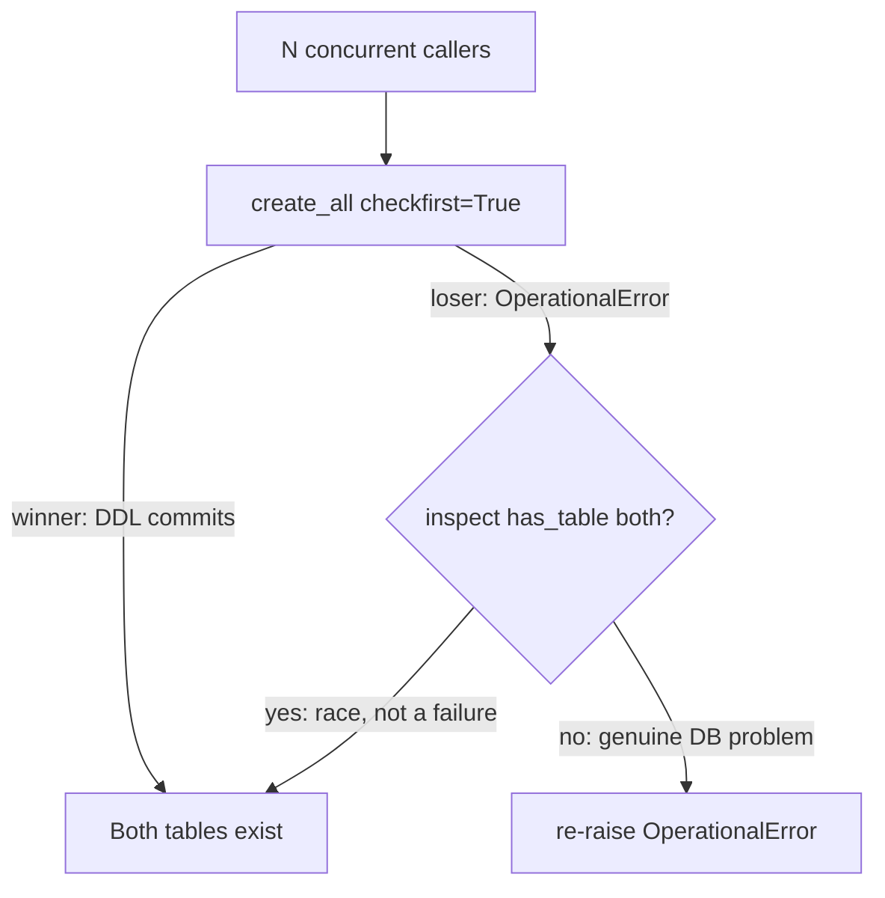

# Race-proof findings-ledger schema initialization

## Intent

Make `init_findings_schema` safe against concurrent first-creation of
`pr_findings` / `pr_review_integrity` so a fresh review run never emits
`review.track_record.db_error: table pr_findings already exists` — the
exact warning a live four-reviewer fan-out produced tonight against a
brand-new findings database.

## Context

`init_findings_schema` (`src/repoach/review/findings.py:177-185`) builds
a fresh `create_engine()` (`findings.py:171-174`) on every call and runs
`_metadata.create_all(engine, checkfirst=True)`. SQLAlchemy's
`checkfirst=True` inspects existing tables, then emits a bare
`CREATE TABLE` (no `IF NOT EXISTS`) for whichever are missing — that
check-then-create sequence is not atomic across independent SQLite
connections. When two or more callers race the very first creation of
a table, more than one can observe "missing" before either commits, and
every loser then sees the winner's `CREATE TABLE` as
`sqlite3.OperationalError: table pr_findings already exists`.

`Reviewer.review_diff` (`src/repoach/review/reviewer.py:639-644`) calls
`render_lens_track_record(self._db_path, self.role.value)`
unconditionally whenever a `db_path` is set. That function
(`src/repoach/review/review_lessons.py:204-228`) calls
`fetch_all_findings(db_path)` (`findings.py:439-450`), which calls
`init_findings_schema(db_path)` at `findings.py:445` on every
invocation. `ReviewTeamOrchestrator.review_pr` runs the four reviewer
personas through a four-worker `ThreadPoolExecutor`
(`src/repoach/review/orchestrator.py:417-433`), so all four reviewer
threads hit `init_findings_schema` at effectively the same instant on
every review round — and on the very first round against a fresh
database, before `pr_findings` exists, that is exactly the race window.
`render_lens_track_record` already catches the resulting exception
(`review_lessons.py:224-228`, logs the observed warning, degrades to
`""`), so tonight's incident was contained — but the same unguarded
`_metadata.create_all(engine, checkfirst=True)` call is also reached,
with no local try/except, from `findings_bridge.record_findings_for_outcomes`,
`merge_gate.gather_merge_facts` / `summarise_ledger_facts`,
`coder_outcomes.harvest_coder_outcomes`,
`reviewer_outcomes.harvest_reviewer_outcomes`, `auto_merge`, and
`dev_runner` — any of which could hit the identical race the first time
two processes (a review run and a `repoach develop` session, or two CI
jobs) touch a genuinely fresh `REPOACH_DB_PATH` at once.

`Orchestrator.__init__` already calls `persistence.init_schema`
(`orchestrator.py:261`) eagerly, single-threaded, before the
`ThreadPoolExecutor` fan-out ever starts, so `pr_reviews` /
`pr_coder_responses` / `pr_merges` are already guaranteed to exist by
the time the four reviewer threads run — that pre-existing eager,
serial call is why only `pr_findings` raced tonight and the sibling
tables did not. There is no equivalent eager call for
`init_findings_schema` anywhere, and adding one would only close the
window for this one call path, leaving the other unguarded callers
above exposed to the same race under a different process topology.

## Goals

- G1: A concurrent first-creation race against `pr_findings` /
  `pr_review_integrity` never surfaces
  `sqlite3.OperationalError: table ... already exists` to any caller of
  `init_findings_schema`, regardless of whether the callers are threads
  in one process or separate OS processes sharing `REPOACH_DB_PATH`.
- G2: A genuine `OperationalError` unrelated to concurrent creation
  (the database file itself cannot be used) still propagates — the fix
  must not silently swallow real failures.
- G3: The fix lives once, inside `init_findings_schema` itself, so
  every existing caller (`review_lessons.fetch_all_findings`,
  `findings_bridge.record_findings_for_outcomes`,
  `merge_gate.gather_merge_facts` / `summarise_ledger_facts`,
  `coder_outcomes.harvest_coder_outcomes`,
  `reviewer_outcomes.harvest_reviewer_outcomes`, `auto_merge`,
  `dev_runner`) inherits the protection with no change on its own side.
- G4: A real end-to-end review round (four reviewer threads through
  `ReviewTeamOrchestrator.review_pr`) against a fresh database confirms
  both that `pr_findings` / `pr_review_integrity` no longer race and
  that the sibling tables `pr_reviews` / `pr_coder_responses` /
  `pr_merges` remain unaffected, in the same run.

## Non-Goals

- NG1: Does not touch `persistence.py`, `stuck.py`, `audit_log.py`,
  `spec_gate.py`, or `planner_telemetry.py`, which carry the identical
  unguarded `checkfirst=True` pattern against their own, separate
  `_metadata` tables — same bug class, different files; tracked as a
  follow-up sweep spec, out of capacity here.
- NG2: Does not add cross-process locking (a file lock, an advisory DB
  lock, a `PRAGMA busy_timeout` bump). The catch-and-verify approach
  needs no new dependency and costs nothing extra once the tables
  exist.
- NG3: Does not modify `Orchestrator.__init__` or add an eager
  `init_findings_schema` call there. Once the shared function is
  race-proof for every caller, an additional eager call would protect
  only the orchestrator's own call path (already covered) while adding
  a change to `orchestrator.py`, a file owned by `SP-ORCH-DOCSTRING`.
- NG4: Does not change `_migrate_missing_findings_columns`'s own
  analogous has-column-then-`ALTER` sequence — it self-heals on every
  subsequent call once the column exists and was not implicated in
  tonight's incident.

## Assumptions

- A1: SQLite DDL is transactional — a losing `CREATE TABLE` never
  leaves `pr_findings` / `pr_review_integrity` partially created, so
  re-verifying both tables via `inspect(engine).has_table(...)` after a
  caught `OperationalError` is a sufficient, cheap safety check.
- A2: `sqlalchemy.exc.OperationalError` is the exception type
  SQLAlchemy raises for both "table already exists" and every other
  bare SQLite `OperationalError` (locked database, unusable file) — the
  fix has no other exception type to distinguish against.
- A3: No current caller of `init_findings_schema` depends on an
  exception propagating specifically for the "someone else just
  created this table" case — every caller either already tolerates
  failure (catches broadly and degrades) or simply wants the schema to
  exist afterward.

## Interface

Inputs:
- `db_path`: `Path` — filesystem path to the SQLite findings ledger.
  Same argument `init_findings_schema` already takes; the signature
  does not change.

Outputs:
- `None`. Same as today — the change is entirely inside the function
  body.

Errors:
- `OperationalError` (`sqlalchemy.exc.OperationalError`): raised when
  the underlying database cannot be used for a reason other than "a
  concurrent caller already created these tables" — e.g. `db_path`
  names something that is not a valid SQLite file. Never raised for
  the concurrent first-creation race this spec closes.

Target shape of `init_findings_schema` (`findings.py:177-185`):

```python
def init_findings_schema(db_path: Path) -> None:
    """Create the findings + review-integrity tables if absent (idempotent).

    Concurrent first-creation is race-proof: ``checkfirst=True`` runs a
    conditional check-then-create that is not atomic across independent
    SQLite connections, so two or more callers racing the very first
    creation of ``pr_findings`` / ``pr_review_integrity`` can each
    observe "missing" before either commits, and every loser then sees
    the winner's ``CREATE TABLE`` as
    ``OperationalError: table ... already exists``. SQLite DDL is
    transactional, so a losing ``CREATE`` never leaves a partially
    built table behind -- catching the error and re-checking both
    tables via ``inspect().has_table`` distinguishes "someone else
    already finished this" (swallow, continue) from a genuine database
    failure (re-raise). Once both tables exist for a given database
    file this check costs nothing extra.

    Also self-heals existing databases by ALTER-ing columns introduced
    post-creation (SQLite has no DDL-versioning).
    """
    engine = _engine_for(db_path)
    try:
        _metadata.create_all(engine, checkfirst=True)
    except OperationalError:
        inspector = inspect(engine)
        if not (
            inspector.has_table("pr_findings")
            and inspector.has_table("pr_review_integrity")
        ):
            raise
    _migrate_missing_findings_columns(engine)
```

`inspect` and `OperationalError` join the module-level `sqlalchemy`
imports (`findings.py:23-34`); the local `from sqlalchemy import
inspect, text` inside `_migrate_missing_findings_columns`
(`findings.py:197`) drops `inspect` since it is now imported once at
module level.

## Behavior

### Nominal

The first caller against a fresh `db_path`: `create_all` succeeds
without raising, both tables and every current column exist
afterward, and `_migrate_missing_findings_columns` runs once more as a
no-op (columns already current). Identical to today's behavior.

### Edge cases

- N ≥ 2 concurrent callers (threads in one process, or separate OS
  processes) racing the very first creation of a fresh `db_path` ->
  exactly one caller's `create_all` issues the `CREATE TABLE`
  statements and commits; every other caller catches
  `OperationalError`, re-verifies via `inspect(engine).has_table(...)`,
  finds both tables present, swallows the exception, and proceeds to
  `_migrate_missing_findings_columns` (idempotent) -> every caller
  returns normally with no exception, and every caller's own
  subsequent read/write against `pr_findings` sees the fully-formed
  schema, including the `verify_attempts` column.
- A caller reaches `init_findings_schema` after the tables already
  exist (the common case: every call after the first) ->
  `checkfirst=True` issues no DDL, no exception; unchanged from today.

### Failure scenarios

- The database file/path is unusable for a reason unrelated to
  concurrent creation (e.g. `db_path` names a directory instead of a
  file, the disk is full, the file is corrupted) -> `create_all`
  raises `OperationalError`; the re-verification
  `inspect(engine).has_table(...)` also fails to observe the tables
  (the underlying connection is unusable) -> the exception propagates
  to the caller unchanged, preserving today's fail-loud behavior for a
  genuine database problem.

## Architecture Impact

- Adds dependency: SP-FINDINGS-INIT-RACE -> SP-FINDING-MODEL
  (`findings.py`'s schema-init helper was introduced by SP-FINDING-MODEL
  as a pre-template, frontier spec; this change substantively rewrites
  its concurrency contract, so ownership of `findings.py` and its two
  tables is promoted into the governed regime here — opportunistic
  erosion per the spec template's own guidance for a frontier file
  whose zone is next touched).
- Removes dependency: none.
- New / changed coupling: none. `init_findings_schema`'s signature and
  every existing caller are unchanged; `orchestrator.py`,
  `reviewer.py`, `review_lessons.py`, `findings_bridge.py`,
  `merge_gate.py`, `coder_outcomes.py`, `reviewer_outcomes.py`,
  `auto_merge.py`, and `dev_runner.py` all keep calling the same
  function and inherit the fix without any change on their side.

## Diagram



## Acceptance Criteria

- [ ] AC1: Eight threads call `init_findings_schema` concurrently
  against the same brand-new `db_path`, released together via a
  `threading.Barrier`; on today's code this reliably raises
  `sqlite3.OperationalError: table pr_findings already exists` in at
  least one thread. After the fix, no thread raises.
  `tests/unit/test_findings_schema_race.py::test_concurrent_init_findings_schema_no_operational_error`
- [ ] AC2: After the same concurrent run, both `pr_findings` and
  `pr_review_integrity` exist and `pr_findings` carries every current
  column (including `verify_attempts`, the post-creation migration),
  regardless of which thread's `create_all` actually won the race.
  `tests/unit/test_findings_schema_race.py::test_concurrent_init_findings_schema_all_threads_see_table_after_race`
- [ ] AC3: Pointing `db_path` at a path that cannot be opened as a
  SQLite database for a reason unrelated to concurrent creation (a
  directory in place of a file) still raises `OperationalError` from
  `init_findings_schema` — the catch-and-verify path must not swallow
  a genuine database failure.
  `tests/unit/test_findings_schema_race.py::test_init_findings_schema_reraises_genuine_operational_error_when_table_absent`
- [ ] AC4 (integration): A real `ReviewTeamOrchestrator.review_pr` run
  against a fresh, never-initialized `db_path` drives the actual
  four-worker `ThreadPoolExecutor` fan-out across real `Architect` /
  `Sentinel` / `Tester` / `Scribe` instances (each with `db_path` set,
  so `review_diff` really calls `render_lens_track_record` ->
  `fetch_all_findings` -> `init_findings_schema` from four concurrent
  threads). Only the network/subprocess boundary is faked: `GhCli` is
  replaced by a truthful stand-in returning a canned diff (mirroring
  the existing `_StubGhCli` pattern in `tests/unit/test_review_team.py`),
  `Reviewer._call_with_retry` — the LLM call boundary — returns a
  canned `APPROVE` outcome instantly, and `recall_review_lessons` — the
  `agentmemory` HTTP boundary — returns `[]`. Captured via
  `structlog.testing.capture_logs` (with the module logger rebound per
  the existing rebind pattern), the run must emit zero
  `review.track_record.db_error` events, and afterward `pr_findings`,
  `pr_review_integrity`, `pr_reviews`, `pr_coder_responses`, and
  `pr_merges` all exist and are queryable.
  `tests/integration/test_findings_schema_race_end_to_end.py::test_review_pr_four_reviewer_threads_do_not_race_pr_findings_creation`

## Open Questions

(none)
