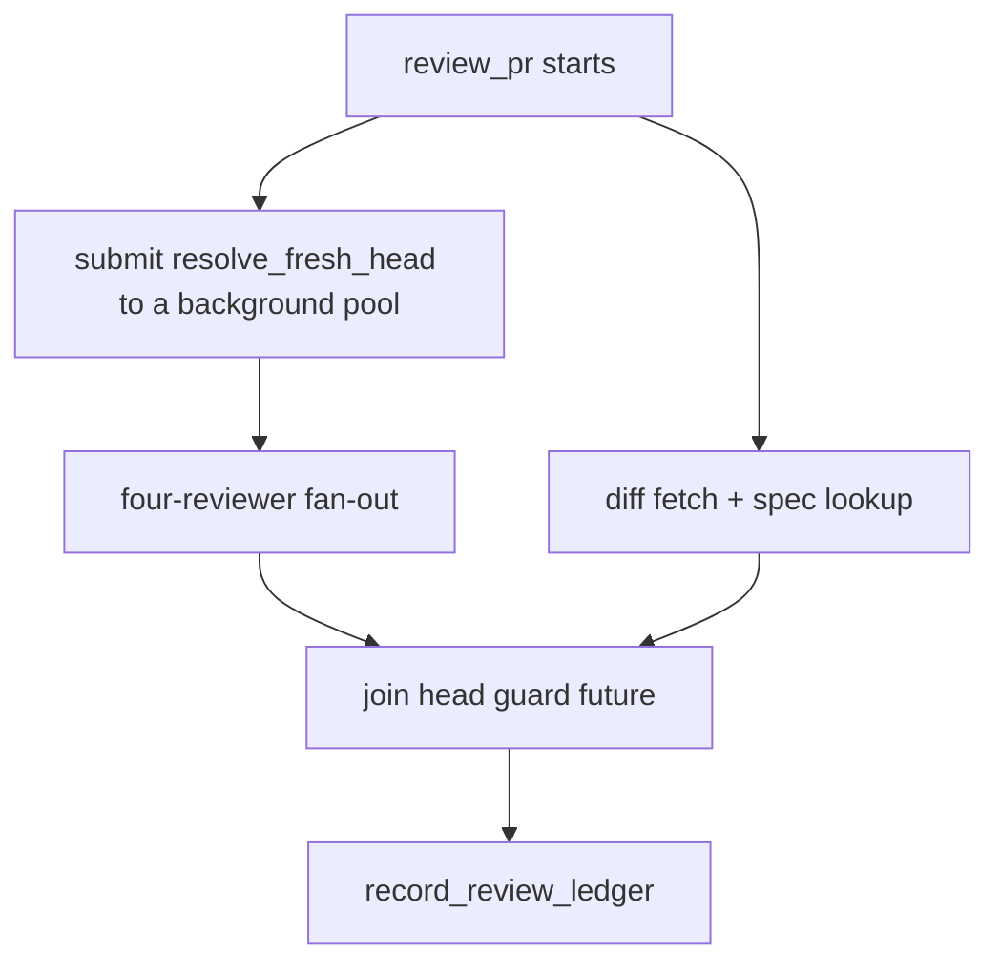

# Resolve the fresh-head guard off the blocking review path

## Intent
`ReviewTeamOrchestrator.review_pr` currently blocks the entire review
pipeline for up to 30 seconds waiting on `resolve_fresh_head` before
starting the four-reviewer fan-out, even though nothing in the
fan-out reads the resolved head SHA. This change runs the guard
concurrently with the fan-out and joins it only at its first real
consumer, so the wait overlaps other work instead of stacking in
front of it, without weakening `resolve_fresh_head`'s own freshness
guarantee.

## Context
`ReviewTeamOrchestrator.review_pr` (`src/repoach/review/orchestrator.py`)
is the entry point for `repoach review pr` and the `auto-review`
GitHub Actions workflow. At `orchestrator.py:331-333` it calls the
module-level `resolve_fresh_head` (`orchestrator.py:1299-1357`)
synchronously and unconditionally whenever `post_to_github=True`.
`resolve_fresh_head` guards against the post-push GitHub API
propagation lag that caused a stale review on PR #3: it compares the
API-served head SHA against the local checkout's `git rev-parse HEAD`
(valid only when the checkout sits on the PR's own branch) and
re-polls up to `attempts=6` times with a flat `delay_s=5.0` sleep
between attempts — 30 seconds worst case — before giving up loudly
and returning whatever GitHub served.

The resolved value, `head_sha`, is not read again until
`record_review_ledger` at `orchestrator.py:526-533` — after the spec
lookup (`341-386`) and the full four-reviewer `ThreadPoolExecutor`
fan-out (`417-457`) have already run to completion. The call site
also passes `repo_root=Path.cwd()` even though the orchestrator
already stores `self._repo_root` (`orchestrator.py:260`), set once in
`__init__` and never mutated — a latent inconsistency whenever the
process cwd differs from the configured repo root (for example a
worktree).

`src/repoach/review/orchestrator.py` is owned in full by
`SP-ORCH-DOCSTRING` (a module-docstring-only slice whose own
Non-Goals promise no behavioural change). This spec depends on it,
edits code inside the file, and does not re-declare ownership over
it.

## Goals
- G1: `resolve_fresh_head` starts running in the background the
  moment `review_pr` reaches the point that previously blocked on
  it, so its wait overlaps with the four-reviewer fan-out instead of
  preceding it.
- G2: The resolved head SHA is joined exactly once, immediately
  before its first real consumer (`record_review_ledger`).
- G3: The join is defensive — an unexpected exception from the
  background poll degrades to `head_sha=None` with a logged warning,
  the same "the review must still proceed" posture the rest of
  `review_pr` already applies to its other best-effort steps, rather
  than crashing the whole review.
- G4: The call site passes `repo_root=self._repo_root` instead of
  `Path.cwd()`.
- G5: `resolve_fresh_head`'s own signature, retry algorithm, and
  defaults (`attempts=6`, `delay_s=5.0`) are untouched, and its four
  existing pinned tests in `tests/unit/test_review_head_guard.py`
  keep passing unmodified.
- G6: When `post_to_github=False` (`self._post` false), no
  background thread or pool is created at all — dry runs behave
  exactly as before.

## Non-Goals
- NG1: No change to `resolve_fresh_head`'s internal algorithm,
  defaults, or its evidence-first fail-open behavior on persistent
  staleness.
- NG2: No exponential backoff or other change to the polling
  cadence — a legitimate follow-up, not part of this fix.
- NG3: No shared cache of a resolved head across `review_pr`
  invocations, and no substitution of this guard's output for
  `resolve_verified_head` (`src/repoach/review/auto_merge.py:510-580`,
  `SP-AUTOMERGE-FRESH-HEAD`) — that guard runs at merge time, against
  remote `git ls-remote` ground truth, with different defaults and a
  fail-closed contract; it stays fully independent.
- NG4: No change to `record_review_ledger`, `summarise_ledger_facts`,
  `_publish_outcome`, or any other downstream consumer of `head_sha`
  beyond moving where and how the value is computed.

## Assumptions
- A1: `resolve_fresh_head` performs no mutation of orchestrator
  state, so it is safe to run on a worker thread while the main
  thread proceeds with its own `GhCli` reads.
- A2: `self._gh` (a `GhCli` instance) is safe to call concurrently
  from a background thread while the main thread also calls it
  (`pr_view`, `pr_diff`) — both sides perform independent read-only
  `gh`/`git` subprocess calls, and `GhCli` holds no mutable per-call
  state.
- A3: `self._repo_root` is set once in `__init__` and never mutated
  during `review_pr`, so a background thread closing over it is
  race-free.
- A4: This spec is developed and merged as a single, self-contained
  change to `review_pr`'s body; no other in-flight change concurrently
  edits the same span (`orchestrator.py:331-533`) in a way that would
  conflict at merge time — a scheduling concern for the operator, not
  a design gap in this spec.

## Interface
Inputs / outputs of the public entry point are unchanged:
- `ReviewTeamOrchestrator.review_pr(pr_number: int) -> TeamOutcome` —
  same signature, same `TeamOutcome` fields and meaning.

New private helper on `ReviewTeamOrchestrator`:

```python
def _join_head_guard(
    self,
    pool: ThreadPoolExecutor | None,
    future: Future[str | None] | None,
    *,
    pr_number: int,
) -> str | None:
    """Join the background head-freshness poll started in review_pr.

    Returns the resolved head SHA, or ``None`` when no guard was
    started (``post_to_github=False``) or the background poll
    raised unexpectedly. The review always proceeds either way,
    matching resolve_fresh_head's own evidence-first contract of
    never letting this check block or crash the pipeline.
    """
```

Errors:
- No new public exception type. An exception raised inside the
  background `resolve_fresh_head` call is caught at the join point,
  logged as `review_team.head_guard_failed` (with `pr_number` and the
  exception type name), and degrades `head_sha` to `None` — it never
  propagates out of `review_pr`.

## Behavior

### Nominal
When `post_to_github=True`:
1. At the point that previously held the direct synchronous call
   (`orchestrator.py:331-333`), `review_pr` creates a dedicated
   `ThreadPoolExecutor(max_workers=1)` and submits
   `resolve_fresh_head(self._gh, pr_number, repo_root=self._repo_root)`
   to it. This returns a `Future` immediately, without blocking.
2. The rest of the pipeline proceeds unchanged: spec lookup, the
   resolved-disagreements fetch, the four-reviewer
   `ThreadPoolExecutor` fan-out, the hallucination guard, round-1
   dialogue persistence, and round 2 — none of these read `head_sha`.
3. Immediately before `record_review_ledger`, `review_pr` calls
   `_join_head_guard(pool, future, pr_number=pr_number)`, which
   blocks only on whatever residual wait remains (typically none,
   since the reviewer fan-out already ran at least as long), then
   shuts the pool down.
4. `record_review_ledger` and every later `head_sha` consumer receive
   exactly the value they would have before — only the wall-clock
   cost, not the resolved value, changes.

### Edge cases
- The reviewer fan-out finishes before the guard converges (only
  when `resolve_fresh_head` needed one or more retries while all four
  reviewer calls happened to return unusually fast): `_join_head_guard`
  blocks for the residual delta; total wall time is
  `max(guard_time, reviewer_time)`, never their sum.
- `post_to_github=False`: no pool, no future, no thread is created;
  `_join_head_guard` is never invoked and `head_sha` stays `None`,
  identical to today's dry-run behavior.
- Foreign-branch checkout or an already-converged head:
  `resolve_fresh_head` still returns on its first check
  (`orchestrator.py:1319-1334`) exactly as today — the background
  thread simply finishes near-instantly instead of after up to 30s;
  the function's own behavior is unchanged.

### Failure scenarios
- The background `resolve_fresh_head` call raises: `_join_head_guard`
  catches the exception, logs `review_team.head_guard_failed`, shuts
  the pool down, and returns `None`; `review_pr` continues to
  `record_review_ledger` with `head_sha=None` — the same
  degraded-but-alive posture already used for the spec lookup and the
  resolved-disagreements fetch.
- `resolve_fresh_head` never converges within `attempts`: unchanged
  behavior — it logs `orchestrator.reviewing_stale_head` loudly and
  returns the served (stale) SHA; `_join_head_guard` passes that
  value through untouched.

## Architecture Impact
- Adds dependency: SP-FRESH-HEAD-CONCURRENT -> SP-ORCH-DOCSTRING
  (this spec edits code inside `orchestrator.py`, whose full-file
  ownership SP-ORCH-DOCSTRING already holds; no ownership is
  re-claimed here, and the affected method's docstring is kept
  truthful about the new concurrent scheduling).
- Removes dependency: none.
- New / changed coupling, cycles, or shared state: none. The
  background thread/pool is local to a single `review_pr` call and is
  shut down before that call returns; no state crosses into
  `resolve_verified_head` (`auto_merge.py`, `SP-AUTOMERGE-FRESH-HEAD`)
  or between separate `review_pr` invocations.

## Diagram


## Acceptance Criteria
- [ ] AC1: The call site submits `resolve_fresh_head` to a background
  pool instead of calling it synchronously, passes
  `repo_root=self._repo_root` (not `Path.cwd()`), and the reviewer
  fan-out is observably running before that background call returns.
  Test: `tests/unit/test_review_head_guard.py::test_orchestrator_head_guard_call_site_is_non_blocking`.
  Construct the orchestrator with an explicit `repo_root` that
  differs from the process's current working directory (no
  `monkeypatch.chdir`, so `Path.cwd()` and `repo_root` genuinely
  disagree). Monkeypatch `repoach.review.orchestrator.resolve_fresh_head`
  with a fake that records its `repo_root` kwarg and then calls
  `threading.Event.wait(timeout=1.0)` on an event the stubbed
  reviewers set, returning the string `"event-set"` if the wait
  succeeded or `"timed-out"` otherwise. Monkeypatch the four reviewer
  classes (`Architect`/`Sentinel`/`Tester`/`Scribe`) with a stub whose
  `review_diff` sets the event before returning a canned APPROVE
  outcome. Today the direct synchronous call means the fake blocks
  and times out before any reviewer runs, so `team.head_sha ==
  "timed-out"` — the test's assertion `team.head_sha == "event-set"`
  fails. After the fix, the submission returns immediately, the
  fan-out runs concurrently, the event is set well inside the
  timeout, and both `team.head_sha == "event-set"` and the recorded
  `repo_root` matching the orchestrator's `repo_root` (not the
  process cwd) hold.
- [ ] AC2: The up to 30-second worst-case wait inside
  `resolve_fresh_head` overlaps with the four-reviewer fan-out
  instead of preceding it, so total `review_pr` wall time approaches
  `max(guard_time, reviewer_time)` rather than their sum.
  Test: `tests/unit/test_review_head_guard.py::test_orchestrator_head_guard_overlaps_reviewer_fanout`.
  Drives the real, unmodified `resolve_fresh_head` (not a fake)
  through the real call site, against a real scratch git repository
  (`git init` + one commit under `tmp_path`), constructing the
  orchestrator with `repo_root` pointed at that scratch repo. Uses a
  truthful stale-forever `GhCli` fake: `pr_view` returns the scratch
  repo's real branch name, `pr_head_sha` always returns a SHA that
  never matches local HEAD. Speeds up the retry cadence via
  `monkeypatch.setitem(resolve_fresh_head.__kwdefaults__, "delay_s",
  0.2)` — a legitimate override of a keyword-only default, leaving
  `attempts` and the algorithm untouched — and stubs the four
  reviewers to each `time.sleep(1.5)` before returning a canned
  APPROVE outcome. Asserts total elapsed wall time for
  `orch.review_pr(...)` is comfortably below the serial sum (roughly
  `6 * 0.2 + 1.5 ≈ 2.7s`) and close to the concurrent floor (roughly
  `max(6 * 0.2, 1.5) ≈ 1.5s`) — true today only after paying the full
  serial sum (the test fails against a generous threshold set between
  the two), and true after the fix once the two phases overlap.
- [ ] AC3 (integration): An end-to-end `review_pr` run against a
  hermetic real git repository, the real unmodified
  `resolve_fresh_head` (`attempts=6`, `delay_s=5.0`), and slow
  reviewer stubs finishes in well under the serial sum of one
  propagation-lag tick plus the reviewer time, and above the
  concurrent floor.
  Test: `tests/integration/test_review_head_guard_overlap_end_to_end.py::test_review_pr_stale_head_guard_overlaps_slow_reviewers`.
  Follows the hermetic bare-origin-plus-clone pattern already
  established in `tests/integration/test_automerge_fresh_head_end_to_end.py`:
  a real bare origin and a real clone checked out on a feature
  branch with one pushed commit. Drives the real, unmodified
  `ReviewTeamOrchestrator.review_pr` end to end, constructed with
  `repo_root` pointed at the clone. The `GhCli` fake is truthful at
  the two GitHub-API seams only: `pr_view` returns the clone's real
  branch name; `pr_head_sha` is scripted to return a stale SHA on its
  first call and the clone's real committed HEAD on its second call
  (converging after exactly one `delay_s=5.0` sleep, mirroring the
  existing pinned `test_retries_until_the_served_head_catches_up`
  convergence pattern) — every other `GhCli` method needed by the
  publish path (`pr_diff`, `list_review_comments`,
  `pr_review_comment`, `pr_review_submit`, `upsert_archive_comment`,
  `fetch_archive_comment`) is stubbed the same way as the established
  `_StubGhCli` pattern in `tests/unit/test_review_team.py`. The four
  reviewer classes are stubbed to each `time.sleep(7)` before
  returning a canned APPROVE outcome. Asserts elapsed wall time is
  well under the roughly 12-second serial sum (5s guard tick + 7s
  reviewers) and comfortably above the roughly 7-second concurrent
  floor — true today only above 12s (fails against a threshold set
  between the two, e.g. under 10s), true after the fix around 7-8s.
  This test necessarily runs for several real seconds and belongs to
  the integration tier (`scripts/ci_local.sh --integration`), not the
  fast unit lane.

## Open Questions
(none)
