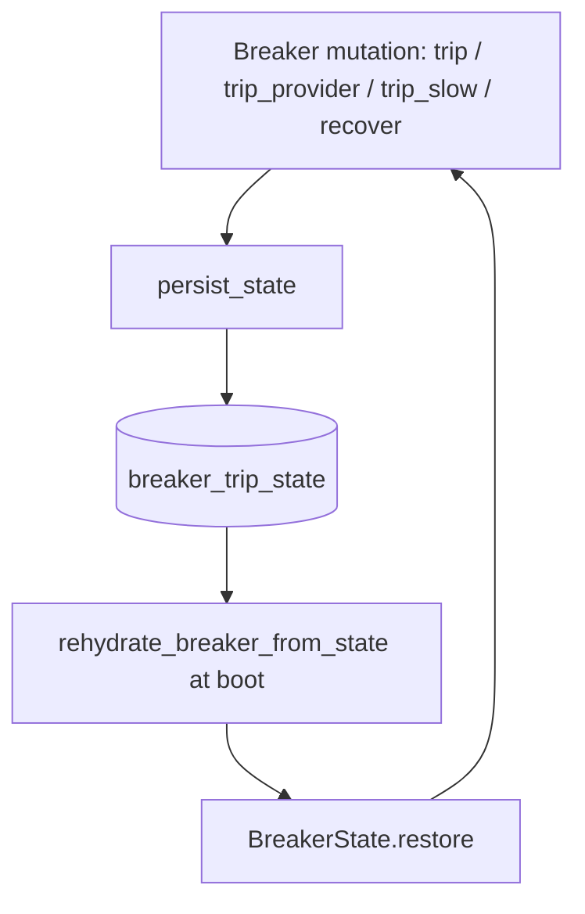

# Persist and rehydrate breaker trip state across proxy restarts

## Intent

The failover breaker (`BreakerState`) is a process-memory singleton: every
trip, every consecutive-failure count, and every slow-strike history vanish
the instant the proxy process exits. The operating rule restarts the proxy
after every merge, so this is not a rare event — it happens routinely and
silently defeats invariants the breaker's own code already asserts (a
consecutive-failure counter that "must survive TTL lapse", a provider-wide
account quarantine meant to last hours). Give the breaker a durable,
write-through memory: every trip is mirrored to SQLite with a wall-clock
expiry, and at boot the proxy rehydrates from that table before the first
request, so a restart stops being a free pass for a model or provider that
is still broken.

## Context

- `src/repoach/llm_proxy/routing/breaker.py` (151-343) — `BreakerState` is a
  clock-free map of four dicts (`_down_until`, `_down_reason`,
  `_consecutive_failures`, `_slow_history`) behind a module singleton
  (`_BREAKER`, line 332; `get_breaker()`, lines 335-337). Its docstring
  (lines 10-12) commits to staying clock-free — callers pass
  `time.monotonic()` timestamps in. `down_refs()` (lines 232-249) prunes a
  lapsed trip window but its docstring (233-242) states the
  consecutive-failure counter must survive that lapse; a process restart
  currently defeats this because the counter lives only in memory.
  `trip_provider()` (185-213) benches every ref of a provider by calling
  `trip()` per ref (SP-BREAKER-PROVIDER-SCOPE). This spec is the first to
  claim formal ownership of `breaker.py`: every spec since
  `SP-PROXY-HEALTH-BREAKER` (pre-frontmatter, no `owns` block) has amended it
  while declaring `owns.code: []`, leaving it an unowned frontier file.
- `src/repoach/llm_proxy/routing/probe_seed.py` (owned by
  `SP-PROXY-BREAKER-PROBE-SEED`) already rehydrates a NARROW slice at boot:
  `seed_breaker_from_probes()` (63-102) reads only the single latest
  `nim_health_probe` row per tier and, when degraded, trips only
  `chain.refs[0]` — the tier HEAD — via a bare `breaker.trip(...)` call
  (line 100) that always increments the counter by one. It never restores a
  pre-restart consecutive-failure count, never touches a non-head chain ref,
  never restores `_slow_history`, and its reason vocabulary
  (`reason_from_detail`, 47-60) only ever yields `provider_410` or
  `probe_degraded` — it cannot express an account-fault reason
  (`provider_402`, `auth_failed`, ...), so a provider-wide quarantine
  (`trip_provider`) is invisible to it. This spec does not modify
  `probe_seed.py` or retire it; its tier-head top-up keeps running
  unchanged, ordered AFTER this spec's full rehydration in
  `AppRuntime.startup()` so a still-live persisted state is never clobbered.
- `src/repoach/llm_proxy/api/runtime.py` — `AppRuntime.startup()` (55-61)
  currently calls `self._seed_breaker_from_probes()` (83-105) then
  `self._seed_effort_map()` (63-81), each gated by its own settings flag and
  wrapping its bridge call in a log-and-swallow `try/except`. This spec adds
  a third step, `_seed_breaker_from_persisted_state()`, called FIRST.
- `src/repoach/llm_proxy/api/services.py` — every `BreakerState` mutation in
  the live dispatch path lives in this one file: `_trip_breaker()` (195-273)
  composes the reason-aware TTL and calls either `breaker.trip_provider(...)`
  (250-256, account-fault branch, returns early at 263) or `breaker.trip(...)`
  (264, single-ref branch); `_stream_with_failover()` calls
  `get_breaker().trip_slow(...)` (391-395 and 457-461) and
  `get_breaker().recover(ref)` (405 and 473). Already reads `BreakerState`
  private attributes directly from outside the class (e.g.
  `breaker._consecutive_failures.get(ref, 0)` at line 236,
  `get_breaker()._slow_history.get(ref, [])` at lines 402 and 469) — an
  established in-tree convention this spec's persistence adapter reuses
  rather than growing `BreakerState`'s public surface.
- `src/repoach/llm_proxy/config/settings.py` — `breaker_probe_seed_db`
  (default `"data/repoach.db"`) already names the one shared SQLite file
  used by `nim_health_probe`, `cell_effort_probe`, and the review DB
  (`core/config.py` Path field, default `"./data/repoach.db"`); this spec
  reuses that same setting rather than introducing a second DB path. Every
  Settings field resolves through `_aliases(<LEGACY_NAME>)`
  (`_LEGACY_TO_REPOACH_ALIAS`, lines 107-160), whose entries are pinned 1:1
  by `tests/unit/test_settings_sharp_prefix_aliases.py`'s
  `_LEGACY_TO_FIELD` map (lines 32-85) — a new Settings field needs one
  entry in each dict.
- `src/repoach/health/store.py` (owned by `SP-HEALTH-STORE-NEUTRALIZE`) is
  the reference persistence shape this spec's new table mirrors
  (`Table` + `create_engine(..., checkfirst=True)` + a frozen row
  dataclass) but is not imported from — the new table is independent, so no
  dependency on that spec is introduced.
- `src/repoach/llm_proxy/providers/effort_map.py` (owned by
  `SP-CHAINPILOT-EFFORT-MAP`) needs no work here: `seed_effort_map()`
  (82-105) already fully replaces the singleton from the durable
  `cell_effort_probe` series on every boot — a complete, not partial,
  rehydrate. It is cited only as the pattern this spec extends to the
  breaker, never touched.

## Goals

- G1: Every `BreakerState` mutation on the live dispatch path (`trip`,
  `trip_provider`, `trip_slow`) that leaves a ref DOWN write-throughs a
  wall-clock row to a new `breaker_trip_state` SQLite table; a mutation that
  brings a ref back UP (`recover`, or a lapsed TTL) removes its row.
- G2: At boot, before the first request, every still-live persisted row is
  restored into the (freshly empty) `BreakerState` singleton with the
  SAME consecutive-failure count and slow-history window it had at the
  moment it was persisted — never incremented, never reset.
- G3: Restoration uses wall-clock arithmetic (`down_until_utc` minus
  `datetime.now(UTC)` at boot) since the pre-restart `time.monotonic()`
  origin does not survive a process restart; the remaining TTL is clamped
  to the TTL that was in force at persist time, bounding a backward
  system-clock step between shutdown and boot.
- G4: A row whose wall-clock TTL has already lapsed by boot time is skipped
  (not restored) and pruned from the table.
- G5: The mechanism is provider- and reason-agnostic: a provider-wide
  quarantine (`trip_provider`, SP-BREAKER-PROVIDER-SCOPE) and a trip on any
  non-head chain ref both survive a restart identically to a single-ref
  terminal/transient trip — the gaps `probe_seed.py` structurally cannot
  close (tier-head-only, NIM-probe-reason-only).
- G6: `BreakerState` itself stays clock-free and gains exactly one new
  method (`restore`); no adapter or SQL import leaks into `breaker.py`.

## Non-Goals

- NG1: Persisting the OpenRouter credits cache (`src/repoach/health/credits.py`)
  is explicitly deferred — it already self-heals in one request after a
  restart (a single live round-trip), the lowest-severity gap this dossier
  surfaces, and including it would push this spec over its LOC budget.
- NG2: No change to `probe_seed.py` — its tier-head, NIM-probe-derived seed
  keeps running unchanged as a secondary top-up, ordered after this spec's
  rehydration step.
- NG3: No change to `effort_map.py` / the resolved-effort seeding path — it
  already fully rehydrates from durable history on every boot.
- NG4: No background task queue, batching, or async write-through pipeline.
  The write-through call is a synchronous, single-row SQLite upsert-or-delete
  inline on the request path — bounded and fast (one local file write), not
  a general async persistence framework.
- NG5: No multi-process or multi-worker coordination. The proxy runs as a
  single OS process; concurrent writers to `breaker_trip_state` are out of
  scope.
- NG6: No change to `ttl_for_reason`, `escalated_ttl`, or the reason
  vocabulary (`TERMINAL_REASONS`, `QUARANTINE_REASONS`,
  `ACCOUNT_FAULT_REASONS`) — this spec persists whatever TTL/reason the
  existing policy already computed, it does not change the policy.

## Assumptions

- A1: The proxy runs as a single process per environment (today's
  deployment), so no concurrent-writer race exists on the new table.
- A2: `settings.breaker_probe_seed_db` continues to name the one shared
  SQLite file already hosting `nim_health_probe` and `cell_effort_probe`;
  no second DB path setting is introduced.
- A3: The system wall clock can step backward (NTP correction) between
  shutdown and boot; G3's clamp bounds the damage to this spec's own TTL
  arithmetic, it does not fix wall-clock issues elsewhere in the system.
- A4: `ModelRef.parse(str(ref))` round-trips losslessly for every ref this
  spec ever persists (already relied upon throughout `breaker.py` and
  `services.py`).

## Interface

Inputs:
- `breaker: BreakerState` — the singleton instance whose state is being
  written through or restored into.
- `ref: ModelRef` — the provider/model reference a write-through call
  concerns.
- `db_path: Path` — the shared SQLite path (`settings.breaker_probe_seed_db`).
- `monotonic_now: float` — a `time.monotonic()` reading.
- `wall_clock_now: datetime` — a `datetime.now(UTC)` reading taken at the
  same instant as `monotonic_now`, so a monotonic delta can be projected
  onto a wall-clock timestamp for durable storage.

Storage schema — one new table, `breaker_trip_state`, in the shared SQLite
file, columns: `ref` (`String`, primary key, `str(ModelRef)`), `provider_id`
(`String`), `model` (`String`), `down_until_utc` (`DateTime(timezone=True)`),
`reason` (`String`), `consecutive_failures` (`Integer`), `slow_history_json`
(`String`, JSON-encoded `list[bool]`), `ttl_s` (`Float`, the remaining
seconds computed at persist time — the clamp ceiling), `updated_at`
(`DateTime(timezone=True)`). Built with the same
`Table` + `create_engine(..., checkfirst=True)` shape as `health/store.py`.

Outputs (new module `src/repoach/llm_proxy/routing/breaker_persist.py`):
- `init_breaker_state_schema(db_path: Path) -> None` — create the
  `breaker_trip_state` table if it does not exist (idempotent), mirroring
  `health/store.py`'s `init_nim_health_schema`.
- `persist_state(breaker: BreakerState, ref: ModelRef, *, db_path: Path, monotonic_now: float, wall_clock_now: datetime) -> None` —
  best-effort write-through for one ref. When `ref` is currently down
  (`breaker._down_until.get(ref)` is set and `> monotonic_now`), upserts one
  row: `down_until_utc = wall_clock_now + (down_until_monotonic - monotonic_now)`,
  `reason`, `consecutive_failures`, `slow_history_json` (JSON list, read
  from `breaker._down_reason` / `breaker._consecutive_failures` /
  `breaker._slow_history` exactly as `services.py` already does), and
  `ttl_s = down_until_monotonic - monotonic_now` (the wall-clock-trustworthy
  remaining-seconds value stored as the future clamp ceiling). When `ref`
  is NOT currently down, deletes its row instead (recovered or lapsed).
  Swallows and logs (`loguru`) any DB error internally — never raises,
  since it has multiple call sites on the hot dispatch path.
- `rehydrate_breaker_from_state(breaker: BreakerState, *, db_path: Path, monotonic_now: float, wall_clock_now: datetime) -> int` —
  reads every row, computes `remaining_s = (down_until_utc - wall_clock_now).total_seconds()`
  per row. When `remaining_s <= 0`, the row is pruned (deleted) and
  skipped. Otherwise `effective_ttl_s = min(remaining_s, row.ttl_s)` (the
  clamp) and `breaker.restore(ModelRef(provider_id=row.provider_id, model=row.model), now=monotonic_now, ttl_s=effective_ttl_s, reason=row.reason, consecutive_failures=row.consecutive_failures, slow_history=json.loads(row.slow_history_json))`
  is called. Returns the count of rows restored. Raises on a genuine DB
  failure (no internal swallow — mirrors `seed_breaker_from_probes`, which
  also does not swallow; the ONE caller, `AppRuntime`, wraps it).

Outputs (new `BreakerState` method, `breaker.py`):
- `restore(self, ref: ModelRef, *, now: float, ttl_s: float, reason: str, consecutive_failures: int, slow_history: list[bool]) -> None` —
  sets `_down_until[ref]`, `_down_reason[ref]`, `_consecutive_failures[ref]`,
  and `_slow_history[ref]` to the given values verbatim (no increment, no
  append), extending-never-shortening an already-live in-process trip
  exactly like `trip()` does for `_down_until`, so a rehydration racing a
  live request never shortens a fresher trip.

Outputs (new `AppRuntime` method, `runtime.py`):
- `_seed_breaker_from_persisted_state(self) -> None` — gated by
  `settings.breaker_state_persist_enabled`; calls
  `rehydrate_breaker_from_state(get_breaker(), db_path=Path(self.settings.breaker_probe_seed_db), monotonic_now=time.monotonic(), wall_clock_now=datetime.now(UTC))`
  inside a log-and-swallow `try/except`, mirroring
  `_seed_breaker_from_probes`. Called from `startup()` BEFORE
  `_seed_breaker_from_probes()`.

Outputs (new `Settings` field, `settings.py`):
- `breaker_state_persist_enabled: bool` — default `True`, alias
  `_aliases("BREAKER_STATE_PERSIST_ENABLED")`; one matching entry added to
  `_LEGACY_TO_REPOACH_ALIAS` (`settings.py`) and `_LEGACY_TO_FIELD`
  (`tests/unit/test_settings_sharp_prefix_aliases.py`).

Errors:
- No new public exception type. `persist_state` never raises (internal
  log-and-swallow). `rehydrate_breaker_from_state` propagates a genuine DB
  failure to its one caller, `AppRuntime._seed_breaker_from_persisted_state`,
  which logs and swallows it — the proxy must always finish booting.

## Behavior

### Nominal

An `open_router/*` ref 402s. `_trip_breaker` computes the quarantine TTL,
calls `breaker.trip_provider(...)` for every sibling ref of that provider,
then calls `persist_state(...)` once per sibling ref so each gets its own
durable row with `reason="provider_402_propagated"` and today's
consecutive-failure count. The proxy restarts (merge-triggered). At boot,
`AppRuntime.startup()` calls `_seed_breaker_from_persisted_state()` first:
every row whose wall-clock TTL has not lapsed is restored via
`breaker.restore(...)` — same reason, same failure count, same slow
history, no re-increment. `_seed_breaker_from_probes()` then runs as
today and finds the tier head already down (a no-op re-trip extends but
never shortens). The very first post-restart request against that provider
skips every quarantined ref without paying a single round-trip.

### Edge cases

- A ref recovers (`get_breaker().recover(ref)`) — the very next
  `persist_state(...)` call for that ref (in the same code path,
  immediately after `recover`) finds it no longer down and deletes its row,
  so a restart never resurrects a ref that had already healed.
- A ref's TTL lapses naturally between persist and boot (e.g. a 120s
  transient trip persisted, proxy restarted 10 minutes later) —
  `rehydrate_breaker_from_state` computes `remaining_s <= 0`, prunes the
  row, restores nothing for that ref.
- A non-head chain ref (position 2+, never seen by `probe_seed.py`) was
  tripped before restart — its row restores identically to a head ref;
  `rehydrate_breaker_from_state` has no notion of chain position.
- The system clock steps backward between shutdown and boot (NTP
  correction) — `effective_ttl_s = min(remaining_s, row.ttl_s)` clamps the
  restored TTL to the value that was actually in force at the last
  persist, instead of an inflated wall-clock delta.
- A live request trips a ref via `probe_seed`'s boot-time seed AND this
  spec's rehydration targets the same ref (e.g. a probe-degraded tier head
  that also has a persisted row) — `restore()` and the later `trip()` both
  extend-never-shorten `_down_until`, so whichever call computes the later
  `until` wins; no state is lost either way.
- `breaker_state_persist_enabled` is `False` — `_seed_breaker_from_persisted_state`
  returns immediately on the read side; on the write side, every
  write-through call site in `services.py` checks the same flag before
  calling `persist_state` at all (mirroring how `breaker_enabled` already
  gates `_trip_breaker` today), so disabling the flag stops both sides
  together and `persist_state` itself needs no internal enable check.

### Failure scenarios

- The SQLite file is missing or its parent directory cannot be created —
  `persist_state` logs a warning and returns; dispatch is unaffected.
  `rehydrate_breaker_from_state` raises, `AppRuntime` logs a warning and
  the proxy boots with an empty (but functional) breaker, exactly as if
  persistence had never shipped.
- A `slow_history_json` row is corrupt / not valid JSON — treated as a
  malformed row: skipped and logged during rehydration (never crashes
  boot), consistent with best-effort seeding elsewhere in this file.

## Architecture Impact

- Adds dependency: `SP-PROXY-STATE-PERSIST` -> `SP-PROXY-BREAKER-PROBE-SEED`
  (this spec's new `_seed_breaker_from_persisted_state()` step and the
  existing `_seed_breaker_from_probes()` step both run inside the shared,
  unowned `api/runtime.py`'s `AppRuntime.startup()`, in a specific order,
  and both mutate the same process-level `BreakerState` singleton this
  spec now owns; the persisted-state step must run FIRST so a live
  restored trip is never overwritten by a shorter probe-derived one).
- New owned resource: `db:table:breaker_trip_state` in the shared
  `data/repoach.db` SQLite file (same file, no new path setting).
- New / changed coupling: `api/runtime.py`, `api/services.py`, and
  `config/settings.py` remain unowned frontier files this spec amends
  (adds one method call, ~6 write-through call sites, and one Settings
  field) without claiming them, consistent with how every prior
  breaker-touching spec (`SP-BREAKER-PROVIDER-SCOPE`, `SP-BREAKER-SLOW-STRIKE`,
  `SP-BREAKER-LIVE-REASONS`) has amended them under `owns.code: []`.
  `breaker.py` itself moves from unowned frontier to owned by this spec
  (its first formal owner) since this spec is the first to add a new
  public method to it.

## Diagram

## Acceptance Criteria

- [ ] AC1: unit — new file `tests/unit/test_breaker_persist.py`, real
  `BreakerState` instances and a real `tmp_path` SQLite file (no
  monkeypatching of repoach code):
  `test_persist_state_writes_upsert_row_on_trip`,
  `test_persist_state_writes_upsert_row_on_trip_provider_for_every_sibling_ref`,
  `test_restore_computes_remaining_ttl_from_wall_clock_delta`,
  `test_restore_skips_and_prunes_row_whose_wall_clock_ttl_already_expired`,
  `test_restore_preserves_consecutive_failures_count_without_incrementing`,
  `test_restore_preserves_slow_history_window`,
  `test_restore_clamps_remaining_ttl_to_original_ceiling_on_clock_skew`.
- [ ] AC2: unit — new file `tests/unit/test_runtime_breaker_state_seed.py`,
  mirroring the existing `tests/unit/test_runtime_effort_seed.py` pattern
  (a real `AppRuntime` + real `tmp_path` DB, not a stub):
  `test_seed_populates_breaker_when_enabled`,
  `test_seed_skipped_when_disabled`,
  `test_seed_swallows_db_error` (a real filesystem fault — e.g. a db path
  whose parent segment is itself a plain file — not a monkeypatched
  internal function).
- [ ] AC3 (INTEGRATION): new file
  `tests/integration/test_breaker_restart_persistence.py`, driving real
  `BreakerState` + `breaker_persist` + a real SQLite file across a
  simulated restart (`reset_breaker()` between the "before" and "after"
  halves of each test, a fresh `AppRuntime`/`rehydrate_breaker_from_state`
  call standing in for the new process):
  `test_provider_quarantine_survives_simulated_restart` (drives a real
  `ClaudeProxyService.create_message()` call against a fake 402 provider
  boundary — the `test_provider_scope_and_credits_gate.py` style — so the
  provider-wide propagation, the write-through, AND the rehydration all
  execute through the real dispatch path, not just the persistence module),
  `test_consecutive_failure_escalation_survives_simulated_restart`,
  `test_slow_strike_bench_survives_simulated_restart`,
  `test_recovered_ref_stays_up_after_simulated_restart`,
  `test_non_head_chain_ref_trip_survives_simulated_restart`.
- [ ] AC4: `tests/unit/test_settings_sharp_prefix_aliases.py` gains one
  `_LEGACY_TO_REPOACH_ALIAS` / `_LEGACY_TO_FIELD` entry pair for
  `breaker_state_persist_enabled` and a new
  `test_breaker_state_persist_enabled_alias_and_default` pinning the
  default (`True`) and the `REPOACH_BREAKER_STATE_PERSIST_ENABLED`
  override, following `test_regen_sweep_aliases_present`'s style.
- [ ] AC5: `ruff check` + `ruff format --check` clean; zero inline comments
  and zero `# noqa` in every changed/new file; `pytest tests/unit` green
  including the unchanged existing suites
  (`tests/unit/test_health_breaker.py`, `tests/unit/test_breaker_provider_scope.py`,
  `tests/unit/test_slow_breaker_wiring.py`, `tests/unit/test_probe_seed.py`,
  `tests/unit/test_runtime_effort_seed.py`); `pytest tests/integration`
  green including the new file.

## Open Questions

None.
