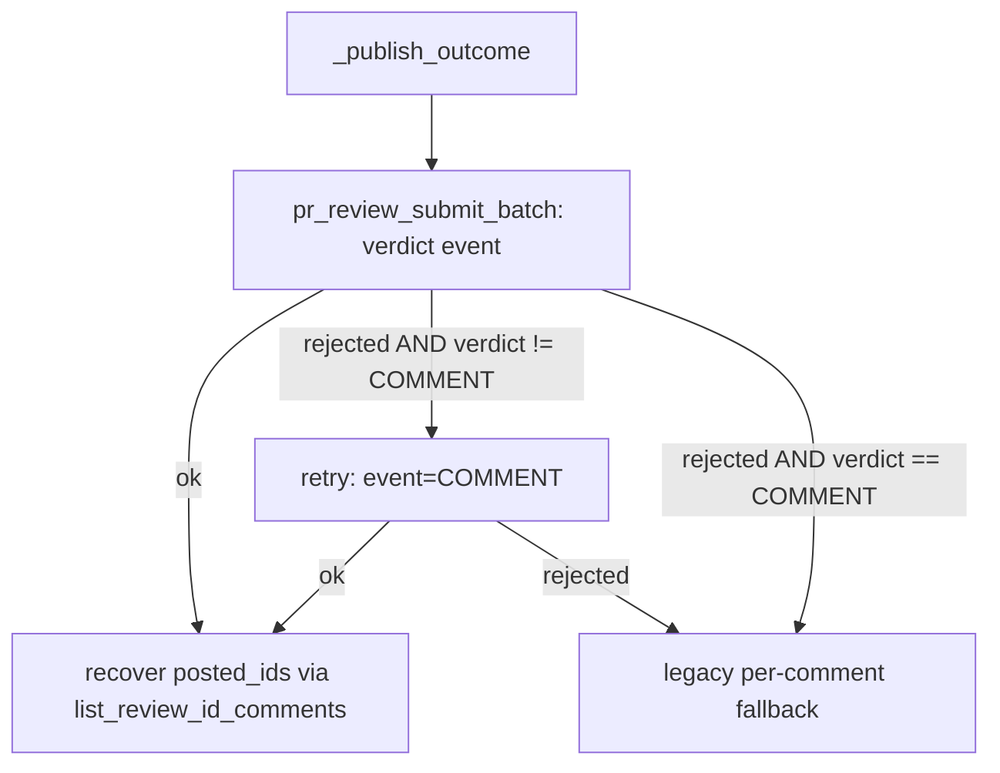

# Single batched review submission per reviewer

## Intent

Posting one reviewer's round of comments makes one blocking `gh`
subprocess per inline comment plus one more for the verdict. Replace
that per-comment burst with a single `gh api` call per reviewer that
carries the verdict and every inline comment together, using
GitHub's batched-review endpoint the codebase has never exercised
before.

## Context

`ReviewTeamOrchestrator._publish_outcome`
(`src/repoach/review/orchestrator.py:808-893`) is called once per
reviewer from the sequential outer loop at
`src/repoach/review/orchestrator.py:643-652`
(`for outcome in outcomes: self._publish_outcome(...)`). Today it:

1. Loops `outcome.comments` and calls
   `GhCli.pr_review_comment` (`gh_client.py:321-367`) once per
   finding — one blocking `subprocess.run` per comment, all funnelled
   through `GhCli._spawn` (`gh_client.py:102-125`).
2. Calls `GhCli.pr_review_submit` (`gh_client.py:369-401`, `gh pr
   review --approve/--request-changes/--comment`) once for the
   verdict.
3. On a `GITHUB_TOKEN`-authenticated run (the actual CI
   `auto-review.yml` path — `GITHUB_TOKEN` bots cannot submit
   `APPROVE`/`REQUEST_CHANGES` reviews, only `COMMENT`; documented in
   `_publish_outcome`'s own docstring and pinned by
   `tests/unit/test_review_team.py::test_review_submit_falls_back_to_issue_comment`),
   step 2 is rejected and a second `pr_review_comment` call posts a
   plain fallback issue comment.

For `N` findings from one reviewer that yields `N + 1` gh subprocess
calls locally, `N + 2` in the realistic CI case — repeated once per
reviewer, four times per round. `gh_client.py` never wraps `POST
/repos/{owner}/{repo}/pulls/{pull_number}/reviews`, the endpoint that
accepts a verdict (`event`) and a `comments[]` array in one call
(`grep -rn "pulls/.*reviews\|comments\[\]" src/repoach/review/*.py`
returns zero hits today).

This spec adds that batched call and switches `_publish_outcome` to
use it. It deliberately does **not** touch the outer loop at
`orchestrator.py:643-652` — see Non-Goals.

## Goals

- G1: Collapse the per-reviewer GitHub-write volume from `N (+1 or
  +2)` gh subprocesses down to 1 (2 in the `GITHUB_TOKEN`
  downgrade case), by adding `GhCli.pr_review_submit_batch` and
  switching `_publish_outcome` to call it instead of looping
  `pr_review_comment`.
- G2: Preserve every externally observable invariant of the current
  posting path: a single bad comment anchor still degrades in
  isolation rather than losing the whole reviewer's output, the
  `GITHUB_TOKEN` approve/reject restriction still resolves to a
  visible fallback, `posted_ids` still feeds the auto-challenge pass,
  and the sticky archive comment still posts strictly after every
  reviewer's review.
- G3: Keep `gh_client.py` the sole owner of the `gh api`/`gh pr`
  subprocess surface — `orchestrator.py` calls only the new
  higher-level method, it never builds a raw `gh api` argv itself.

## Non-Goals

- NG1: Pooling the outer reviewer-posting loop
  (`orchestrator.py:643-652`) with a `ThreadPoolExecutor` (mirroring
  the existing round-1 pattern at `orchestrator.py:417`). Batching
  alone removes the dominant share of the call volume (the
  per-comment inner burst); the outer loop stays a plain sequential
  `for outcome in outcomes: self._publish_outcome(...)`. Threading it
  needs its own synchronization design for the shared
  `posted_ids` dict and `team.posted_comments`/`team.posted_reviews`
  counters (currently safe only because the loop is sequential) and
  must keep the archive-comment-last-write invariant across
  concurrent tasks — real work, scoped to a separate, later change,
  not bundled here (mirrors how round-two's pooled dialogue was
  scoped as its own distinct change rather than folded into round
  one's pooling).
- NG2: Fixing the multi-page `gh api --paginate` JSON-decode
  limitation shared by `list_review_comments` and
  `find_archive_comment` today. The new `list_review_id_comments`
  method added here follows the same single-page `json.loads`
  convention as its siblings for consistency; it inherits the same
  pre-existing limitation rather than fixing it.
- NG3: Changing `resolve_fresh_head`, the round-two dialogue path, or
  any DB/persistence schema.
- NG4: Retrying more than once. A batched submission gets at most one
  event-downgrade retry (`APPROVE`/`REQUEST_CHANGES` → `COMMENT`);
  anything beyond that falls back to the pre-existing per-comment
  path rather than looping further batched attempts.

## Assumptions

- A1: GitHub's `POST /repos/{owner}/{repo}/pulls/{pull_number}/reviews`
  endpoint accepts `event`, `body`, and a `comments` array of
  `{path, line, side, body}` objects in one request — documented
  GitHub REST behavior, never exercised by this codebase before this
  spec.
- A2: `gh api --method POST <path> --input -` reads the JSON request
  body from stdin. The existing scalar `-f`/`-F` flags used elsewhere
  in `gh_client.py` cannot express a nested array of comment objects,
  so the batched call is the first caller in this file to need a
  stdin-fed body.
- A3: The `head_sha` resolved by `resolve_fresh_head` and passed into
  `_publish_outcome` remains a valid anchor for `commit_id` at
  posting time — the same assumption every existing
  `pr_review_comment` call already relies on.

## Interface

`GhCli` (`src/repoach/review/gh_client.py`) gains two methods and one
internal signature change:

```python
def pr_review_submit_batch(
    self,
    pr_number: int,
    *,
    commit_sha: str,
    verdict: str,
    body: str,
    comments: list[dict[str, object]],
) -> GhResult: ...

def list_review_id_comments(
    self,
    pr_number: int,
    review_id: int,
) -> list[dict[str, object]]: ...
```

Inputs:
- `pr_number`: `int` — PR number on origin.
- `commit_sha`: `str` — non-empty SHA the inline comments anchor to
  (`commit_id` in GitHub's payload).
- `verdict`: `str` — one of `"APPROVE"` / `"REQUEST_CHANGES"` /
  `"COMMENT"` (the `ReviewVerdict` enum values), forwarded verbatim
  as the review's `event` (unrecognised values fall back to
  `"COMMENT"`, matching `pr_review_submit`'s existing
  `flag_map.get(..., "--comment")` fallback style).
- `comments`: `list[dict[str, object]]` — one dict per inline
  comment, each carrying `"file"` (`str`, repo-relative path),
  `"line"` (`int`, 1-based), and `"body"` (`str`, rendered comment
  markdown, already formatted by the caller — `pr_review_submit_batch`
  does not add the `**[role/severity]**` prefix itself).
- `review_id` (for `list_review_id_comments`): `int` — the `id` of a
  review previously created by `pr_review_submit_batch` (recovered
  from that call's `res.stdout`).

Outputs:
- `pr_review_submit_batch` → `GhResult`; on success, `stdout` carries
  the created review's JSON (its own `"id"` field, needed by the
  caller to recover comment ids).
- `list_review_id_comments` → `list[dict[str, object]]`, each entry
  carrying at least `"id"` (`int`), `"path"` (`str`), `"line"`
  (`int`); `[]` on any failure (mirrors `list_review_comments`'s
  existing fail-open contract).

Errors: none raised — both methods follow the module's existing
contract (`GhCli` never raises on a failed subprocess; callers read
`GhResult.ok` / an empty list).

`GhCli._run` and `GhCli._spawn` gain an additional keyword-only
`input_data: str | None = None`, forwarded to `subprocess.run(...,
input=input_data)`. Every existing call site omits it, so every
current call keeps its exact current behavior (`subprocess.run`'s own
default for `input` is already `None`).

`ReviewTeamOrchestrator._publish_outcome`'s external signature is
unchanged (`pr_number`, `outcome`, `head_sha`, `team`, `posted_ids`);
only its internal call pattern changes.

## Behavior

### Nominal

1. `_publish_outcome` builds `review_body` exactly as today (verdict
   + summary + model/tokens/elapsed footer) and one comment dict per
   `outcome.comments` entry, each `body` rendered with the same
   `**[{role}/{severity}]** {body}\n\n_— Repoach review-bot
   ({model_used})_` template used today.
2. When `head_sha` is not `None`, calls
   `self._gh.pr_review_submit_batch(pr_number, commit_sha=head_sha,
   verdict=outcome.verdict.value, body=review_body,
   comments=comments_payload)` — exactly one gh subprocess for the
   whole reviewer's output.
3. On success: `team.posted_reviews += 1`,
   `team.posted_comments += len(outcome.comments)`. When
   `posted_ids is not None` and `comments_payload` is non-empty,
   parse the created review's `id` out of `res.stdout`, call
   `self._gh.list_review_id_comments(pr_number, review_id)`, and set
   `posted_ids[(path, line)] = comment_id` for every returned entry
   whose `path`/`line`/`id` are present and well-typed — the same
   `(file, line) -> comment id` shape the auto-challenge pass
   (`_run_auto_challenge_pass`, `orchestrator.py:1011-1082`) already
   consumes today.

### Edge cases

- `head_sha is None` (fresh-head resolution failed) → skip batching
  entirely; run the pre-existing per-comment-loop +
  `pr_review_submit` path unchanged. Today's degrade behavior for an
  unresolved head is preserved verbatim.
- `outcome.comments == []` (a clean approve with no findings) →
  `pr_review_submit_batch` is still called once, with `comments=[]`
  — a verdict-only batched review. No regression versus today's
  single `pr_review_submit` call for this case.
- The batched call fails (non-zero exit / non-2xx) while `verdict` is
  `"APPROVE"` or `"REQUEST_CHANGES"` (the realistic CI case —
  `GITHUB_TOKEN` cannot submit those review states) → retry exactly
  once, same `comments_payload`, `verdict` forced to `"COMMENT"`. On
  success, counts and id-recovery proceed exactly as the nominal
  path — two gh calls total for that reviewer instead of `N + 2`.
- The retried `COMMENT`-event call (or the original call, when
  `verdict` was already `"COMMENT"`) also fails (e.g. one comment's
  `line` no longer resolves against `commit_sha` after a force-push,
  HTTP 422) → fall back to the pre-existing sequence unchanged: one
  `pr_review_comment` call per finding (a bad anchor fails in
  isolation, siblings still post), then `pr_review_submit`, then —
  if that too is rejected — the existing fallback issue comment. No
  regression versus today's failure characteristics.

### Failure scenarios

- `gh` binary unavailable (`GhCli.available is False`) →
  `pr_review_submit_batch` returns the existing `returncode=127`
  `GhResult` via `_run`'s existing not-available guard (unchanged);
  `_publish_outcome` treats that as a rejected batch and routes into
  the same fallback chain as any other rejection.
- Malformed / unparseable JSON in the created review's `stdout` (not
  expected from a genuine `gh` success, but guarded defensively) →
  id recovery no-ops (`posted_ids` unchanged), logged at debug — the
  auto-challenge pass simply cannot target that reviewer's threads
  this round, the same fail-open contract `_parse_comment_id`
  documents today for the per-comment path.

Existing tests in `tests/unit/test_review_team.py` that drive
`ReviewTeamOrchestrator.review_pr(..., post_to_github=True)` —
`test_review_pr_runs_team_and_publishes`,
`test_review_submit_falls_back_to_issue_comment`,
`test_review_pr_writes_archive_comment_when_posting` — exercise
`_publish_outcome` end to end through `_StubGhCli`. Implementing this
spec requires adding `pr_review_submit_batch` (and
`list_review_id_comments`) to `_StubGhCli` so those tests keep
passing; their asserted `posted_comments`/`posted_reviews` totals are
unchanged by this spec (the per-reviewer accounting stays the same —
only the underlying `gh` call count collapses), but
`test_review_submit_falls_back_to_issue_comment`'s
`review_submit_fail=True` flag must make the stub's batched call fail
for every event (not just the legacy `pr_review_submit`) so the test
still exercises the full-fallback scenario it is named for.

## Architecture Impact

- Adds dependency: SP-REVIEW-POST-BATCH -> SP-ORCH-DOCSTRING (this
  spec edits `_publish_outcome` inside `orchestrator.py`, a file
  SP-ORCH-DOCSTRING owns; same module, no new import boundary, but
  the disjoint-ownership rule requires the edge since this spec does
  not itself own that file).
- New / changed coupling: `orchestrator.py`'s `_publish_outcome`
  gains calls to two new `gh_client.py` methods
  (`pr_review_submit_batch`, `list_review_id_comments`). This is the
  same cross-file caller/callee shape that already exists today
  (`pr_review_comment` / `pr_review_submit` are already called
  cross-file) — no new coupling shape, just new methods on an
  existing coupling.
- Removes dependency: none.

## Diagram



## Acceptance Criteria

- [ ] AC1: `GhCli.pr_review_submit_batch` sends exactly one `gh`
  subprocess call — `gh api --method POST
  repos/:owner/:repo/pulls/{pr}/reviews --input -` — carrying the
  verdict as `event`, the review body, and one `comments[]` entry per
  finding (`path`/`line`/`body`) via stdin JSON, never via `-f`/`-F`
  scalar flags.
  Test: `tests/unit/test_review_team.py::test_pr_review_submit_batch_posts_single_call_with_comments_array`
- [ ] AC2: When the batched call is rejected while `verdict` is
  `APPROVE` or `REQUEST_CHANGES`, `_publish_outcome` retries exactly
  once with the same comments and `event="COMMENT"`; on that retry
  succeeding, exactly 2 gh calls were made for that reviewer (no
  per-comment loop, no separate legacy `pr_review_submit` call), and
  `team.posted_reviews`/`team.posted_comments` reflect one review
  submission carrying every comment.
  Test: `tests/unit/test_review_team.py::test_publish_outcome_downgrades_to_comment_event_on_batch_rejection`
- [ ] AC3: When the retried `COMMENT`-event batch also fails,
  `_publish_outcome` falls back to the pre-existing per-comment-loop
  + verdict-submit + fallback-issue-comment sequence, so a single bad
  anchor degrades gracefully instead of losing the whole reviewer's
  output.
  Test: `tests/unit/test_review_team.py::test_publish_outcome_falls_back_to_per_comment_when_batch_fully_rejected`
- [ ] AC4: On a successful batched submission with non-empty
  comments, the GitHub ids of the newly created inline comments are
  recovered via `GhCli.list_review_id_comments` (scoped to the
  created review's own id, not the whole-PR comment list) and
  populate `posted_ids` keyed by `(file, line)`.
  Test: `tests/unit/test_review_team.py::test_publish_outcome_recovers_posted_ids_from_batched_review`
- [ ] AC5 (integration): `ReviewTeamOrchestrator.review_pr(pr_number=...,
  post_to_github=True)` driven end to end against a real executable
  stand-in for `gh` (a real subprocess spawn recording its own argv
  and stdin, not a Python-level stub) posts exactly one `gh api
  --method POST .../pulls/{pr}/reviews --input -` call per reviewer
  (4 total for the four-reviewer team) and issues zero legacy `gh pr
  review` calls and zero per-comment `gh api --method POST
  .../pulls/{pr}/comments` calls, with the archive-comment upsert
  call recorded only after all four batched-review calls have
  completed.
  Test: `tests/integration/test_review_post_batch_end_to_end.py::test_review_pr_posts_batched_reviews_via_real_gh_subprocess`

## Open Questions

None.
