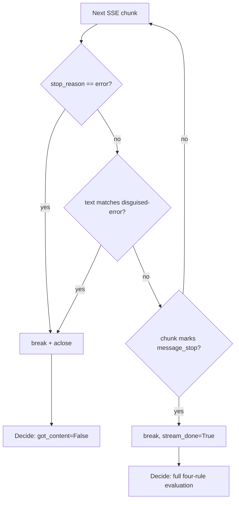

# Per-chunk terminal-error abort in peek_for_content

## Intent

`peek_for_content` drains every chunk of a chain candidate's SSE stream
all the way to `message_stop` before deciding whether the candidate
succeeded, even when the stream already carries an unambiguous
terminal-error signal (`stop_reason == "error"`, or the documented NIM
disguised-connection-error text) long before that. Evaluate those two
signals per-chunk and break the drain the instant either fires, so a
hung or disguised-error stream stops costing wall-clock time and an
open connection the moment failure is already certain.

## Context

`src/repoach/llm_proxy/api/_failover.py` (module docstring lines 1-44,
disguise-text incident documented at lines 16-21) is the pure SSE
inspection layer `ClaudeProxyService._stream_with_failover`
(`src/repoach/llm_proxy/api/services.py:342`) calls per chain
candidate. `peek_for_content` (lines 193-307) reads every chunk into
`buffered` inside an `async for chunk in stream:` loop (lines 245-262)
that only `break`s on `chunk_marks_stream_end` (a `message_stop` event)
or natural exhaustion; the four-rule decision (lines 200-217 in prose,
enforced at lines 268-288) runs once, after the loop, over accumulated
state (`saw_tool_use`, `final_output_tokens`, `saw_error_stop_reason`,
`accumulated_text`).

Two of those signals are already knowable mid-stream:

- `stop_reason == "error"` on a `message_delta` — already detected
  per-chunk today (`saw_error_stop_reason` is set inside the loop),
  but the loop keeps consuming chunks instead of stopping there.
- The documented disguised-error text (`content_block_delta` whose
  accumulated `text_delta` reads `"Connection error.
  (request_id=…)"`, the 2026-05-04 NIM incident, lines 16-21) — today
  only ever gets classified once the terminal `message_delta` reports
  `output_tokens == 0` (lines 274-276), i.e. after the whole stream is
  read.

`_failover.py` is owned by `SP-PROXY-FIRST-BYTE-DEADLINE` (`owns.code`,
verified by grepping every `docs/specs/*.md` frontmatter for
`llm_proxy/api/_failover.py`) — this spec's `depends_on` names that
spec and this diff edits `_failover.py` under that coupling, exactly
as `SP-PROXY-FIRST-BYTE-DEADLINE` itself edited it under its own
`depends_on: [SP-BUDGET-RETRY-FIXES]` coupling to `services.py`.
`services.py`, `_failover.py`'s only caller, remains owned by
`SP-BUDGET-RETRY-FIXES` and is untouched by this diff (NG4).

## Goals

- G1: `peek_for_content` breaks its drain loop the instant a
  `message_delta` chunk carries `stop_reason == "error"`, instead of
  continuing until `message_stop`/exhaustion.
- G2: `peek_for_content` breaks its drain loop the instant the
  accumulated `text_delta` content matches the documented
  disguised-connection-error signature, before any terminal
  `message_delta` arrives.
- G3: on either early exit, the abandoned upstream `stream` is
  explicitly closed (`aclose()`) rather than left open for garbage
  collection — releasing a hung connection's resources promptly.
- G4: the whitespace-only and zero-output-tokens rules keep their
  exact existing logic and continue to require the terminal
  `message_delta`/`message_stop`; G1/G2 only add checks that run
  ahead of them in the same loop, never replace or reorder them
  relative to each other.
- G5 (side effect, documented not sold): because G2 now classifies a
  disguised-error-text stream before the output-tokens rule ever
  runs, `looks_budget_starved` correctly comes out `False` for it
  (previously, undocumented, it could read `True`, making such a
  stream eligible for `_retry_with_more_budget`) — no code in
  `services.py` changes to achieve this; it falls out of G2's earlier
  evaluation point.

## Non-Goals

- NG1: no change to the whitespace-only or zero-output-tokens rules'
  internal logic — they remain evaluated only once the stream is
  fully drained, exactly as today.
- NG2: no early-forwarding of buffered chunks to the client before a
  candidate is confirmed successful. Forwarding still begins only
  after `got_content is True` (`services.py:366-421`, unchanged) —
  the failover-always-possible invariant (nothing is ever forwarded
  before a candidate is confirmed good) is preserved exactly.
- NG3: no new `Settings`/config field and no configurable pattern
  list. The disguised-error signature stays a fixed internal
  constant covering only the documented 2026-05-04 NIM incident
  shape; broader/other providers' disguise signatures are future
  work, not this spec.
- NG4: no change to `services.py`, `_retry_with_more_budget`, or any
  other module — this diff is confined to `_failover.py` plus the
  test files listed under Acceptance Criteria.
- NG5: no hedging, racing, or speculative dispatch of a later chain
  candidate — this spec only shortens the CURRENT candidate's
  evaluation window; the next candidate is still only started after
  the current one is fully decided (success or failure).

## Assumptions

- A1: `stop_reason == "error"` remains the highest-priority signal
  (unchanged from today — it already overrides `tool_use` and the
  output-tokens rule at lines 268-271); adding the disguised-text
  check does not reorder this existing priority, it slots in as a
  second, equally authoritative "stop now" signal.
- A2: the documented disguised-error text is treated as always
  synthetic/placeholder wherever it appears in the accumulated text —
  consistent with the existing docstring's characterization of that
  exact text (lines 16-21) as a transport-error artifact, never
  legitimate model output. A model whose genuine answer happens to
  start with that literal phrase is an accepted, pre-existing
  misclassification risk (the same text already forces
  `output_tokens == 0` failure today; this spec only detects the same
  synthetic response earlier).
- A3: every real provider's `stream_response` (`providers/base.py:69`)
  returns a genuine async generator, which always supports `aclose()`.
  The defensive `getattr(stream, "aclose", None)` guard exists only
  for a hypothetical hand-rolled `AsyncIterator` test double that
  implements `__aiter__`/`__anext__` without `aclose` — matching the
  narrower `AsyncIterator[str]` type the function is actually typed
  against.

## Interface

`peek_for_content`'s signature and `PeekResult`'s fields are unchanged.
One new module-level constant and one new pure helper are added
alongside the existing `chunk_*` helpers:

Inputs:
- `stream: AsyncIterator[str]` — unchanged; raw SSE chunks from the
  current chain candidate's `stream_response` call.

Outputs:
- `PeekResult` — unchanged shape (`buffered`, `got_content`,
  `stream_done`, `looks_budget_starved`, `final_output_tokens`).
  `stream_done`'s docstring is updated (see Behavior) to describe the
  new early-exit case; its type and default are unchanged.

New:
- `text_is_disguised_error(text: str) -> bool` — pure helper, same
  style as `chunk_text_delta`/`chunk_marks_stream_end`; returns
  whether `text` opens with the documented disguised-error signature.
- `_DISGUISED_ERROR_TEXT_PATTERN: re.Pattern[str]` — module-level
  compiled regex backing the helper.

Errors: none new. `peek_for_content` still never raises on its own;
exceptions from `stream.__anext__()` propagate unchanged, exactly as
today.

## Behavior

### Nominal

A healthy stream (`tool_use` or real non-whitespace text, terminal
`message_delta` with `output_tokens > 0`) is unaffected: neither new
check ever matches, the loop still runs to `message_stop`, and the
decision is identical to today.

### Edge cases

- A `message_delta` chunk carries `stop_reason == "error"` before
  `message_stop` arrives -> the loop breaks on that exact chunk
  (`saw_error_stop_reason = True`, then `break`, without waiting for
  `chunk_marks_stream_end`). `got_content = False`,
  `decision_reason = "stop_reason_error"` (unchanged priority),
  `stream_done = False` (the terminal marker was never observed), and
  the abandoned `stream` is closed via `aclose()`.
- A `content_block_delta` text chunk's accumulated text matches
  `text_is_disguised_error` before any terminal `message_delta`
  arrives -> the loop breaks on that chunk. `got_content = False`,
  `decision_reason = "disguised_error_text"` (evaluated ahead of the
  `tool_use`/output-tokens/whitespace rules, per G1/G2's ordering),
  `looks_budget_starved = False` (the reason is not in the
  budget-starved set), `stream_done = False`, stream closed via
  `aclose()`.
- Zero `output_tokens` or whitespace-only text WITHOUT either
  terminal-error signal present -> unchanged: the loop still runs to
  `message_stop`/exhaustion, `stream_done = True`, decision made
  exactly as today (NG1).
- `tool_use` appears in a stream where NEITHER new signal ever fires
  -> unchanged (`decision_reason = "tool_use"`, full drain as before,
  since a `tool_use` content_block_start does not itself terminate
  the loop early — only the two new checks and `message_stop` do).

### Failure scenarios

- `stream` does not implement `aclose` (a hand-rolled `AsyncIterator`
  test double, not a real provider generator) -> the
  `getattr(stream, "aclose", None)` guard skips the close call; no
  crash, `PeekResult` is still returned normally.
- The provider's own `stream_response` generator has no `try/finally`
  around its `yield`s (no current provider is shaped this way) ->
  `aclose()` still raises `GeneratorExit` inside it per normal Python
  async-generator semantics; nothing on the `_failover.py` side
  depends on the callee having its own cleanup.

Updated `PeekResult.stream_done` docstring (replacing "Always ``True``
after :func:`peek_for_content` returns"):

```
stream_done: ``True`` once the stream emitted ``message_stop``.
    ``False`` when :func:`peek_for_content` exited early after a
    per-chunk terminal-error signal fired (``stop_reason == "error"``
    on a ``message_delta``, or the documented disguised-error text
    pattern) — in that case the remaining chunks were never read and
    the caller's ``stream`` was explicitly closed via ``aclose()``
    instead of drained to completion.
```

Illustrative shape of the loop change (the two new checks; existing
lines are elided with `...`, no inline comments are introduced in the
real diff):

```python
_DISGUISED_ERROR_TEXT_PATTERN = re.compile(r"^Connection error\.\s*\(request_id=")


def text_is_disguised_error(text: str) -> bool:
    """Return whether accumulated text_delta content opens with the
    documented NIM disguised-connection-error signature.

    Matches the literal shape observed live on 2026-05-04 17:31
    (``_failover.py`` module docstring): a synthetic
    ``"Connection error. (request_id=…)"`` text block a broken
    upstream emits in place of a real completion. Any other text,
    including partial prefixes still arriving, returns ``False``.
    """
    return _DISGUISED_ERROR_TEXT_PATTERN.match(text) is not None


async def peek_for_content(stream: AsyncIterator[str]) -> PeekResult:
    buffered: list[str] = []
    saw_tool_use = False
    final_output_tokens: int | None = None
    saw_error_stop_reason = False
    saw_disguised_error_text = False
    accumulated_text: list[str] = []
    stream_done = False
    exited_on_terminal_error = False
    async for chunk in stream:
        buffered.append(chunk)
        if chunk_is_tool_use_start(chunk):
            saw_tool_use = True
        usage = chunk_message_delta_usage(chunk)
        if usage is not None:
            tokens = usage.get("output_tokens")
            if isinstance(tokens, int):
                final_output_tokens = tokens
        stop_reason = chunk_message_delta_stop_reason(chunk)
        if stop_reason == "error":
            saw_error_stop_reason = True
            exited_on_terminal_error = True
            break
        text = chunk_text_delta(chunk)
        if text is not None:
            accumulated_text.append(text)
            if text_is_disguised_error("".join(accumulated_text)):
                saw_disguised_error_text = True
                exited_on_terminal_error = True
                break
        if chunk_marks_stream_end(chunk):
            stream_done = True
            break

    if exited_on_terminal_error:
        aclose = getattr(stream, "aclose", None)
        if aclose is not None:
            await aclose()
```

The post-loop decision block gains one new `elif` branch, inserted
between the existing `stop_reason_error` and `tool_use` branches
(everything else — the whitespace/output-tokens branches and the
`looks_budget_starved` computation — is unchanged, satisfying NG1):

```python
if saw_error_stop_reason:
    got_content = False
    decision_reason = "stop_reason_error"
elif saw_disguised_error_text:
    got_content = False
    decision_reason = "disguised_error_text"
elif saw_tool_use:
    got_content = True
    decision_reason = "tool_use"
elif final_output_tokens is None or final_output_tokens == 0:
    got_content = False
    decision_reason = "output_tokens_zero"
elif text_strip_chars == 0:
    got_content = False
    decision_reason = "whitespace_only"
else:
    got_content = True
    decision_reason = "real_text"
```

## Architecture Impact

- `_failover.py` is owned by `SP-PROXY-FIRST-BYTE-DEADLINE`
  (`owns.code`), not frontier. This spec's `depends_on:
  [SP-PROXY-FIRST-BYTE-DEADLINE]` is the edge that authorizes editing
  it — no additional edge is introduced by this diff. `services.py`
  (owned by `SP-BUDGET-RETRY-FIXES`) already imports `PeekResult`/
  `peek_for_content` from it (`services.py:29`) — that import is
  pre-existing and untouched by this diff, so no new cross-owns edge
  is introduced there either.
- Behavioral coupling worth flagging to `SP-BUDGET-RETRY-FIXES`
  without a code change on its side: a disguised-error-text stream's
  `peek.looks_budget_starved` now reliably reads `False` (G5), so
  `services.py:423`'s `_retry_with_more_budget` branch is correctly
  never entered for that class of stream. No import or signature
  changed; `PeekResult`'s field set and types are identical.
- New / changed coupling, cycles, or shared state: none. The
  informational `stream_done=peek.stream_done` field logged at
  `services.py:488` now legitimately reads `False` more often
  (early-abort paths) — it is a log-only field with no consumer
  branching on its value.

## Diagram



## Acceptance Criteria

- [ ] AC1: unit — new file
  `tests/unit/test_proxy_early_abort_terminal_error.py::test_error_stop_reason_breaks_before_message_stop`:
  a fake `AsyncIterator` yielding `message_start` then a
  `message_delta` with `stop_reason="error"`, followed by a sentinel
  that raises `AssertionError` if `__anext__` is ever called again.
  On today's tree this test fails (the drain keeps going and hits the
  sentinel); after the fix it passes with `got_content is False` and
  `stream_done is False`.
- [ ] AC2: unit — same file,
  `test_disguised_error_text_breaks_before_message_stop`: the
  documented literal `"Connection error.
  (request_id=req_def232f1cfca)"` as a lone `content_block_delta`
  text chunk (mirroring
  `tests/unit/test_proxy_failover_toolless.py`'s `_FAKE_ERROR_TEXT_DELTA`
  fixture), followed by the same raise-if-drained-further sentinel.
  Fails today (drain continues past the disguised text and hits the
  sentinel); after the fix, passes with `got_content is False`,
  `decision_reason` effectively `"disguised_error_text"` (asserted
  indirectly via `looks_budget_starved is False`, distinguishing it
  from the `output_tokens_zero` budget-starved path), and
  `stream_done is False`.
- [ ] AC3: unit — same file,
  `test_early_exit_calls_aclose_on_the_abandoned_stream` (primary,
  discriminating: a `_TrackingStream` test double exposing `aclose`
  and a `closed: bool` flag, driven through the AC1 scenario; asserts
  `closed is True` — `False` today since nothing calls `aclose()`,
  `True` after the fix) plus
  `test_early_exit_tolerates_a_stream_without_aclose` (a second fake
  lacking `aclose` entirely, proving the `getattr` guard prevents a
  crash on either signal).
- [ ] AC4: existing pinned assertions updated to the new,
  now-correct `stream_done` contract (each is individually
  discriminating: asserting the new value fails against today's
  unmodified `_failover.py` and passes after) —
  `tests/unit/test_proxy_chain_failover.py::test_peek_for_content_treats_fake_error_text_as_failure`
  (line 223, `assert result.stream_done is True` becomes
  `is False`),
  `tests/unit/test_proxy_402_failover.py::test_peek_classifies_openrouter_error_as_failure`
  (line 98, same flip), and
  `tests/unit/test_proxy_410_auto_skip.py::test_disguised_error_with_error_stop_reason_is_failure`
  (line 97, same flip). No other assertion in any of the three files
  changes; `got_content is False` stays asserted unchanged in all
  three.
- [ ] AC5 (INTEGRATION): new file
  `tests/integration/test_proxy_early_abort_hung_stream.py::test_hung_disguised_error_candidate_fails_over_without_waiting_for_the_hang`.
  Drives the real `/v1/messages` endpoint via `create_app()` +
  `TestClient` (pattern of
  `tests/integration/test_proxy_dead_hop_quarantine.py`) with a
  two-candidate chain: the first is a truthful boundary fake
  `BaseProvider` whose `stream_response` yields `message_start`, then
  the documented disguised-error text delta, then
  `await asyncio.sleep(4.0)` before ever reaching `message_delta`/
  `message_stop` (wrapped in `try/finally: self.closed = True` to
  observe cleanup); the second is a healthy provider yielding real
  text. `budget_retry_enabled` is set `False` on the resolved
  `Settings` to keep the timing story isolated to this spec's change.
  Asserts: the response is 200 and carries the healthy candidate's
  text; wall-clock time for the whole request is under 2.0 seconds
  (fails today — the unmodified drain waits out the full 4-second
  simulated hang before failing over, so elapsed time is >= 4.0s and
  the assertion fails; passes after the fix, since the disguised-text
  chunk aborts the drain immediately); and the hung provider's
  `closed` flag is `True` (the abandoned stream was explicitly
  closed rather than left to time out).
- [ ] AC6: `ruff check` + `ruff format --check` green; zero inline
  comments (SP-NO-INLINE-COMMENTS-GATE) and no `# noqa` anywhere in
  the diff; full `pytest tests/unit` green; net new/changed
  non-test code in `_failover.py` stays under ~40 lines.

## Open Questions

None.
