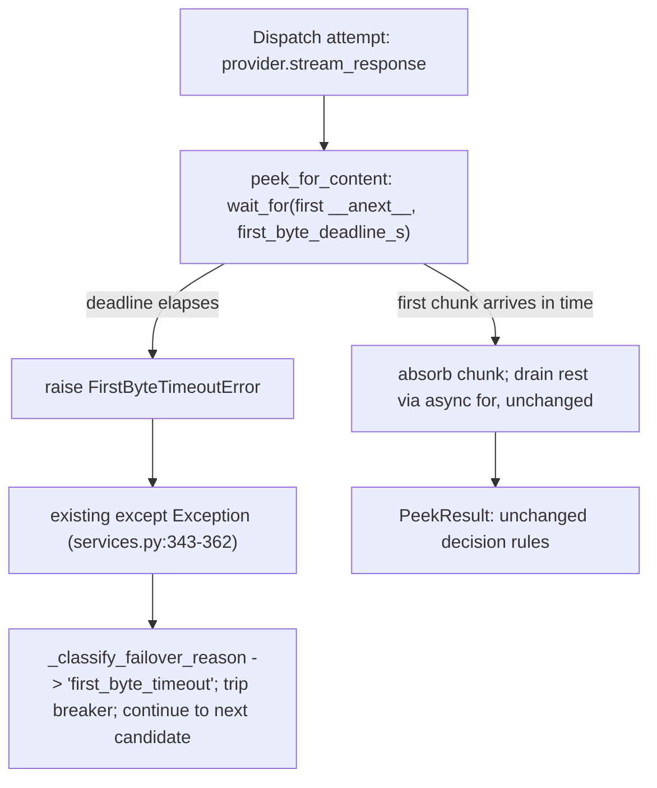

# First-byte deadline per chain hop

## Intent

Bound "the hop accepted the connection but never sent a single byte"
distinctly from "the hop is slow but alive" — today both look
identical to the dispatcher until the blanket `http_read_timeout`
(120 s default) elapses or the provider itself gives up. Add a
separate, tighter first-byte deadline so a silent hop fails over in
seconds, not up to two minutes, without touching the drain-then-forward
architecture at all.

## Context

`ClaudeProxyService._stream_with_failover`
(`src/repoach/llm_proxy/api/services.py:274-513`) walks the resolved
chain with a plain `for` loop: for each candidate it calls
`provider.stream_response(...)` then `await peek_for_content(stream)`
(`services.py:337-342`), all inside a `try/except Exception`
(`services.py:335-362`) that already treats any raised exception as a
failover trigger — classified by `_classify_failover_reason`
(`services.py:41-79`), logged as `proxy_chain_failover_fired`, breaker
tripped via `_trip_breaker`, loop continues to the next candidate.

`peek_for_content` (`src/repoach/llm_proxy/api/_failover.py:193-307`)
drains every chunk of the winning-or-losing candidate's stream via a
plain `async for chunk in stream:` (`_failover.py:245-262`) until
`message_stop` or natural exhaustion, before any success/failure
decision is made. There is currently no bound on how long the FIRST
`__anext__()` of that loop may take — only the transport-level
`http_read_timeout` (`src/repoach/llm_proxy/providers/base.py:22`,
defaulted to `120.0` in `src/repoach/llm_proxy/config/settings.py:350`
and wired into every provider's `httpx.Timeout` at
`providers/registry.py:125`) applies, and that timeout resets on
EVERY successful read — it bounds the gap between two already-started
reads, not the wait for the very first one. A hop that accepts the
TCP/TLS handshake and then sends nothing is therefore indistinguishable
from a hop that is genuinely mid-generation until the full 120 s
elapses (or the provider's own idle timer fires first).

The same `_retry_with_more_budget` same-candidate retry
(`services.py:515-578`) calls `peek_for_content` a second time
(`services.py:555`) and is subject to the identical gap.

`src/repoach/llm_proxy/api/services.py` is owned by
`SP-BUDGET-RETRY-FIXES` (whole file) — this spec edits it (both
`peek_for_content` call sites, plus `_classify_failover_reason`) but
does not re-claim it; see Architecture Impact.

## Goals

- G1: A distinct `first_byte_deadline_s` setting bounds how long
  `peek_for_content` will wait for the stream's FIRST chunk, separate
  from `http_read_timeout`.
- G2: Expiry cancels that hop and fails over exactly as an
  exception-path failure does today — no new branch in
  `_stream_with_failover`'s dispatch loop, only a new classified
  reason so operators can tell "silent hop" apart from every other
  `"timeout"`.
- G3: A hop whose first chunk arrives before the deadline (however
  slow) is completely unaffected — `peek_for_content`'s behavior and
  `PeekResult` contract are byte-for-byte identical to today whenever
  a first chunk does arrive in time, or when no deadline is passed at
  all (every existing caller keeps working unmodified).

## Non-Goals

- NG1: No change to the drain-then-forward architecture — forwarding
  to the client still only begins after `peek_for_content` decides
  `got_content=True`; this spec does not start forwarding chunks
  early, race hops concurrently, or hedge.
- NG2: No per-chunk / mid-stream stall detection (bounding the gap
  BETWEEN chunks once streaming has started remains
  `http_read_timeout`'s job, unchanged).
- NG3: No early-abort on terminal-error frames (a separate, later
  spec's concern) and no hedged/racing dispatch — both are explicitly
  out of scope for this standalone change.
- NG4: No change to `budget_retry_enabled`/`looks_budget_starved`
  semantics beyond passing the same new keyword through to the
  retry's `peek_for_content` call.

## Assumptions

- A1: When `asyncio.wait_for` cancels an in-flight `__anext__()` on a
  provider's async-generator stream, the cancellation propagates
  through any `async with` / context managers the generator holds
  (e.g. an `httpx` streaming response), closing the underlying
  connection — standard `asyncio` async-generator cancellation
  semantics. Verifying socket-level teardown per concrete provider
  transport is out of scope; this spec asserts the failover/
  classification contract only.
- A2: `src/repoach/llm_proxy/api/services.py` remains owned by
  `SP-BUDGET-RETRY-FIXES` for the duration of this spec's
  implementation; this spec's Developer session edits it directly
  (two `peek_for_content` call sites + one classifier branch) under
  the `depends_on` coupling rather than re-claiming it.

## Interface

Inputs:
- `stream: AsyncIterator[str]` — unchanged, the raw SSE chunk stream
  from a chain candidate's `stream_response`.
- `first_byte_deadline_s: float | None` — NEW, keyword-only parameter
  on `peek_for_content`, default `None`. `None` or any value `<= 0`
  disables enforcement (identical to today's behavior). A positive
  value bounds only the wait for the stream's first chunk.
- `Settings.first_byte_deadline_s: float` — NEW Pydantic field on
  `repoach.llm_proxy.config.settings.Settings`, default `20.0`,
  `ge=0`. Env aliases (via the existing `_aliases()` helper,
  `settings.py:163-190`): `REPOACH_PROXY_FIRST_BYTE_DEADLINE_S`
  (canonical) / `FIRST_BYTE_DEADLINE_S` (legacy bare, per the
  project's dual-read convention — REPOACH_ wins on conflict). Both
  `_stream_with_failover`'s main attempt (`services.py:342`) and
  `_retry_with_more_budget`'s same-candidate retry (`services.py:555`)
  pass `first_byte_deadline_s=self._settings.first_byte_deadline_s`.

Outputs:
- `PeekResult` — unchanged shape and semantics whenever a first chunk
  arrives in time (or no deadline is set).
- `_classify_failover_reason(exc) -> str` — gains one new possible
  return value: `"first_byte_timeout"`.

Errors:
- `FirstByteTimeoutError` (NEW, `repoach.llm_proxy.api._failover.FirstByteTimeoutError`,
  subclasses `Exception`) — raised by `peek_for_content` when
  `first_byte_deadline_s` elapses before the stream's first chunk
  arrives. Propagates out of `peek_for_content` uncaught; the EXISTING
  `except Exception` blocks in `_stream_with_failover`
  (`services.py:335-362`) and `_retry_with_more_budget`
  (`services.py:550-566`) catch it exactly like any other dispatch
  exception today — no new exception-handling branch is added to
  either function.

## Behavior

### Nominal

`peek_for_content`'s drain loop is split into "fetch the first chunk
under a deadline" followed by "drain the rest exactly as today":

```python
import asyncio


class FirstByteTimeoutError(Exception):
    """Raised when a stream's first SSE chunk misses its deadline.

    Distinct from the transport-level ``http_read_timeout``
    (``providers/base.py``), which only bounds the gap between two
    already-started reads: this error fires when a hop accepts the
    connection and then sends nothing at all, a state otherwise
    indistinguishable from a legitimately slow-but-alive stream until
    the full read timeout elapses.
    """


async def peek_for_content(
    stream: AsyncIterator[str],
    *,
    first_byte_deadline_s: float | None = None,
) -> PeekResult:
    buffered: list[str] = []
    saw_tool_use = False
    final_output_tokens: int | None = None
    saw_error_stop_reason = False
    accumulated_text: list[str] = []
    stream_done = False

    def absorb(chunk: str) -> bool:
        nonlocal saw_tool_use, final_output_tokens, saw_error_stop_reason
        buffered.append(chunk)
        if chunk_is_tool_use_start(chunk):
            saw_tool_use = True
        usage = chunk_message_delta_usage(chunk)
        if usage is not None:
            tokens = usage.get("output_tokens")
            if isinstance(tokens, int):
                final_output_tokens = tokens
        stop_reason = chunk_message_delta_stop_reason(chunk)
        if stop_reason == "error":
            saw_error_stop_reason = True
        text = chunk_text_delta(chunk)
        if text is not None:
            accumulated_text.append(text)
        return chunk_marks_stream_end(chunk)

    stream_iter = stream.__aiter__()
    if first_byte_deadline_s is not None and first_byte_deadline_s > 0:
        try:
            first_chunk = await asyncio.wait_for(
                stream_iter.__anext__(), timeout=first_byte_deadline_s
            )
        except StopAsyncIteration:
            stream_done = True
        except TimeoutError as exc:
            raise FirstByteTimeoutError(
                f"no SSE chunk within first_byte_deadline_s={first_byte_deadline_s}"
            ) from exc
        else:
            if absorb(first_chunk):
                stream_done = True

    if not stream_done:
        async for chunk in stream_iter:
            if absorb(chunk):
                stream_done = True
                break
```

The decision-rule block below this (today's `_failover.py:264-300`)
is untouched — it already reads `buffered`, `saw_tool_use`,
`final_output_tokens`, `saw_error_stop_reason`, and
`accumulated_text`, which `absorb` populates identically to the
current inline loop body.

`services.py` wires the setting through both call sites:

```python
peek = await peek_for_content(
    stream, first_byte_deadline_s=self._settings.first_byte_deadline_s
)
```

(`_stream_with_failover`, replacing `services.py:342`) and

```python
retry_peek = await peek_for_content(
    stream, first_byte_deadline_s=self._settings.first_byte_deadline_s
)
```

(`_retry_with_more_budget`, replacing `services.py:555`).

`_classify_failover_reason` gains one isinstance check BEFORE its
existing generic substring check:

```python
def _classify_failover_reason(exc: BaseException) -> str:
    if isinstance(exc, FirstByteTimeoutError):
        return "first_byte_timeout"
    exc_name = type(exc).__name__
    name_lower = exc_name.lower()
    if "timeout" in name_lower:
        return "timeout"
```

(the remainder of the function, `services.py:56-79`, is unchanged).

`settings.py` gains one field, placed after `http_connect_timeout`
(`settings.py:352-354`) and before `nim: NimSettings = Field(...)`
(`settings.py:356`):

```python
first_byte_deadline_s: float = Field(
    default=20.0, ge=0, validation_alias=_aliases("FIRST_BYTE_DEADLINE_S")
)
```

plus one entry added to `_LEGACY_TO_REPOACH_ALIAS`
(`settings.py:107-160`, grouped near the other `HTTP_*_TIMEOUT`
entries at `settings.py:135-137`):

```python
"FIRST_BYTE_DEADLINE_S": "REPOACH_PROXY_FIRST_BYTE_DEADLINE_S",
```

`_aliases()` raises `KeyError` for any legacy name missing from that
map (`settings.py:186-188`), so this entry is required before the
`Field` declaration above can resolve. The companion pinning test
`tests/unit/test_settings_sharp_prefix_aliases.py` needs one matching
entry added to its own `_LEGACY_TO_FIELD` dict
(`test_settings_sharp_prefix_aliases.py:32-85`) —
`"FIRST_BYTE_DEADLINE_S": "first_byte_deadline_s"` — or its existing
`test_alias_map_covers_every_field_with_proxy_alias`
(`test_settings_sharp_prefix_aliases.py:128-133`) regresses; this is
the same companion edit every prior aliased setting (e.g. the five
`regen_sweep_*` fields, `test_regen_sweep_aliases_present`,
`test_settings_sharp_prefix_aliases.py:289-315`) already made.

### Edge cases

- `first_byte_deadline_s` is `None` or `<= 0` -> no deadline enforced;
  `peek_for_content` behaves byte-for-byte as it does today. Every
  existing caller that omits the keyword (the whole of
  `tests/unit/test_proxy_chain_failover.py`,
  `test_proxy_failover_events.py`, etc.) is unaffected.
- The stream is exhausted with ZERO chunks (`StopAsyncIteration` on
  the very first `__anext__()`, itself within the deadline) -> NOT a
  `FirstByteTimeoutError` — the hop answered promptly with nothing to
  say. Falls through to the existing empty-completion path
  (`got_content=False`, `final_output_tokens=None`,
  `decision_reason="output_tokens_zero"`), same as today.
- A hop whose first chunk is legitimately slow (large prompt, heavy
  reasoning preamble) but arrives before the deadline elapses is
  served normally — only a hop producing NOTHING within the window is
  aborted. Operators needing more headroom raise
  `REPOACH_PROXY_FIRST_BYTE_DEADLINE_S`.

### Failure scenarios

- First chunk does not arrive within `first_byte_deadline_s` ->
  `asyncio.wait_for` raises `TimeoutError`, re-raised as
  `FirstByteTimeoutError` from inside `peek_for_content` -> propagates
  to `_stream_with_failover`'s existing `except Exception` block
  (`services.py:343-362`): logged as `proxy_chain_failover_fired`,
  `_trip_breaker` called, loop continues to the next chain candidate.
- `_classify_failover_reason` MUST special-case
  `isinstance(exc, FirstByteTimeoutError)` BEFORE the existing generic
  `"timeout" in name_lower` substring check — `FirstByteTimeoutError`'s
  own class name contains "Timeout", so placing the check AFTER the
  substring test silently mis-classifies every first-byte timeout as
  the generic `"timeout"` reason, defeating this spec's "distinct
  classified reason" requirement (see AC3).
- A `FirstByteTimeoutError` raised inside `_retry_with_more_budget`'s
  same-candidate retry is caught by that function's OWN existing
  `except Exception` block (`services.py:556-566`), logged as
  `proxy_budget_retry_failed`, and returns `None` — unchanged from how
  any other retry exception is handled today; the outer loop then
  logs `empty_completion` and moves to the next chain entry.

## Architecture Impact

- Adds dependency: SP-PROXY-FIRST-BYTE-DEADLINE -> SP-BUDGET-RETRY-FIXES
  (this spec's Developer session edits two `peek_for_content` call
  sites and `_classify_failover_reason` inside
  `src/repoach/llm_proxy/api/services.py`, a file SP-BUDGET-RETRY-FIXES
  owns; no new cross-module IMPORT is introduced — `services.py`
  already imports from `_failover.py` — only in-place edits to the
  owning spec's file, coordinated via this `depends_on` per the
  disjoint-ownership gate).
- Removes dependency: none.
- New / changed coupling: `src/repoach/llm_proxy/api/_failover.py` and
  `src/repoach/llm_proxy/config/settings.py` become owned by this
  spec (both previously frontier/unowned). The companion edit to
  `tests/unit/test_settings_sharp_prefix_aliases.py` (frontier,
  unowned, test-only) keeps the existing alias-coverage pin green — no
  ownership claim needed there since it is a test file, not a
  `src/` artifact.

## Diagram



## Acceptance Criteria

- [ ] AC1: `peek_for_content` raises `FirstByteTimeoutError` bounded by
  `first_byte_deadline_s` when a stream never yields a single chunk
  within the window (a stalling fake provider that sleeps 30 s is
  aborted in well under 2 s) —
  `test_peek_for_content_raises_first_byte_timeout_when_no_chunk_arrives`
  in `tests/unit/test_proxy_first_byte_deadline.py` (new file). Fails
  today: `peek_for_content` has no `first_byte_deadline_s` parameter
  and `FirstByteTimeoutError` does not exist.
- [ ] AC2: an immediately-exhausted stream (zero chunks total, itself
  within the deadline) is treated as ordinary empty completion
  (`got_content=False`, `stream_done=True`, `final_output_tokens is
  None`), NOT as a `FirstByteTimeoutError` —
  `test_peek_for_content_treats_immediate_exhaustion_as_empty_completion_not_timeout`
  in `tests/unit/test_proxy_first_byte_deadline.py`. Fails today for
  the same signature/import reasons as AC1.
- [ ] AC3: `_classify_failover_reason` returns `"first_byte_timeout"`
  for a `FirstByteTimeoutError` instance and still returns `"timeout"`
  for an unrelated, generically-named timeout exception — pins the
  isinstance-before-substring ordering —
  `test_first_byte_timeout_classified_distinctly_from_generic_timeout`
  in `tests/unit/test_proxy_first_byte_deadline.py`. Fails today:
  `FirstByteTimeoutError` does not exist, so the import errors.
- [ ] AC4: `Settings().first_byte_deadline_s` defaults to `20.0` and
  resolves through `REPOACH_PROXY_FIRST_BYTE_DEADLINE_S` (and the
  legacy bare `FIRST_BYTE_DEADLINE_S`, REPOACH_ winning on conflict) —
  `test_first_byte_deadline_s_alias_and_default` added to
  `tests/unit/test_settings_sharp_prefix_aliases.py`. Fails today:
  `Settings` has no `first_byte_deadline_s` attribute.
- [ ] AC5 (integration): end-to-end via a real `TestClient` +
  `create_app` + a stub `ProviderRegistry` (pattern:
  `tests/integration/test_proxy_dead_hop_quarantine.py`) — a
  two-candidate chain whose FIRST hop accepts the request and never
  emits a single SSE chunk fails over to the second (healthy) hop in
  well under `http_read_timeout`, the client still receives a `200`
  with the healthy hop's content, and the captured
  `proxy_chain_failover_fired` log event carries
  `primary_reason="first_byte_timeout"` —
  `test_silent_hop_fails_over_at_first_byte_deadline_not_full_read_timeout`
  in `tests/integration/test_proxy_first_byte_deadline_failover.py`
  (new file). Fails today: `Settings` has no `first_byte_deadline_s`
  attribute to monkeypatch, and — absent that guard entirely — the
  silent hop would hang past this test's bounded wall-clock assertion
  instead of failing over.
- [ ] AC6: the existing `tests/unit/test_proxy_chain_failover.py`,
  `tests/unit/test_proxy_failover_events.py`,
  `tests/unit/test_proxy_budget_retry.py`, and
  `tests/integration/test_proxy_dead_hop_quarantine.py` suites pass
  unmodified — every pre-existing `peek_for_content(stream)` call
  (no keyword) and every `ClaudeProxyService`-level test keeps working
  identically, since the new default (`None` at the function level,
  `20.0` at the `Settings` level) never fires against their
  synchronous, immediately-yielding fake providers.

## Open Questions

(none)
