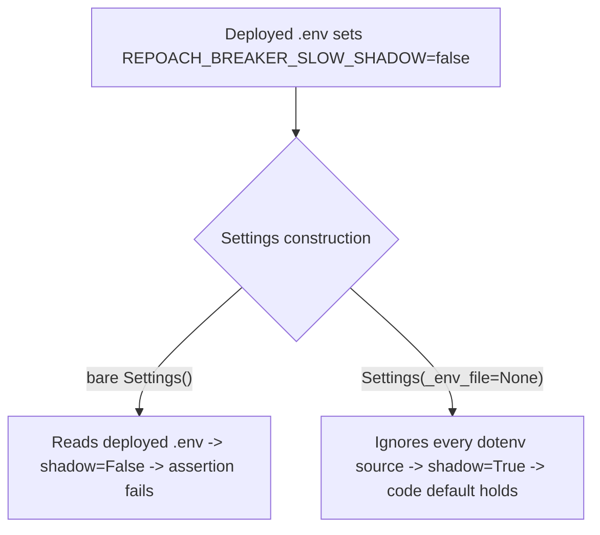

# Settings-default tests isolate from the deployed .env

## Intent

`tests/unit/test_slow_completion_policy.py::test_slow_settings_defaults`
constructs `Settings()` without `_env_file=None`, so it reads whatever
`.env` happens to be deployed on the machine running the suite instead
of the CODE default. Arming the slow-strike breaker the documented way
(`REPOACH_BREAKER_SLOW_SHADOW=false` in `.env`, per SP-BREAKER-SLOW-STRIKE)
flips `breaker_slow_shadow` to `False` and breaks this assertion — which
breaks `ci_local.sh` and every merge gate on any box that has armed the
feature. This spec isolates the defaults test from the deployed
environment and audits the rest of the suite for the same pattern.

## Context

- `src/repoach/llm_proxy/config/settings.py:307-309` declares
  `breaker_slow_shadow: bool = Field(default=True, ...)`; `Settings`'s
  `model_config` (`settings.py:470-474`) wires `env_file=_env_files()`,
  which resolves `Path(".env")` relative to the process's current
  working directory at construction time — not relative to the test
  file.
- `tests/unit/test_slow_completion_policy.py:133-142` is
  `test_slow_settings_defaults`; line 136 is the offending
  `settings = Settings()`.
- Verified live: a scratch directory holding only a `.env` with
  `REPOACH_BREAKER_SLOW_SHADOW=false`, with the real pytest binary
  invoked from that directory against the real
  `test_slow_settings_defaults` selector, reproduces the failure
  today (`AssertionError: assert False is True`); the same selector
  run from the repo root (no override in the real `.env`) passes.
  Constructing `Settings(_env_file=None)` from inside that same
  scratch directory returns `breaker_slow_shadow is True` regardless.
  This is the exact fix.
- The repo's own convention for isolating a `Settings()`-under-test
  from the deployed environment is already established and used
  throughout the suite (e.g. `tests/unit/test_automerge_fail_fast_gate.py`,
  `tests/unit/test_health_breaker.py`, `tests/unit/test_chain_regen.py`):
  construct with `Settings(_env_file=None)`, and `monkeypatch.setenv`
  explicitly for any value the test needs.
- The repo's `.env` on this box currently has no
  `REPOACH_BREAKER_SLOW_SHADOW` line — the defect is latent, not yet
  triggered, but is one intentional operator action away from
  breaking every gate.

## Goals

- G1: `test_slow_settings_defaults` asserts the CODE default for all
  six `breaker_slow_*` fields regardless of what the deployed `.env`
  (or any dotenv file `_env_files()` resolves) contains.
- G2: audit every bare `Settings()` construction in `tests/unit/` and
  `tests/integration/` for the same "assert an unset field's value
  against its bare default" pattern; fix every instance found as a
  set, not just the one in the evidence.
- G3: the fix is proven, not just asserted — a discriminating unit
  test and a discriminating integration test both fail against
  today's tree and pass after the fix.

## Non-Goals

- NG1: no change to `breaker_slow_shadow`'s default value, or to any
  other `breaker_slow_*` default — this spec is test isolation only,
  never a behavior change to `Settings`.
- NG2: no change to the other bare-`Settings()` call sites audited and
  found NOT to match the defect pattern (each already
  `monkeypatch.setenv`s the exact fields it asserts on, or isolates by
  `monkeypatch.chdir` into a directory holding its own written dotenv
  file): `tests/unit/test_chain_health.py`,
  `tests/unit/test_chains_single_source.py`,
  `tests/unit/test_proxy_semantic_failover.py`,
  `tests/unit/test_proxy_failover_events.py`,
  `tests/unit/test_proxy_chain_failover.py`,
  `tests/unit/test_proxy_failover_toolless.py`,
  `tests/unit/test_proxy_budget_retry.py`,
  `tests/unit/test_chain_loop.py`, `tests/unit/test_chain_status.py`.
  None of these assert a Settings field's bare code default; every
  assertion downstream targets a value the test itself injected via
  `monkeypatch.setenv`, or targets unrelated component behavior
  (rendered digest text, resolved chain order, retry counts).
- NG3: no change to `_env_files()` or `Settings.model_config` — the
  isolation primitive (`_env_file=None`) already exists and is already
  the established idiom elsewhere in the suite; this spec only applies
  it where it was missing.

## Assumptions

- A1: `Settings(_env_file=None)` disables ALL dotenv sources for that
  instance (home config, `.env`, `chains.env`) while still honoring
  real `os.environ` overrides and field defaults — this is
  `pydantic-settings`'s standard source-priority behavior, unmodified
  by this repo's `Settings` subclass, and is exactly the primitive
  every existing isolated test in the suite already relies on.
- A2: no CI runner or the reference dev box exports
  `REPOACH_BREAKER_SLOW_SHADOW` as a real process environment variable
  (only ever as a `.env`-file line) — confirmed on this box; the fix
  targets the documented, file-based arm path, not a live-shell export.

## Interface

No public runtime API changes. The contract is the shape of three
pytest test functions.

Inputs:
- `tmp_path`: `pathlib.Path` — pytest's built-in per-test scratch
  directory, used to hold a simulated deployed `.env`.
- `monkeypatch`: `pytest.MonkeyPatch` — used only for `chdir`, never
  for `setenv`, in the new unit test (the point is to prove isolation
  from a FILE, not from a real env var).

Outputs:
- None (test functions; pass/fail is the pytest run outcome).

Errors:
- `AssertionError`: raised by `test_slow_settings_defaults` itself
  today when run from a working directory whose `.env` sets
  `REPOACH_BREAKER_SLOW_SHADOW=false`; must NOT be raised after the
  fix, from any working directory.

Three function signatures, exact bodies specified in Behavior:

```python
def test_slow_settings_defaults() -> None: ...


def test_slow_settings_defaults_survives_deployed_shadow_arm(
    tmp_path: Path, monkeypatch: pytest.MonkeyPatch
) -> None: ...


def test_slow_settings_defaults_subprocess_survives_deployed_shadow_arm(
    tmp_path: Path,
) -> None: ...
```

## Behavior

### Nominal

`test_slow_settings_defaults` constructs `Settings(_env_file=None)` and
asserts the six `breaker_slow_*` defaults declared in
SP-BREAKER-SLOW-STRIKE. No dotenv file on disk — deployed, simulated,
or otherwise — can change the outcome.

```python
def test_slow_settings_defaults() -> None:
    """Settings carries the six breaker_slow_* knobs with the defaults
    declared in the spec (SP-BREAKER-SLOW-STRIKE).

    Constructs with ``_env_file=None`` so these assertions exercise the
    CODE default, never the operator's deployed ``.env``
    (SP-SLOW-DEFAULTS-TEST-ISOLATION) -- arming the slow-strike breaker
    (``REPOACH_BREAKER_SLOW_SHADOW=false``) must never flip this test.
    """
    settings = Settings(_env_file=None)
    assert settings.breaker_slow_latency_gate_s == 10.0
    assert settings.breaker_slow_tps_floor == 1.0
    assert settings.breaker_slow_k == 3
    assert settings.breaker_slow_n == 5
    assert settings.breaker_slow_ttl_s == 300.0
    assert settings.breaker_slow_shadow is True
```

The new unit test simulates a deployed `.env` that has armed the
breaker, then calls the fixed test function directly, proving it
survives:

```python
def test_slow_settings_defaults_survives_deployed_shadow_arm(
    tmp_path: Path, monkeypatch: pytest.MonkeyPatch
) -> None:
    """Arming the slow-strike breaker in the deployed .env
    (REPOACH_BREAKER_SLOW_SHADOW=false) must never break
    test_slow_settings_defaults: it isolates via
    Settings(_env_file=None), so it keeps reading the CODE default
    regardless of what the operator wrote to disk.
    """
    (tmp_path / ".env").write_text(
        "REPOACH_BREAKER_SLOW_SHADOW=false\n", encoding="utf-8"
    )
    monkeypatch.chdir(tmp_path)
    test_slow_settings_defaults()
```

The new integration test drives the real `pytest` binary against the
real selector from a scratch working directory holding the same
simulated deployed `.env`, reproducing exactly what `ci_local.sh` and
every merge gate run:

```python
def test_slow_settings_defaults_subprocess_survives_deployed_shadow_arm(
    tmp_path: Path,
) -> None:
    """A deployed .env that arms the slow-strike breaker must not fail
    the real pytest gate for test_slow_settings_defaults.

    Writes REPOACH_BREAKER_SLOW_SHADOW=false into a scratch .env, runs
    pytest for the single real selector with that directory as the
    process cwd (Settings resolves its dotenv path relative to cwd,
    exactly as it does under ci_local.sh at the repo root), and asserts
    the gate still exits 0.
    """
    (tmp_path / ".env").write_text(
        "REPOACH_BREAKER_SLOW_SHADOW=false\n", encoding="utf-8"
    )
    target = (
        f"{_REPO}/tests/unit/test_slow_completion_policy.py"
        "::test_slow_settings_defaults"
    )
    result = subprocess.run(
        [sys.executable, "-m", "pytest", target, "-q", "-p", "no:cacheprovider"],
        capture_output=True,
        text=True,
        cwd=str(tmp_path),
        timeout=60,
    )
    assert result.returncode == 0, (
        f"expected exit 0, got {result.returncode}\n"
        f"stdout: {result.stdout}\nstderr: {result.stderr}"
    )
```

where `_REPO = Path(__file__).resolve().parents[2]`, matching the
existing convention in `tests/integration/test_credits_integration.py`.

### Edge cases

- A machine whose `~/.config/free-claude-code/.env` or `chains.env`
  also happens to set `REPOACH_BREAKER_SLOW_SHADOW` -> irrelevant
  after the fix; `_env_file=None` disables every dotenv source at
  once, not only the repo-root `.env`.
- The nine audited sibling call sites (NG2) stay untouched — each
  already overrides, via `monkeypatch.setenv`, precisely the fields it
  asserts on, so they were never vulnerable to this pattern; adding
  `_env_file=None` there would be scope creep with no discriminating
  test to justify it.
- A real (not file-based) `REPOACH_BREAKER_SLOW_SHADOW` process
  environment variable would still win over the code default even
  with `_env_file=None` (env vars outrank dotenv in
  `pydantic-settings`'s source order) — out of scope per A2; the
  incident and the fix are both about the FILE-based arm path.

### Failure scenarios

- If `_env_files()` is ever changed to add a new dotenv source that
  `_env_file=None` does not disable, both new tests fail loudly
  (the integration one with a nonzero pytest exit, the unit one with
  the underlying `AssertionError` propagating from the direct call) —
  no silent regression is possible.

## Architecture Impact

- No `owns.code` edges added or removed — this spec touches only
  `tests/` files, and `Settings`/`settings.py` is frontier (unowned by
  any spec; confirmed by grepping every spec frontmatter). No
  disjoint-ownership conflict is possible.
- Conceptual coupling only (not gate-enforced): the assertions target
  `breaker_slow_shadow`, a field introduced by
  SP-BREAKER-SLOW-STRIKE — but that spec's own `owns.code` is `[]`, so
  there is no owned artifact to declare a `depends_on` edge against.
- New / changed coupling, cycles, or shared state: none.

## Diagram



## Acceptance Criteria

- [ ] AC1: `tests/unit/test_slow_completion_policy.py::test_slow_settings_defaults_survives_deployed_shadow_arm`
  writes a scratch `.env` with `REPOACH_BREAKER_SLOW_SHADOW=false`,
  `monkeypatch.chdir`s into it, and calls
  `test_slow_settings_defaults()` directly. FAILS on today's tree
  (the target test's bare `Settings()` picks up the scratch `.env`,
  `AssertionError: assert False is True` propagates through the direct
  call) and PASSES once `test_slow_settings_defaults` is changed to
  construct `Settings(_env_file=None)`.
- [ ] AC2 (integration): `tests/integration/test_slow_settings_isolation_end_to_end.py::test_slow_settings_defaults_subprocess_survives_deployed_shadow_arm`
  drives the REAL `pytest` executable against the real
  `tests/unit/test_slow_completion_policy.py::test_slow_settings_defaults`
  selector, with `cwd` set to a scratch directory holding
  `REPOACH_BREAKER_SLOW_SHADOW=false` in its `.env` — the same shape of
  invocation `ci_local.sh` and the merge gate run from the repo root.
  FAILS on today's tree (subprocess exits 1) and PASSES once the fix
  lands (subprocess exits 0).
- [ ] AC3: `tests/unit/test_slow_completion_policy.py::test_slow_settings_defaults`
  itself constructs `Settings(_env_file=None)` (verified transitively
  by AC1 and AC2 — both fail if this construction is reverted to bare
  `Settings()`).
- [ ] AC4: `ruff check tests/unit/test_slow_completion_policy.py tests/integration/test_slow_settings_isolation_end_to_end.py`
  and `ruff format --check` on the same two files pass; zero inline
  comments (`python scripts/lint_no_inline_comments.py`); the full
  `tests/unit` and `tests/integration` suites stay green (no
  regression introduced in the nine audited sibling files — none are
  touched).

## Open Questions

None.
