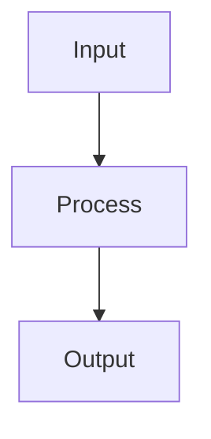

<!--
HOW TO FILL THIS TEMPLATE (SP-SPEC-TEMPLATE, 2026-06-20)
- `id` IS the SP-ID (e.g. SP-ARCH-GRAPH) — the SAME identifier used in the
  filename `<date>_<SP-ID>_<slug>.md`, the feature branch, and every other
  spec's `depends_on`. One identifier, no aliasing, no drift.
- Applies to NEW specs only. Legacy specs (pre-template) stay frozen and
  un-owned; they are "frontier" nodes. A legacy spec may be PROMOTED into
  the governed regime voluntarily (give it an `owns`, pull its files out of
  the frontier) when its zone is next touched — opportunistic erosion, never
  a forced big-bang.
- "Complete everywhere" = every section is PRESENT. A section that does
  not apply (e.g. `owns.resources` for a code-only component, a Diagram for
  a trivial slice) may say `N/A` with a one-word reason — that is not a
  violation. Present structure, not mandatory filler.
- `depends_on` is the single canonical source for architecture edges.
  "## Architecture Impact" is its human-readable WHY, one line per edge —
  it does not introduce edges the frontmatter omits.
- Delete these HTML guidance comments in a real spec.
-->

# <title>

## Intent
<One to three sentences: WHAT this component does, and WHY it exists.
Purpose, not mechanism.>

## Context
<The minimum the agent needs so it doesn't invent things: where this
component fits, what calls it, what it calls. Keep it short.>

## Goals
- G1: <verifiable objective>
- G2: ...

## Non-Goals
- NG1: <what this component explicitly does NOT do>
- NG2: ...

## Assumptions
- A1: <condition presumed true: dependency available, format guaranteed, etc.>
- A2: ...

## Interface
<The contract. Typed signatures, inputs/outputs, exchange formats.
The part most directly consumable by the coding agent.>

Inputs:
- `<name>`: <type> — <description, value constraints>

Outputs:
- `<name>`: <type> — <description>

Errors:
- `<ErrorName>`: <when it is raised>

## Behavior
<The rules. Pseudocode where useful. For each notable case:
condition -> expected behavior.>

### Nominal
<the main path>

### Edge cases
- <edge case> -> <behavior>

### Failure scenarios
- <what can fail> -> <how the component reacts>

## Architecture Impact
<!-- The human-readable WHY behind the depends_on edges above — one line
per edge. It states architectural consequence; it never introduces an edge
the frontmatter omits (depends_on stays canonical).
For a brand-new component: the edges it introduces.
For a change to an existing one: edges ADDED or REMOVED. -->
- Adds dependency: <this-id> -> <target-id> (<why>)
- Removes dependency: <this-id> -> <target-id> (<why>)
- New / changed coupling, cycles, or shared state: <note, or "none">

## Diagram
<!-- Optional. This component's INTERNAL flow only. The system-wide graph
is derived from every spec's depends_on, not drawn here. 4-6 nodes max;
more than that -> split into multiple specs. -->

## Acceptance Criteria
<!-- These map to SP-SPEC-GATE's coverage fact. Each should be testable. -->
- [ ] AC1: <verifiable condition, ideally translatable into a test>
- [ ] AC2: ...
- [ ] AC3: ...

## Open Questions
<!-- MUST be empty before status can move to `approved`. -->
- Q1: <anything not yet settled — resolve BEFORE approved>
